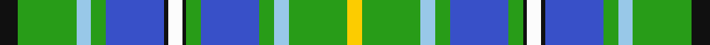

This page is one **sett** — a single exact thread-count. It belongs to the [tartan](/tartans/k5g16lb4g4b16k1w4k1g4b16g4lb4g16y4/)
(the same proportion at any scale), whose colour order is pattern [KGWGBKWKGBGWGY](/stripes/kgwgbkwkgbgwgy/).

Sourced from tartans-authority.  It is a [14 stripe tartan](/stripes/stripes14/).

Original link http://www.tartansauthority.com/tartan-ferret/display/8531/

## Thread count
K/10 G32 LB8 G8 B32 K2 W8 K2 G8 B32 G8 LB8 G32 Y/8

## Palette
Each colour and the base-6 reference it is a variant of.

| Colour | Shade | Base |
|---|---|---|
| B | <code style="background-color:#3850C8;">#3850C8</code> `oklch(48.8% 0.188 269.4)` <small>#3850C8</small> | B <code style="background-color:#2A418A;">#2A418A</code> |
| G | <code style="background-color:#289C18;">#289C18</code> `oklch(60.6% 0.191 141.6)` <small>#289C18</small> | G <code style="background-color:#006100;">#006100</code> |
| K | <code style="background-color:#101010;">#101010</code> `oklch(17.3% 0.000 89.9)` <small>#101010</small> | K <code style="background-color:#000000;">#000000</code> |
| LB | <code style="background-color:#98C8E8;">#98C8E8</code> `oklch(81.0% 0.068 237.9)` <small>#98C8E8</small> | W <code style="background-color:#F7F7F7;">#F7F7F7</code> |
| W | <code style="background-color:#FCFCFC;">#FCFCFC</code> `oklch(99.1% 0.000 89.9)` <small>#FCFCFC</small> | W <code style="background-color:#F7F7F7;">#F7F7F7</code> |
| Y | <code style="background-color:#FCCC00;">#FCCC00</code> `oklch(86.2% 0.176 91.5)` <small>#FCCC00</small> | Y <code style="background-color:#F2BF00;">#F2BF00</code> |

## Nearest tartans

The nearest existing variants by ΔTartan distance, with this tartan at the top so the swatches line up against it.

ΔTartan

Tartan

Sett

—

<a href="/ttd/edit/#slug=k5g16lb4g4b16k1w4k1g4b16g4lb4g16ly4~x2">Unidentified (Callander 2009)</a> <a class="nn-out" href="/setts/s14/k5g16lb4g4b16k1w4k1g4b16g4lb4g16ly4~x2/" title="open its dictionary page">↗</a>

1.30

<a href="/ttd/edit/#slug=b16w3b2ly4g24r2g4r5g4r2lb8~x2">Currie of Arran (Clan/family)</a> <a class="nn-out" href="/setts/s11/b16w3b2ly4g24r2g4r5g4r2lb8~x2/" title="open its dictionary page">↗</a>

1.30

<a href="/ttd/edit/#slug=w15dt5w2dt15o4dt10r2dt10o4dt15w2dt5w15g6g20g6~x2">Copar a'Beannichte Dress Family Tartan Tartan Number: 6484. Earliest known date: 2004 The name of the tartan is constructed in Gaelic from the Dutch van Koperen and the French Benoist to mean the Blessed Copper, a tribute to Mrs Y Ch van Koperen-Benoist. The green represents oxidised copper of the Koperens and blue the Benoist family. See products available Copyright © Blair Urquhart, Comrie, 2015</a> <a class="nn-out" href="/setts/s16/w15dt5w2dt15o4dt10r2dt10o4dt15w2dt5w15g6g20g6~x2/" title="open its dictionary page">↗</a>

1.45

<a href="/ttd/edit/#slug=r6lg22g8lg4g12lg2g18db8lt12db35ly4">Bruntsfield Links Golfing Society</a> <a class="nn-out" href="/setts/s11/r6lg22g8lg4g12lg2g18db8lt12db35ly4/" title="open its dictionary page">↗</a>

1.45

<a href="/ttd/edit/#slug=t34r3t8dt4t8k24g34k2w6">Hogg Dress</a> <a class="nn-out" href="/setts/s9/t34r3t8dt4t8k24g34k2w6/" title="open its dictionary page">↗</a>

1.48

<a href="/ttd/edit/#slug=lb25g3lb4g4lb5g5lb15r6lb5g19lb8g26lb4w4lb4g7lb4db21~x2">Shedor (2013)</a> <a class="nn-out" href="/setts/s18/lb25g3lb4g4lb5g5lb15r6lb5g19lb8g26lb4w4lb4g7lb4db21~x2/" title="open its dictionary page">↗</a>

1.52

<a href="/ttd/edit/#slug=g5b20g2b2g2b2g25r2g2r17k8g2w2~x2">Cameron Boyle, The (Personal)</a> <a class="nn-out" href="/setts/s13/g5b20g2b2g2b2g25r2g2r17k8g2w2~x2/" title="open its dictionary page">↗</a>

1.53

<a href="/ttd/edit/#slug=g12db4g54db26k4w8db18db44w3db12w4">Scottish Motor Trade Association</a> <a class="nn-out" href="/setts/s11/g12db4g54db26k4w8db18db44w3db12w4/" title="open its dictionary page">↗</a>

1.53

<a href="/ttd/edit/#slug=g3t3g5r4g28db8w3db3w24r2k2~x2">Downie Dress</a> <a class="nn-out" href="/setts/s11/g3t3g5r4g28db8w3db3w24r2k2~x2/" title="open its dictionary page">↗</a>

1.56

<a href="/ttd/edit/#slug=lb16g2lb16db18ly2db13g11r2g9db12r2ly2~x2">E.C.R. (Corporate)</a> <a class="nn-out" href="/setts/s12/lb16g2lb16db18ly2db13g11r2g9db12r2ly2~x2/" title="open its dictionary page">↗</a>

1.57

<a href="/ttd/edit/#slug=g20g6w15dt5w2dt15o4dt10r2~x2">Copar a'Beannichte Dress (Personal)</a> <a class="nn-out" href="/setts/s9/g20g6w15dt5w2dt15o4dt10r2~x2/" title="open its dictionary page">↗</a>

## Neighbour map

Every grey dot is one of 14299 variants placed by the first two principal components of the ΔTartan feature space (44% of its variance). Red is this tartan; blue dots are its nearest — click one to open its page.

<svg viewBox="0 0 640 380" role="img" style="max-width:100%;height:auto;border:1px solid #e0e0e0;border-radius:4px;display:block" xmlns="http://www.w3.org/2000/svg"><image href="/nn/cloud.v1.png" width="640" height="380"/><a href="/setts/s11/b16w3b2ly4g24r2g4r5g4r2lb8~x2/"><circle cx="163.7" cy="126.4" r="4" fill="#3465a4"><title>Currie of Arran (Clan/family)</title></circle></a><a href="/setts/s16/w15dt5w2dt15o4dt10r2dt10o4dt15w2dt5w15g6g20g6~x2/"><circle cx="117.6" cy="143.1" r="4" fill="#3465a4"><title>Copar a'Beannichte Dress Family Tartan Tartan Number: 6484. Earliest known date: 2004 The name of the tartan is constructed in Gaelic from the Dutch van Koperen and the French Benoist to mean the Blessed Copper, a tribute to Mrs Y Ch van Koperen-Benoist. The green represents oxidised copper of the Koperens and blue the Benoist family. See products available Copyright © Blair Urquhart, Comrie, 2015</title></circle></a><a href="/setts/s11/r6lg22g8lg4g12lg2g18db8lt12db35ly4/"><circle cx="96.0" cy="125.6" r="4" fill="#3465a4"><title>Bruntsfield Links Golfing Society</title></circle></a><a href="/setts/s9/t34r3t8dt4t8k24g34k2w6/"><circle cx="168.1" cy="136.3" r="4" fill="#3465a4"><title>Hogg Dress</title></circle></a><a href="/setts/s18/lb25g3lb4g4lb5g5lb15r6lb5g19lb8g26lb4w4lb4g7lb4db21~x2/"><circle cx="164.8" cy="144.7" r="4" fill="#3465a4"><title>Shedor (2013)</title></circle></a><a href="/setts/s13/g5b20g2b2g2b2g25r2g2r17k8g2w2~x2/"><circle cx="182.2" cy="124.9" r="4" fill="#3465a4"><title>Cameron Boyle, The (Personal)</title></circle></a><a href="/setts/s11/g12db4g54db26k4w8db18db44w3db12w4/"><circle cx="140.3" cy="118.5" r="4" fill="#3465a4"><title>Scottish Motor Trade Association</title></circle></a><a href="/setts/s11/g3t3g5r4g28db8w3db3w24r2k2~x2/"><circle cx="166.9" cy="101.4" r="4" fill="#3465a4"><title>Downie Dress</title></circle></a><a href="/setts/s12/lb16g2lb16db18ly2db13g11r2g9db12r2ly2~x2/"><circle cx="111.3" cy="152.3" r="4" fill="#3465a4"><title>E.C.R. (Corporate)</title></circle></a><a href="/setts/s9/g20g6w15dt5w2dt15o4dt10r2~x2/"><circle cx="107.8" cy="165.8" r="4" fill="#3465a4"><title>Copar a'Beannichte Dress (Personal)</title></circle></a><circle cx="159.9" cy="121.2" r="5" fill="#c00000"/></svg>

ID: /setts/s14/k5g16lb4g4b16k1w4k1g4b16g4lb4g16ly4~x2/
