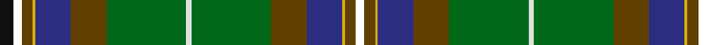

**Bands:** [KKGYBGGWGGBYGK](/stripes/kkgybggwggbygk/) · **Stripes:** [K K DY LY DB DY G W G DY DB LY DY K](/stripes/stripes14/) K K DY LY DB DY G W G DY DB LY DY K

This was sourced from house-of-tartan.  It is a [14 band tartan](/bands/bands14/).

Original link http://www.house-of-tartan.scotland.net/house/TartanViewjs.asp?colr=Def&tnam=5136

## Thread count
K/10 BL6 T8 Y2 DBb26 T26 G58 LN4 G58 T26 DBb26 Y2 T8 BL/6

## Palette
Each colour and its ΔE from the base-6 reference it is a variant of.

| Colour | Shade | Base | ΔE (OKLab) |
|---|---|---|---|
| DB | <code style="background-color:#202060;">#202060</code> `#202060` | B <code style="background-color:#2A418A;">#2A418A</code> | 0.11 |
| DBa | <code style="background-color:#1C0070;">#1C0070</code> `#1C0070` | B <code style="background-color:#2A418A;">#2A418A</code> | 0.14 |
| DBb | <code style="background-color:#2C2C80;">#2C2C80</code> `#2C2C80` | B <code style="background-color:#2A418A;">#2A418A</code> | 0.06 |
| DG | <code style="background-color:#003820;">#003820</code> `#003820` | G <code style="background-color:#006100;">#006100</code> | 0.15 |
| G | <code style="background-color:#006818;">#006818</code> `#006818` | G <code style="background-color:#006100;">#006100</code> | 0.02 |
| K | <code style="background-color:#101010;">#101010</code> `#101010` | K <code style="background-color:#000000;">#000000</code> | 0.17 |
| LN | <code style="background-color:#E0E0E0;">#E0E0E0</code> `#E0E0E0` | W <code style="background-color:#F7F7F7;">#F7F7F7</code> | 0.07 |
| T | <code style="background-color:#604000;">#604000</code> `#604000` | G <code style="background-color:#006100;">#006100</code> | 0.14 |
| W | <code style="background-color:#FCFCFC;">#FCFCFC</code> `#FCFCFC` | W <code style="background-color:#F7F7F7;">#F7F7F7</code> | 0.01 |
| Y | <code style="background-color:#D8B000;">#D8B000</code> `#D8B000` | Y <code style="background-color:#F2BF00;">#F2BF00</code> | 0.06 |

## Nearest tartans

The nearest existing variants by ΔTartan distance.

1. [Teviotdale](/setts/s8/k5b3dy4ly1db13dy13g29w2~x2/) — ΔT 1.21
1. [Hughes Interconnection Int.](/setts/s16/w4k2b18ly4b18dy26g18k1m2~x2/) — ΔT 1.21
1. [Mill o Forest Primary School (Corp)](/setts/s13/db3dg22r5dg5o5w1o1dg1g8db6o1db5dg2~x2/) — ΔT 1.22
1. [MacLean of Kingairloch Clan Tartan Tartan Number: 61. Earliest known date: pre 2003 Reproduction. See products available Copyright © Blair Urquhart, Comrie, 2015](/setts/s11/db8t1k6ly1k2w2k2g12dy28w1dy4~x2/) — ΔT 1.22
1. [California State American District Tartan Tartan Number: 2454. Earliest known date: 1998 Designed by J.Howard Standing of Tarzana, California and Thomas Ferguson of Sydney, British Columbia. Adopted as the 'official' California State tartan by the State Legislature. For general use by all those living in the State. Based on Muir, after the famous botanist and environmentalist John Muir who lived in California. Assembly Bill 2362, february 20th 1998. See products available Copyright © Blair Urquhart, Comrie, 2015](/setts/s13/lo4k1g10r2g10r4g10r2g10k16t28k1lb4~x2/) — ΔT 1.41
1. [Stirling University](/setts/s9/dg28r4k3y2k1dg2r3db20ly2~x2/) — ΔT 1.41
1. [Wagland](/setts/s12/db6ly2db15g12dg39w3dg39g12db15ly2db6r3~x2/) — ΔT 1.46
1. [Stirling University Corporate Tartan Tartan Number: 2074. Earliest known date: Aug 1992 This is a simplified Stirling and Bannockburn district sett with the Universities 'Green and Grey' striped through the black. See products available Copyright © Blair Urquhart, Comrie, 2015](/setts/s9/g28r4k3o2k1dg2r3db20ly2~x2/) — ΔT 1.47
1. [Adams (Name)](/setts/s11/r4g4k2g17do5g5do17g6lb1db22r2~x2/) — ΔT 1.48
1. [Gow Hunting #2](/setts/s14/k24dg12k1ly3k1dg12k1r3k1dg12k12db12db3db12~x4/) — ΔT 1.52

## Neighbour map

Every grey dot is one of 14299 variants placed by the first two principal components of the ΔTartan feature space (44% of its variance). Red is this tartan; blue dots are its nearest — click one to open its page.

<svg viewBox="0 0 640 380" role="img" style="max-width:100%;height:auto;border:1px solid #e0e0e0;border-radius:4px;display:block" xmlns="http://www.w3.org/2000/svg"><image href="/nn/cloud.v1.png" width="640" height="380"/><a href="/setts/s8/k5b3dy4ly1db13dy13g29w2~x2/"><circle cx="224.0" cy="124.1" r="4" fill="#3465a4"><title>Teviotdale</title></circle></a><a href="/setts/s16/w4k2b18ly4b18dy26g18k1m2~x2/"><circle cx="188.0" cy="109.4" r="4" fill="#3465a4"><title>Hughes Interconnection Int.</title></circle></a><a href="/setts/s13/db3dg22r5dg5o5w1o1dg1g8db6o1db5dg2~x2/"><circle cx="240.3" cy="119.0" r="4" fill="#3465a4"><title>Mill o Forest Primary School (Corp)</title></circle></a><a href="/setts/s11/db8t1k6ly1k2w2k2g12dy28w1dy4~x2/"><circle cx="256.2" cy="87.9" r="4" fill="#3465a4"><title>MacLean of Kingairloch Clan Tartan Tartan Number: 61. Earliest known date: pre 2003 Reproduction. See products available Copyright © Blair Urquhart, Comrie, 2015</title></circle></a><a href="/setts/s13/lo4k1g10r2g10r4g10r2g10k16t28k1lb4~x2/"><circle cx="187.7" cy="107.4" r="4" fill="#3465a4"><title>California State American District Tartan Tartan Number: 2454. Earliest known date: 1998 Designed by J.Howard Standing of Tarzana, California and Thomas Ferguson of Sydney, British Columbia. Adopted as the 'official' California State tartan by the State Legislature. For general use by all those living in the State. Based on Muir, after the famous botanist and environmentalist John Muir who lived in California. Assembly Bill 2362, february 20th 1998. See products available Copyright © Blair Urquhart, Comrie, 2015</title></circle></a><a href="/setts/s9/dg28r4k3y2k1dg2r3db20ly2~x2/"><circle cx="247.7" cy="99.7" r="4" fill="#3465a4"><title>Stirling University</title></circle></a><a href="/setts/s12/db6ly2db15g12dg39w3dg39g12db15ly2db6r3~x2/"><circle cx="284.3" cy="147.4" r="4" fill="#3465a4"><title>Wagland</title></circle></a><a href="/setts/s9/g28r4k3o2k1dg2r3db20ly2~x2/"><circle cx="234.2" cy="92.4" r="4" fill="#3465a4"><title>Stirling University Corporate Tartan Tartan Number: 2074. Earliest known date: Aug 1992 This is a simplified Stirling and Bannockburn district sett with the Universities 'Green and Grey' striped through the black. See products available Copyright © Blair Urquhart, Comrie, 2015</title></circle></a><a href="/setts/s11/r4g4k2g17do5g5do17g6lb1db22r2~x2/"><circle cx="208.2" cy="141.7" r="4" fill="#3465a4"><title>Adams (Name)</title></circle></a><a href="/setts/s14/k24dg12k1ly3k1dg12k1r3k1dg12k12db12db3db12~x4/"><circle cx="207.7" cy="138.6" r="4" fill="#3465a4"><title>Gow Hunting #2</title></circle></a><circle cx="222.7" cy="103.5" r="5" fill="#c00000"/></svg>

ID: /setts/s14/k5k3dy4ly1db13dy13g29w2~x2/
