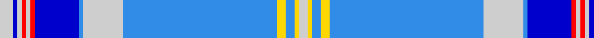

**Bands:** [WBWRWRBBWBYBYW](/stripes/wbwrwrbbwbybyw/) · **Stripes:** [LB DB LB R LB R DB B LB B LY B LY LB](/stripes/stripes14/) LB DB LB R LB R DB B LB B LY B LY LB

This was sourced from register-of-tartans.  It is a [14 band tartan](/bands/bands14/).

Original link https://www.tartanregister.gov.uk/tartanDetails.aspx?ref=10741

## Attestations

This cloth appears in 2 source records; the oldest owns this page.

- 22/11/2012 — De Clercq, Christian Family (Belgium) (register-of-tartans, [record](https://www.tartanregister.gov.uk/tartanDetails.aspx?ref=10741))
- undated — De Clercq, Christian Family Name Tartan Tartan Number: 10741. Earliest known date: 22/11/2012 The De Clercq Family tartan is based on the Coat of Arms granted to Christian De Clercq by the Walloon Government. See products available Copyright © Blair Urquhart, Comrie, 2015 (house-of-tartan, [record](http://www.house-of-tartan.scotland.net/house/TartanViewjs.asp?colr=Def&tnam=10741))

## Register references

External register numbers recorded for this tartan.

- Scottish Register of Tartans: [10741](https://www.tartanregister.gov.uk/tartanDetails.aspx?ref=10741)

## Thread count
N/6 B2 N2 R2 N2 R2 B20 Ba2 N18 Ba70 Y4 Ba4 Y2 N/4

## Palette
Each colour and its ΔE from the base-6 reference it is a variant of.

| Colour | Shade | Base | ΔE (OKLab) |
|---|---|---|---|
| B | <code style="background-color:#0000CD;">#0000CD</code> `#0000CD` | B <code style="background-color:#2A418A;">#2A418A</code> | 0.14 |
| Ba | <code style="background-color:#318CE7;">#318CE7</code> `#318CE7` | B <code style="background-color:#2A418A;">#2A418A</code> | 0.24 |
| N | <code style="background-color:#CECECE;">#CECECE</code> `#CECECE` | W <code style="background-color:#F7F7F7;">#F7F7F7</code> | 0.12 |
| R | <code style="background-color:#FF0000;">#FF0000</code> `#FF0000` | R <code style="background-color:#CC0000;">#CC0000</code> | 0.11 |
| Y | <code style="background-color:#FFD700;">#FFD700</code> `#FFD700` | Y <code style="background-color:#F2BF00;">#F2BF00</code> | 0.06 |

## Nearest tartans

The nearest existing variants by ΔTartan distance.

1. [De Clercq, Christian (Belgium)](/setts/s13/lb3db1lb1r1lb1db10r1lb9b35lo2b2lo1lb2~x2/) — ΔT 1.18
1. [Spirit of India](/setts/s13/b32w2db1w2b4db1g8w8r8db1b16db1w4~x2/) — ΔT 1.39
1. [StammBar](/setts/s12/w4b8w4lg8w2lg2w4b42r1ly2r1b2~x2/) — ΔT 1.68
1. [Edinburgh '86](/setts/s11/db6w2db2w2db4w6db28b4db4b45r4/) — ΔT 1.71
1. [Dallas](/setts/s17/b75n2b10n6w2n6b10w2g9y6w2y6g10w2b6n4w2~x2/) — ΔT 1.71
1. [Bennet Dress](/setts/s11/lr64db18lb2db3lr2db3n14b8k2b4lr2~x2/) — ΔT 1.76
1. [Summerwood](/setts/s12/b76w3r4w3dg4w3dg8b20lt20b3lt8w10/) — ΔT 1.88
1. [Dunn (Scotland) (Name)](/setts/s12/b45ly6b3ly6b3w3db5w3db5w20b2w3~x2/) — ΔT 1.93
1. [Commonwealth Games 1986 (Corp)](/setts/s11/db3w1db1w1db2w3db15t2db2t22r2~x2/) — ΔT 1.97
1. [Blue Dunnett (Fashion)](/setts/s11/lb50db14g2db2lb2db2n10b6k2b3lb2~x2/) — ΔT 2.00

## Neighbour map

Every grey dot is one of 14313 variants placed by the first two principal components of the ΔTartan feature space (44% of its variance). Red is this tartan; blue dots are its nearest — click one to open its page.

<svg viewBox="0 0 640 380" role="img" style="max-width:100%;height:auto;border:1px solid #e0e0e0;border-radius:4px;display:block" xmlns="http://www.w3.org/2000/svg"><image href="/nn/cloud.v1.png" width="640" height="380"/><a href="/setts/s13/lb3db1lb1r1lb1db10r1lb9b35lo2b2lo1lb2~x2/"><circle cx="346.4" cy="77.4" r="4" fill="#3465a4"><title>De Clercq, Christian (Belgium)</title></circle></a><a href="/setts/s13/b32w2db1w2b4db1g8w8r8db1b16db1w4~x2/"><circle cx="313.7" cy="79.6" r="4" fill="#3465a4"><title>Spirit of India</title></circle></a><a href="/setts/s12/w4b8w4lg8w2lg2w4b42r1ly2r1b2~x2/"><circle cx="403.8" cy="70.1" r="4" fill="#3465a4"><title>StammBar</title></circle></a><a href="/setts/s11/db6w2db2w2db4w6db28b4db4b45r4/"><circle cx="305.8" cy="127.9" r="4" fill="#3465a4"><title>Edinburgh '86</title></circle></a><a href="/setts/s17/b75n2b10n6w2n6b10w2g9y6w2y6g10w2b6n4w2~x2/"><circle cx="415.7" cy="76.9" r="4" fill="#3465a4"><title>Dallas</title></circle></a><a href="/setts/s11/lr64db18lb2db3lr2db3n14b8k2b4lr2~x2/"><circle cx="298.8" cy="57.2" r="4" fill="#3465a4"><title>Bennet Dress</title></circle></a><a href="/setts/s12/b76w3r4w3dg4w3dg8b20lt20b3lt8w10/"><circle cx="312.2" cy="69.6" r="4" fill="#3465a4"><title>Summerwood</title></circle></a><a href="/setts/s12/b45ly6b3ly6b3w3db5w3db5w20b2w3~x2/"><circle cx="287.1" cy="104.6" r="4" fill="#3465a4"><title>Dunn (Scotland) (Name)</title></circle></a><a href="/setts/s11/db3w1db1w1db2w3db15t2db2t22r2~x2/"><circle cx="293.3" cy="124.8" r="4" fill="#3465a4"><title>Commonwealth Games 1986 (Corp)</title></circle></a><a href="/setts/s11/lb50db14g2db2lb2db2n10b6k2b3lb2~x2/"><circle cx="292.5" cy="60.1" r="4" fill="#3465a4"><title>Blue Dunnett (Fashion)</title></circle></a><circle cx="329.6" cy="61.1" r="5" fill="#c00000"/></svg>

ID: /setts/s14/lb3db1lb1r1lb1r1db10b1lb9b35ly2b2ly1lb2~x2/
