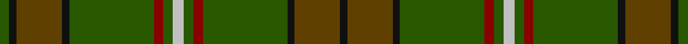

In pattern [GKGKGRGWGRGKGK](/stripes/gkgkgrgwgrgkgk/).

This was sourced from house-of-tartan.  It is a [14 stripe tartan](/stripes/stripes14/).

Original link http://www.house-of-tartan.scotland.net/house/TartanViewjs.asp?colr=Def&tnam=4135

## Thread count
G/10 K8 T48 K8 G90 DR10 G10 N12 G10 DR10 G90 K8 T48 K/8

## Palette
Each colour and the base-6 reference it is a variant of.

| Colour | Shade | Base |
|---|---|---|
| DR | <code style="background-color:#880000;">#880000</code> `oklch(39.4% 0.162 29.2)` <small>#880000</small> | R <code style="background-color:#CC0000;">#CC0000</code> |
| G | <code style="background-color:#285800;">#285800</code> `oklch(41.0% 0.122 135.8)` <small>#285800</small> | G <code style="background-color:#006100;">#006100</code> |
| Ga | <code style="background-color:#006818;">#006818</code> `oklch(45.0% 0.142 145.0)` <small>#006818</small> | G <code style="background-color:#006100;">#006100</code> |
| K | <code style="background-color:#101010;">#101010</code> `oklch(17.3% 0.000 89.9)` <small>#101010</small> | K <code style="background-color:#000000;">#000000</code> |
| N | <code style="background-color:#C0C0C0;">#C0C0C0</code> `oklch(80.8% 0.000 89.9)` <small>#C0C0C0</small> | W <code style="background-color:#F7F7F7;">#F7F7F7</code> |
| T | <code style="background-color:#604000;">#604000</code> `oklch(39.8% 0.083 76.8)` <small>#604000</small> | G <code style="background-color:#006100;">#006100</code> |

## Nearest tartans

The nearest existing variants by ΔTartan distance.

1. [Ensign of Ontario Canadian Tartan Tartan Number: 2032. Earliest known date: 1965 The Ensign tartan owes its inspiration to the Provincial Coat of Arms which was granted to the province by Royal Warrant of Queen Victoria in 1868. The yellow is taken from the three golden maple leaves of the lower shield and the red from the cross of St George on the upper. The black and brown come from the bear, the moose and the deer. There is also a District tartan called Northern Ontario. See products available Copyright © Blair Urquhart, Comrie, 2015](/setts/s15/g21k1r4k1dy21g3dy3g3dy21g3ly4g21dy3g3dy3~x2/) — ΔT 1.31
1. [Manitoba Province](/setts/s14/r12g1dg3g20t1g1t3g1t1g20dg3g1r12lo3~x4/) — ΔT 1.63
1. [Chisholm Hunting Clan Tartan Tartan Number: 1458. Earliest known date: 1906 This is a classic example of the process that began during the late Victorian period when the new analine dyes of the 1860s were considered to be too bright. Subtler forms of the tartan were produced, often replacing the red ground with green or brown. See products available Copyright © Blair Urquhart, Comrie, 2015](/setts/s10/dy6w1dy24db6g2db1g2db1g12r1~x2/) — ΔT 1.63
1. [Westmeath (District)](/setts/s14/g11r6dt6do2g3do2dt6r6g36lo2do3lo2dt5r5~x2/) — ΔT 1.67
1. [Proctor (Name)](/setts/s14/dg39k2dg2k2dg2k3dt13k2lb4k2dt13k3dg24lo3~x2/) — ΔT 1.70
1. [Westmeath Irish County Tartan Tartan Number: 2278. Earliest known date: 1996 One of a series of Irish District tartans designed by Polly Wittering of the House of Edgar, with colours reminiscent of the Country with soft warm colours dominating. See products available Copyright © Blair Urquhart, Comrie, 2015](/setts/s14/g11r6db6dy2g3dy2db6r6g36ly2dy3ly2db5r5~x2/) — ΔT 1.72
1. [Fraser Hunting (unmarked sample)](/setts/s16/w2dy14dg7dy1db7dy1db7dy1dg7dy14r2dy14dg7dy1db7dy1~x4/) — ΔT 1.73
1. [Ontario](/setts/s15/dg24k1r5k1dy20dg4dy4dg4dy21dg4ly5dg24dy4dg4dy4~x2/) — ΔT 1.75
1. [Prince David Royal Family Tartan Tartan Number: 2125. Earliest known date: 1930 Mackinlay suggests that David was the pet name of the Duke of Windsor when he was a boy and that the tartan was designed for his personal use. See products available Copyright © Blair Urquhart, Comrie, 2015](/setts/s15/dg3g1lo2dg3g1lo2dy21dg18dy2dg3dy2dg18dy21g1lo2~x2/) — ΔT 1.75
1. [Duchess of York](/setts/s9/db1dy9dg5dy1k5dy1dg5dy9w1~x2/) — ΔT 1.80

## Neighbour map

Every grey dot is one of 14299 variants placed by the first two principal components of the ΔTartan feature space (44% of its variance). Red is this tartan; blue dots are its nearest — click one to open its page.

<svg viewBox="0 0 640 380" role="img" style="max-width:100%;height:auto;border:1px solid #e0e0e0;border-radius:4px;display:block" xmlns="http://www.w3.org/2000/svg"><image href="/nn/cloud.v1.png" width="640" height="380"/><a href="/setts/s15/g21k1r4k1dy21g3dy3g3dy21g3ly4g21dy3g3dy3~x2/"><circle cx="366.2" cy="168.1" r="4" fill="#3465a4"><title>Ensign of Ontario Canadian Tartan Tartan Number: 2032. Earliest known date: 1965 The Ensign tartan owes its inspiration to the Provincial Coat of Arms which was granted to the province by Royal Warrant of Queen Victoria in 1868. The yellow is taken from the three golden maple leaves of the lower shield and the red from the cross of St George on the upper. The black and brown come from the bear, the moose and the deer. There is also a District tartan called Northern Ontario. See products available Copyright © Blair Urquhart, Comrie, 2015</title></circle></a><a href="/setts/s14/r12g1dg3g20t1g1t3g1t1g20dg3g1r12lo3~x4/"><circle cx="350.3" cy="144.8" r="4" fill="#3465a4"><title>Manitoba Province</title></circle></a><a href="/setts/s10/dy6w1dy24db6g2db1g2db1g12r1~x2/"><circle cx="390.1" cy="159.4" r="4" fill="#3465a4"><title>Chisholm Hunting Clan Tartan Tartan Number: 1458. Earliest known date: 1906 This is a classic example of the process that began during the late Victorian period when the new analine dyes of the 1860s were considered to be too bright. Subtler forms of the tartan were produced, often replacing the red ground with green or brown. See products available Copyright © Blair Urquhart, Comrie, 2015</title></circle></a><a href="/setts/s14/g11r6dt6do2g3do2dt6r6g36lo2do3lo2dt5r5~x2/"><circle cx="331.4" cy="145.3" r="4" fill="#3465a4"><title>Westmeath (District)</title></circle></a><a href="/setts/s14/dg39k2dg2k2dg2k3dt13k2lb4k2dt13k3dg24lo3~x2/"><circle cx="386.4" cy="149.0" r="4" fill="#3465a4"><title>Proctor (Name)</title></circle></a><a href="/setts/s14/g11r6db6dy2g3dy2db6r6g36ly2dy3ly2db5r5~x2/"><circle cx="341.0" cy="146.5" r="4" fill="#3465a4"><title>Westmeath Irish County Tartan Tartan Number: 2278. Earliest known date: 1996 One of a series of Irish District tartans designed by Polly Wittering of the House of Edgar, with colours reminiscent of the Country with soft warm colours dominating. See products available Copyright © Blair Urquhart, Comrie, 2015</title></circle></a><a href="/setts/s16/w2dy14dg7dy1db7dy1db7dy1dg7dy14r2dy14dg7dy1db7dy1~x4/"><circle cx="324.5" cy="199.6" r="4" fill="#3465a4"><title>Fraser Hunting (unmarked sample)</title></circle></a><a href="/setts/s15/dg24k1r5k1dy20dg4dy4dg4dy21dg4ly5dg24dy4dg4dy4~x2/"><circle cx="347.9" cy="160.6" r="4" fill="#3465a4"><title>Ontario</title></circle></a><a href="/setts/s15/dg3g1lo2dg3g1lo2dy21dg18dy2dg3dy2dg18dy21g1lo2~x2/"><circle cx="407.7" cy="187.5" r="4" fill="#3465a4"><title>Prince David Royal Family Tartan Tartan Number: 2125. Earliest known date: 1930 Mackinlay suggests that David was the pet name of the Duke of Windsor when he was a boy and that the tartan was designed for his personal use. See products available Copyright © Blair Urquhart, Comrie, 2015</title></circle></a><a href="/setts/s9/db1dy9dg5dy1k5dy1dg5dy9w1~x2/"><circle cx="327.8" cy="239.1" r="4" fill="#3465a4"><title>Duchess of York</title></circle></a><circle cx="370.5" cy="190.2" r="5" fill="#c00000"/></svg>

ID: /setts/s14/lb6dg5r5dg45k4dy24k4dg5~x2/
