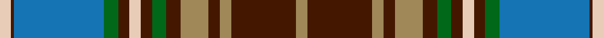

In pattern [WBBGBWBGBYBYBY](/stripes/wbbgbwbgbybyby/).

This was sourced from tartans-authority.  It is a [14 stripe tartan](/stripes/stripes14/).

Original link http://www.tartansauthority.com/tartan-ferret/display/8650/

## Thread count
LR/8 DR2 B64 G10 DR8 LR8 DR8 G10 DR10 LT20 DR8 LT8 DR46 LT/8

## Palette
Each colour and the base-6 reference it is a variant of.

| Colour | Shade | Base |
|---|---|---|
| B | <code style="background-color:#1474B4;">#1474B4</code> `oklch(54.0% 0.129 245.1)` <small>#1474B4</small> | B <code style="background-color:#2A418A;">#2A418A</code> |
| DR | <code style="background-color:#441800;">#441800</code> `oklch(27.3% 0.076 46.3)` <small>#441800</small> | B <code style="background-color:#2A418A;">#2A418A</code> |
| G | <code style="background-color:#006818;">#006818</code> `oklch(45.0% 0.142 145.0)` <small>#006818</small> | G <code style="background-color:#006100;">#006100</code> |
| LR | <code style="background-color:#E8CCB8;">#E8CCB8</code> `oklch(86.3% 0.042 57.7)` <small>#E8CCB8</small> | W <code style="background-color:#F7F7F7;">#F7F7F7</code> |
| LT | <code style="background-color:#A08858;">#A08858</code> `oklch(63.7% 0.071 84.0)` <small>#A08858</small> | Y <code style="background-color:#F2BF00;">#F2BF00</code> |

## Nearest tartans

The nearest existing variants by ΔTartan distance, with this tartan at the top so the swatches line up against it.

ΔTartan

Tartan

Sett

—

<a href="/ttd/edit/#slug=lo4do23lo4do4lo10do5g5do4lb4do4g5b32do1lb4~x2">State Seal of Oklahoma (Fashion)</a> <a class="nn-out" href="/setts/s14/lo4do23lo4do4lo10do5g5do4lb4do4g5b32do1lb4~x2/" title="open its dictionary page">↗</a>

0.73

<a href="/ttd/edit/#slug=k3t4r5k2t5k2r5k2g25k3t11k2r5k1w3~x2">Un-named (D C Dalgliesh)</a> <a class="nn-out" href="/setts/s15/k3t4r5k2t5k2r5k2g25k3t11k2r5k1w3~x2/" title="open its dictionary page">↗</a>

0.99

<a href="/setts/s18/dt48t12lo3w3lo3r11dt5r2lo7w2~x2/">Holyrood Golden Jubilee II</a>

1.09

<a href="/ttd/edit/#slug=r4n12k18n4y22lb1y2lb2y3lb2~x4">Windsor</a> <a class="nn-out" href="/setts/s10/r4n12k18n4y22lb1y2lb2y3lb2~x4/" title="open its dictionary page">↗</a>

1.12

<a href="/ttd/edit/#slug=r2lp4db2g24db4g2db4k10lp4db2lp4g8db1k2db22lp4db2r2~x2">Couper of Gogar (Clan)</a> <a class="nn-out" href="/setts/s18/r2lp4db2g24db4g2db4k10lp4db2lp4g8db1k2db22lp4db2r2~x2/" title="open its dictionary page">↗</a>

1.12

<a href="/ttd/edit/#slug=db2lp4r2g24db4g2db4k10lp4db2lp4g8db1k1db22lp4db2r2~x2">Couper of Gogar</a> <a class="nn-out" href="/setts/s18/db2lp4r2g24db4g2db4k10lp4db2lp4g8db1k1db22lp4db2r2~x2/" title="open its dictionary page">↗</a>

1.13

<a href="/ttd/edit/#slug=g46r6g6r2g8r2g6r2g6dr36r2db47r6db24ly6">Cochrane Hunting</a> <a class="nn-out" href="/setts/s15/g46r6g6r2g8r2g6r2g6dr36r2db47r6db24ly6/" title="open its dictionary page">↗</a>

1.13

<a href="/ttd/edit/#slug=r5k20n1k2n1k2n2k2n5o2n2o2n2o3n2o10w3~x2">Nike Golf Dark (Corporate)</a> <a class="nn-out" href="/setts/s17/r5k20n1k2n1k2n2k2n5o2n2o2n2o3n2o10w3~x2/" title="open its dictionary page">↗</a>

1.14

<a href="/ttd/edit/#slug=db20r2db3r6db32r2k32w2dg30r6dg4r2dg4w1~x2">MacDonald of Clanranald #4</a> <a class="nn-out" href="/setts/s14/db20r2db3r6db32r2k32w2dg30r6dg4r2dg4w1~x2/" title="open its dictionary page">↗</a>

1.14

<a href="/ttd/edit/#slug=t2k1dg15w2dg15k1t2k1r2k20t2k2t2k2t25k1~x2">Rankin, John (Personal)</a> <a class="nn-out" href="/setts/s16/t2k1dg15w2dg15k1t2k1r2k20t2k2t2k2t25k1~x2/" title="open its dictionary page">↗</a>

1.16

<a href="/ttd/edit/#slug=g19r1g2r2g15r1dt13w1db2r2db21r1w3~x2">Ontario (Official)</a> <a class="nn-out" href="/setts/s13/g19r1g2r2g15r1dt13w1db2r2db21r1w3~x2/" title="open its dictionary page">↗</a>

## Neighbour map

Every grey dot is one of 14299 variants placed by the first two principal components of the ΔTartan feature space (44% of its variance). Red is this tartan; blue dots are its nearest — click one to open its page.

<svg viewBox="0 0 640 380" role="img" style="max-width:100%;height:auto;border:1px solid #e0e0e0;border-radius:4px;display:block" xmlns="http://www.w3.org/2000/svg"><image href="/nn/cloud.v1.png" width="640" height="380"/><a href="/setts/s15/k3t4r5k2t5k2r5k2g25k3t11k2r5k1w3~x2/"><circle cx="180.7" cy="100.8" r="4" fill="#3465a4"><title>Un-named (D C Dalgliesh)</title></circle></a><a href="/setts/s18/dt48t12lo3w3lo3r11dt5r2lo7w2~x2/"><circle cx="214.4" cy="78.8" r="4" fill="#3465a4"><title>Holyrood Golden Jubilee II</title></circle></a><a href="/setts/s10/r4n12k18n4y22lb1y2lb2y3lb2~x4/"><circle cx="215.0" cy="132.9" r="4" fill="#3465a4"><title>Windsor</title></circle></a><a href="/setts/s18/r2lp4db2g24db4g2db4k10lp4db2lp4g8db1k2db22lp4db2r2~x2/"><circle cx="194.9" cy="98.2" r="4" fill="#3465a4"><title>Couper of Gogar (Clan)</title></circle></a><a href="/setts/s18/db2lp4r2g24db4g2db4k10lp4db2lp4g8db1k1db22lp4db2r2~x2/"><circle cx="198.5" cy="97.2" r="4" fill="#3465a4"><title>Couper of Gogar</title></circle></a><a href="/setts/s15/g46r6g6r2g8r2g6r2g6dr36r2db47r6db24ly6/"><circle cx="197.7" cy="104.7" r="4" fill="#3465a4"><title>Cochrane Hunting</title></circle></a><a href="/setts/s17/r5k20n1k2n1k2n2k2n5o2n2o2n2o3n2o10w3~x2/"><circle cx="196.0" cy="94.2" r="4" fill="#3465a4"><title>Nike Golf Dark (Corporate)</title></circle></a><a href="/setts/s14/db20r2db3r6db32r2k32w2dg30r6dg4r2dg4w1~x2/"><circle cx="235.7" cy="109.1" r="4" fill="#3465a4"><title>MacDonald of Clanranald #4</title></circle></a><a href="/setts/s16/t2k1dg15w2dg15k1t2k1r2k20t2k2t2k2t25k1~x2/"><circle cx="225.7" cy="100.5" r="4" fill="#3465a4"><title>Rankin, John (Personal)</title></circle></a><a href="/setts/s13/g19r1g2r2g15r1dt13w1db2r2db21r1w3~x2/"><circle cx="237.1" cy="122.7" r="4" fill="#3465a4"><title>Ontario (Official)</title></circle></a><circle cx="210.9" cy="96.9" r="5" fill="#c00000"/></svg>

ID: /setts/s14/lo4do23lo4do4lo10do5g5do4lb4do4g5b32do1lb4~x2/
