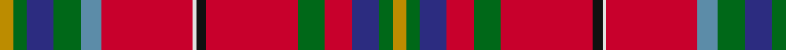

**Bands:** [YGBGBRWKRGRBGY](/stripes/ygbgbrwkrgrbgy/) · **Stripes:** [LO G DB G T R W K R G R DB G LO](/stripes/stripes14/) LO G DB G T R W K R G R DB G LO

This was sourced from register-of-tartans.  It is a [14 band tartan](/bands/bands14/).

Original link https://www.tartanregister.gov.uk/tartanDetails.aspx?ref=5649

## Attestations

This cloth appears in 3 source records; the oldest owns this page.

- 27/05/2008 — West Virginia (register-of-tartans, [record](https://www.tartanregister.gov.uk/tartanDetails.aspx?ref=5649))
- May 2008 — West Virginia (US State) (tartans-authority, [record](http://www.tartansauthority.com/tartan-ferret/display/7631/))
- undated — West Virginia State American District Tartan Tartan Number: 7631. Earliest known date: May 2008 Adapted from 4252 - West Virginia Shawl by Dr Phil Smith and John A Grant III. Adopted by the West Virginia senate (HCR #29) on March 6th 2008. Part of the resolution reads: "Whereas, In order to complement our mountain state the color red is to represent the cardinal (State bird); yellow for the fall colors; dark blue for the mountain rivers and lakes; black for the black bear, coal and oil; green for the rhododendron and mountain meadows; azure for the sky above; and white to have all the colors of this great nation intertwined with the State of West Virginia; therefore, be it Resolved by the Legislature of West Virginia: That the adaption, as described above, of the West Virgina Shawl be designated the Official Tartan of the State of West Virginia." See products available Copyright © Blair Urquhart, Comrie, 2015 (house-of-tartan, [record](http://www.house-of-tartan.scotland.net/house/TartanViewjs.asp?colr=Def&tnam=7631))

## Register references

External register numbers recorded for this tartan.

- Scottish Register of Tartans: [5649](https://www.tartanregister.gov.uk/tartanDetails.aspx?ref=5649)
- Scottish Tartans Authority (ITI): 7631

## Thread count
DY/8 G8 DB16 G16 B12 R54 LN2 K6 R54 G16 R16 DB16 G8 DY/8

## Palette
Each colour and its ΔE from the base-6 reference it is a variant of.

| Colour | Shade | Base | ΔE (OKLab) |
|---|---|---|---|
| B | <code style="background-color:#5C8CA8;">#5C8CA8</code> `#5C8CA8` | B <code style="background-color:#2A418A;">#2A418A</code> | 0.23 |
| DB | <code style="background-color:#2C2C80;">#2C2C80</code> `#2C2C80` | B <code style="background-color:#2A418A;">#2A418A</code> | 0.06 |
| DY | <code style="background-color:#BC8C00;">#BC8C00</code> `#BC8C00` | Y <code style="background-color:#F2BF00;">#F2BF00</code> | 0.16 |
| G | <code style="background-color:#006818;">#006818</code> `#006818` | G <code style="background-color:#006100;">#006100</code> | 0.02 |
| K | <code style="background-color:#101010;">#101010</code> `#101010` | K <code style="background-color:#000000;">#000000</code> | 0.17 |
| LN | <code style="background-color:#E0E0E0;">#E0E0E0</code> `#E0E0E0` | W <code style="background-color:#F7F7F7;">#F7F7F7</code> | 0.07 |
| R | <code style="background-color:#C8002C;">#C8002C</code> `#C8002C` | R <code style="background-color:#CC0000;">#CC0000</code> | 0.03 |

## Nearest tartans

The nearest existing variants by ΔTartan distance.

1. [Muzzi, Massimiliano Baron of Striche](/setts/s16/ly2o1r19k2r8k3g9k3g6k2db6k1db5k2r27w1~x2/) — ΔT 1.09
1. [Wilson's No 4](/setts/s12/r64t16p18ly4p4w4p18g32r14t4r14w3~x2/) — ΔT 1.18
1. [Muzzi, Massimiliano, baron of Strichen Dress (Personal)](/setts/s16/ly2lr1r19k2r8k3dg9k3dg6k2db6k1db5k2r27w1~x2/) — ΔT 1.22
1. [Cork County Crest (Fashion)](/setts/s11/r7k6r62k15r20n15lo10k16db10k3w6/) — ΔT 1.41
1. [Wilson's No.002](/setts/s14/r21g13ly2dp11t9r11dp2r11t9dp11ly2g13r21w1~x2/) — ΔT 1.48
1. [Canfield (Personal)](/setts/s11/r5w1r18dg4r6lo4r1g6k13db5lo2~x2/) — ΔT 1.52
1. [Wren (Name)](/setts/s12/db6w2k2r6ly2g12r6t3k3t3r28ly4~x2/) — ΔT 1.53
1. [Unidentified Bedspread](/setts/s14/r20w6r100db15k10db15k40ly5dg54r15k5r15k6w8/) — ΔT 1.55
1. [MacQueen of Dalmagarry (Clan?)](/setts/s8/g3r4k1r26y14r4dp16w2~x2/) — ΔT 1.56
1. [Livingstone (Australia) Official](/setts/s15/dg10r3k2r3dg10r8k2ly1n1ly1k2r20dg4r8w1~x2/) — ΔT 1.56

## Neighbour map

Every grey dot is one of 14313 variants placed by the first two principal components of the ΔTartan feature space (44% of its variance). Red is this tartan; blue dots are its nearest — click one to open its page.

<svg viewBox="0 0 640 380" role="img" style="max-width:100%;height:auto;border:1px solid #e0e0e0;border-radius:4px;display:block" xmlns="http://www.w3.org/2000/svg"><image href="/nn/cloud.v1.png" width="640" height="380"/><a href="/setts/s16/ly2o1r19k2r8k3g9k3g6k2db6k1db5k2r27w1~x2/"><circle cx="278.8" cy="51.7" r="4" fill="#3465a4"><title>Muzzi, Massimiliano Baron of Striche</title></circle></a><a href="/setts/s12/r64t16p18ly4p4w4p18g32r14t4r14w3~x2/"><circle cx="245.9" cy="96.8" r="4" fill="#3465a4"><title>Wilson's No 4</title></circle></a><a href="/setts/s16/ly2lr1r19k2r8k3dg9k3dg6k2db6k1db5k2r27w1~x2/"><circle cx="272.7" cy="50.0" r="4" fill="#3465a4"><title>Muzzi, Massimiliano, baron of Strichen Dress (Personal)</title></circle></a><a href="/setts/s11/r7k6r62k15r20n15lo10k16db10k3w6/"><circle cx="264.2" cy="98.5" r="4" fill="#3465a4"><title>Cork County Crest (Fashion)</title></circle></a><a href="/setts/s14/r21g13ly2dp11t9r11dp2r11t9dp11ly2g13r21w1~x2/"><circle cx="201.6" cy="124.4" r="4" fill="#3465a4"><title>Wilson's No.002</title></circle></a><a href="/setts/s11/r5w1r18dg4r6lo4r1g6k13db5lo2~x2/"><circle cx="197.7" cy="117.4" r="4" fill="#3465a4"><title>Canfield (Personal)</title></circle></a><a href="/setts/s12/db6w2k2r6ly2g12r6t3k3t3r28ly4~x2/"><circle cx="215.1" cy="81.1" r="4" fill="#3465a4"><title>Wren (Name)</title></circle></a><a href="/setts/s14/r20w6r100db15k10db15k40ly5dg54r15k5r15k6w8/"><circle cx="225.8" cy="77.2" r="4" fill="#3465a4"><title>Unidentified Bedspread</title></circle></a><a href="/setts/s8/g3r4k1r26y14r4dp16w2~x2/"><circle cx="272.3" cy="112.7" r="4" fill="#3465a4"><title>MacQueen of Dalmagarry (Clan?)</title></circle></a><a href="/setts/s15/dg10r3k2r3dg10r8k2ly1n1ly1k2r20dg4r8w1~x2/"><circle cx="296.8" cy="95.3" r="4" fill="#3465a4"><title>Livingstone (Australia) Official</title></circle></a><circle cx="251.4" cy="79.0" r="5" fill="#c00000"/></svg>

ID: /setts/s14/lo4g4db8g8t6r27w1k3r27g8r8db8g4lo4~x2/
