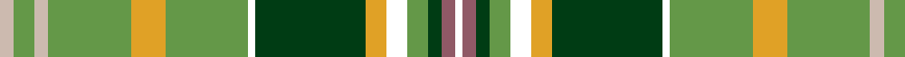

**Bands:** [WRGGWYGWGYGYGY](/stripes/wrggwygwgygygy/) · **Stripes:** [W O DG G W LO DG W G LO G LR G LR](/stripes/stripes14/) W O DG G W LO DG W G LO G LR G LR

This was sourced from register-of-tartans.  It is a [14 band tartan](/bands/bands14/).

Original link https://www.tartanregister.gov.uk/tartanDetails.aspx?ref=11625

## Register references

External register numbers recorded for this tartan.

- Scottish Register of Tartans: [11625](https://www.tartanregister.gov.uk/tartanDetails.aspx?ref=11625)

## Thread count
N/4 LG6 N4 LG24 Y10 LG24 W2 DG32 Y6 W6 LG6 DG4 LT4 W/2

## Palette
Each colour and its ΔE from the base-6 reference it is a variant of.

| Colour | Shade | Base | ΔE (OKLab) |
|---|---|---|---|
| DG | <code style="background-color:#003C14;">#003C14</code> `#003C14` | G <code style="background-color:#006100;">#006100</code> | 0.13 |
| LG | <code style="background-color:#649848;">#649848</code> `#649848` | G <code style="background-color:#006100;">#006100</code> | 0.20 |
| LT | <code style="background-color:#905966;">#905966</code> `#905966` | R <code style="background-color:#CC0000;">#CC0000</code> | 0.15 |
| N | <code style="background-color:#CCBAAF;">#CCBAAF</code> `#CCBAAF` | Y <code style="background-color:#F2BF00;">#F2BF00</code> | 0.15 |
| W | <code style="background-color:#FFFFFF;">#FFFFFF</code> `#FFFFFF` | W <code style="background-color:#F7F7F7;">#F7F7F7</code> | 0.02 |
| Y | <code style="background-color:#E0A126;">#E0A126</code> `#E0A126` | Y <code style="background-color:#F2BF00;">#F2BF00</code> | 0.08 |

## Nearest tartans

The nearest existing variants by ΔTartan distance.

1. [Fredericton #2](/setts/s12/ly2g16t2w2t2w2t6g7r2w1t1dp1~x6/) — ΔT 1.17
1. [Green Bay, Wisconsin (District)](/setts/s12/g8ly2db3ly2g16ly10g3w6g1ly3g1w6~x2/) — ΔT 1.18
1. [Fredericton](/setts/s12/ly2g16t2w2t2w2t6g7r2w1t1p1~x2/) — ΔT 1.23
1. [Currie of Arran (Clan/family)](/setts/s11/b16w3b2ly4g24r2g4r5g4r2lb8~x2/) — ΔT 1.24
1. [Wcwm 972-1](/setts/s13/lb7k1do1o2g18lb2k1lo2k1lb6k1do1lb1~x4/) — ΔT 1.29
1. [Harmony, 2](/setts/s12/dr9t3dr4ly3dr3ly4dr3o11g30b3g4dr3~x2/) — ΔT 1.36
1. [North West Territories](/setts/s10/ly4g2ly2g2ly2g24k2r16w9db3~x2/) — ΔT 1.38
1. [Currie](/setts/s11/db16w3db1ly4g24r1g3r4g3r1t8~x2/) — ΔT 1.38
1. [Buglass](/setts/s13/lo3g1lo1g14o2g2o2g4o11dg25ly2dg3w2~x2/) — ΔT 1.43
1. [Breacan](/setts/s12/o3w1o1w3g1w1g10g2g1g10ly2r2~x2/) — ΔT 1.43

## Neighbour map

Every grey dot is one of 14313 variants placed by the first two principal components of the ΔTartan feature space (44% of its variance). Red is this tartan; blue dots are its nearest — click one to open its page.

<svg viewBox="0 0 640 380" role="img" style="max-width:100%;height:auto;border:1px solid #e0e0e0;border-radius:4px;display:block" xmlns="http://www.w3.org/2000/svg"><image href="/nn/cloud.v1.png" width="640" height="380"/><a href="/setts/s12/ly2g16t2w2t2w2t6g7r2w1t1dp1~x6/"><circle cx="240.2" cy="109.7" r="4" fill="#3465a4"><title>Fredericton #2</title></circle></a><a href="/setts/s12/g8ly2db3ly2g16ly10g3w6g1ly3g1w6~x2/"><circle cx="191.5" cy="132.8" r="4" fill="#3465a4"><title>Green Bay, Wisconsin (District)</title></circle></a><a href="/setts/s12/ly2g16t2w2t2w2t6g7r2w1t1p1~x2/"><circle cx="252.9" cy="116.8" r="4" fill="#3465a4"><title>Fredericton</title></circle></a><a href="/setts/s11/b16w3b2ly4g24r2g4r5g4r2lb8~x2/"><circle cx="163.8" cy="126.4" r="4" fill="#3465a4"><title>Currie of Arran (Clan/family)</title></circle></a><a href="/setts/s13/lb7k1do1o2g18lb2k1lo2k1lb6k1do1lb1~x4/"><circle cx="197.4" cy="81.0" r="4" fill="#3465a4"><title>Wcwm 972-1</title></circle></a><a href="/setts/s12/dr9t3dr4ly3dr3ly4dr3o11g30b3g4dr3~x2/"><circle cx="179.7" cy="130.1" r="4" fill="#3465a4"><title>Harmony, 2</title></circle></a><a href="/setts/s10/ly4g2ly2g2ly2g24k2r16w9db3~x2/"><circle cx="162.1" cy="111.4" r="4" fill="#3465a4"><title>North West Territories</title></circle></a><a href="/setts/s11/db16w3db1ly4g24r1g3r4g3r1t8~x2/"><circle cx="217.7" cy="104.0" r="4" fill="#3465a4"><title>Currie</title></circle></a><a href="/setts/s13/lo3g1lo1g14o2g2o2g4o11dg25ly2dg3w2~x2/"><circle cx="196.6" cy="87.3" r="4" fill="#3465a4"><title>Buglass</title></circle></a><a href="/setts/s12/o3w1o1w3g1w1g10g2g1g10ly2r2~x2/"><circle cx="112.5" cy="126.9" r="4" fill="#3465a4"><title>Breacan</title></circle></a><circle cx="182.0" cy="109.3" r="5" fill="#c00000"/></svg>

ID: /setts/s14/lr2g3lr2g12lo5g12w1dg16lo3w3g3dg2o2w1~x2/
