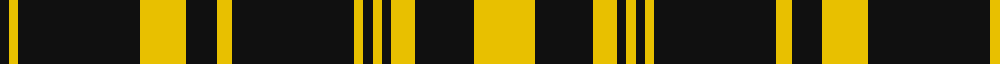

**Bands:** [KYKYKYKYKYKYKY](/stripes/kykykykykykyky/) · **Stripes:** [K LY K LY K LY K LY K LY K LY K LY](/stripes/stripes14/) K LY K LY K LY K LY K LY K LY K LY

This was sourced from tartans-authority.  It is a [14 band tartan](/bands/bands14/).

Original link http://www.tartansauthority.com/tartan-ferret/display/6319/

## Thread count
K/6 Y6 K80 Y30 K20 Y10 K80 Y6 K6 Y6 K6 Y16 K38 Y/40

## Palette
Each colour and its ΔE from the base-6 reference it is a variant of.

| Colour | Shade | Base | ΔE (OKLab) |
|---|---|---|---|
| K | <code style="background-color:#101010;">#101010</code> `#101010` | K <code style="background-color:#000000;">#000000</code> | 0.17 |
| Y | <code style="background-color:#E8C000;">#E8C000</code> `#E8C000` | Y <code style="background-color:#F2BF00;">#F2BF00</code> | 0.02 |

## Nearest tartans

The nearest existing variants by ΔTartan distance.

1. [Justus Yellow & Black (Personal)](/setts/s26/ly20k19ly8k3ly3k3ly3k40ly5k10ly15k40ly3k3ly3k40ly15k10ly5k40ly3k3ly3k3ly8k19~x2/) — ΔT 1.34
1. [Kinloch Anderson Black and White](/setts/s10/k4w14k2w4k8w3k30w2k4w4~x2/) — ΔT 1.48
1. [Justus Black & Gold (Angus) (Persona](/setts/s9/k3lo1k8lo9k1lo1k1lo1k2~x4/) — ΔT 1.59
1. [Justus Black & Gold (Angus) (Personal)](/setts/s16/k3lo1k8lo9k1lo1k1lo1k2lo1k1lo1k1lo9k8lo1~x4/) — ΔT 1.65
1. [Coppa Romana (Switzerland)](/setts/s10/k17ly2k2ly2k9w11k2w11k20ly2~x2/) — ΔT 1.67
1. [Coppa Romana (Corporate)](/setts/s10/k17ly2k2ly2k9lb11k2lb11k20ly2~x2/) — ΔT 1.69
1. [Gretna Football Club](/setts/s12/w36k8w36k95w4k4r6k4w4k95w36k8/) — ΔT 1.75
1. [MacLean, Black & White](/setts/s11/w20k6w9k6w6k12w6k48w8k16w16/) — ΔT 1.82
1. [Jensen, Sven (Personal)](/setts/s9/g12k8w6k22w3k8w3k40g6/) — ΔT 1.83
1. [Northern Kentucky University](/setts/s7/w5k3ly6k5w3k30ly2~x2/) — ΔT 1.85

## Neighbour map

Every grey dot is one of 14313 variants placed by the first two principal components of the ΔTartan feature space (44% of its variance). Red is this tartan; blue dots are its nearest — click one to open its page.

<svg viewBox="0 0 640 380" role="img" style="max-width:100%;height:auto;border:1px solid #e0e0e0;border-radius:4px;display:block" xmlns="http://www.w3.org/2000/svg"><image href="/nn/cloud.v1.png" width="640" height="380"/><a href="/setts/s26/ly20k19ly8k3ly3k3ly3k40ly5k10ly15k40ly3k3ly3k40ly15k10ly5k40ly3k3ly3k3ly8k19~x2/"><circle cx="412.3" cy="150.2" r="4" fill="#3465a4"><title>Justus Yellow &amp; Black (Personal)</title></circle></a><a href="/setts/s10/k4w14k2w4k8w3k30w2k4w4~x2/"><circle cx="384.3" cy="175.2" r="4" fill="#3465a4"><title>Kinloch Anderson Black and White</title></circle></a><a href="/setts/s9/k3lo1k8lo9k1lo1k1lo1k2~x4/"><circle cx="346.6" cy="207.2" r="4" fill="#3465a4"><title>Justus Black &amp; Gold (Angus) (Persona</title></circle></a><a href="/setts/s16/k3lo1k8lo9k1lo1k1lo1k2lo1k1lo1k1lo9k8lo1~x4/"><circle cx="319.7" cy="178.7" r="4" fill="#3465a4"><title>Justus Black &amp; Gold (Angus) (Personal)</title></circle></a><a href="/setts/s10/k17ly2k2ly2k9w11k2w11k20ly2~x2/"><circle cx="323.2" cy="189.7" r="4" fill="#3465a4"><title>Coppa Romana (Switzerland)</title></circle></a><a href="/setts/s10/k17ly2k2ly2k9lb11k2lb11k20ly2~x2/"><circle cx="327.0" cy="192.8" r="4" fill="#3465a4"><title>Coppa Romana (Corporate)</title></circle></a><a href="/setts/s12/w36k8w36k95w4k4r6k4w4k95w36k8/"><circle cx="378.1" cy="126.1" r="4" fill="#3465a4"><title>Gretna Football Club</title></circle></a><a href="/setts/s11/w20k6w9k6w6k12w6k48w8k16w16/"><circle cx="309.3" cy="208.6" r="4" fill="#3465a4"><title>MacLean, Black &amp; White</title></circle></a><a href="/setts/s9/g12k8w6k22w3k8w3k40g6/"><circle cx="416.8" cy="197.8" r="4" fill="#3465a4"><title>Jensen, Sven (Personal)</title></circle></a><a href="/setts/s7/w5k3ly6k5w3k30ly2~x2/"><circle cx="405.6" cy="168.1" r="4" fill="#3465a4"><title>Northern Kentucky University</title></circle></a><circle cx="397.8" cy="173.3" r="5" fill="#c00000"/></svg>

ID: /setts/s14/ly20k19ly8k3ly3k3ly3k40ly5k10ly15k40ly3k3~x2/
