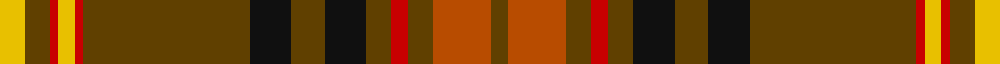

In pattern [GRGRGKGKGRYRGY](/stripes/grgrgkgkgryrgy/).

This was sourced from register-of-tartans.  It is a [14 stripe tartan](/stripes/stripes14/).

Original link https://www.tartanregister.gov.uk/tartanDetails.aspx?ref=187

## Also known as

This cloth is also recorded under:

- Balnagown

## Attestations

This cloth appears in 2 source records; the oldest owns this page.

- 01/09/2002 — Balnagowan (Harrods) (register-of-tartans, [record](https://www.tartanregister.gov.uk/tartanDetails.aspx?ref=187))
- May 2003 — Balnagown (Corporate) (tartans-authority, [record](http://www.tartansauthority.com/tartan-ferret/display/5824/))

## Register references

External register numbers recorded for this tartan.

- Scottish Register of Tartans: [187](https://www.tartanregister.gov.uk/tartanDetails.aspx?ref=187)
- Scottish Tartans Authority (ITI): 5824
- Scottish Tartans World Register: 2925

## Thread count
Y/6 T6 R2 Y4 R2 T40 K10 T8 K10 T6 R4 T6 DO14 T/4

## Palette
Each colour and the base-6 reference it is a variant of.

| Colour | Shade | Base |
|---|---|---|
| DO | <code style="background-color:#B84C00;">#B84C00</code> `oklch(55.1% 0.156 45.5)` <small>#B84C00</small> | R <code style="background-color:#CC0000;">#CC0000</code> |
| K | <code style="background-color:#101010;">#101010</code> `oklch(17.3% 0.000 89.9)` <small>#101010</small> | K <code style="background-color:#000000;">#000000</code> |
| R | <code style="background-color:#C80000;">#C80000</code> `oklch(52.3% 0.215 29.2)` <small>#C80000</small> | R <code style="background-color:#CC0000;">#CC0000</code> |
| T | <code style="background-color:#604000;">#604000</code> `oklch(39.8% 0.083 76.8)` <small>#604000</small> | G <code style="background-color:#006100;">#006100</code> |
| Y | <code style="background-color:#E8C000;">#E8C000</code> `oklch(81.9% 0.168 93.7)` <small>#E8C000</small> | Y <code style="background-color:#F2BF00;">#F2BF00</code> |

## Nearest tartans

The nearest existing variants by ΔTartan distance, with this tartan at the top so the swatches line up against it.

ΔTartan

Tartan

Sett

—

<a href="/ttd/edit/#slug=ly3dy3r1ly2r1dy20k5dy4k5dy3r2dy3o7dy2~x2">Balnagowan (Harrods)</a> <a class="nn-out" href="/setts/s14/ly3dy3r1ly2r1dy20k5dy4k5dy3r2dy3o7dy2~x2/" title="open its dictionary page">↗</a>

0.65

<a href="/ttd/edit/#slug=r6k2r2k4r2k2r6g18r2lo1r2k2r10w1r2~x4">Ainslie #2</a> <a class="nn-out" href="/setts/s15/r6k2r2k4r2k2r6g18r2lo1r2k2r10w1r2~x4/" title="open its dictionary page">↗</a>

1.02

<a href="/ttd/edit/#slug=r4t2r50db26r10g44r4r10r4g44r51db2r4t2~x2">MacQuarrie 1</a> <a class="nn-out" href="/setts/s14/r4t2r50db26r10g44r4r10r4g44r51db2r4t2~x2/" title="open its dictionary page">↗</a>

1.18

<a href="/ttd/edit/#slug=k2lr1r2g6r2db4r2k2r15g2r2k1~x4">MacClure Clan/Family Tartan Tartan Number: 3330. Earliest known date: pre 2002 Designed by Phil Smith for all MacClures. (note by Phil Smith Sept 2004) and originally woven by D C Dalgliesh. MacClures and MacLures are a sept of MacLeod. See products available Copyright © Blair Urquhart, Comrie, 2015</a> <a class="nn-out" href="/setts/s12/k2lr1r2g6r2db4r2k2r15g2r2k1~x4/" title="open its dictionary page">↗</a>

1.20

<a href="/ttd/edit/#slug=dg3r1r2dg2r16lb1db4r3dg13r1db1r1r3~x2">MacDonald of Glencoe</a> <a class="nn-out" href="/setts/s13/dg3r1r2dg2r16lb1db4r3dg13r1db1r1r3~x2/" title="open its dictionary page">↗</a>

1.20

<a href="/ttd/edit/#slug=r24lb1k3lb1g14r8k3dp3lb2~x4">Leach (1995)</a> <a class="nn-out" href="/setts/s9/r24lb1k3lb1g14r8k3dp3lb2~x4/" title="open its dictionary page">↗</a>

1.20

<a href="/ttd/edit/#slug=k1r14g1r1g6lb2g6r1g1r14k1lb1~x4">MacMaster Clan/Family Tartan Tartan Number: 3493. Earliest known date: 1986 Designed by Phil Smith in 1986 for all of the names MacMaster, MacMasters etc. See MacMasters Canada. See products available Copyright © Blair Urquhart, Comrie, 2015</a> <a class="nn-out" href="/setts/s12/k1r14g1r1g6lb2g6r1g1r14k1lb1~x4/" title="open its dictionary page">↗</a>

1.27

<a href="/ttd/edit/#slug=r4t2r50db26r10dg44r4r10r4dg44r51db2r4t2~x2">MacQuarrie #2</a> <a class="nn-out" href="/setts/s14/r4t2r50db26r10dg44r4r10r4dg44r51db2r4t2~x2/" title="open its dictionary page">↗</a>

1.29

<a href="/ttd/edit/#slug=r6k4r8g16r6lb2r2g2r2lb2r6g18dp6g2dp1~x2">MacCall Family Tartan Tartan Number: 2238. Earliest known date: 2000 Originally designed for a wedding in the McCall family in Aberdeen, and permission was given for anyone of the name to wear it. It was designed by John C McCall &amp; M McCall who are related to Nancy McCall the former owner of McCall's of Aberdeen (01224 405300). MacCall Chieftain is a Peter J.D. MacCall of Birkenshaw who is believed to be elderly and living with a daughter in Lockerbie (October 2002). See products available Copyright © Blair Urquhart, Comrie, 2015</a> <a class="nn-out" href="/setts/s15/r6k4r8g16r6lb2r2g2r2lb2r6g18dp6g2dp1~x2/" title="open its dictionary page">↗</a>

1.31

<a href="/ttd/edit/#slug=y14lo1y1lo1y2k3y3k3do3do1do9lo1~x4">Glen Nevis #2 (Personal)</a> <a class="nn-out" href="/setts/s12/y14lo1y1lo1y2k3y3k3do3do1do9lo1~x4/" title="open its dictionary page">↗</a>

1.31

<a href="/ttd/edit/#slug=r5r2k3r4g43r6k7t2r47g2r3r2g4~x2">Glen Coe (District)</a> <a class="nn-out" href="/setts/s13/r5r2k3r4g43r6k7t2r47g2r3r2g4~x2/" title="open its dictionary page">↗</a>

## Neighbour map

Every grey dot is one of 14299 variants placed by the first two principal components of the ΔTartan feature space (44% of its variance). Red is this tartan; blue dots are its nearest — click one to open its page.

<svg viewBox="0 0 640 380" role="img" style="max-width:100%;height:auto;border:1px solid #e0e0e0;border-radius:4px;display:block" xmlns="http://www.w3.org/2000/svg"><image href="/nn/cloud.v1.png" width="640" height="380"/><a href="/setts/s15/r6k2r2k4r2k2r6g18r2lo1r2k2r10w1r2~x4/"><circle cx="303.2" cy="126.7" r="4" fill="#3465a4"><title>Ainslie #2</title></circle></a><a href="/setts/s14/r4t2r50db26r10g44r4r10r4g44r51db2r4t2~x2/"><circle cx="312.9" cy="110.7" r="4" fill="#3465a4"><title>MacQuarrie 1</title></circle></a><a href="/setts/s12/k2lr1r2g6r2db4r2k2r15g2r2k1~x4/"><circle cx="327.9" cy="145.2" r="4" fill="#3465a4"><title>MacClure Clan/Family Tartan Tartan Number: 3330. Earliest known date: pre 2002 Designed by Phil Smith for all MacClures. (note by Phil Smith Sept 2004) and originally woven by D C Dalgliesh. MacClures and MacLures are a sept of MacLeod. See products available Copyright © Blair Urquhart, Comrie, 2015</title></circle></a><a href="/setts/s13/dg3r1r2dg2r16lb1db4r3dg13r1db1r1r3~x2/"><circle cx="320.8" cy="138.4" r="4" fill="#3465a4"><title>MacDonald of Glencoe</title></circle></a><a href="/setts/s9/r24lb1k3lb1g14r8k3dp3lb2~x4/"><circle cx="330.7" cy="129.6" r="4" fill="#3465a4"><title>Leach (1995)</title></circle></a><a href="/setts/s12/k1r14g1r1g6lb2g6r1g1r14k1lb1~x4/"><circle cx="374.5" cy="139.7" r="4" fill="#3465a4"><title>MacMaster Clan/Family Tartan Tartan Number: 3493. Earliest known date: 1986 Designed by Phil Smith in 1986 for all of the names MacMaster, MacMasters etc. See MacMasters Canada. See products available Copyright © Blair Urquhart, Comrie, 2015</title></circle></a><a href="/setts/s14/r4t2r50db26r10dg44r4r10r4dg44r51db2r4t2~x2/"><circle cx="309.7" cy="105.7" r="4" fill="#3465a4"><title>MacQuarrie #2</title></circle></a><a href="/setts/s15/r6k4r8g16r6lb2r2g2r2lb2r6g18dp6g2dp1~x2/"><circle cx="260.6" cy="141.0" r="4" fill="#3465a4"><title>MacCall Family Tartan Tartan Number: 2238. Earliest known date: 2000 Originally designed for a wedding in the McCall family in Aberdeen, and permission was given for anyone of the name to wear it. It was designed by John C McCall &amp; M McCall who are related to Nancy McCall the former owner of McCall's of Aberdeen (01224 405300). MacCall Chieftain is a Peter J.D. MacCall of Birkenshaw who is believed to be elderly and living with a daughter in Lockerbie (October 2002). See products available Copyright © Blair Urquhart, Comrie, 2015</title></circle></a><a href="/setts/s12/y14lo1y1lo1y2k3y3k3do3do1do9lo1~x4/"><circle cx="275.4" cy="146.5" r="4" fill="#3465a4"><title>Glen Nevis #2 (Personal)</title></circle></a><a href="/setts/s13/r5r2k3r4g43r6k7t2r47g2r3r2g4~x2/"><circle cx="355.6" cy="107.4" r="4" fill="#3465a4"><title>Glen Coe (District)</title></circle></a><circle cx="326.4" cy="124.8" r="5" fill="#c00000"/></svg>

ID: /setts/s14/ly3dy3r1ly2r1dy20k5dy4k5dy3r2dy3o7dy2~x2/
