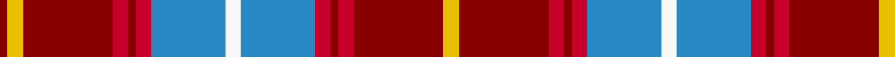

This page is one **sett** — a single exact thread-count. It belongs to the [tartan](/tartans/y4dr23r4dr2r4b19w4b19r4dr2r4dr23y4dr2/)
(the same proportion at any scale), whose colour order is pattern [RYRRRRBWBRRRRY](/stripes/ryrrrrbwbrrrry/).

Sourced from register-of-tartans.  It is a [14 stripe tartan](/stripes/stripes14/).

Original link https://www.tartanregister.gov.uk/tartanDetails.aspx?ref=3725

## Register references

External register numbers recorded for this tartan.

- Scottish Register of Tartans: [3725](https://www.tartanregister.gov.uk/tartanDetails.aspx?ref=3725)
- Scottish Tartans Authority (ITI): 6745

## Thread count
Y/8 DR46 R8 DR4 R8 B38 W8 B38 R8 DR4 R8 DR46 Y8 DR/4

## Palette
Each colour and the base-6 reference it is a variant of.

| Colour | Shade | Base |
|---|---|---|
| B | <code style="background-color:#2888C4;">#2888C4</code> `oklch(60.1% 0.125 241.5)` <small>#2888C4</small> | B <code style="background-color:#2A418A;">#2A418A</code> |
| DB | <code style="background-color:#202060;">#202060</code> `oklch(28.9% 0.111 276.9)` <small>#202060</small> | B <code style="background-color:#2A418A;">#2A418A</code> |
| DR | <code style="background-color:#880000;">#880000</code> `oklch(39.4% 0.162 29.2)` <small>#880000</small> | R <code style="background-color:#CC0000;">#CC0000</code> |
| R | <code style="background-color:#C8002C;">#C8002C</code> `oklch(52.6% 0.212 22.0)` <small>#C8002C</small> | R <code style="background-color:#CC0000;">#CC0000</code> |
| Ra | <code style="background-color:#C80000;">#C80000</code> `oklch(52.3% 0.215 29.2)` <small>#C80000</small> | R <code style="background-color:#CC0000;">#CC0000</code> |
| W | <code style="background-color:#F8F8F8;">#F8F8F8</code> `oklch(97.9% 0.000 89.9)` <small>#F8F8F8</small> | W <code style="background-color:#F7F7F7;">#F7F7F7</code> |
| Y | <code style="background-color:#E8C000;">#E8C000</code> `oklch(81.9% 0.168 93.7)` <small>#E8C000</small> | Y <code style="background-color:#F2BF00;">#F2BF00</code> |

## Nearest tartans

The nearest existing variants by ΔTartan distance, with this tartan at the top so the swatches line up against it.

ΔTartan

Tartan

Sett

—

<a href="/ttd/edit/#slug=ly4r23r4r2r4t19w4t19r4r2r4r23ly4r2~x2">Scottish Institute of Sport</a> <a class="nn-out" href="/setts/s14/ly4r23r4r2r4t19w4t19r4r2r4r23ly4r2~x2/" title="open its dictionary page">↗</a>

0.87

<a href="/ttd/edit/#slug=k3r4db2r20db20r2dg2r6dg10r6w2r3k2~x2">Cameron of Locheil (Bonner collection)</a> <a class="nn-out" href="/setts/s13/k3r4db2r20db20r2dg2r6dg10r6w2r3k2~x2/" title="open its dictionary page">↗</a>

0.91

<a href="/ttd/edit/#slug=k3r4db2r20db20r2g2r6g10r6w2r3k2~x2">Cameron of Locheil</a> <a class="nn-out" href="/setts/s13/k3r4db2r20db20r2g2r6g10r6w2r3k2~x2/" title="open its dictionary page">↗</a>

0.95

<a href="/ttd/edit/#slug=n4r20k2r2k2r3k6o26w3o2w2o4~x2">Eidart 1990 (Fashion)</a> <a class="nn-out" href="/setts/s12/n4r20k2r2k2r3k6o26w3o2w2o4~x2/" title="open its dictionary page">↗</a>

1.03

<a href="/ttd/edit/#slug=dp2r3dg2db2r6dg16r2db4dg2r16dg8dp2r4w2~x2">MacKinnon #8</a> <a class="nn-out" href="/setts/s14/dp2r3dg2db2r6dg16r2db4dg2r16dg8dp2r4w2~x2/" title="open its dictionary page">↗</a>

1.05

<a href="/ttd/edit/#slug=r7ly3r27k14m5k3m5k3m8g3m4g4~x2">Scotland's People</a> <a class="nn-out" href="/setts/s12/r7ly3r27k14m5k3m5k3m8g3m4g4~x2/" title="open its dictionary page">↗</a>

1.09

<a href="/ttd/edit/#slug=db2r11dg2r11dg21r2k9t2db11r11dg2r11db2~x2">Nicolson/MacNicol</a> <a class="nn-out" href="/setts/s13/db2r11dg2r11dg21r2k9t2db11r11dg2r11db2~x2/" title="open its dictionary page">↗</a>

1.10

<a href="/ttd/edit/#slug=w1ly2r15db2r2db15r2g15r2db2r15ly2w1~x2">Robbie (Stirling) (Personal)</a> <a class="nn-out" href="/setts/s13/w1ly2r15db2r2db15r2g15r2db2r15ly2w1~x2/" title="open its dictionary page">↗</a>

1.11

<a href="/ttd/edit/#slug=r31g3r2g2r3g2r2g3r15k15g2t15g3t3w2~x2">Moir (Loch Insch) (Personal)</a> <a class="nn-out" href="/setts/s15/r31g3r2g2r3g2r2g3r15k15g2t15g3t3w2~x2/" title="open its dictionary page">↗</a>

1.11

<a href="/ttd/edit/#slug=t2r3dg2db2r6dg16r2db4dg2r16dg8t2r4w2~x2">MacKinnon #2</a> <a class="nn-out" href="/setts/s14/t2r3dg2db2r6dg16r2db4dg2r16dg8t2r4w2~x2/" title="open its dictionary page">↗</a>

1.12

<a href="/ttd/edit/#slug=dp3r4dg3db3r7dg17r3db5dg4r21dg7dp3r6w3~x2">MacKinnon #3</a> <a class="nn-out" href="/setts/s14/dp3r4dg3db3r7dg17r3db5dg4r21dg7dp3r6w3~x2/" title="open its dictionary page">↗</a>

## Neighbour map

Every grey dot is one of 14299 variants placed by the first two principal components of the ΔTartan feature space (44% of its variance). Red is this tartan; blue dots are its nearest — click one to open its page.

<svg viewBox="0 0 640 380" role="img" style="max-width:100%;height:auto;border:1px solid #e0e0e0;border-radius:4px;display:block" xmlns="http://www.w3.org/2000/svg"><image href="/nn/cloud.v1.png" width="640" height="380"/><a href="/setts/s13/k3r4db2r20db20r2dg2r6dg10r6w2r3k2~x2/"><circle cx="245.4" cy="136.6" r="4" fill="#3465a4"><title>Cameron of Locheil (Bonner collection)</title></circle></a><a href="/setts/s13/k3r4db2r20db20r2g2r6g10r6w2r3k2~x2/"><circle cx="239.6" cy="137.2" r="4" fill="#3465a4"><title>Cameron of Locheil</title></circle></a><a href="/setts/s12/n4r20k2r2k2r3k6o26w3o2w2o4~x2/"><circle cx="224.8" cy="120.0" r="4" fill="#3465a4"><title>Eidart 1990 (Fashion)</title></circle></a><a href="/setts/s14/dp2r3dg2db2r6dg16r2db4dg2r16dg8dp2r4w2~x2/"><circle cx="215.6" cy="149.5" r="4" fill="#3465a4"><title>MacKinnon #8</title></circle></a><a href="/setts/s12/r7ly3r27k14m5k3m5k3m8g3m4g4~x2/"><circle cx="171.7" cy="138.9" r="4" fill="#3465a4"><title>Scotland's People</title></circle></a><a href="/setts/s13/db2r11dg2r11dg21r2k9t2db11r11dg2r11db2~x2/"><circle cx="215.3" cy="156.7" r="4" fill="#3465a4"><title>Nicolson/MacNicol</title></circle></a><a href="/setts/s13/w1ly2r15db2r2db15r2g15r2db2r15ly2w1~x2/"><circle cx="215.2" cy="104.0" r="4" fill="#3465a4"><title>Robbie (Stirling) (Personal)</title></circle></a><a href="/setts/s15/r31g3r2g2r3g2r2g3r15k15g2t15g3t3w2~x2/"><circle cx="257.1" cy="95.3" r="4" fill="#3465a4"><title>Moir (Loch Insch) (Personal)</title></circle></a><a href="/setts/s14/t2r3dg2db2r6dg16r2db4dg2r16dg8t2r4w2~x2/"><circle cx="215.6" cy="150.6" r="4" fill="#3465a4"><title>MacKinnon #2</title></circle></a><a href="/setts/s14/dp3r4dg3db3r7dg17r3db5dg4r21dg7dp3r6w3~x2/"><circle cx="206.9" cy="158.7" r="4" fill="#3465a4"><title>MacKinnon #3</title></circle></a><circle cx="212.4" cy="129.5" r="5" fill="#c00000"/></svg>

ID: /setts/s14/ly4r23r4r2r4t19w4t19r4r2r4r23ly4r2~x2/
