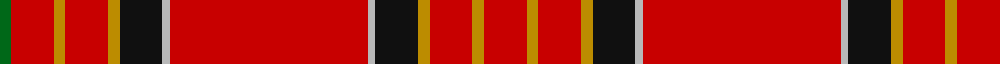

In pattern [GRYRYKYRYKYRYR](/patterns/gryrykyrykyryr/).

This was sourced from register-of-tartans.  It is a [14 stripes tartan](/stripes/stripes14/).

Original link https://www.tartanregister.gov.uk/tartanDetails.aspx?ref=1566

## Register references

External register numbers recorded for this tartan.

- Scottish Register of Tartans: [1566](https://www.tartanregister.gov.uk/tartanDetails.aspx?ref=1566)
- Scottish Tartans Authority (ITI): 907
- Scottish Tartans World Register: 907

## Thread count
G/6 R22 DY6 R22 DY6 K22 N4 R102 N4 K22 DY6 R22 DY6 R/22

## Palette
Each colour and its ΔE from the base-6 reference it is a variant of.

| Colour | Shade | Base | ΔE (OKLab) |
|---|---|---|---|
| DY | <code style="background-color:#BC8C00;">#BC8C00</code> `#BC8C00` | Y <code style="background-color:#F2BF00;">#F2BF00</code> | 0.16 |
| G | <code style="background-color:#006818;">#006818</code> `#006818` | G <code style="background-color:#006100;">#006100</code> | 0.02 |
| K | <code style="background-color:#101010;">#101010</code> `#101010` | K <code style="background-color:#000000;">#000000</code> | 0.17 |
| N | <code style="background-color:#B8B8B8;">#B8B8B8</code> `#B8B8B8` | Y <code style="background-color:#F2BF00;">#F2BF00</code> | 0.17 |
| R | <code style="background-color:#C80000;">#C80000</code> `#C80000` | R <code style="background-color:#CC0000;">#CC0000</code> | 0.01 |

## Nearest tartans

The nearest existing variants by ΔTartan distance.

1. [Highland Queen](/setts/s12/r8y4r30ya6r2k1r2y6r8k1r4yb2~k101010-rcd0000-y66cd00-ya75a1d0-ybcdad00~x2/) — ΔT 1.01
1. [Wilding, Michael John (Personal)](/setts/s13/w2k2b2y2k2r7k1r12k2r6w1r23k1~b5c8ca8-k101010-ra00000-wfcfcfc-yfccc00~x2/) — ΔT 1.08
1. [Heritage Plaid](/setts/s11/r44b3k6y2k2y2k10r5k2r3w2~b2c2c80-k101010-rc80000-we0e0e0-ya08858~x2/) — ΔT 1.30
1. [Mair (Personal)](/setts/s12/r23g3y1g3r2b18r2w1g3r2b2r23~b2c2c80-g006818-rc80000-wfcfcfc-yd8b000~x2/) — ΔT 1.34
1. [Mair Family Tartan Tartan Number: 1406. Earliest known date: 1985 Based on an unnamed tartan from South Uist, the yellow represents the gold and red of the original sett form the colours of the 'Mair' coat of arms registered with Lord Lyon. Head of the family, Duine Usail, Robert George Alexander Mair esq. F.S.A. Scot, Sunshine, Melbourne, Victoria, Australia. He is the son of Alexander Smith Mair who arrived in Australia in 1924 from Govan, Glasgow. See products available Copyright © Blair Urquhart, Comrie, 2015](/setts/s12/r23g3y1g3r2b18r2w1g3r2b2r23~b2c2c80-g006818-rc80000-we0e0e0-ye8c000~x2/) — ΔT 1.34
1. [Oliver Family Tartan Tartan Number: 1606. Earliest known date: 1973 (1820) Designed for the Oliver Society, based on Tweedside Distict sett of c.1820 in Wilson's notebook now in Museum of Antiquities. See products available Copyright © Blair Urquhart, Comrie, 2015](/setts/s9/r40k3r2b12r2g2r2g2y3~b2c2c80-g006818-k101010-rc80000-ye8c000~x2/) — ΔT 1.34
1. [Oliver, dress](/setts/s9/r40k3r2b12r2g2r2g2y3~b304080-g008000-k000000-rc00000-yf0c000~x2/) — ΔT 1.34
1. [De Nardi #2 (Personal)](/setts/s8/r68b27r5y3r5g3r13ba3~b1c1c50-ba5c8ca8-g006818-rc80000-ye8c000~x2/) — ΔT 1.36
1. [Unidentified #34](/setts/s18/r66b1ba1r6g30r6ba1b1r3ba16r3b1ba1r54g3ra1r6g6~b2c4084-ba080848-g005020-rdc0000-rac82828~x2/) — ΔT 1.38
1. [Stewart of Rothesay Clan Tartan Tartan Number: 847. Earliest known date: 1829 See Vestiarium Scoticum entry. Named `Duke of Rothesay' in a drawing by Charles Sobieski (Allen) in the Dick Lauder transcript in the Royal Library in Windsor. See products available Copyright © Blair Urquhart, Comrie, 2015](/setts/s11/g2r26b4r2k4r2g8r4k1r1w2~b2c2c80-g006818-k101010-rc80000-we0e0e0~x2/) — ΔT 1.39

## Neighbour map

Every grey dot is one of 15726 variants placed by the first two principal components of the ΔTartan feature space (44% of its variance). Red is this tartan; blue dots are its nearest — click one to open its page.

<svg viewBox="0 0 640 380" role="img" style="max-width:100%;height:auto;border:1px solid #e0e0e0;border-radius:4px;display:block" xmlns="http://www.w3.org/2000/svg"><image href="/nn/cloud.v1.png" width="640" height="380"/><a href="/setts/s12/r8y4r30ya6r2k1r2y6r8k1r4yb2~k101010-rcd0000-y66cd00-ya75a1d0-ybcdad00~x2/"><circle cx="465.7" cy="90.6" r="4" fill="#3465a4"><title>Highland Queen</title></circle></a><a href="/setts/s13/w2k2b2y2k2r7k1r12k2r6w1r23k1~b5c8ca8-k101010-ra00000-wfcfcfc-yfccc00~x2/"><circle cx="478.8" cy="101.5" r="4" fill="#3465a4"><title>Wilding, Michael John (Personal)</title></circle></a><a href="/setts/s11/r44b3k6y2k2y2k10r5k2r3w2~b2c2c80-k101010-rc80000-we0e0e0-ya08858~x2/"><circle cx="408.2" cy="86.2" r="4" fill="#3465a4"><title>Heritage Plaid</title></circle></a><a href="/setts/s12/r23g3y1g3r2b18r2w1g3r2b2r23~b2c2c80-g006818-rc80000-wfcfcfc-yd8b000~x2/"><circle cx="390.5" cy="104.8" r="4" fill="#3465a4"><title>Mair (Personal)</title></circle></a><a href="/setts/s12/r23g3y1g3r2b18r2w1g3r2b2r23~b2c2c80-g006818-rc80000-we0e0e0-ye8c000~x2/"><circle cx="391.5" cy="105.2" r="4" fill="#3465a4"><title>Mair Family Tartan Tartan Number: 1406. Earliest known date: 1985 Based on an unnamed tartan from South Uist, the yellow represents the gold and red of the original sett form the colours of the 'Mair' coat of arms registered with Lord Lyon. Head of the family, Duine Usail, Robert George Alexander Mair esq. F.S.A. Scot, Sunshine, Melbourne, Victoria, Australia. He is the son of Alexander Smith Mair who arrived in Australia in 1924 from Govan, Glasgow. See products available Copyright © Blair Urquhart, Comrie, 2015</title></circle></a><a href="/setts/s9/r40k3r2b12r2g2r2g2y3~b2c2c80-g006818-k101010-rc80000-ye8c000~x2/"><circle cx="437.8" cy="103.7" r="4" fill="#3465a4"><title>Oliver Family Tartan Tartan Number: 1606. Earliest known date: 1973 (1820) Designed for the Oliver Society, based on Tweedside Distict sett of c.1820 in Wilson's notebook now in Museum of Antiquities. See products available Copyright © Blair Urquhart, Comrie, 2015</title></circle></a><a href="/setts/s9/r40k3r2b12r2g2r2g2y3~b304080-g008000-k000000-rc00000-yf0c000~x2/"><circle cx="432.5" cy="103.0" r="4" fill="#3465a4"><title>Oliver, dress</title></circle></a><a href="/setts/s8/r68b27r5y3r5g3r13ba3~b1c1c50-ba5c8ca8-g006818-rc80000-ye8c000~x2/"><circle cx="476.9" cy="119.4" r="4" fill="#3465a4"><title>De Nardi #2 (Personal)</title></circle></a><a href="/setts/s18/r66b1ba1r6g30r6ba1b1r3ba16r3b1ba1r54g3ra1r6g6~b2c4084-ba080848-g005020-rdc0000-rac82828~x2/"><circle cx="478.9" cy="39.1" r="4" fill="#3465a4"><title>Unidentified #34</title></circle></a><a href="/setts/s11/g2r26b4r2k4r2g8r4k1r1w2~b2c2c80-g006818-k101010-rc80000-we0e0e0~x2/"><circle cx="384.4" cy="93.1" r="4" fill="#3465a4"><title>Stewart of Rothesay Clan Tartan Tartan Number: 847. Earliest known date: 1829 See Vestiarium Scoticum entry. Named `Duke of Rothesay' in a drawing by Charles Sobieski (Allen) in the Dick Lauder transcript in the Royal Library in Windsor. See products available Copyright © Blair Urquhart, Comrie, 2015</title></circle></a><circle cx="441.3" cy="91.6" r="5" fill="#c00000"/></svg>

ID: /setts/s14/r11y3r11y3k11ya2r51ya2k11y3r11y3r11g3~g006818-k101010-rc80000-ybc8c00-yab8b8b8~x2/
