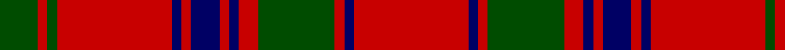

In pattern [GRGRBRBRBRGRBR](/patterns/grgrbrbrbrgrbr/).

This was sourced from weddslist.  It is a [14 stripes tartan](/stripes/stripes14/).

Original link http://www.weddslist.com/cgi-bin/tartans/pg.pl?source=rb

## Thread count
G/4 R1 G1 R12 DB1 R1 DB3 R1 DB1 R2 G8 R1 DB1 R/12

## Palette
Each colour and its ΔE from the base-6 reference it is a variant of.

| Colour | Shade | Base | ΔE (OKLab) |
|---|---|---|---|
| DB | <code style="background-color:#000064;">#000064</code> `#000064` | B <code style="background-color:#2C4084;">#2C4084</code> | 0.17 |
| G | <code style="background-color:#004C00;">#004C00</code> `#004C00` | G <code style="background-color:#006400;">#006400</code> | 0.08 |
| R | <code style="background-color:#C80000;">#C80000</code> `#C80000` | R <code style="background-color:#C80000;">#C80000</code> | 0.00 |

## Nearest tartans

The nearest existing variants by ΔTartan distance.

1. [MacColl](/setts/s14/r48b4r4g32r8b4r4b12r4b4r48g4r4g16-b1c1c50-g006818-rc80000/) — ΔT 0.51
1. [MacColl Clan Tartan Tartan Number: 878. Earliest known date: 1797 The MacColl tartan was produced by Wilson's of Bannockburn in 1797 under the name of 'Bruce' later known as 'Old Bruce'. Some historical detective work is required to establish the earliest date for the MacColl tartan. The MacColls are a branch of the Clan Donald who settled around Loch Fyne. Some of the clan living in the Ballachulich area took protection from the Stewart of Appin. There is a strong similarity in the pattern structure of the 'Appin' and the MacColl design. Wilson took great care to produce genuine Highland tartans, but he was less concerned with the naming of them, suggesting that he had in fact produced a MacColl tartan with a mistaken identity. See products available Copyright © Blair Urquhart, Comrie, 2015](/setts/s14/r24b2r2g16r4b2r2b6r2b2r24g2r2g8-b2c2c80-g006818-rc80000/) — ΔT 0.65
1. [MacColl](/setts/s14/r24b2r2g16r4b2r2b6r2b2r24g2r2g8-b000052-g11450d-raa0000/) — ΔT 0.81
1. [MacColl](/setts/s14/r12b1r1g8r2b1r1b3r1b1r12g1r1g4-b000052-g11450d-raa0000/) — ΔT 0.81
1. [MacColl](/setts/s14/r24b2r2g16r4b2r2b6r2b2r24g2r2g8-b304080-g008000-rc00000/) — ΔT 0.85
1. [MacDonald of Belfinlay](/setts/s10/k16g8r8g6r64g6r8g6r8k8-g447c34-k101010-rc80000/) — ΔT 0.94
1. [Robertson #5](/setts/s12/r56g4r10g4r56b6r6g48r6b48r6b6-b2c4084-g005020-rdc0000/) — ΔT 1.06
1. [MacColl #3](/setts/s14/r24g2r2ga16r4g2r2b6r2g2r24ga2r2ga8-b2c4084-g503c14-ga005020-rdc0000/) — ΔT 1.13
1. [Rothesay, Duke of](/setts/s17/w8r44g6r6g6r6g26r8g26r6g6r6g6r46w4r4w8-g006818-rc80000-we0e0e0/) — ΔT 1.16
1. [Drummond of Megginch - Child's Kilt (c.1890)](/setts/s15/r12b4r6g24r4g4r4b8r4w4r28b4r4b2r12-b000064-g004c00-rc80000-w98c8e8/) — ΔT 1.16

## Neighbour map

Every grey dot is one of 15726 variants placed by the first two principal components of the ΔTartan feature space (44% of its variance). Red is this tartan; blue dots are its nearest — click one to open its page.

<svg viewBox="0 0 640 380" role="img" style="max-width:100%;height:auto;border:1px solid #e0e0e0;border-radius:4px;display:block" xmlns="http://www.w3.org/2000/svg"><image href="/nn/cloud.v1.png" width="640" height="380"/><a href="/setts/s14/r48b4r4g32r8b4r4b12r4b4r48g4r4g16-b1c1c50-g006818-rc80000/"><circle cx="390.4" cy="159.6" r="4" fill="#3465a4"><title>MacColl</title></circle></a><a href="/setts/s14/r24b2r2g16r4b2r2b6r2b2r24g2r2g8-b2c2c80-g006818-rc80000/"><circle cx="393.9" cy="160.9" r="4" fill="#3465a4"><title>MacColl Clan Tartan Tartan Number: 878. Earliest known date: 1797 The MacColl tartan was produced by Wilson's of Bannockburn in 1797 under the name of 'Bruce' later known as 'Old Bruce'. Some historical detective work is required to establish the earliest date for the MacColl tartan. The MacColls are a branch of the Clan Donald who settled around Loch Fyne. Some of the clan living in the Ballachulich area took protection from the Stewart of Appin. There is a strong similarity in the pattern structure of the 'Appin' and the MacColl design. Wilson took great care to produce genuine Highland tartans, but he was less concerned with the naming of them, suggesting that he had in fact produced a MacColl tartan with a mistaken identity. See products available Copyright © Blair Urquhart, Comrie, 2015</title></circle></a><a href="/setts/s14/r24b2r2g16r4b2r2b6r2b2r24g2r2g8-b000052-g11450d-raa0000/"><circle cx="399.2" cy="168.5" r="4" fill="#3465a4"><title>MacColl</title></circle></a><a href="/setts/s14/r12b1r1g8r2b1r1b3r1b1r12g1r1g4-b000052-g11450d-raa0000/"><circle cx="399.2" cy="168.5" r="4" fill="#3465a4"><title>MacColl</title></circle></a><a href="/setts/s14/r24b2r2g16r4b2r2b6r2b2r24g2r2g8-b304080-g008000-rc00000/"><circle cx="394.0" cy="162.0" r="4" fill="#3465a4"><title>MacColl</title></circle></a><a href="/setts/s10/k16g8r8g6r64g6r8g6r8k8-g447c34-k101010-rc80000/"><circle cx="406.8" cy="167.2" r="4" fill="#3465a4"><title>MacDonald of Belfinlay</title></circle></a><a href="/setts/s12/r56g4r10g4r56b6r6g48r6b48r6b6-b2c4084-g005020-rdc0000/"><circle cx="343.2" cy="162.8" r="4" fill="#3465a4"><title>Robertson #5</title></circle></a><a href="/setts/s14/r24g2r2ga16r4g2r2b6r2g2r24ga2r2ga8-b2c4084-g503c14-ga005020-rdc0000/"><circle cx="374.2" cy="142.6" r="4" fill="#3465a4"><title>MacColl #3</title></circle></a><a href="/setts/s17/w8r44g6r6g6r6g26r8g26r6g6r6g6r46w4r4w8-g006818-rc80000-we0e0e0/"><circle cx="340.6" cy="151.9" r="4" fill="#3465a4"><title>Rothesay, Duke of</title></circle></a><a href="/setts/s15/r12b4r6g24r4g4r4b8r4w4r28b4r4b2r12-b000064-g004c00-rc80000-w98c8e8/"><circle cx="326.2" cy="142.6" r="4" fill="#3465a4"><title>Drummond of Megginch - Child's Kilt (c.1890)</title></circle></a><circle cx="379.3" cy="156.2" r="5" fill="#c00000"/></svg>

ID: /setts/s14/r12b1r1g8r2b1r1b3r1b1r12g1r1g4-b000064-g004c00-rc80000/
