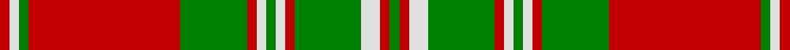

In pattern [GRWGRWGWRGRGWR](/stripes/grwgrwgwrgrgwr/).

This was sourced from weddslist.  It is a [14 stripe tartan](/stripes/stripes14/).

Original link http://www.weddslist.com/cgi-bin/tartans/pg.pl?source=sts

## Attestations

This cloth appears in 2 source records; the oldest owns this page.

- undated — Mordente (weddslist, [record](http://www.weddslist.com/cgi-bin/tartans/pg.pl?source=sts))
- undated — Mordente Family Tartan Tartan Number: 1016. Earliest known date: 1966 Taken from the portrait of James Moray of Abercairney, by D.C.Stewart. See products available Copyright © Blair Urquhart, Comrie, 2015 (house-of-tartan, [record](http://www.house-of-tartan.scotland.net/house/TartanViewjs.asp?colr=Def&tnam=1016))

## Thread count
R/2 LN2 G2 R32 G14 R2 LN2 G2 LN2 R2 G14 LN4 R2 G/2

## Palette
Each colour and the base-6 reference it is a variant of.

| Colour | Shade | Base |
|---|---|---|
| G | <code style="background-color:#008000;">#008000</code> `oklch(52.0% 0.177 142.5)` <small>#008000</small> | G <code style="background-color:#006100;">#006100</code> |
| LN | <code style="background-color:#E0E0E0;">#E0E0E0</code> `oklch(90.7% 0.000 89.9)` <small>#E0E0E0</small> | W <code style="background-color:#F7F7F7;">#F7F7F7</code> |
| R | <code style="background-color:#C00000;">#C00000</code> `oklch(50.7% 0.208 29.2)` <small>#C00000</small> | R <code style="background-color:#CC0000;">#CC0000</code> |

## Nearest tartans

The nearest existing variants by ΔTartan distance.

1. [Mordente (Personal)](/setts/s14/r2w1g1r16g7r1w1g1w1r1g7w2r1g2~x2/) — ΔT 0.49
1. [Mordente (Personal)](/setts/s14/r2w1g1r16g7r1w1g1w1r1g7w2r1g2~x4/) — ΔT 0.49
1. [Bruce, Old](/setts/s14/r45db4r4g48r4db4r4db15r4db4r40g4r4g30/) — ΔT 1.23
1. [MacNeish](/setts/s12/g6r3k3r24g4k10r2g4r2g24r6g2~x2/) — ΔT 1.24
1. [MacDonell of Glengarry](/setts/s11/g18r3g2r2db6r2g2r24g1r2g6~x2/) — ΔT 1.28
1. [Drummond](/setts/s12/r4g1r1g18k1g1k1g8r28g1r1g4~x2/) — ΔT 1.30
1. [Crieff](/setts/s13/r4r10g7r70g7r4p21r4g85r4g7r10r4/) — ΔT 1.33
1. [Fort William (Fashion)](/setts/s11/o10lb2lg3lb2do24lb4do4o34do2lb3do2~x2/) — ΔT 1.39
1. [MacQuarrie 3](/setts/s13/g2r3g2r52g2r2db28r2g42r2g2r3g2~x2/) — ΔT 1.41
1. [Hayes (Fashion)](/setts/s14/r2dg1ly1dg12r1dg1r1dg4r17dg3r2dg1r2lr2~x4/) — ΔT 1.44

## Neighbour map

Every grey dot is one of 14299 variants placed by the first two principal components of the ΔTartan feature space (44% of its variance). Red is this tartan; blue dots are its nearest — click one to open its page.

<svg viewBox="0 0 640 380" role="img" style="max-width:100%;height:auto;border:1px solid #e0e0e0;border-radius:4px;display:block" xmlns="http://www.w3.org/2000/svg"><image href="/nn/cloud.v1.png" width="640" height="380"/><a href="/setts/s14/r2w1g1r16g7r1w1g1w1r1g7w2r1g2~x2/"><circle cx="311.2" cy="123.9" r="4" fill="#3465a4"><title>Mordente (Personal)</title></circle></a><a href="/setts/s14/r2w1g1r16g7r1w1g1w1r1g7w2r1g2~x4/"><circle cx="311.2" cy="123.9" r="4" fill="#3465a4"><title>Mordente (Personal)</title></circle></a><a href="/setts/s14/r45db4r4g48r4db4r4db15r4db4r40g4r4g30/"><circle cx="321.5" cy="165.0" r="4" fill="#3465a4"><title>Bruce, Old</title></circle></a><a href="/setts/s12/g6r3k3r24g4k10r2g4r2g24r6g2~x2/"><circle cx="268.1" cy="162.8" r="4" fill="#3465a4"><title>MacNeish</title></circle></a><a href="/setts/s11/g18r3g2r2db6r2g2r24g1r2g6~x2/"><circle cx="363.3" cy="147.3" r="4" fill="#3465a4"><title>MacDonell of Glengarry</title></circle></a><a href="/setts/s12/r4g1r1g18k1g1k1g8r28g1r1g4~x2/"><circle cx="390.3" cy="121.3" r="4" fill="#3465a4"><title>Drummond</title></circle></a><a href="/setts/s13/r4r10g7r70g7r4p21r4g85r4g7r10r4/"><circle cx="327.9" cy="114.5" r="4" fill="#3465a4"><title>Crieff</title></circle></a><a href="/setts/s11/o10lb2lg3lb2do24lb4do4o34do2lb3do2~x2/"><circle cx="298.4" cy="127.1" r="4" fill="#3465a4"><title>Fort William (Fashion)</title></circle></a><a href="/setts/s13/g2r3g2r52g2r2db28r2g42r2g2r3g2~x2/"><circle cx="342.5" cy="118.0" r="4" fill="#3465a4"><title>MacQuarrie 3</title></circle></a><a href="/setts/s14/r2dg1ly1dg12r1dg1r1dg4r17dg3r2dg1r2lr2~x4/"><circle cx="347.1" cy="124.4" r="4" fill="#3465a4"><title>Hayes (Fashion)</title></circle></a><circle cx="320.6" cy="124.4" r="5" fill="#c00000"/></svg>

ID: /setts/s14/r1w1g1r16g7r1w1g1w1r1g7w2r1g1~x2/
