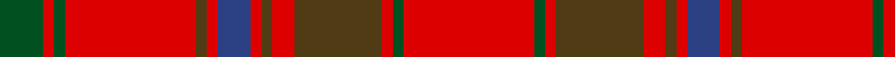

In pattern [GRGRGRBRGRGRGR](/patterns/grgrgrbrgrgrgr/).

This was sourced from register-of-tartans.  It is a [14 stripes tartan](/stripes/stripes14/).

Original link https://www.tartanregister.gov.uk/tartanDetails.aspx?ref=2316

## Thread count
G/8 R2 G2 R24 T2 R2 B6 R2 T2 R4 T16 R2 G2 R/24

## Palette
Each colour and its ΔE from the base-6 reference it is a variant of.

| Colour | Shade | Base | ΔE (OKLab) |
|---|---|---|---|
| B | <code style="background-color:#2C4084;">#2C4084</code> `#2C4084` | B <code style="background-color:#2C4084;">#2C4084</code> | 0.00 |
| G | <code style="background-color:#005020;">#005020</code> `#005020` | G <code style="background-color:#006400;">#006400</code> | 0.08 |
| R | <code style="background-color:#DC0000;">#DC0000</code> `#DC0000` | R <code style="background-color:#C80000;">#C80000</code> | 0.04 |
| T | <code style="background-color:#503C14;">#503C14</code> `#503C14` | G <code style="background-color:#006400;">#006400</code> | 0.15 |

## Nearest tartans

The nearest existing variants by ΔTartan distance.

1. [MacColl #3](/setts/s14/r24g2r2ga16r4g2r2b6r2g2r24ga2r2ga8-b2c4084-g503c14-ga005020-rdc0000/) — ΔT 0.56
1. [London Caledonian Games Association](/setts/s13/r18b4r42g4r4b16r4ga4r4ga34r4b4r16-b780078-g789484-ga006818-rc80000/) — ΔT 0.61
1. [MacColl](/setts/s14/r24ra2r2g16r4ra2r2b6r2ra2r24g2r2g8-b304080-g008000-rc00000-ra806050/) — ΔT 0.85
1. [London Caledonian Commemorative Tartan Tartan Number: 1388. Earliest known date: 1953 For London Caledonian Games Association. See products available Copyright © Blair Urquhart, Comrie, 2015](/setts/s13/r18b4r42ba4r4b16r4g4r4g34r4b4r16-b2c2c80-ba5c8ca8-g006818-rc80000/) — ΔT 1.06
1. [Virginia Tech](/setts/s10/r12y4r64y30r4y6r4y12w6b8-b2c2c80-r880000-we0e0e0-yd87c00/) — ΔT 1.11
1. [Morgan (Welsh Name)](/setts/s11/r4ra34b20ra4b8ra6y2ra5b2ra3r4-b441800-r901c38-rac80000-ye8c000/) — ΔT 1.12
1. [London, Caledonian](/setts/s13/r18b4r42ba4r4b16r4g4r4g34r4b4r16-b304080-ba5480b0-g008000-rc00000/) — ΔT 1.13
1. [MacColl Clan Tartan Tartan Number: 878. Earliest known date: 1797 The MacColl tartan was produced by Wilson's of Bannockburn in 1797 under the name of 'Bruce' later known as 'Old Bruce'. Some historical detective work is required to establish the earliest date for the MacColl tartan. The MacColls are a branch of the Clan Donald who settled around Loch Fyne. Some of the clan living in the Ballachulich area took protection from the Stewart of Appin. There is a strong similarity in the pattern structure of the 'Appin' and the MacColl design. Wilson took great care to produce genuine Highland tartans, but he was less concerned with the naming of them, suggesting that he had in fact produced a MacColl tartan with a mistaken identity. See products available Copyright © Blair Urquhart, Comrie, 2015](/setts/s14/r24b2r2g16r4b2r2b6r2b2r24g2r2g8-b2c2c80-g006818-rc80000/) — ΔT 1.17
1. [Virginia Tech (Corporate)](/setts/s10/r12y4r72y36r4y8r4y12w6b8-b2c2c80-r880000-we0e0e0-yd87c00/) — ΔT 1.21
1. [MacColl](/setts/s14/r48b4r4g32r8b4r4b12r4b4r48g4r4g16-b1c1c50-g006818-rc80000/) — ΔT 1.21

## Neighbour map

Every grey dot is one of 15726 variants placed by the first two principal components of the ΔTartan feature space (44% of its variance). Red is this tartan; blue dots are its nearest — click one to open its page.

<svg viewBox="0 0 640 380" role="img" style="max-width:100%;height:auto;border:1px solid #e0e0e0;border-radius:4px;display:block" xmlns="http://www.w3.org/2000/svg"><image href="/nn/cloud.v1.png" width="640" height="380"/><a href="/setts/s14/r24g2r2ga16r4g2r2b6r2g2r24ga2r2ga8-b2c4084-g503c14-ga005020-rdc0000/"><circle cx="374.2" cy="142.6" r="4" fill="#3465a4"><title>MacColl #3</title></circle></a><a href="/setts/s13/r18b4r42g4r4b16r4ga4r4ga34r4b4r16-b780078-g789484-ga006818-rc80000/"><circle cx="353.1" cy="161.7" r="4" fill="#3465a4"><title>London Caledonian Games Association</title></circle></a><a href="/setts/s14/r24ra2r2g16r4ra2r2b6r2ra2r24g2r2g8-b304080-g008000-rc00000-ra806050/"><circle cx="384.4" cy="150.4" r="4" fill="#3465a4"><title>MacColl</title></circle></a><a href="/setts/s13/r18b4r42ba4r4b16r4g4r4g34r4b4r16-b2c2c80-ba5c8ca8-g006818-rc80000/"><circle cx="337.7" cy="159.2" r="4" fill="#3465a4"><title>London Caledonian Commemorative Tartan Tartan Number: 1388. Earliest known date: 1953 For London Caledonian Games Association. See products available Copyright © Blair Urquhart, Comrie, 2015</title></circle></a><a href="/setts/s10/r12y4r64y30r4y6r4y12w6b8-b2c2c80-r880000-we0e0e0-yd87c00/"><circle cx="369.8" cy="138.4" r="4" fill="#3465a4"><title>Virginia Tech</title></circle></a><a href="/setts/s11/r4ra34b20ra4b8ra6y2ra5b2ra3r4-b441800-r901c38-rac80000-ye8c000/"><circle cx="401.5" cy="150.2" r="4" fill="#3465a4"><title>Morgan (Welsh Name)</title></circle></a><a href="/setts/s13/r18b4r42ba4r4b16r4g4r4g34r4b4r16-b304080-ba5480b0-g008000-rc00000/"><circle cx="339.4" cy="161.0" r="4" fill="#3465a4"><title>London, Caledonian</title></circle></a><a href="/setts/s14/r24b2r2g16r4b2r2b6r2b2r24g2r2g8-b2c2c80-g006818-rc80000/"><circle cx="393.9" cy="160.9" r="4" fill="#3465a4"><title>MacColl Clan Tartan Tartan Number: 878. Earliest known date: 1797 The MacColl tartan was produced by Wilson's of Bannockburn in 1797 under the name of 'Bruce' later known as 'Old Bruce'. Some historical detective work is required to establish the earliest date for the MacColl tartan. The MacColls are a branch of the Clan Donald who settled around Loch Fyne. Some of the clan living in the Ballachulich area took protection from the Stewart of Appin. There is a strong similarity in the pattern structure of the 'Appin' and the MacColl design. Wilson took great care to produce genuine Highland tartans, but he was less concerned with the naming of them, suggesting that he had in fact produced a MacColl tartan with a mistaken identity. See products available Copyright © Blair Urquhart, Comrie, 2015</title></circle></a><a href="/setts/s10/r12y4r72y36r4y8r4y12w6b8-b2c2c80-r880000-we0e0e0-yd87c00/"><circle cx="377.3" cy="132.4" r="4" fill="#3465a4"><title>Virginia Tech (Corporate)</title></circle></a><a href="/setts/s14/r48b4r4g32r8b4r4b12r4b4r48g4r4g16-b1c1c50-g006818-rc80000/"><circle cx="390.4" cy="159.6" r="4" fill="#3465a4"><title>MacColl</title></circle></a><circle cx="381.9" cy="146.1" r="5" fill="#c00000"/></svg>

ID: /setts/s14/r24g2r2ga16r4ga2r2b6r2ga2r24g2r2g8-b2c4084-g005020-ga503c14-rdc0000/
