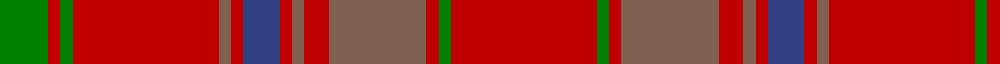

In pattern [GRGRRRBRRRRRGR](/patterns/grgrrrbrrrrrgr/).

This was sourced from weddslist.  It is a [14 stripes tartan](/stripes/stripes14/).

Original link http://www.weddslist.com/cgi-bin/tartans/pg.pl?source=sts

## Thread count
G/8 R2 G2 R24 LT2 R2 B6 R2 LT2 R4 LT16 R2 G2 R/24

## Palette
Each colour and its ΔE from the base-6 reference it is a variant of.

| Colour | Shade | Base | ΔE (OKLab) |
|---|---|---|---|
| B | <code style="background-color:#304080;">#304080</code> `#304080` | B <code style="background-color:#2C4084;">#2C4084</code> | 0.01 |
| G | <code style="background-color:#008000;">#008000</code> `#008000` | G <code style="background-color:#006400;">#006400</code> | 0.09 |
| LT | <code style="background-color:#806050;">#806050</code> `#806050` | R <code style="background-color:#C80000;">#C80000</code> | 0.17 |
| R | <code style="background-color:#C00000;">#C00000</code> `#C00000` | R <code style="background-color:#C80000;">#C80000</code> | 0.02 |

## Nearest tartans

The nearest existing variants by ΔTartan distance.

1. [Unidentified Scarlett #17](/setts/s12/r24ra4g8ra4r4g12r4ra4g8ra4r24k2-g006818-k101010-ra00000-rac80000/) — ΔT 1.18
1. [MacColl #2](/setts/s14/r24g2r2ga16r4ga2r2b6r2ga2r24g2r2g8-b2c4084-g005020-ga503c14-rdc0000/) — ΔT 1.26
1. [MacColl](/setts/s14/r24ra2r2g16r4ra2r2b6r2ra2r24g2r2g8-b304080-g008000-rc00000-ra806050/) — ΔT 1.32
1. [London Caledonian Games Association](/setts/s13/r18b4r42g4r4b16r4ga4r4ga34r4b4r16-b780078-g789484-ga006818-rc80000/) — ΔT 1.37
1. [Morgan (Welsh Name)](/setts/s11/r4ra34b20ra4b8ra6y2ra5b2ra3r4-b441800-r901c38-rac80000-ye8c000/) — ΔT 1.46
1. [Frame - Ferniegair (Personal)](/setts/s12/g16ga56r4ga4g4ga4r4ga56r56ga4r4g4-g003820-ga604000-rc8002c/) — ΔT 1.48
1. [Chisholm](/setts/s8/r24b4y2b4r6g16r6b2-b6e5058-g11450d-raa0000-yaaaaaa/) — ΔT 1.55
1. [Chisholm](/setts/s8/r12b2y1b2r3g8r3b1-b6e5058-g11450d-raa0000-yaaaaaa/) — ΔT 1.55
1. [MacIver of Strathendry Htg (Personal](/setts/s9/r6ra56b10ra10b66ra10b10ra56y6-b441800-r880000-ra98481c-ybc8c00/) — ΔT 1.55
1. [Chisholm D](/setts/s10/r12y2r48b12g4b2g4b2g24r2-b6e5058-g11450d-raa0000-yaaaaaa/) — ΔT 1.61

## Neighbour map

Every grey dot is one of 15726 variants placed by the first two principal components of the ΔTartan feature space (44% of its variance). Red is this tartan; blue dots are its nearest — click one to open its page.

<svg viewBox="0 0 640 380" role="img" style="max-width:100%;height:auto;border:1px solid #e0e0e0;border-radius:4px;display:block" xmlns="http://www.w3.org/2000/svg"><image href="/nn/cloud.v1.png" width="640" height="380"/><a href="/setts/s12/r24ra4g8ra4r4g12r4ra4g8ra4r24k2-g006818-k101010-ra00000-rac80000/"><circle cx="359.4" cy="188.0" r="4" fill="#3465a4"><title>Unidentified Scarlett #17</title></circle></a><a href="/setts/s14/r24g2r2ga16r4ga2r2b6r2ga2r24g2r2g8-b2c4084-g005020-ga503c14-rdc0000/"><circle cx="381.9" cy="146.1" r="4" fill="#3465a4"><title>MacColl #2</title></circle></a><a href="/setts/s14/r24ra2r2g16r4ra2r2b6r2ra2r24g2r2g8-b304080-g008000-rc00000-ra806050/"><circle cx="384.4" cy="150.4" r="4" fill="#3465a4"><title>MacColl</title></circle></a><a href="/setts/s13/r18b4r42g4r4b16r4ga4r4ga34r4b4r16-b780078-g789484-ga006818-rc80000/"><circle cx="353.1" cy="161.7" r="4" fill="#3465a4"><title>London Caledonian Games Association</title></circle></a><a href="/setts/s11/r4ra34b20ra4b8ra6y2ra5b2ra3r4-b441800-r901c38-rac80000-ye8c000/"><circle cx="401.5" cy="150.2" r="4" fill="#3465a4"><title>Morgan (Welsh Name)</title></circle></a><a href="/setts/s12/g16ga56r4ga4g4ga4r4ga56r56ga4r4g4-g003820-ga604000-rc8002c/"><circle cx="445.3" cy="186.8" r="4" fill="#3465a4"><title>Frame - Ferniegair (Personal)</title></circle></a><a href="/setts/s8/r24b4y2b4r6g16r6b2-b6e5058-g11450d-raa0000-yaaaaaa/"><circle cx="376.9" cy="202.9" r="4" fill="#3465a4"><title>Chisholm</title></circle></a><a href="/setts/s8/r12b2y1b2r3g8r3b1-b6e5058-g11450d-raa0000-yaaaaaa/"><circle cx="376.9" cy="202.9" r="4" fill="#3465a4"><title>Chisholm</title></circle></a><a href="/setts/s9/r6ra56b10ra10b66ra10b10ra56y6-b441800-r880000-ra98481c-ybc8c00/"><circle cx="420.4" cy="211.8" r="4" fill="#3465a4"><title>MacIver of Strathendry Htg (Personal</title></circle></a><a href="/setts/s10/r12y2r48b12g4b2g4b2g24r2-b6e5058-g11450d-raa0000-yaaaaaa/"><circle cx="417.3" cy="148.8" r="4" fill="#3465a4"><title>Chisholm D</title></circle></a><circle cx="412.7" cy="162.5" r="5" fill="#c00000"/></svg>

ID: /setts/s14/r24g2r2ra16r4ra2r2b6r2ra2r24g2r2g8-b304080-g008000-rc00000-ra806050/
