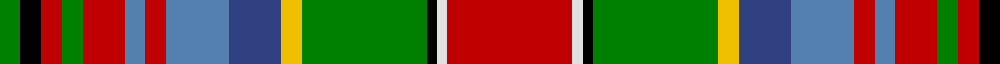

In pattern [GKRGRBRBBYGKWR](/patterns/gkrgrbrbbygkwr/).

This was sourced from weddslist.  It is a [14 stripes tartan](/stripes/stripes14/).

Original link http://www.weddslist.com/cgi-bin/tartans/pg.pl?source=sts

## Thread count
G/4 K4 R4 G4 R8 Ba4 R4 Ba12 B10 Y4 G24 K2 LN2 R/24

## Palette
Each colour and its ΔE from the base-6 reference it is a variant of.

| Colour | Shade | Base | ΔE (OKLab) |
|---|---|---|---|
| B | <code style="background-color:#304080;">#304080</code> `#304080` | B <code style="background-color:#2C4084;">#2C4084</code> | 0.01 |
| Ba | <code style="background-color:#5480B0;">#5480B0</code> `#5480B0` | B <code style="background-color:#2C4084;">#2C4084</code> | 0.20 |
| G | <code style="background-color:#008000;">#008000</code> `#008000` | G <code style="background-color:#006400;">#006400</code> | 0.09 |
| K | <code style="background-color:#000000;">#000000</code> `#000000` | K <code style="background-color:#000000;">#000000</code> | 0.00 |
| LN | <code style="background-color:#E0E0E0;">#E0E0E0</code> `#E0E0E0` | W <code style="background-color:#F4F4F0;">#F4F4F0</code> | 0.06 |
| R | <code style="background-color:#C00000;">#C00000</code> `#C00000` | R <code style="background-color:#C80000;">#C80000</code> | 0.02 |
| Y | <code style="background-color:#F0C000;">#F0C000</code> `#F0C000` | Y <code style="background-color:#E8C000;">#E8C000</code> | 0.01 |

## Nearest tartans

The nearest existing variants by ΔTartan distance.

1. [Wilson's No.132](/setts/s14/r36w4g42ga4b14gb10w4gb10b14ga4g42w4r36k6-b440044-g006818-ga5c6428-gb789484-k101010-rc80000-we0e0e0/) — ΔT 0.45
1. [Unidentified #31](/setts/s14/r24w2k2g24y4b10ba12r4ba4r8g4r4k4g4-b2c4084-ba3c82af-g005020-k101010-rdc0000-we0e0e0-ye8c000/) — ΔT 0.51
1. [Wilson's No.110](/setts/s16/b20w6k6g38r28ba6k4y6k4ba6r28g38k6w6b20ba6-b440044-ba5c8ca8-g006818-k101010-rc80000-we0e0e0-yd8b000/) — ΔT 0.76
1. [Wilson's No.121](/setts/s12/b16ba12g4ga36w4r32k4r32w4ga36g4ba12-b5c8ca8-ba440044-g5c6428-ga006818-k101010-rc80000-wc0c0c0/) — ΔT 0.93
1. [Angels' Share, The](/setts/s11/r40y10w6ya10g6ya4g6ya4g60k34b11-b2888c4-g603800-k1c1714-re86000-wffffff-yffd700-yac88c00/) — ΔT 0.95
1. [Cree (Fashion)](/setts/s13/w6r6k6r12g12k4w6k4y6k12b4ga40y6-b2c2c80-g006818-ga603800-k101010-rc80000-wfcfcfc-ye8c000/) — ΔT 0.96
1. [MacLean of Duart Clan Tartan Tartan Number: 57. Earliest known date: 1810-15 The pattern is recorded by W and A Smith in 1850 and by Grant in 1886. Logan (1831) gives a variation with a single azure stripe, but the earlier sample in the Cockburn Collection (1810-15) indicates that in this instance, Logan was wrong. There is a curious mathematical similarity with the Royal Stewart tartan in which the number of threads and the colours have been reversed. It suggests a common origin in design. Branches of the clan include the MacLaines of Lochbuie who often disputed the right to the chiefship. Colonel Sir Fitzroy MacLean, 10th Baronet and 26th Chief, acquired Duart castle in 1911. He died aged 100 having restored the family seat to its former glory. Worn by the Polkemmet pipe band, the Ayr pipe band, East Kilbride pipe band and the Cupar & District pipe band. See products available Copyright © Blair Urquhart, Comrie, 2015](/setts/s12/b8ba2k6y2k2w2k2g16r24ba2r4k2-b2c2c80-ba5c8ca8-g006818-k101010-rc80000-we0e0e0-ye8c000/) — ΔT 1.00
1. [MacLean of Duart #6](/setts/s12/b16ba4k12y4k4w4k4g32r48ba4r8k4-b2c2c80-ba5c8ca8-g407c34-k101010-rc80000-we0e0e0-ye8c000/) — ΔT 1.01
1. [Unidentified Silk scarf](/setts/s10/w12r40g24y32b32ga128ra32r40ra24w12-b3c82af-g503c14-ga005020-rdc0000-rac82828-we0e0e0-ye8c000/) — ΔT 1.01
1. [Mayo County Crest (Fashion)](/setts/s12/y18g14b6r56b8g14b10ba8b10ga14b6w12-b2c2c80-ba2888c4-g5c6428-ga006818-rc80000-we0e0e0-ye8c000/) — ΔT 1.03

## Neighbour map

Every grey dot is one of 15726 variants placed by the first two principal components of the ΔTartan feature space (44% of its variance). Red is this tartan; blue dots are its nearest — click one to open its page.

<svg viewBox="0 0 640 380" role="img" style="max-width:100%;height:auto;border:1px solid #e0e0e0;border-radius:4px;display:block" xmlns="http://www.w3.org/2000/svg"><image href="/nn/cloud.v1.png" width="640" height="380"/><a href="/setts/s14/r36w4g42ga4b14gb10w4gb10b14ga4g42w4r36k6-b440044-g006818-ga5c6428-gb789484-k101010-rc80000-we0e0e0/"><circle cx="118.5" cy="111.4" r="4" fill="#3465a4"><title>Wilson's No.132</title></circle></a><a href="/setts/s14/r24w2k2g24y4b10ba12r4ba4r8g4r4k4g4-b2c4084-ba3c82af-g005020-k101010-rdc0000-we0e0e0-ye8c000/"><circle cx="117.5" cy="102.1" r="4" fill="#3465a4"><title>Unidentified #31</title></circle></a><a href="/setts/s16/b20w6k6g38r28ba6k4y6k4ba6r28g38k6w6b20ba6-b440044-ba5c8ca8-g006818-k101010-rc80000-we0e0e0-yd8b000/"><circle cx="72.3" cy="109.5" r="4" fill="#3465a4"><title>Wilson's No.110</title></circle></a><a href="/setts/s12/b16ba12g4ga36w4r32k4r32w4ga36g4ba12-b5c8ca8-ba440044-g5c6428-ga006818-k101010-rc80000-wc0c0c0/"><circle cx="121.2" cy="135.5" r="4" fill="#3465a4"><title>Wilson's No.121</title></circle></a><a href="/setts/s11/r40y10w6ya10g6ya4g6ya4g60k34b11-b2888c4-g603800-k1c1714-re86000-wffffff-yffd700-yac88c00/"><circle cx="129.5" cy="90.5" r="4" fill="#3465a4"><title>Angels' Share, The</title></circle></a><a href="/setts/s13/w6r6k6r12g12k4w6k4y6k12b4ga40y6-b2c2c80-g006818-ga603800-k101010-rc80000-wfcfcfc-ye8c000/"><circle cx="61.8" cy="98.3" r="4" fill="#3465a4"><title>Cree (Fashion)</title></circle></a><a href="/setts/s12/b8ba2k6y2k2w2k2g16r24ba2r4k2-b2c2c80-ba5c8ca8-g006818-k101010-rc80000-we0e0e0-ye8c000/"><circle cx="137.3" cy="91.9" r="4" fill="#3465a4"><title>MacLean of Duart Clan Tartan Tartan Number: 57. Earliest known date: 1810-15 The pattern is recorded by W and A Smith in 1850 and by Grant in 1886. Logan (1831) gives a variation with a single azure stripe, but the earlier sample in the Cockburn Collection (1810-15) indicates that in this instance, Logan was wrong. There is a curious mathematical similarity with the Royal Stewart tartan in which the number of threads and the colours have been reversed. It suggests a common origin in design. Branches of the clan include the MacLaines of Lochbuie who often disputed the right to the chiefship. Colonel Sir Fitzroy MacLean, 10th Baronet and 26th Chief, acquired Duart castle in 1911. He died aged 100 having restored the family seat to its former glory. Worn by the Polkemmet pipe band, the Ayr pipe band, East Kilbride pipe band and the Cupar &amp; District pipe band. See products available Copyright © Blair Urquhart, Comrie, 2015</title></circle></a><a href="/setts/s12/b16ba4k12y4k4w4k4g32r48ba4r8k4-b2c2c80-ba5c8ca8-g407c34-k101010-rc80000-we0e0e0-ye8c000/"><circle cx="138.1" cy="90.8" r="4" fill="#3465a4"><title>MacLean of Duart #6</title></circle></a><a href="/setts/s10/w12r40g24y32b32ga128ra32r40ra24w12-b3c82af-g503c14-ga005020-rdc0000-rac82828-we0e0e0-ye8c000/"><circle cx="89.2" cy="122.5" r="4" fill="#3465a4"><title>Unidentified Silk scarf</title></circle></a><a href="/setts/s12/y18g14b6r56b8g14b10ba8b10ga14b6w12-b2c2c80-ba2888c4-g5c6428-ga006818-rc80000-we0e0e0-ye8c000/"><circle cx="69.6" cy="112.7" r="4" fill="#3465a4"><title>Mayo County Crest (Fashion)</title></circle></a><circle cx="109.7" cy="100.7" r="5" fill="#c00000"/></svg>

ID: /setts/s14/r24w2k2g24y4b10ba12r4ba4r8g4r4k4g4-b304080-ba5480b0-g008000-k000000-rc00000-we0e0e0-yf0c000/
