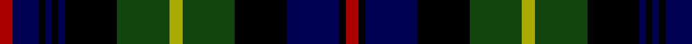

In pattern [RBKBKBKGYGKBKR](/patterns/rbkbkbkgygkbkr/).

This was sourced from weddslist.  It is a [14 stripes tartan](/stripes/stripes14/).

Original link http://www.weddslist.com/cgi-bin/tartans/pg.pl?source=tinsel

## Thread count
DR/4 DB8 K2 DB2 K2 DB2 K16 DG16 LG4 DG16 K16 DB16 K2 DR/4

## Palette
Each colour and its ΔE from the base-6 reference it is a variant of.

| Colour | Shade | Base | ΔE (OKLab) |
|---|---|---|---|
| DB | <code style="background-color:#000052;">#000052</code> `#000052` | B <code style="background-color:#2A418A;">#2A418A</code> | 0.20 |
| DG | <code style="background-color:#11450D;">#11450D</code> `#11450D` | G <code style="background-color:#006100;">#006100</code> | 0.09 |
| DR | <code style="background-color:#AA0000;">#AA0000</code> `#AA0000` | R <code style="background-color:#CC0000;">#CC0000</code> | 0.07 |
| K | <code style="background-color:#000000;">#000000</code> `#000000` | K <code style="background-color:#000000;">#000000</code> | 0.00 |
| LG | <code style="background-color:#AAAA00;">#AAAA00</code> `#AAAA00` | Y <code style="background-color:#F2BF00;">#F2BF00</code> | 0.13 |

## Nearest tartans

The nearest existing variants by ΔTartan distance.

1. [Farquharson](/setts/s14/r2b4k1b1k1b1k8g8y2g8k8b8k1r2~b000052-g11450d-k000000-raa0000-yaaaa00/) — ΔT 0.00
1. [Farquharson](/setts/s14/r2b4k1b1k1b1k8g8y2g8k8b8k1r2~b000064-g004c00-k000000-rc80000-yffc800/) — ΔT 0.50
1. [Thormanby Buccaneer Bay](/setts/s16/g17k2g2k2g2k15b15r7b15k15g2k2g2k2g17y2x2~b282060-g004810-k000000-rc80010-yff9823/) — ΔT 0.55
1. [MacEwan](/setts/s13/r4k1g12k12b12k1b4k1b12k12g12k1y4x2~b000052-g11450d-k000000-raa0000-yaaaa00/) — ΔT 0.75
1. [MacEwan](/setts/s13/r2k1g12k12b12k1b2k1b12k12g12k1y2x2~b00004c-g004c00-k000000-rc80000-yffc800/) — ΔT 0.76
1. [Scotland's National (Fashion)](/setts/s15/b12w2b2r2b2k10g12k2g4k2g12k10b12k2r3x2~b14283c-g00643c-k000000-r8c0000-we0e0e0/) — ΔT 0.78
1. [Campbell Loudon](/setts/s13/w2k1g12k12b12k1b2k1b12k12g12k1y2x2~b00004c-g004c00-k000000-wd0d0d0-yffc800/) — ΔT 0.84
1. [Campbell of Loudon](/setts/s13/y2k1g12k12b12k1b2k1b12k12g12k1ya2x2~b000052-g11450d-k000000-yaaaa00-yaaaaaaa/) — ΔT 0.85
1. [Campbell of Loudon](/setts/s13/y4k1g12k12b12k1b4k1b12k12g12k1ya4~b000052-g11450d-k000000-yaaaa00-yaaaaaaa/) — ΔT 0.85
1. [MacDonald of Clanranald](/setts/s13/b8r1b2r3b12r1k12y1g12r3g2r1g8x2~b000052-g11450d-k000000-raa0000-yaaaaaa/) — ΔT 0.86

## Neighbour map

Every grey dot is one of 15726 variants placed by the first two principal components of the ΔTartan feature space (44% of its variance). Red is this tartan; blue dots are its nearest — click one to open its page.

<svg viewBox="0 0 640 380" role="img" style="max-width:100%;height:auto;border:1px solid #e0e0e0;border-radius:4px;display:block" xmlns="http://www.w3.org/2000/svg"><image href="/nn/cloud.v1.png" width="640" height="380"/><a href="/setts/s14/r2b4k1b1k1b1k8g8y2g8k8b8k1r2~b000052-g11450d-k000000-raa0000-yaaaa00/"><circle cx="132.3" cy="179.1" r="4" fill="#3465a4"><title>Farquharson</title></circle></a><a href="/setts/s14/r2b4k1b1k1b1k8g8y2g8k8b8k1r2~b000064-g004c00-k000000-rc80000-yffc800/"><circle cx="117.7" cy="172.7" r="4" fill="#3465a4"><title>Farquharson</title></circle></a><a href="/setts/s16/g17k2g2k2g2k15b15r7b15k15g2k2g2k2g17y2x2~b282060-g004810-k000000-rc80010-yff9823/"><circle cx="149.9" cy="164.1" r="4" fill="#3465a4"><title>Thormanby Buccaneer Bay</title></circle></a><a href="/setts/s13/r4k1g12k12b12k1b4k1b12k12g12k1y4x2~b000052-g11450d-k000000-raa0000-yaaaa00/"><circle cx="137.3" cy="175.4" r="4" fill="#3465a4"><title>MacEwan</title></circle></a><a href="/setts/s13/r2k1g12k12b12k1b2k1b12k12g12k1y2x2~b00004c-g004c00-k000000-rc80000-yffc800/"><circle cx="160.7" cy="168.2" r="4" fill="#3465a4"><title>MacEwan</title></circle></a><a href="/setts/s15/b12w2b2r2b2k10g12k2g4k2g12k10b12k2r3x2~b14283c-g00643c-k000000-r8c0000-we0e0e0/"><circle cx="108.0" cy="188.0" r="4" fill="#3465a4"><title>Scotland's National (Fashion)</title></circle></a><a href="/setts/s13/w2k1g12k12b12k1b2k1b12k12g12k1y2x2~b00004c-g004c00-k000000-wd0d0d0-yffc800/"><circle cx="152.8" cy="165.6" r="4" fill="#3465a4"><title>Campbell Loudon</title></circle></a><a href="/setts/s13/y2k1g12k12b12k1b2k1b12k12g12k1ya2x2~b000052-g11450d-k000000-yaaaa00-yaaaaaaa/"><circle cx="165.1" cy="170.5" r="4" fill="#3465a4"><title>Campbell of Loudon</title></circle></a><a href="/setts/s13/y4k1g12k12b12k1b4k1b12k12g12k1ya4~b000052-g11450d-k000000-yaaaa00-yaaaaaaa/"><circle cx="127.3" cy="172.3" r="4" fill="#3465a4"><title>Campbell of Loudon</title></circle></a><a href="/setts/s13/b8r1b2r3b12r1k12y1g12r3g2r1g8x2~b000052-g11450d-k000000-raa0000-yaaaaaa/"><circle cx="157.9" cy="161.6" r="4" fill="#3465a4"><title>MacDonald of Clanranald</title></circle></a><circle cx="132.3" cy="179.1" r="5" fill="#c00000"/></svg>

ID: /setts/s14/r2b4k1b1k1b1k8g8y2g8k8b8k1r2x2~b000052-g11450d-k000000-raa0000-yaaaa00/
