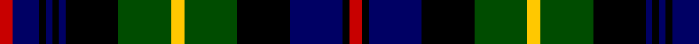

In pattern [RBKBKBKGYGKBKR](/patterns/rbkbkbkgygkbkr/).

This was sourced from weddslist.  It is a [14 stripes tartan](/stripes/stripes14/).

Original link http://www.weddslist.com/cgi-bin/tartans/pg.pl?source=rb

## Thread count
R/2 DB4 K1 DB1 K1 DB1 K8 G8 Y2 G8 K8 DB8 K1 R/2

## Palette
Each colour and its ΔE from the base-6 reference it is a variant of.

| Colour | Shade | Base | ΔE (OKLab) |
|---|---|---|---|
| DB | <code style="background-color:#000064;">#000064</code> `#000064` | B <code style="background-color:#2A418A;">#2A418A</code> | 0.18 |
| G | <code style="background-color:#004C00;">#004C00</code> `#004C00` | G <code style="background-color:#006100;">#006100</code> | 0.07 |
| K | <code style="background-color:#000000;">#000000</code> `#000000` | K <code style="background-color:#000000;">#000000</code> | 0.00 |
| R | <code style="background-color:#C80000;">#C80000</code> `#C80000` | R <code style="background-color:#CC0000;">#CC0000</code> | 0.01 |
| Y | <code style="background-color:#FFC800;">#FFC800</code> `#FFC800` | Y <code style="background-color:#F2BF00;">#F2BF00</code> | 0.03 |

## Nearest tartans

The nearest existing variants by ΔTartan distance.

1. [Farquharson](/setts/s14/r2b4k1b1k1b1k8g8y2g8k8b8k1r2~b000052-g11450d-k000000-raa0000-yaaaa00~x2/) — ΔT 0.50
1. [Farquharson](/setts/s14/r2b4k1b1k1b1k8g8y2g8k8b8k1r2~b000052-g11450d-k000000-raa0000-yaaaa00/) — ΔT 0.50
1. [Cumbernauld](/setts/s15/k17ka3k3ka3k3ka17g17ka2w3ka2g17ka17k17ka3r3~g008000-k000030-ka000000-rc00000-we0e0e0~x2/) — ΔT 0.63
1. [Scottish National](/setts/s15/b13w2b2r2b2k12g12k2g3k2g12k12b12k2r3~b000050-g008000-k000000-rc00000-we0e0e0~x2/) — ΔT 0.66
1. [Campbell of Loudoun (Clan)](/setts/s13/w1k1g7k8b7k1b2k1b7k8g7k1y1~b2c2c80-g006818-k000000-wfcfcfc-ye8c000~x4/) — ΔT 0.69
1. [MacClellan](/setts/s14/b18k5g3r3g6k2y2k2g6r3g3k10b5k10~b304080-g008000-k000000-rc00000-yf0c000/) — ΔT 0.73
1. [Thormanby Buccaneer Bay](/setts/s16/g17k2g2k2g2k15b15r7b15k15g2k2g2k2g17y2~b282060-g004810-k000000-rc80010-yff9823~x2/) — ΔT 0.73
1. [Scotland's National (Fashion)](/setts/s15/b12w2b2r2b2k10g12k2g4k2g12k10b12k2r3~b14283c-g00643c-k000000-r8c0000-we0e0e0~x2/) — ΔT 0.82
1. [Campbell of Loudon](/setts/s13/y4k1g12k12b12k1b4k1b12k12g12k1ya4~b000052-g11450d-k000000-yaaaa00-yaaaaaaa/) — ΔT 0.84
1. [Baillie](/setts/s15/b28k4b4k4b4k28g26k3y5k3g26k28b26k3r5~b304080-g008000-k000000-rc00000-yf0c000/) — ΔT 0.85

## Neighbour map

Every grey dot is one of 15726 variants placed by the first two principal components of the ΔTartan feature space (44% of its variance). Red is this tartan; blue dots are its nearest — click one to open its page.

<svg viewBox="0 0 640 380" role="img" style="max-width:100%;height:auto;border:1px solid #e0e0e0;border-radius:4px;display:block" xmlns="http://www.w3.org/2000/svg"><image href="/nn/cloud.v1.png" width="640" height="380"/><a href="/setts/s14/r2b4k1b1k1b1k8g8y2g8k8b8k1r2~b000052-g11450d-k000000-raa0000-yaaaa00~x2/"><circle cx="132.3" cy="179.1" r="4" fill="#3465a4"><title>Farquharson</title></circle></a><a href="/setts/s14/r2b4k1b1k1b1k8g8y2g8k8b8k1r2~b000052-g11450d-k000000-raa0000-yaaaa00/"><circle cx="132.3" cy="179.1" r="4" fill="#3465a4"><title>Farquharson</title></circle></a><a href="/setts/s15/k17ka3k3ka3k3ka17g17ka2w3ka2g17ka17k17ka3r3~g008000-k000030-ka000000-rc00000-we0e0e0~x2/"><circle cx="133.3" cy="167.1" r="4" fill="#3465a4"><title>Cumbernauld</title></circle></a><a href="/setts/s15/b13w2b2r2b2k12g12k2g3k2g12k12b12k2r3~b000050-g008000-k000000-rc00000-we0e0e0~x2/"><circle cx="93.7" cy="174.9" r="4" fill="#3465a4"><title>Scottish National</title></circle></a><a href="/setts/s13/w1k1g7k8b7k1b2k1b7k8g7k1y1~b2c2c80-g006818-k000000-wfcfcfc-ye8c000~x4/"><circle cx="137.1" cy="176.5" r="4" fill="#3465a4"><title>Campbell of Loudoun (Clan)</title></circle></a><a href="/setts/s14/b18k5g3r3g6k2y2k2g6r3g3k10b5k10~b304080-g008000-k000000-rc00000-yf0c000/"><circle cx="120.3" cy="163.2" r="4" fill="#3465a4"><title>MacClellan</title></circle></a><a href="/setts/s16/g17k2g2k2g2k15b15r7b15k15g2k2g2k2g17y2~b282060-g004810-k000000-rc80010-yff9823~x2/"><circle cx="149.9" cy="164.1" r="4" fill="#3465a4"><title>Thormanby Buccaneer Bay</title></circle></a><a href="/setts/s15/b12w2b2r2b2k10g12k2g4k2g12k10b12k2r3~b14283c-g00643c-k000000-r8c0000-we0e0e0~x2/"><circle cx="108.0" cy="188.0" r="4" fill="#3465a4"><title>Scotland's National (Fashion)</title></circle></a><a href="/setts/s13/y4k1g12k12b12k1b4k1b12k12g12k1ya4~b000052-g11450d-k000000-yaaaa00-yaaaaaaa/"><circle cx="127.3" cy="172.3" r="4" fill="#3465a4"><title>Campbell of Loudon</title></circle></a><a href="/setts/s15/b28k4b4k4b4k28g26k3y5k3g26k28b26k3r5~b304080-g008000-k000000-rc00000-yf0c000/"><circle cx="134.9" cy="154.2" r="4" fill="#3465a4"><title>Baillie</title></circle></a><circle cx="117.7" cy="172.7" r="5" fill="#c00000"/></svg>

ID: /setts/s14/r2b4k1b1k1b1k8g8y2g8k8b8k1r2~b000064-g004c00-k000000-rc80000-yffc800/
