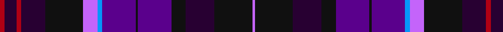

In pattern [RBRBKRBBKBKBKR](/patterns/rbrbkrbbkbkbkr/).

This was sourced from register-of-tartans.  It is a [14 stripes tartan](/stripes/stripes14/).

Original link https://www.tartanregister.gov.uk/tartanDetails.aspx?ref=5998

## Register references

External register numbers recorded for this tartan.

- Scottish Register of Tartans: [5998](https://www.tartanregister.gov.uk/tartanDetails.aspx?ref=5998)
- Scottish Tartans World Register: 3289

## Thread count
DR/4 DP10 DR4 DP20 K32 P12 B4 Pa28 K2 Pa28 K12 DP24 K32 P/2

## Palette
Each colour and its ΔE from the base-6 reference it is a variant of.

| Colour | Shade | Base | ΔE (OKLab) |
|---|---|---|---|
| B | <code style="background-color:#0596FA;">#0596FA</code> `#0596FA` | B <code style="background-color:#2A418A;">#2A418A</code> | 0.27 |
| DP | <code style="background-color:#280032;">#280032</code> `#280032` | B <code style="background-color:#2A418A;">#2A418A</code> | 0.22 |
| DR | <code style="background-color:#AF0014;">#AF0014</code> `#AF0014` | R <code style="background-color:#CC0000;">#CC0000</code> | 0.06 |
| K | <code style="background-color:#101010;">#101010</code> `#101010` | K <code style="background-color:#000000;">#000000</code> | 0.17 |
| P | <code style="background-color:#C464FA;">#C464FA</code> `#C464FA` | R <code style="background-color:#CC0000;">#CC0000</code> | 0.31 |
| Pa | <code style="background-color:#5A008C;">#5A008C</code> `#5A008C` | B <code style="background-color:#2A418A;">#2A418A</code> | 0.13 |

## Nearest tartans

The nearest existing variants by ΔTartan distance.

1. [Pride of Bannockburn Fashion Tartan Tartan Number: 8978. Earliest known date: 2008 Original name was Scotland the Brave (design by Dalgleish) but changed to Spirit of Bannockburn by Lochcarron. Tartan Ribbon subsequently added a white stripe and called it Pride of Bannockburn See products available Copyright © Blair Urquhart, Comrie, 2015](/setts/s15/b20k16g3ba23r7g10r7ba23g3k16b23w2b2w2b3~b2c2c80-ba780078-g006818-k101010-rb468ac-wfcfcfc~x2/) — ΔT 1.27
1. [Scottish Tourist Guides Assoc. (Corp](/setts/s13/g12b3y3b3y3b12ba3b3ba2b2ba14ya1w3~b440044-ba2c2c80-g003820-we0e0e0-ya0a0a0-yabc8c00~x2/) — ΔT 1.29
1. [Glengoyne Distillery](/setts/s15/b11k3b3k3b3k9ba9k1y3k1ba9k9b9k1w3~b2c2c80-ba6c0070-k101010-we0e0e0-ybc8c00~x2/) — ΔT 1.29
1. [Scotland Forever](/setts/s11/b6k3ba19k6ba4k3bb12g4bb12w2b5~b202060-ba14283c-bb780078-g006818-k101010-wfcfcfc~x2/) — ΔT 1.34
1. [Dunn (Canada) (Name)](/setts/s11/b6k2ba14k5ba14k3ka4k6ka24w2ba6~b2c00b0-ba60007c-k101010-ka00002c-wf8f8f8~x2/) — ΔT 1.36
1. [Cowal (Corporate)](/setts/s10/b6ba22k12bb10g3k1g3bb10b2w2~b1c0070-ba003c64-bb780078-g006818-k101010-we0e0e0~x2/) — ΔT 1.49
1. [Westwood MacPoiret (Fashion)](/setts/s13/b21r3b3r3b3k20ba18w3ba18k20b18r3b3~b1c1c50-ba780078-k101010-r888888-we0e0e0~x2/) — ΔT 1.60
1. [Highland Destiny (Fashion)](/setts/s13/b4k3b20k10ba19r2ba2r2ba25g3ba4k6w4~b780078-ba1c0070-g006818-k101010-rb468ac-we0e0e0~x2/) — ΔT 1.62
1. [Creiff Highland Gathering](/setts/s9/k3b16g5b3ba2b2k12bb23w2~b780078-ba9058d8-bb003c64-g006818-k101010-wfcfcfc~x2/) — ΔT 1.63
1. [Crieff Highland Gathering Corporate Tartan Tartan Number: 11108. Earliest known date: 2013 The colours selected for the Crieff Highland Gathering tartan, deep blue, green and purple have been used in the CHG logo for many years. They are also long established within the traditions of the Gathering, established in 1874, which runs the Crieff Highland Games. The blue relates to the Earn, the main river running through the town of Crieff and the Strathearn region. The green depicts the trees around the town. Crieff's name originates from the Scottish Gaelic word 'Craoibh' meaning 'tree'; whilst another common meaning is 'town in the valley of the trees'. The tartan's vibrant purple reflects the colour of the thistle. Thistles were incorporated into the Games as an ancient Celtic 'symbol of notability of character'. The thistle is also considered of 'high chivalric order' and Scotland's National Emblem. The Games are used by the Chieftain of the Games (in the past a Clans Chieftain) to highlight the fastest and strongest people in the area. See products available Copyright © Blair Urquhart, Comrie, 2015](/setts/s9/k3b16g5b3r2b2k12ba23w2~b3c104c-ba141c50-g043828-k000000-r905888-we8e8e8~x2/) — ΔT 1.63

## Neighbour map

Every grey dot is one of 15726 variants placed by the first two principal components of the ΔTartan feature space (44% of its variance). Red is this tartan; blue dots are its nearest — click one to open its page.

<svg viewBox="0 0 640 380" role="img" style="max-width:100%;height:auto;border:1px solid #e0e0e0;border-radius:4px;display:block" xmlns="http://www.w3.org/2000/svg"><image href="/nn/cloud.v1.png" width="640" height="380"/><a href="/setts/s15/b20k16g3ba23r7g10r7ba23g3k16b23w2b2w2b3~b2c2c80-ba780078-g006818-k101010-rb468ac-wfcfcfc~x2/"><circle cx="112.1" cy="139.5" r="4" fill="#3465a4"><title>Pride of Bannockburn Fashion Tartan Tartan Number: 8978. Earliest known date: 2008 Original name was Scotland the Brave (design by Dalgleish) but changed to Spirit of Bannockburn by Lochcarron. Tartan Ribbon subsequently added a white stripe and called it Pride of Bannockburn See products available Copyright © Blair Urquhart, Comrie, 2015</title></circle></a><a href="/setts/s13/g12b3y3b3y3b12ba3b3ba2b2ba14ya1w3~b440044-ba2c2c80-g003820-we0e0e0-ya0a0a0-yabc8c00~x2/"><circle cx="157.8" cy="133.5" r="4" fill="#3465a4"><title>Scottish Tourist Guides Assoc. (Corp</title></circle></a><a href="/setts/s15/b11k3b3k3b3k9ba9k1y3k1ba9k9b9k1w3~b2c2c80-ba6c0070-k101010-we0e0e0-ybc8c00~x2/"><circle cx="162.6" cy="173.0" r="4" fill="#3465a4"><title>Glengoyne Distillery</title></circle></a><a href="/setts/s11/b6k3ba19k6ba4k3bb12g4bb12w2b5~b202060-ba14283c-bb780078-g006818-k101010-wfcfcfc~x2/"><circle cx="139.8" cy="178.9" r="4" fill="#3465a4"><title>Scotland Forever</title></circle></a><a href="/setts/s11/b6k2ba14k5ba14k3ka4k6ka24w2ba6~b2c00b0-ba60007c-k101010-ka00002c-wf8f8f8~x2/"><circle cx="213.7" cy="178.7" r="4" fill="#3465a4"><title>Dunn (Canada) (Name)</title></circle></a><a href="/setts/s10/b6ba22k12bb10g3k1g3bb10b2w2~b1c0070-ba003c64-bb780078-g006818-k101010-we0e0e0~x2/"><circle cx="170.9" cy="137.6" r="4" fill="#3465a4"><title>Cowal (Corporate)</title></circle></a><a href="/setts/s13/b21r3b3r3b3k20ba18w3ba18k20b18r3b3~b1c1c50-ba780078-k101010-r888888-we0e0e0~x2/"><circle cx="169.4" cy="192.5" r="4" fill="#3465a4"><title>Westwood MacPoiret (Fashion)</title></circle></a><a href="/setts/s13/b4k3b20k10ba19r2ba2r2ba25g3ba4k6w4~b780078-ba1c0070-g006818-k101010-rb468ac-we0e0e0~x2/"><circle cx="228.8" cy="138.5" r="4" fill="#3465a4"><title>Highland Destiny (Fashion)</title></circle></a><a href="/setts/s9/k3b16g5b3ba2b2k12bb23w2~b780078-ba9058d8-bb003c64-g006818-k101010-wfcfcfc~x2/"><circle cx="165.6" cy="153.5" r="4" fill="#3465a4"><title>Creiff Highland Gathering</title></circle></a><a href="/setts/s9/k3b16g5b3r2b2k12ba23w2~b3c104c-ba141c50-g043828-k000000-r905888-we8e8e8~x2/"><circle cx="174.8" cy="164.5" r="4" fill="#3465a4"><title>Crieff Highland Gathering Corporate Tartan Tartan Number: 11108. Earliest known date: 2013 The colours selected for the Crieff Highland Gathering tartan, deep blue, green and purple have been used in the CHG logo for many years. They are also long established within the traditions of the Gathering, established in 1874, which runs the Crieff Highland Games. The blue relates to the Earn, the main river running through the town of Crieff and the Strathearn region. The green depicts the trees around the town. Crieff's name originates from the Scottish Gaelic word 'Craoibh' meaning 'tree'; whilst another common meaning is 'town in the valley of the trees'. The tartan's vibrant purple reflects the colour of the thistle. Thistles were incorporated into the Games as an ancient Celtic 'symbol of notability of character'. The thistle is also considered of 'high chivalric order' and Scotland's National Emblem. The Games are used by the Chieftain of the Games (in the past a Clans Chieftain) to highlight the fastest and strongest people in the area. See products available Copyright © Blair Urquhart, Comrie, 2015</title></circle></a><circle cx="176.0" cy="146.4" r="5" fill="#c00000"/></svg>

ID: /setts/s14/r2b5r2b10k16ra6ba2bb14k1bb14k6b12k16ra1~b280032-ba0596fa-bb5a008c-k101010-raf0014-rac464fa~x2/
