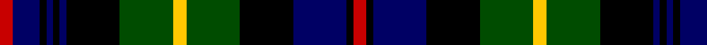

**Bands:** [RBKBKBKGYGKBKR](/stripes/rbkbkbkgygkbkr/) · **Stripes:** [R DB K DB K DB K DG LY DG K DB K R](/stripes/stripes14/) R DB K DB K DB K DG LY DG K DB K R

This was sourced from weddslist.  It is a [14 band tartan](/bands/bands14/).

Original link http://www.weddslist.com/cgi-bin/tartans/pg.pl?source=rb

## Attestations

This cloth appears in 2 source records; the oldest owns this page.

- undated — Farquharson (weddslist, [record](http://www.weddslist.com/cgi-bin/tartans/pg.pl?source=rb))
- undated — Farquharson (weddslist, [record](http://www.weddslist.com/cgi-bin/tartans/pg.pl?source=x))

## Register references

External register numbers recorded for this tartan.

- Scottish Register of Tartans: [2540](https://www.tartanregister.gov.uk/tartanDetails.aspx?ref=2540)
- Scottish Register of Tartans: [2625](https://www.tartanregister.gov.uk/tartanDetails.aspx?ref=2625)
- Scottish Register of Tartans: [2666](https://www.tartanregister.gov.uk/tartanDetails.aspx?ref=2666)
- Scottish Register of Tartans: [3555](https://www.tartanregister.gov.uk/tartanDetails.aspx?ref=3555)
- Scottish Register of Tartans: [3808](https://www.tartanregister.gov.uk/tartanDetails.aspx?ref=3808)
- Scottish Tartans Authority (ITI): 1429
- Scottish Tartans Authority (ITI): 218
- Scottish Tartans World Register: 1010
- Scottish Tartans World Register: 1429
- Scottish Tartans World Register: 1585
- Scottish Tartans World Register: 218
- Scottish Tartans World Register: 864

## Variants

Other setts woven to the same stripe pattern.

- [Farquharson](/setts/s14/r2db4k1db1k1db1k8dg8ly2dg8k8db8k1r2~x2/)

## Thread count
R/2 DB4 K1 DB1 K1 DB1 K8 G8 Y2 G8 K8 DB8 K1 R/2

## Palette
Each colour and its ΔE from the base-6 reference it is a variant of.

| Colour | Shade | Base | ΔE (OKLab) |
|---|---|---|---|
| DB | <code style="background-color:#000064;">#000064</code> `#000064` | B <code style="background-color:#2A418A;">#2A418A</code> | 0.18 |
| G | <code style="background-color:#004C00;">#004C00</code> `#004C00` | G <code style="background-color:#006100;">#006100</code> | 0.07 |
| K | <code style="background-color:#000000;">#000000</code> `#000000` | K <code style="background-color:#000000;">#000000</code> | 0.00 |
| R | <code style="background-color:#C80000;">#C80000</code> `#C80000` | R <code style="background-color:#CC0000;">#CC0000</code> | 0.01 |
| Y | <code style="background-color:#FFC800;">#FFC800</code> `#FFC800` | Y <code style="background-color:#F2BF00;">#F2BF00</code> | 0.03 |

## Nearest tartans

The nearest existing variants by ΔTartan distance.

1. [Farquharson](/setts/s14/r2db4k1db1k1db1k8dg8ly2dg8k8db8k1r2~x2/) — ΔT 0.50
1. [Cumbernauld](/setts/s15/k17k3k3k3k3k17g17k2w3k2g17k17k17k3r3~x2/) — ΔT 0.63
1. [Scottish National](/setts/s15/db13w2db2r2db2k12g12k2g3k2g12k12db12k2r3~x2/) — ΔT 0.66
1. [Campbell of Loudoun (Clan)](/setts/s13/ly1k1g7k8db7k1db2k1db7k8g7k1w1~x4/) — ΔT 0.69
1. [MacClellan](/setts/s14/db18k5g3r3g6k2ly2k2g6r3g3k10db5k10/) — ΔT 0.73
1. [Thormanby Buccaneer Bay](/setts/s16/dg17k2dg2k2dg2k15db15r7db15k15dg2k2dg2k2dg17lo2~x2/) — ΔT 0.73
1. [Scotland's National (Fashion)](/setts/s15/dt12w2dt2r2dt2k10g12k2g4k2g12k10dt12k2r3~x2/) — ΔT 0.82
1. [Campbell of Loudon](/setts/s13/lr4k1dg12k12db12k1db4k1db12k12dg12k1ly4/) — ΔT 0.84
1. [Baillie](/setts/s15/db28k4db4k4db4k28g26k3ly5k3g26k28db26k3r5/) — ΔT 0.85
1. [Campbell Loudon](/setts/s13/lb2k1dg12k12db12k1db2k1db12k12dg12k1ly2~x2/) — ΔT 0.86

## Neighbour map

Every grey dot is one of 14313 variants placed by the first two principal components of the ΔTartan feature space (44% of its variance). Red is this tartan; blue dots are its nearest — click one to open its page.

<svg viewBox="0 0 640 380" role="img" style="max-width:100%;height:auto;border:1px solid #e0e0e0;border-radius:4px;display:block" xmlns="http://www.w3.org/2000/svg"><image href="/nn/cloud.v1.png" width="640" height="380"/><a href="/setts/s14/r2db4k1db1k1db1k8dg8ly2dg8k8db8k1r2~x2/"><circle cx="136.0" cy="183.5" r="4" fill="#3465a4"><title>Farquharson</title></circle></a><a href="/setts/s15/k17k3k3k3k3k17g17k2w3k2g17k17k17k3r3~x2/"><circle cx="137.4" cy="169.2" r="4" fill="#3465a4"><title>Cumbernauld</title></circle></a><a href="/setts/s15/db13w2db2r2db2k12g12k2g3k2g12k12db12k2r3~x2/"><circle cx="97.9" cy="177.0" r="4" fill="#3465a4"><title>Scottish National</title></circle></a><a href="/setts/s13/ly1k1g7k8db7k1db2k1db7k8g7k1w1~x4/"><circle cx="141.0" cy="178.0" r="4" fill="#3465a4"><title>Campbell of Loudoun (Clan)</title></circle></a><a href="/setts/s14/db18k5g3r3g6k2ly2k2g6r3g3k10db5k10/"><circle cx="124.0" cy="164.3" r="4" fill="#3465a4"><title>MacClellan</title></circle></a><a href="/setts/s16/dg17k2dg2k2dg2k15db15r7db15k15dg2k2dg2k2dg17lo2~x2/"><circle cx="153.4" cy="168.3" r="4" fill="#3465a4"><title>Thormanby Buccaneer Bay</title></circle></a><a href="/setts/s15/dt12w2dt2r2dt2k10g12k2g4k2g12k10dt12k2r3~x2/"><circle cx="111.7" cy="192.4" r="4" fill="#3465a4"><title>Scotland's National (Fashion)</title></circle></a><a href="/setts/s13/lr4k1dg12k12db12k1db4k1db12k12dg12k1ly4/"><circle cx="131.3" cy="176.4" r="4" fill="#3465a4"><title>Campbell of Loudon</title></circle></a><a href="/setts/s15/db28k4db4k4db4k28g26k3ly5k3g26k28db26k3r5/"><circle cx="138.9" cy="155.6" r="4" fill="#3465a4"><title>Baillie</title></circle></a><a href="/setts/s13/lb2k1dg12k12db12k1db2k1db12k12dg12k1ly2~x2/"><circle cx="156.8" cy="169.4" r="4" fill="#3465a4"><title>Campbell Loudon</title></circle></a><circle cx="121.5" cy="175.4" r="5" fill="#c00000"/></svg>

ID: /setts/s14/r2db4k1db1k1db1k8dg8ly2dg8k8db8k1r2/
