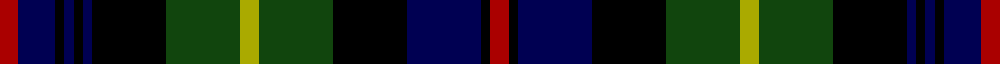

This page is one **sett** — a single exact thread-count. It belongs to the [tartan](/tartans/r2db4k1db1k1db1k8dg8ly2dg8k8db8k1r2/)
(the same proportion at any scale), whose colour order is pattern [RBKBKBKGYGKBKR](/stripes/rbkbkbkgygkbkr/).

Sourced from weddslist.  It is a [14 stripe tartan](/stripes/stripes14/).

Original link http://www.weddslist.com/cgi-bin/tartans/pg.pl?source=tinsel

## Thread count
DR/4 DB8 K2 DB2 K2 DB2 K16 DG16 LG4 DG16 K16 DB16 K2 DR/4

## Palette

Palette: <strong>Ingles Buchan</strong> <small style="color:#888">(1 of 5 colours)</small>
<table><thead><tr><th>Colour</th><th>Threads</th><th>Shade</th><th>Base</th><th>OKLCh</th></tr></thead><tbody><tr><td>DR/</td><td style="text-align:right;font-variant-numeric:tabular-nums">4</td><td><code style="background-color:#AA0000;">#AA0000</code> <small style="color:#888">#AA0000</small></td><td>R <code style="background-color:#CC0000;">#CC0000</code></td><td><small style="color:#888">oklch(46.3% 0.190 29.2)</small></td></tr><tr><td>DB</td><td style="text-align:right;font-variant-numeric:tabular-nums">8</td><td><code style="background-color:#000052;">#000052</code> <small style="color:#888">#000052</small></td><td>B <code style="background-color:#2A418A;">#2A418A</code></td><td><small style="color:#888">oklch(19.8% 0.137 264.1)</small></td></tr><tr><td>K</td><td style="text-align:right;font-variant-numeric:tabular-nums">2</td><td><code style="background-color:#000000;">#000000</code> <small style="color:#888">#000000</small></td><td>K <code style="background-color:#000000;">#000000</code></td><td><small style="color:#888">oklch(0.0% 0.000 0.0)</small></td></tr><tr><td>DB</td><td style="text-align:right;font-variant-numeric:tabular-nums">2</td><td><code style="background-color:#000052;">#000052</code> <small style="color:#888">#000052</small></td><td>B <code style="background-color:#2A418A;">#2A418A</code></td><td><small style="color:#888">oklch(19.8% 0.137 264.1)</small></td></tr><tr><td>K</td><td style="text-align:right;font-variant-numeric:tabular-nums">2</td><td><code style="background-color:#000000;">#000000</code> <small style="color:#888">#000000</small></td><td>K <code style="background-color:#000000;">#000000</code></td><td><small style="color:#888">oklch(0.0% 0.000 0.0)</small></td></tr><tr><td>DB</td><td style="text-align:right;font-variant-numeric:tabular-nums">2</td><td><code style="background-color:#000052;">#000052</code> <small style="color:#888">#000052</small></td><td>B <code style="background-color:#2A418A;">#2A418A</code></td><td><small style="color:#888">oklch(19.8% 0.137 264.1)</small></td></tr><tr><td>K</td><td style="text-align:right;font-variant-numeric:tabular-nums">16</td><td><code style="background-color:#000000;">#000000</code> <small style="color:#888">#000000</small></td><td>K <code style="background-color:#000000;">#000000</code></td><td><small style="color:#888">oklch(0.0% 0.000 0.0)</small></td></tr><tr><td>DG</td><td style="text-align:right;font-variant-numeric:tabular-nums">16</td><td><code style="background-color:#11450D;">#11450D</code> <small style="color:#888">#11450D</small></td><td>G <code style="background-color:#006100;">#006100</code></td><td><small style="color:#888">oklch(34.4% 0.101 142.1)</small></td></tr><tr><td>LG</td><td style="text-align:right;font-variant-numeric:tabular-nums">4</td><td><code style="background-color:#AAAA00;">#AAAA00</code> <small style="color:#888">#AAAA00</small></td><td>Y <code style="background-color:#F2BF00;">#F2BF00</code></td><td><small style="color:#888">oklch(71.4% 0.156 109.8)</small></td></tr><tr><td>DG</td><td style="text-align:right;font-variant-numeric:tabular-nums">16</td><td><code style="background-color:#11450D;">#11450D</code> <small style="color:#888">#11450D</small></td><td>G <code style="background-color:#006100;">#006100</code></td><td><small style="color:#888">oklch(34.4% 0.101 142.1)</small></td></tr><tr><td>K</td><td style="text-align:right;font-variant-numeric:tabular-nums">16</td><td><code style="background-color:#000000;">#000000</code> <small style="color:#888">#000000</small></td><td>K <code style="background-color:#000000;">#000000</code></td><td><small style="color:#888">oklch(0.0% 0.000 0.0)</small></td></tr><tr><td>DB</td><td style="text-align:right;font-variant-numeric:tabular-nums">16</td><td><code style="background-color:#000052;">#000052</code> <small style="color:#888">#000052</small></td><td>B <code style="background-color:#2A418A;">#2A418A</code></td><td><small style="color:#888">oklch(19.8% 0.137 264.1)</small></td></tr><tr><td>K</td><td style="text-align:right;font-variant-numeric:tabular-nums">2</td><td><code style="background-color:#000000;">#000000</code> <small style="color:#888">#000000</small></td><td>K <code style="background-color:#000000;">#000000</code></td><td><small style="color:#888">oklch(0.0% 0.000 0.0)</small></td></tr><tr><td>DR/</td><td style="text-align:right;font-variant-numeric:tabular-nums">4</td><td><code style="background-color:#AA0000;">#AA0000</code> <small style="color:#888">#AA0000</small></td><td>R <code style="background-color:#CC0000;">#CC0000</code></td><td><small style="color:#888">oklch(46.3% 0.190 29.2)</small></td></tr></tbody></table>

## Nearest tartans

The nearest existing variants by ΔTartan distance, with this tartan at the top so the swatches line up against it.

ΔTartan

Tartan

Sett

—

<a href="/ttd/edit/#slug=r2db4k1db1k1db1k8dg8ly2dg8k8db8k1r2~x2">Farquharson</a> <a class="nn-out" href="/setts/s14/r2db4k1db1k1db1k8dg8ly2dg8k8db8k1r2~x2/" title="open its dictionary page">↗</a>

0.50

<a href="/ttd/edit/#slug=r2db4k1db1k1db1k8dg8ly2dg8k8db8k1r2">Farquharson</a> <a class="nn-out" href="/setts/s14/r2db4k1db1k1db1k8dg8ly2dg8k8db8k1r2/" title="open its dictionary page">↗</a>

0.55

<a href="/ttd/edit/#slug=dg17k2dg2k2dg2k15db15r7db15k15dg2k2dg2k2dg17lo2~x2">Thormanby Buccaneer Bay</a> <a class="nn-out" href="/setts/s16/dg17k2dg2k2dg2k15db15r7db15k15dg2k2dg2k2dg17lo2~x2/" title="open its dictionary page">↗</a>

0.75

<a href="/ttd/edit/#slug=r4k1dg12k12db12k1db4k1db12k12dg12k1ly4~x2">MacEwan</a> <a class="nn-out" href="/setts/s13/r4k1dg12k12db12k1db4k1db12k12dg12k1ly4~x2/" title="open its dictionary page">↗</a>

0.76

<a href="/ttd/edit/#slug=r2k1dg12k12db12k1db2k1db12k12dg12k1ly2~x2">MacEwan</a> <a class="nn-out" href="/setts/s13/r2k1dg12k12db12k1db2k1db12k12dg12k1ly2~x2/" title="open its dictionary page">↗</a>

0.78

<a href="/ttd/edit/#slug=dt12w2dt2r2dt2k10g12k2g4k2g12k10dt12k2r3~x2">Scotland's National (Fashion)</a> <a class="nn-out" href="/setts/s15/dt12w2dt2r2dt2k10g12k2g4k2g12k10dt12k2r3~x2/" title="open its dictionary page">↗</a>

0.84

<a href="/ttd/edit/#slug=ly2k1dg12k12db12k1db2k1db12k12dg12k1lb2~x2">Campbell Loudon</a> <a class="nn-out" href="/setts/s13/ly2k1dg12k12db12k1db2k1db12k12dg12k1lb2~x2/" title="open its dictionary page">↗</a>

0.85

<a href="/ttd/edit/#slug=lr2k1dg12k12db12k1db2k1db12k12dg12k1ly2~x2">Campbell of Loudon</a> <a class="nn-out" href="/setts/s13/lr2k1dg12k12db12k1db2k1db12k12dg12k1ly2~x2/" title="open its dictionary page">↗</a>

0.85

<a href="/ttd/edit/#slug=lr4k1dg12k12db12k1db4k1db12k12dg12k1ly4~x2">Campbell of Loudon</a> <a class="nn-out" href="/setts/s13/lr4k1dg12k12db12k1db4k1db12k12dg12k1ly4~x2/" title="open its dictionary page">↗</a>

0.86

<a href="/ttd/edit/#slug=dg8r1dg2r3dg12lr1k12r1db12r3db2r1db8~x2">MacDonald of Clanranald</a> <a class="nn-out" href="/setts/s13/dg8r1dg2r3dg12lr1k12r1db12r3db2r1db8~x2/" title="open its dictionary page">↗</a>

0.86

<a href="/ttd/edit/#slug=dg8r1dg2r3dg12lr1k12r1db12r3db2r1db8">MacDonald of Clanranald</a> <a class="nn-out" href="/setts/s13/dg8r1dg2r3dg12lr1k12r1db12r3db2r1db8/" title="open its dictionary page">↗</a>

## Neighbour map

Every grey dot is one of 14299 variants placed by the first two principal components of the ΔTartan feature space (44% of its variance). Red is this tartan; blue dots are its nearest — click one to open its page.

<svg viewBox="0 0 640 380" role="img" style="max-width:100%;height:auto;border:1px solid #e0e0e0;border-radius:4px;display:block" xmlns="http://www.w3.org/2000/svg"><image href="/nn/cloud.v1.png" width="640" height="380"/><a href="/setts/s14/r2db4k1db1k1db1k8dg8ly2dg8k8db8k1r2/"><circle cx="121.8" cy="175.5" r="4" fill="#3465a4"><title>Farquharson</title></circle></a><a href="/setts/s16/dg17k2dg2k2dg2k15db15r7db15k15dg2k2dg2k2dg17lo2~x2/"><circle cx="153.6" cy="168.4" r="4" fill="#3465a4"><title>Thormanby Buccaneer Bay</title></circle></a><a href="/setts/s13/r4k1dg12k12db12k1db4k1db12k12dg12k1ly4~x2/"><circle cx="141.4" cy="180.3" r="4" fill="#3465a4"><title>MacEwan</title></circle></a><a href="/setts/s13/r2k1dg12k12db12k1db2k1db12k12dg12k1ly2~x2/"><circle cx="164.9" cy="172.8" r="4" fill="#3465a4"><title>MacEwan</title></circle></a><a href="/setts/s15/dt12w2dt2r2dt2k10g12k2g4k2g12k10dt12k2r3~x2/"><circle cx="111.9" cy="192.5" r="4" fill="#3465a4"><title>Scotland's National (Fashion)</title></circle></a><a href="/setts/s13/ly2k1dg12k12db12k1db2k1db12k12dg12k1lb2~x2/"><circle cx="157.1" cy="169.5" r="4" fill="#3465a4"><title>Campbell Loudon</title></circle></a><a href="/setts/s13/lr2k1dg12k12db12k1db2k1db12k12dg12k1ly2~x2/"><circle cx="169.4" cy="175.7" r="4" fill="#3465a4"><title>Campbell of Loudon</title></circle></a><a href="/setts/s13/lr4k1dg12k12db12k1db4k1db12k12dg12k1ly4~x2/"><circle cx="131.6" cy="176.5" r="4" fill="#3465a4"><title>Campbell of Loudon</title></circle></a><a href="/setts/s13/dg8r1dg2r3dg12lr1k12r1db12r3db2r1db8~x2/"><circle cx="161.6" cy="166.6" r="4" fill="#3465a4"><title>MacDonald of Clanranald</title></circle></a><a href="/setts/s13/dg8r1dg2r3dg12lr1k12r1db12r3db2r1db8/"><circle cx="161.6" cy="166.6" r="4" fill="#3465a4"><title>MacDonald of Clanranald</title></circle></a><circle cx="136.3" cy="183.6" r="5" fill="#c00000"/></svg>

ID: /setts/s14/r2db4k1db1k1db1k8dg8ly2dg8k8db8k1r2~x2/
