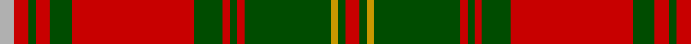

This page is one **sett** — a single exact thread-count. It belongs to the [tartan](/tartans/r2dg1ly1dg12r1dg1r1dg4r17dg3r2dg1r2lr2/)
(the same proportion at any scale), whose colour order is pattern [RGYGRGRGRGRGRY](/stripes/rgygrgrgrgrgry/).

Sourced from tartans-authority.  It is a [14 stripe tartan](/stripes/stripes14/).

Original link http://www.tartansauthority.com/tartan-ferret/display/5168/

## Thread count
N/8 R8 G4 R8 G12 R68 G16 R4 G4 R4 G48 DY4 G4 R/8

## Palette

Palette: <strong>Tartan Register</strong>
<table><thead><tr><th>Colour</th><th>Threads</th><th>Shade</th><th>Base</th><th>OKLCh</th></tr></thead><tbody><tr><td>N/</td><td style="text-align:right;font-variant-numeric:tabular-nums">8</td><td><code style="background-color:#B0B0B0;">#B0B0B0</code> <small style="color:#888">#B0B0B0</small></td><td>Y <code style="background-color:#F2BF00;">#F2BF00</code></td><td><small style="color:#888">oklch(75.7% 0.000 89.9)</small></td></tr><tr><td>R</td><td style="text-align:right;font-variant-numeric:tabular-nums">8</td><td><code style="background-color:#C80000;">#C80000</code> <small style="color:#888">#C80000</small></td><td>R <code style="background-color:#CC0000;">#CC0000</code></td><td><small style="color:#888">oklch(52.3% 0.215 29.2)</small></td></tr><tr><td>G</td><td style="text-align:right;font-variant-numeric:tabular-nums">4</td><td><code style="background-color:#004C00;">#004C00</code> <small style="color:#888">#004C00</small></td><td>G <code style="background-color:#006100;">#006100</code></td><td><small style="color:#888">oklch(36.1% 0.123 142.5)</small></td></tr><tr><td>R</td><td style="text-align:right;font-variant-numeric:tabular-nums">8</td><td><code style="background-color:#C80000;">#C80000</code> <small style="color:#888">#C80000</small></td><td>R <code style="background-color:#CC0000;">#CC0000</code></td><td><small style="color:#888">oklch(52.3% 0.215 29.2)</small></td></tr><tr><td>G</td><td style="text-align:right;font-variant-numeric:tabular-nums">12</td><td><code style="background-color:#004C00;">#004C00</code> <small style="color:#888">#004C00</small></td><td>G <code style="background-color:#006100;">#006100</code></td><td><small style="color:#888">oklch(36.1% 0.123 142.5)</small></td></tr><tr><td>R</td><td style="text-align:right;font-variant-numeric:tabular-nums">68</td><td><code style="background-color:#C80000;">#C80000</code> <small style="color:#888">#C80000</small></td><td>R <code style="background-color:#CC0000;">#CC0000</code></td><td><small style="color:#888">oklch(52.3% 0.215 29.2)</small></td></tr><tr><td>G</td><td style="text-align:right;font-variant-numeric:tabular-nums">16</td><td><code style="background-color:#004C00;">#004C00</code> <small style="color:#888">#004C00</small></td><td>G <code style="background-color:#006100;">#006100</code></td><td><small style="color:#888">oklch(36.1% 0.123 142.5)</small></td></tr><tr><td>R</td><td style="text-align:right;font-variant-numeric:tabular-nums">4</td><td><code style="background-color:#C80000;">#C80000</code> <small style="color:#888">#C80000</small></td><td>R <code style="background-color:#CC0000;">#CC0000</code></td><td><small style="color:#888">oklch(52.3% 0.215 29.2)</small></td></tr><tr><td>G</td><td style="text-align:right;font-variant-numeric:tabular-nums">4</td><td><code style="background-color:#004C00;">#004C00</code> <small style="color:#888">#004C00</small></td><td>G <code style="background-color:#006100;">#006100</code></td><td><small style="color:#888">oklch(36.1% 0.123 142.5)</small></td></tr><tr><td>R</td><td style="text-align:right;font-variant-numeric:tabular-nums">4</td><td><code style="background-color:#C80000;">#C80000</code> <small style="color:#888">#C80000</small></td><td>R <code style="background-color:#CC0000;">#CC0000</code></td><td><small style="color:#888">oklch(52.3% 0.215 29.2)</small></td></tr><tr><td>G</td><td style="text-align:right;font-variant-numeric:tabular-nums">48</td><td><code style="background-color:#004C00;">#004C00</code> <small style="color:#888">#004C00</small></td><td>G <code style="background-color:#006100;">#006100</code></td><td><small style="color:#888">oklch(36.1% 0.123 142.5)</small></td></tr><tr><td>DY</td><td style="text-align:right;font-variant-numeric:tabular-nums">4</td><td><code style="background-color:#C89800;">#C89800</code> <small style="color:#888">#C89800</small></td><td>Y <code style="background-color:#F2BF00;">#F2BF00</code></td><td><small style="color:#888">oklch(70.6% 0.144 85.9)</small></td></tr><tr><td>G</td><td style="text-align:right;font-variant-numeric:tabular-nums">4</td><td><code style="background-color:#004C00;">#004C00</code> <small style="color:#888">#004C00</small></td><td>G <code style="background-color:#006100;">#006100</code></td><td><small style="color:#888">oklch(36.1% 0.123 142.5)</small></td></tr><tr><td>R/</td><td style="text-align:right;font-variant-numeric:tabular-nums">8</td><td><code style="background-color:#C80000;">#C80000</code> <small style="color:#888">#C80000</small></td><td>R <code style="background-color:#CC0000;">#CC0000</code></td><td><small style="color:#888">oklch(52.3% 0.215 29.2)</small></td></tr></tbody></table>

## Nearest tartans

The nearest existing variants by ΔTartan distance, with this tartan at the top so the swatches line up against it.

ΔTartan

Tartan

Sett

—

<a href="/ttd/edit/#slug=r2dg1ly1dg12r1dg1r1dg4r17dg3r2dg1r2lr2~x4">Hayes (Fashion)</a> <a class="nn-out" href="/setts/s14/r2dg1ly1dg12r1dg1r1dg4r17dg3r2dg1r2lr2~x4/" title="open its dictionary page">↗</a>

0.87

<a href="/ttd/edit/#slug=g38r3g3r3db9r3t2r40db3r3db2r6~x2">MacLintock</a> <a class="nn-out" href="/setts/s12/g38r3g3r3db9r3t2r40db3r3db2r6~x2/" title="open its dictionary page">↗</a>

0.87

<a href="/ttd/edit/#slug=g36r3g3r3db9r3t2r40db3r3db2r6~x2">MacLintock - 1880 (Clan)</a> <a class="nn-out" href="/setts/s12/g36r3g3r3db9r3t2r40db3r3db2r6~x2/" title="open its dictionary page">↗</a>

0.94

<a href="/ttd/edit/#slug=r4r10g7r70g7r4dp21r4g85r4g7r10r4">Crieff District Tartan Tartan Number: 1636. Earliest known date: 1793 Wilson's accounts of 1793 mention the Crieff tartan with no details. A manuscript dated 1800 gives details of colour but it is not until the publication of the Key Pattern Book of 1819 that this sett is revealed in full. Crieff in Perthshire was the most famous of the cattle drovers 'trysts' prior to 1700. It is a very large sett which has been proportionately reduced for this illustration. The full threadcount: Light Red 4, Red 12, Green 8, R 140, G 8, R 4, Purple 42, R 4, G 170, R 4, G 8, R 12, LR 4. See products available Copyright © Blair Urquhart, Comrie, 2015</a> <a class="nn-out" href="/setts/s13/r4r10g7r70g7r4dp21r4g85r4g7r10r4/" title="open its dictionary page">↗</a>

0.95

<a href="/ttd/edit/#slug=r4r10g7r70g7r4p21r4g85r4g7r10r4">Crieff</a> <a class="nn-out" href="/setts/s13/r4r10g7r70g7r4p21r4g85r4g7r10r4/" title="open its dictionary page">↗</a>

1.04

<a href="/ttd/edit/#slug=r4g4w3g4r4g14r28k2r2g3~x2">Scott Red Clan Tartan Tartan Number: 4. Earliest known date: 1930-50 The Red Scott tartan is the sett most often seen today. The earliest recording appears to come from a sample in the MacKinlay collection at the Scottish Tartans Society. Sir Walter Scott, despite his assertion that Lowlanders never wore plaids, was largely responsible for the wide spread introduction of tartans to the Lowland families. There is also a Green Scott tartan. See products available Copyright © Blair Urquhart, Comrie, 2015</a> <a class="nn-out" href="/setts/s10/r4g4w3g4r4g14r28k2r2g3~x2/" title="open its dictionary page">↗</a>

1.08

<a href="/ttd/edit/#slug=r16g8r2g2w2g2r2g2w2g2r2g8r16k1r2g3r2k1~x2">Scott</a> <a class="nn-out" href="/setts/s18/r16g8r2g2w2g2r2g2w2g2r2g8r16k1r2g3r2k1~x2/" title="open its dictionary page">↗</a>

1.11

<a href="/ttd/edit/#slug=r3dg2ly1dg18r1dg1r1dg6r24dg2r1k1r1w3~x2">Hay - 1842 (Clan)</a> <a class="nn-out" href="/setts/s14/r3dg2ly1dg18r1dg1r1dg6r24dg2r1k1r1w3~x2/" title="open its dictionary page">↗</a>

1.14

<a href="/ttd/edit/#slug=ly1r12dg2r1dg16r1dg2r12lb1">MacFie</a> <a class="nn-out" href="/setts/s9/ly1r12dg2r1dg16r1dg2r12lb1/" title="open its dictionary page">↗</a>

1.16

<a href="/setts/s12/r60db2g24r8db2t3db2/">Unidentified Cant #12</a>

1.17

<a href="/ttd/edit/#slug=r3db2t1r2g24r4g2r2db8r2g2r24db2t1r2g2~x2">Stewart of Appin - 1906</a> <a class="nn-out" href="/setts/s16/r3db2t1r2g24r4g2r2db8r2g2r24db2t1r2g2~x2/" title="open its dictionary page">↗</a>

## Neighbour map

Every grey dot is one of 14299 variants placed by the first two principal components of the ΔTartan feature space (44% of its variance). Red is this tartan; blue dots are its nearest — click one to open its page.

<svg viewBox="0 0 640 380" role="img" style="max-width:100%;height:auto;border:1px solid #e0e0e0;border-radius:4px;display:block" xmlns="http://www.w3.org/2000/svg"><image href="/nn/cloud.v1.png" width="640" height="380"/><a href="/setts/s12/g38r3g3r3db9r3t2r40db3r3db2r6~x2/"><circle cx="337.8" cy="116.7" r="4" fill="#3465a4"><title>MacLintock</title></circle></a><a href="/setts/s12/g36r3g3r3db9r3t2r40db3r3db2r6~x2/"><circle cx="340.8" cy="116.9" r="4" fill="#3465a4"><title>MacLintock - 1880 (Clan)</title></circle></a><a href="/setts/s13/r4r10g7r70g7r4dp21r4g85r4g7r10r4/"><circle cx="336.0" cy="117.9" r="4" fill="#3465a4"><title>Crieff District Tartan Tartan Number: 1636. Earliest known date: 1793 Wilson's accounts of 1793 mention the Crieff tartan with no details. A manuscript dated 1800 gives details of colour but it is not until the publication of the Key Pattern Book of 1819 that this sett is revealed in full. Crieff in Perthshire was the most famous of the cattle drovers 'trysts' prior to 1700. It is a very large sett which has been proportionately reduced for this illustration. The full threadcount: Light Red 4, Red 12, Green 8, R 140, G 8, R 4, Purple 42, R 4, G 170, R 4, G 8, R 12, LR 4. See products available Copyright © Blair Urquhart, Comrie, 2015</title></circle></a><a href="/setts/s13/r4r10g7r70g7r4p21r4g85r4g7r10r4/"><circle cx="327.9" cy="114.5" r="4" fill="#3465a4"><title>Crieff</title></circle></a><a href="/setts/s10/r4g4w3g4r4g14r28k2r2g3~x2/"><circle cx="353.9" cy="147.9" r="4" fill="#3465a4"><title>Scott Red Clan Tartan Tartan Number: 4. Earliest known date: 1930-50 The Red Scott tartan is the sett most often seen today. The earliest recording appears to come from a sample in the MacKinlay collection at the Scottish Tartans Society. Sir Walter Scott, despite his assertion that Lowlanders never wore plaids, was largely responsible for the wide spread introduction of tartans to the Lowland families. There is also a Green Scott tartan. See products available Copyright © Blair Urquhart, Comrie, 2015</title></circle></a><a href="/setts/s18/r16g8r2g2w2g2r2g2w2g2r2g8r16k1r2g3r2k1~x2/"><circle cx="331.8" cy="116.3" r="4" fill="#3465a4"><title>Scott</title></circle></a><a href="/setts/s14/r3dg2ly1dg18r1dg1r1dg6r24dg2r1k1r1w3~x2/"><circle cx="335.0" cy="84.9" r="4" fill="#3465a4"><title>Hay - 1842 (Clan)</title></circle></a><a href="/setts/s9/ly1r12dg2r1dg16r1dg2r12lb1/"><circle cx="360.1" cy="154.6" r="4" fill="#3465a4"><title>MacFie</title></circle></a><a href="/setts/s12/r60db2g24r8db2t3db2/"><circle cx="386.5" cy="105.3" r="4" fill="#3465a4"><title>Unidentified Cant #12</title></circle></a><a href="/setts/s16/r3db2t1r2g24r4g2r2db8r2g2r24db2t1r2g2~x2/"><circle cx="326.7" cy="101.9" r="4" fill="#3465a4"><title>Stewart of Appin - 1906</title></circle></a><circle cx="347.1" cy="124.4" r="5" fill="#c00000"/></svg>

ID: /setts/s14/r2dg1ly1dg12r1dg1r1dg4r17dg3r2dg1r2lr2~x4/
