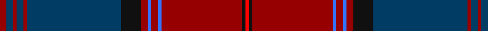

**Bands:** [RKRBRBRKBRBRBR](/stripes/rkrbrbrkbrbrbr/) · **Stripes:** [R K R B R B R K DT R DT R DT R](/stripes/stripes14/) R K R B R B R K DT R DT R DT R

This was sourced from register-of-tartans.  It is a [14 band tartan](/bands/bands14/).

Original link https://www.tartanregister.gov.uk/tartanDetails.aspx?ref=11420

## Register references

External register numbers recorded for this tartan.

- Scottish Register of Tartans: [11420](https://www.tartanregister.gov.uk/tartanDetails.aspx?ref=11420)

## Thread count
DR/4 DB4 DR2 DB4 DR2 DB56 K12 DR4 B2 DR4 B2 DR48 K2 R/2

## Palette
Each colour and its ΔE from the base-6 reference it is a variant of.

| Colour | Shade | Base | ΔE (OKLab) |
|---|---|---|---|
| B | <code style="background-color:#3474FC;">#3474FC</code> `#3474FC` | B <code style="background-color:#2A418A;">#2A418A</code> | 0.22 |
| DB | <code style="background-color:#003C64;">#003C64</code> `#003C64` | B <code style="background-color:#2A418A;">#2A418A</code> | 0.08 |
| DR | <code style="background-color:#960000;">#960000</code> `#960000` | R <code style="background-color:#CC0000;">#CC0000</code> | 0.12 |
| K | <code style="background-color:#101010;">#101010</code> `#101010` | K <code style="background-color:#000000;">#000000</code> | 0.17 |
| R | <code style="background-color:#FF0000;">#FF0000</code> `#FF0000` | R <code style="background-color:#CC0000;">#CC0000</code> | 0.11 |

## Nearest tartans

The nearest existing variants by ΔTartan distance.

1. [MacDonald of Glencoe Artifact Tartan Tartan Number: 1012. Earliest known date: 17th century Cargill fragment now at Fort William museum. See products available Copyright © Blair Urquhart, Comrie, 2015](/setts/s13/m6r1db2m2g40m6db13t1m48g2m4r1g4~x2/) — ΔT 1.33
1. [Leando Hunting (Personal)](/setts/s13/n19do2m1dr3w1dr1w1dr1do6n3dr1do3w1~x4/) — ΔT 1.36
1. [Firefighters' Memorial](/setts/s13/r4k4r65k8r6k35lo2k2g7k35r3k2r4/) — ΔT 1.37
1. [MacDonald of Glencoe #2](/setts/s13/r5ly1db2r2dg30r5db10t1r42dg2r4ly1dg4~x2/) — ΔT 1.39
1. [MacDonald of Glenaladale #2](/setts/s13/r6r1db2r2dg40r6db13t1r48dg2r4r1dg4~x2/) — ΔT 1.48
1. [Broz Sanz Elementary School](/setts/s12/n20r2db4lb2db4r2db4k1db1k1db1k4~x4/) — ΔT 1.50
1. [Stewart of Appin](/setts/s16/r3db2b1r2dg24r4dg2r2db8r2dg2r24db2b1r2dg2~x2/) — ΔT 1.52
1. [Belk Heritage (Fashion)](/setts/s15/k16lo1k4lb2k4r1dg41lo2r36k1dg3k1r3k1dg4~x2/) — ΔT 1.53
1. [Royal Bahrain (Royal)](/setts/s18/dt16r1dt2r3dt1r9dt1r3dt2r1dt6dg3lb3dg5r28w3r3w3~x2/) — ΔT 1.57
1. [German American](/setts/s12/r4k4lo3k4r54r5k54r4k3db9k2w4/) — ΔT 1.61

## Neighbour map

Every grey dot is one of 14299 variants placed by the first two principal components of the ΔTartan feature space (44% of its variance). Red is this tartan; blue dots are its nearest — click one to open its page.

<svg viewBox="0 0 640 380" role="img" style="max-width:100%;height:auto;border:1px solid #e0e0e0;border-radius:4px;display:block" xmlns="http://www.w3.org/2000/svg"><image href="/nn/cloud.v1.png" width="640" height="380"/><a href="/setts/s13/m6r1db2m2g40m6db13t1m48g2m4r1g4~x2/"><circle cx="379.8" cy="77.6" r="4" fill="#3465a4"><title>MacDonald of Glencoe Artifact Tartan Tartan Number: 1012. Earliest known date: 17th century Cargill fragment now at Fort William museum. See products available Copyright © Blair Urquhart, Comrie, 2015</title></circle></a><a href="/setts/s13/n19do2m1dr3w1dr1w1dr1do6n3dr1do3w1~x4/"><circle cx="320.9" cy="115.2" r="4" fill="#3465a4"><title>Leando Hunting (Personal)</title></circle></a><a href="/setts/s13/r4k4r65k8r6k35lo2k2g7k35r3k2r4/"><circle cx="368.0" cy="105.1" r="4" fill="#3465a4"><title>Firefighters' Memorial</title></circle></a><a href="/setts/s13/r5ly1db2r2dg30r5db10t1r42dg2r4ly1dg4~x2/"><circle cx="400.6" cy="93.3" r="4" fill="#3465a4"><title>MacDonald of Glencoe #2</title></circle></a><a href="/setts/s13/r6r1db2r2dg40r6db13t1r48dg2r4r1dg4~x2/"><circle cx="407.1" cy="93.8" r="4" fill="#3465a4"><title>MacDonald of Glenaladale #2</title></circle></a><a href="/setts/s12/n20r2db4lb2db4r2db4k1db1k1db1k4~x4/"><circle cx="280.0" cy="126.7" r="4" fill="#3465a4"><title>Broz Sanz Elementary School</title></circle></a><a href="/setts/s16/r3db2b1r2dg24r4dg2r2db8r2dg2r24db2b1r2dg2~x2/"><circle cx="334.3" cy="110.8" r="4" fill="#3465a4"><title>Stewart of Appin</title></circle></a><a href="/setts/s15/k16lo1k4lb2k4r1dg41lo2r36k1dg3k1r3k1dg4~x2/"><circle cx="323.7" cy="89.6" r="4" fill="#3465a4"><title>Belk Heritage (Fashion)</title></circle></a><a href="/setts/s18/dt16r1dt2r3dt1r9dt1r3dt2r1dt6dg3lb3dg5r28w3r3w3~x2/"><circle cx="313.5" cy="83.7" r="4" fill="#3465a4"><title>Royal Bahrain (Royal)</title></circle></a><a href="/setts/s12/r4k4lo3k4r54r5k54r4k3db9k2w4/"><circle cx="302.0" cy="81.2" r="4" fill="#3465a4"><title>German American</title></circle></a><circle cx="343.6" cy="96.6" r="5" fill="#c00000"/></svg>

ID: /setts/s14/r2dt2r1dt2r1dt28k6r2b1r2b1r24k1r1~x2/
