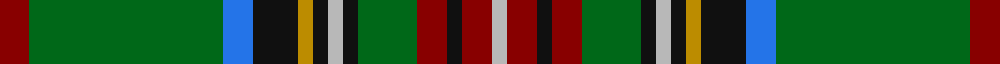

In pattern [RGGBKYKYKGRKRY](/stripes/rggbkykykgrkry/).

This was sourced from register-of-tartans.  It is a [14 stripe tartan](/stripes/stripes14/).

Original link https://www.tartanregister.gov.uk/tartanDetails.aspx?ref=3930

## Register references

External register numbers recorded for this tartan.

- Scottish Register of Tartans: [3930](https://www.tartanregister.gov.uk/tartanDetails.aspx?ref=3930)
- Scottish Tartans Authority (ITI): 5253

## Thread count
DR/8 G44 G8 B8 K12 DY4 K4 Na4 K4 G16 DR8 K4 DR8 Na/4

## Palette
Each colour and the base-6 reference it is a variant of.

| Colour | Shade | Base |
|---|---|---|
| B | <code style="background-color:#2474E8;">#2474E8</code> `oklch(57.8% 0.192 258.7)` <small>#2474E8</small> | B <code style="background-color:#2A418A;">#2A418A</code> |
| DR | <code style="background-color:#880000;">#880000</code> `oklch(39.4% 0.162 29.2)` <small>#880000</small> | R <code style="background-color:#CC0000;">#CC0000</code> |
| DY | <code style="background-color:#BC8C00;">#BC8C00</code> `oklch(66.8% 0.137 84.1)` <small>#BC8C00</small> | Y <code style="background-color:#F2BF00;">#F2BF00</code> |
| G | <code style="background-color:#006818;">#006818</code> `oklch(45.0% 0.142 145.0)` <small>#006818</small> | G <code style="background-color:#006100;">#006100</code> |
| K | <code style="background-color:#101010;">#101010</code> `oklch(17.3% 0.000 89.9)` <small>#101010</small> | K <code style="background-color:#000000;">#000000</code> |
| N | <code style="background-color:#5C5C5C;">#5C5C5C</code> `oklch(47.5% 0.000 89.9)` <small>#5C5C5C</small> | B <code style="background-color:#2A418A;">#2A418A</code> |
| Na | <code style="background-color:#B8B8B8;">#B8B8B8</code> `oklch(78.3% 0.000 89.9)` <small>#B8B8B8</small> | Y <code style="background-color:#F2BF00;">#F2BF00</code> |

## Nearest tartans

The nearest existing variants by ΔTartan distance, with this tartan at the top so the swatches line up against it.

ΔTartan

Tartan

Sett

—

<a href="/ttd/edit/#slug=r2g11g2b2k3lo1k1lr1k1g4r2k1r2lr1~x4">Stewart (King George VI)</a> <a class="nn-out" href="/setts/s14/r2g11g2b2k3lo1k1lr1k1g4r2k1r2lr1~x4/" title="open its dictionary page">↗</a>

0.74

<a href="/ttd/edit/#slug=k3g3r2g3ly2g2ly2g11db3k3db3k3db3k3db3g20r3~x2">Myron Family Tartan Tartan Number: 1105. Earliest known date: pre 2003 Designed for the town celebrations of 1958-59 by G. Lawson of the Musselburgh Co-operative Society. See products available Copyright © Blair Urquhart, Comrie, 2015</a> <a class="nn-out" href="/setts/s17/k3g3r2g3ly2g2ly2g11db3k3db3k3db3k3db3g20r3~x2/" title="open its dictionary page">↗</a>

0.75

<a href="/ttd/edit/#slug=dp4w2dp10k10g3k3g3k2g24ly2g2r4~x2">Kerby (Personal)</a> <a class="nn-out" href="/setts/s12/dp4w2dp10k10g3k3g3k2g24ly2g2r4~x2/" title="open its dictionary page">↗</a>

0.87

<a href="/ttd/edit/#slug=g10k1g1k1g1k1db4k1w1k1db1ly1k1g4k1r1~x4">Cockburn - 1830 (Clan)</a> <a class="nn-out" href="/setts/s16/g10k1g1k1g1k1db4k1w1k1db1ly1k1g4k1r1~x4/" title="open its dictionary page">↗</a>

0.88

<a href="/ttd/edit/#slug=k8r2k3ly2k2w3k2dy10g26r2g3k2~x2">Tara Murphy Irish Family Tartan Tartan Number: 1103. Earliest known date: 1880 This pattern was recorded by Bill Johnston, Shippak, USA in 1978 along with other patterns found at Pendleton Mill. This and other Irish patterns appear to have originated in the former Waterford Mill in Ireland before they arrived at Pendleton in the late 19C. This and the O'Keefe (1176) are colour variations of the MacLean of Duart See products available Copyright © Blair Urquhart, Comrie, 2015</a> <a class="nn-out" href="/setts/s12/k8r2k3ly2k2w3k2dy10g26r2g3k2~x2/" title="open its dictionary page">↗</a>

0.90

<a href="/ttd/edit/#slug=g17t3r3t3k19ly2g17r4g17ly2k19t3r3t3g17db8~x2">Wilson's No.033</a> <a class="nn-out" href="/setts/s16/g17t3r3t3k19ly2g17r4g17ly2k19t3r3t3g17db8~x2/" title="open its dictionary page">↗</a>

0.92

<a href="/ttd/edit/#slug=r2k6g2k2g14k1ly2k1b5r1b5k1w2k1g14k1b2~x2">Duncan of Sketraw</a> <a class="nn-out" href="/setts/s17/r2k6g2k2g14k1ly2k1b5r1b5k1w2k1g14k1b2~x2/" title="open its dictionary page">↗</a>

0.95

<a href="/ttd/edit/#slug=y3k3dg2k6y7dg2y3dg2lo3dg5y3b3y20k2~x2">Stewart Camel Fashion Tartan Tartan Number: 4038. Earliest known date: 01/01/1999 No Details See products available Copyright © Blair Urquhart, Comrie, 2015</a> <a class="nn-out" href="/setts/s14/y3k3dg2k6y7dg2y3dg2lo3dg5y3b3y20k2~x2/" title="open its dictionary page">↗</a>

0.95

<a href="/ttd/edit/#slug=g17t3r3t3k19w2g17r4g17w2k19t3r3t3g17db8~x2">Wilson's No.033 #2</a> <a class="nn-out" href="/setts/s16/g17t3r3t3k19w2g17r4g17w2k19t3r3t3g17db8~x2/" title="open its dictionary page">↗</a>

1.05

<a href="/ttd/edit/#slug=dr9t3dr4ly3dr3ly4dr3o11g30b3g4dr3~x2">Harmony, 2</a> <a class="nn-out" href="/setts/s12/dr9t3dr4ly3dr3ly4dr3o11g30b3g4dr3~x2/" title="open its dictionary page">↗</a>

1.06

<a href="/ttd/edit/#slug=g15r1g8r3dp1r1w1r3dp1r3dp12r1g7ly1~x2">Recycled Lamb, The</a> <a class="nn-out" href="/setts/s14/g15r1g8r3dp1r1w1r3dp1r3dp12r1g7ly1~x2/" title="open its dictionary page">↗</a>

## Neighbour map

Every grey dot is one of 14299 variants placed by the first two principal components of the ΔTartan feature space (44% of its variance). Red is this tartan; blue dots are its nearest — click one to open its page.

<svg viewBox="0 0 640 380" role="img" style="max-width:100%;height:auto;border:1px solid #e0e0e0;border-radius:4px;display:block" xmlns="http://www.w3.org/2000/svg"><image href="/nn/cloud.v1.png" width="640" height="380"/><a href="/setts/s17/k3g3r2g3ly2g2ly2g11db3k3db3k3db3k3db3g20r3~x2/"><circle cx="235.7" cy="132.4" r="4" fill="#3465a4"><title>Myron Family Tartan Tartan Number: 1105. Earliest known date: pre 2003 Designed for the town celebrations of 1958-59 by G. Lawson of the Musselburgh Co-operative Society. See products available Copyright © Blair Urquhart, Comrie, 2015</title></circle></a><a href="/setts/s12/dp4w2dp10k10g3k3g3k2g24ly2g2r4~x2/"><circle cx="207.0" cy="133.2" r="4" fill="#3465a4"><title>Kerby (Personal)</title></circle></a><a href="/setts/s16/g10k1g1k1g1k1db4k1w1k1db1ly1k1g4k1r1~x4/"><circle cx="223.1" cy="120.6" r="4" fill="#3465a4"><title>Cockburn - 1830 (Clan)</title></circle></a><a href="/setts/s12/k8r2k3ly2k2w3k2dy10g26r2g3k2~x2/"><circle cx="207.8" cy="118.7" r="4" fill="#3465a4"><title>Tara Murphy Irish Family Tartan Tartan Number: 1103. Earliest known date: 1880 This pattern was recorded by Bill Johnston, Shippak, USA in 1978 along with other patterns found at Pendleton Mill. This and other Irish patterns appear to have originated in the former Waterford Mill in Ireland before they arrived at Pendleton in the late 19C. This and the O'Keefe (1176) are colour variations of the MacLean of Duart See products available Copyright © Blair Urquhart, Comrie, 2015</title></circle></a><a href="/setts/s16/g17t3r3t3k19ly2g17r4g17ly2k19t3r3t3g17db8~x2/"><circle cx="187.0" cy="152.7" r="4" fill="#3465a4"><title>Wilson's No.033</title></circle></a><a href="/setts/s17/r2k6g2k2g14k1ly2k1b5r1b5k1w2k1g14k1b2~x2/"><circle cx="210.3" cy="109.9" r="4" fill="#3465a4"><title>Duncan of Sketraw</title></circle></a><a href="/setts/s14/y3k3dg2k6y7dg2y3dg2lo3dg5y3b3y20k2~x2/"><circle cx="168.8" cy="128.2" r="4" fill="#3465a4"><title>Stewart Camel Fashion Tartan Tartan Number: 4038. Earliest known date: 01/01/1999 No Details See products available Copyright © Blair Urquhart, Comrie, 2015</title></circle></a><a href="/setts/s16/g17t3r3t3k19w2g17r4g17w2k19t3r3t3g17db8~x2/"><circle cx="180.2" cy="149.3" r="4" fill="#3465a4"><title>Wilson's No.033 #2</title></circle></a><a href="/setts/s12/dr9t3dr4ly3dr3ly4dr3o11g30b3g4dr3~x2/"><circle cx="179.6" cy="130.2" r="4" fill="#3465a4"><title>Harmony, 2</title></circle></a><a href="/setts/s14/g15r1g8r3dp1r1w1r3dp1r3dp12r1g7ly1~x2/"><circle cx="251.6" cy="113.2" r="4" fill="#3465a4"><title>Recycled Lamb, The</title></circle></a><circle cx="216.8" cy="132.2" r="5" fill="#c00000"/></svg>

ID: /setts/s14/r2g11g2b2k3lo1k1lr1k1g4r2k1r2lr1~x4/
