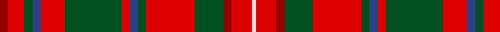

**Bands:** [RRGBRGRBGRGRRW](/stripes/rrgbrgrbgrgrrw/) · **Stripes:** [R R DG DB R DG R DB DG R DG R R W](/stripes/stripes14/) R R DG DB R DG R DB DG R DG R R W

This was sourced from register-of-tartans.  It is a [14 band tartan](/bands/bands14/).

Original link https://www.tartanregister.gov.uk/tartanDetails.aspx?ref=2372

## Register references

External register numbers recorded for this tartan.

- Scottish Register of Tartans: [2372](https://www.tartanregister.gov.uk/tartanDetails.aspx?ref=2372)
- Scottish Tartans World Register: 1643

## Thread count
DR/4 R8 G4 B4 R12 G28 R4 B4 G4 R24 G14 DR4 R10 LN/2

## Palette
Each colour and its ΔE from the base-6 reference it is a variant of.

| Colour | Shade | Base | ΔE (OKLab) |
|---|---|---|---|
| B | <code style="background-color:#2C4084;">#2C4084</code> `#2C4084` | B <code style="background-color:#2A418A;">#2A418A</code> | 0.01 |
| DR | <code style="background-color:#960000;">#960000</code> `#960000` | R <code style="background-color:#CC0000;">#CC0000</code> | 0.12 |
| G | <code style="background-color:#005020;">#005020</code> `#005020` | G <code style="background-color:#006100;">#006100</code> | 0.07 |
| LN | <code style="background-color:#E0E0E0;">#E0E0E0</code> `#E0E0E0` | W <code style="background-color:#F7F7F7;">#F7F7F7</code> | 0.07 |
| R | <code style="background-color:#DC0000;">#DC0000</code> `#DC0000` | R <code style="background-color:#CC0000;">#CC0000</code> | 0.03 |

## Nearest tartans

The nearest existing variants by ΔTartan distance.

1. [MacDonald of Staffa 4](/setts/s14/r2r4g2db2r6g14r2db2g2r12g7r2r5w1~x2/) — ΔT 0.79
1. [Hay](/setts/s14/r6dg4ly2dg17r2dg2r2dg8r26dg6r4k2r4w6~x2/) — ΔT 0.80
1. [MacKinnon #9](/setts/s14/r1r2dg1k1r5dg11r1k2dg1r11dg4r1r2w1~x2/) — ΔT 0.85
1. [MacKinnon #11](/setts/s14/w3r5dg3dp3r14dg36r3dp8dg3r36dg14r3r5w3~x2/) — ΔT 0.95
1. [Seton](/setts/s18/r2g1r10k2r1dp2r2g6w1g3w1g6r2dp2r1k2r10g1~x8/) — ΔT 0.95
1. [Nicolson/MacNicol](/setts/s13/db2r11dg2r11dg21r2k9t2db11r11dg2r11db2~x2/) — ΔT 0.97
1. [MacGuire (Personal)](/setts/s14/w3k2dg18r2db8r18dg2r2dg2r2db2r18dg18k2~x2/) — ΔT 0.99
1. [Seton (Clan)](/setts/s10/g3w1g6r2dp2r1k2r10g1r2~x8/) — ΔT 0.99
1. [MacKinnon](/setts/s14/dp2r3g2db2r6g16r2db4g2r16g8dp2r4w2~x2/) — ΔT 1.04
1. [MacKinnon #8](/setts/s14/dp2r3dg2db2r6dg16r2db4dg2r16dg8dp2r4w2~x2/) — ΔT 1.06

## Neighbour map

Every grey dot is one of 14313 variants placed by the first two principal components of the ΔTartan feature space (44% of its variance). Red is this tartan; blue dots are its nearest — click one to open its page.

<svg viewBox="0 0 640 380" role="img" style="max-width:100%;height:auto;border:1px solid #e0e0e0;border-radius:4px;display:block" xmlns="http://www.w3.org/2000/svg"><image href="/nn/cloud.v1.png" width="640" height="380"/><a href="/setts/s14/r2r4g2db2r6g14r2db2g2r12g7r2r5w1~x2/"><circle cx="257.4" cy="144.2" r="4" fill="#3465a4"><title>MacDonald of Staffa 4</title></circle></a><a href="/setts/s14/r6dg4ly2dg17r2dg2r2dg8r26dg6r4k2r4w6~x2/"><circle cx="273.2" cy="127.1" r="4" fill="#3465a4"><title>Hay</title></circle></a><a href="/setts/s14/r1r2dg1k1r5dg11r1k2dg1r11dg4r1r2w1~x2/"><circle cx="262.6" cy="127.2" r="4" fill="#3465a4"><title>MacKinnon #9</title></circle></a><a href="/setts/s14/w3r5dg3dp3r14dg36r3dp8dg3r36dg14r3r5w3~x2/"><circle cx="253.9" cy="119.0" r="4" fill="#3465a4"><title>MacKinnon #11</title></circle></a><a href="/setts/s18/r2g1r10k2r1dp2r2g6w1g3w1g6r2dp2r1k2r10g1~x8/"><circle cx="244.0" cy="127.9" r="4" fill="#3465a4"><title>Seton</title></circle></a><a href="/setts/s13/db2r11dg2r11dg21r2k9t2db11r11dg2r11db2~x2/"><circle cx="215.5" cy="156.7" r="4" fill="#3465a4"><title>Nicolson/MacNicol</title></circle></a><a href="/setts/s14/w3k2dg18r2db8r18dg2r2dg2r2db2r18dg18k2~x2/"><circle cx="225.8" cy="146.8" r="4" fill="#3465a4"><title>MacGuire (Personal)</title></circle></a><a href="/setts/s10/g3w1g6r2dp2r1k2r10g1r2~x8/"><circle cx="253.2" cy="156.1" r="4" fill="#3465a4"><title>Seton (Clan)</title></circle></a><a href="/setts/s14/dp2r3g2db2r6g16r2db4g2r16g8dp2r4w2~x2/"><circle cx="221.7" cy="153.9" r="4" fill="#3465a4"><title>MacKinnon</title></circle></a><a href="/setts/s14/dp2r3dg2db2r6dg16r2db4dg2r16dg8dp2r4w2~x2/"><circle cx="215.8" cy="149.5" r="4" fill="#3465a4"><title>MacKinnon #8</title></circle></a><circle cx="256.3" cy="140.0" r="5" fill="#c00000"/></svg>

ID: /setts/s14/r2r4dg2db2r6dg14r2db2dg2r12dg7r2r5w1~x2/
