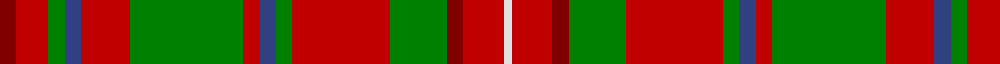

In pattern [RRGBRGRBGRGRRW](/stripes/rrgbrgrbgrgrrw/).

This was sourced from weddslist.  It is a [14 stripe tartan](/stripes/stripes14/).

Original link http://www.weddslist.com/cgi-bin/tartans/pg.pl?source=sts

## Also known as

This cloth is also recorded under:

- MacDonald of Staffa #5

## Thread count
DR/4 R8 G4 B4 R12 G28 R4 B4 G4 R24 G14 DR4 R10 LN/2

## Palette
Each colour and the base-6 reference it is a variant of.

| Colour | Shade | Base |
|---|---|---|
| B | <code style="background-color:#304080;">#304080</code> `oklch(39.4% 0.109 270.2)` <small>#304080</small> | B <code style="background-color:#2A418A;">#2A418A</code> |
| DR | <code style="background-color:#800000;">#800000</code> `oklch(37.7% 0.155 29.2)` <small>#800000</small> | R <code style="background-color:#CC0000;">#CC0000</code> |
| G | <code style="background-color:#008000;">#008000</code> `oklch(52.0% 0.177 142.5)` <small>#008000</small> | G <code style="background-color:#006100;">#006100</code> |
| LN | <code style="background-color:#E0E0E0;">#E0E0E0</code> `oklch(90.7% 0.000 89.9)` <small>#E0E0E0</small> | W <code style="background-color:#F7F7F7;">#F7F7F7</code> |
| R | <code style="background-color:#C00000;">#C00000</code> `oklch(50.7% 0.208 29.2)` <small>#C00000</small> | R <code style="background-color:#CC0000;">#CC0000</code> |

## Nearest tartans

The nearest existing variants by ΔTartan distance, with this tartan at the top so the swatches line up against it.

ΔTartan

Tartan

Sett

—

<a href="/ttd/edit/#slug=r2r4g2db2r6g14r2db2g2r12g7r2r5w1~x2">MacDonald of Staffa 4</a> <a class="nn-out" href="/setts/s14/r2r4g2db2r6g14r2db2g2r12g7r2r5w1~x2/" title="open its dictionary page">↗</a>

0.79

<a href="/ttd/edit/#slug=r2r4dg2db2r6dg14r2db2dg2r12dg7r2r5w1~x2">MacDonald of Staffa #5</a> <a class="nn-out" href="/setts/s14/r2r4dg2db2r6dg14r2db2dg2r12dg7r2r5w1~x2/" title="open its dictionary page">↗</a>

0.84

<a href="/ttd/edit/#slug=r6dg4ly2dg17r2dg2r2dg8r26dg6r4k2r4w6~x2">Hay</a> <a class="nn-out" href="/setts/s14/r6dg4ly2dg17r2dg2r2dg8r26dg6r4k2r4w6~x2/" title="open its dictionary page">↗</a>

0.91

<a href="/ttd/edit/#slug=w3r5r3g14r36g3p8r3g36r14p3g3r5w3~x2">MacKinnon 3</a> <a class="nn-out" href="/setts/s14/w3r5r3g14r36g3p8r3g36r14p3g3r5w3~x2/" title="open its dictionary page">↗</a>

0.96

<a href="/ttd/edit/#slug=g14r1g14r7w1r7w1r7db5dp3w1~x4">Hynde Artifact Tartan Tartan Number: 976. Earliest known date: 1744 Trews belonging to Sir John Hynde. See products available Copyright © Blair Urquhart, Comrie, 2015</a> <a class="nn-out" href="/setts/s11/g14r1g14r7w1r7w1r7db5dp3w1~x4/" title="open its dictionary page">↗</a>

1.01

<a href="/ttd/edit/#slug=p2r3g2db2r6g16r2db4g2r16g8p2r4w2~x2">MacKinnon 5</a> <a class="nn-out" href="/setts/s14/p2r3g2db2r6g16r2db4g2r16g8p2r4w2~x2/" title="open its dictionary page">↗</a>

1.04

<a href="/ttd/edit/#slug=t2r3g2db2r6g16r2db4g2r16g8t2r4w2~x2">MacKinnon 6</a> <a class="nn-out" href="/setts/s14/t2r3g2db2r6g16r2db4g2r16g8t2r4w2~x2/" title="open its dictionary page">↗</a>

1.11

<a href="/ttd/edit/#slug=w3k2dg18r2db8r18dg2r2dg2r2db2r18dg18k2~x2">MacGuire (Personal)</a> <a class="nn-out" href="/setts/s14/w3k2dg18r2db8r18dg2r2dg2r2db2r18dg18k2~x2/" title="open its dictionary page">↗</a>

1.13

<a href="/ttd/edit/#slug=dp2r3g2db2r6g16r2db4g2r16g8dp2r4w2~x2">MacKinnon</a> <a class="nn-out" href="/setts/s14/dp2r3g2db2r6g16r2db4g2r16g8dp2r4w2~x2/" title="open its dictionary page">↗</a>

1.14

<a href="/ttd/edit/#slug=r3dg14r3ly1r3dp8r3ly1r3dg14r3ly1~x4">Wilson's No.213</a> <a class="nn-out" href="/setts/s12/r3dg14r3ly1r3dp8r3ly1r3dg14r3ly1~x4/" title="open its dictionary page">↗</a>

1.15

<a href="/ttd/edit/#slug=r1r2g1k1r5g11r1k2g1r11g4r1r2w1~x2">MacKinnon 2</a> <a class="nn-out" href="/setts/s14/r1r2g1k1r5g11r1k2g1r11g4r1r2w1~x2/" title="open its dictionary page">↗</a>

## Neighbour map

Every grey dot is one of 14299 variants placed by the first two principal components of the ΔTartan feature space (44% of its variance). Red is this tartan; blue dots are its nearest — click one to open its page.

<svg viewBox="0 0 640 380" role="img" style="max-width:100%;height:auto;border:1px solid #e0e0e0;border-radius:4px;display:block" xmlns="http://www.w3.org/2000/svg"><image href="/nn/cloud.v1.png" width="640" height="380"/><a href="/setts/s14/r2r4dg2db2r6dg14r2db2dg2r12dg7r2r5w1~x2/"><circle cx="256.0" cy="140.1" r="4" fill="#3465a4"><title>MacDonald of Staffa #5</title></circle></a><a href="/setts/s14/r6dg4ly2dg17r2dg2r2dg8r26dg6r4k2r4w6~x2/"><circle cx="272.8" cy="127.1" r="4" fill="#3465a4"><title>Hay</title></circle></a><a href="/setts/s14/w3r5r3g14r36g3p8r3g36r14p3g3r5w3~x2/"><circle cx="258.2" cy="123.6" r="4" fill="#3465a4"><title>MacKinnon 3</title></circle></a><a href="/setts/s11/g14r1g14r7w1r7w1r7db5dp3w1~x4/"><circle cx="234.5" cy="151.9" r="4" fill="#3465a4"><title>Hynde Artifact Tartan Tartan Number: 976. Earliest known date: 1744 Trews belonging to Sir John Hynde. See products available Copyright © Blair Urquhart, Comrie, 2015</title></circle></a><a href="/setts/s14/p2r3g2db2r6g16r2db4g2r16g8p2r4w2~x2/"><circle cx="218.0" cy="153.0" r="4" fill="#3465a4"><title>MacKinnon 5</title></circle></a><a href="/setts/s14/t2r3g2db2r6g16r2db4g2r16g8t2r4w2~x2/"><circle cx="218.8" cy="155.0" r="4" fill="#3465a4"><title>MacKinnon 6</title></circle></a><a href="/setts/s14/w3k2dg18r2db8r18dg2r2dg2r2db2r18dg18k2~x2/"><circle cx="225.6" cy="146.9" r="4" fill="#3465a4"><title>MacGuire (Personal)</title></circle></a><a href="/setts/s14/dp2r3g2db2r6g16r2db4g2r16g8dp2r4w2~x2/"><circle cx="221.4" cy="153.9" r="4" fill="#3465a4"><title>MacKinnon</title></circle></a><a href="/setts/s12/r3dg14r3ly1r3dp8r3ly1r3dg14r3ly1~x4/"><circle cx="286.5" cy="162.4" r="4" fill="#3465a4"><title>Wilson's No.213</title></circle></a><a href="/setts/s14/r1r2g1k1r5g11r1k2g1r11g4r1r2w1~x2/"><circle cx="249.2" cy="124.5" r="4" fill="#3465a4"><title>MacKinnon 2</title></circle></a><circle cx="257.1" cy="144.2" r="5" fill="#c00000"/></svg>

ID: /setts/s14/r2r4g2db2r6g14r2db2g2r12g7r2r5w1~x2/
