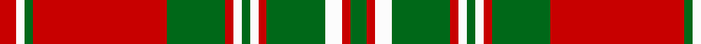

In pattern [GRWGRWGWRGRGWR](/stripes/grwgrwgwrgrgwr/).

This was sourced from tartans-authority.  It is a [14 stripe tartan](/stripes/stripes14/).

Original link http://www.tartansauthority.com/tartan-ferret/display/1016/

## Thread count
R/8 W4 G4 R64 G28 R4 W4 G4 W4 R4 G28 W8 R4 G/8

## Palette
Each colour and its ΔE from the base-6 reference it is a variant of.

| Colour | Shade | Base | ΔE (OKLab) |
|---|---|---|---|
| G | <code style="background-color:#006818;">#006818</code> `#006818` | G <code style="background-color:#006100;">#006100</code> | 0.02 |
| R | <code style="background-color:#C80000;">#C80000</code> `#C80000` | R <code style="background-color:#CC0000;">#CC0000</code> | 0.01 |
| W | <code style="background-color:#FCFCFC;">#FCFCFC</code> `#FCFCFC` | W <code style="background-color:#F7F7F7;">#F7F7F7</code> | 0.01 |

## Nearest tartans

The nearest existing variants by ΔTartan distance.

1. [Mordente (Personal)](/setts/s14/r2w1g1r16g7r1w1g1w1r1g7w2r1g2~x2/) — ΔT 0.00
1. [Mordente](/setts/s14/r1w1g1r16g7r1w1g1w1r1g7w2r1g1~x2/) — ΔT 0.49
1. [MacNeish](/setts/s12/g6r3k3r24g4k10r2g4r2g24r6g2~x2/) — ΔT 1.22
1. [Fort William (Fashion)](/setts/s11/o10lb2lg3lb2do24lb4do4o34do2lb3do2~x2/) — ΔT 1.29
1. [Bruce, Old](/setts/s14/r45db4r4g48r4db4r4db15r4db4r40g4r4g30/) — ΔT 1.30
1. [Grant (Official)](/setts/s15/r8db2r2db2r32lt2r2db8r2g2r2g27r2db2r2~x2/) — ΔT 1.32
1. [Scott](/setts/s12/g4r3k1r28g14r4g4w3g4r4g4w3~x2/) — ΔT 1.37
1. [Bruce Old](/setts/s14/r45db4r4dg48r4db4r4db15r4db4r40dg4r4dg30/) — ΔT 1.38
1. [MacQuarrie #4](/setts/s13/k1r1dg1r21dg1r1k10r1dg14r1dg1r1dg1~x2/) — ΔT 1.39
1. [MacQuarrie 6](/setts/s13/k1r1g1r21g1r1k10r1g14r1g1r1g1~x2/) — ΔT 1.40

## Neighbour map

Every grey dot is one of 14299 variants placed by the first two principal components of the ΔTartan feature space (44% of its variance). Red is this tartan; blue dots are its nearest — click one to open its page.

<svg viewBox="0 0 640 380" role="img" style="max-width:100%;height:auto;border:1px solid #e0e0e0;border-radius:4px;display:block" xmlns="http://www.w3.org/2000/svg"><image href="/nn/cloud.v1.png" width="640" height="380"/><a href="/setts/s14/r2w1g1r16g7r1w1g1w1r1g7w2r1g2~x2/"><circle cx="311.2" cy="123.9" r="4" fill="#3465a4"><title>Mordente (Personal)</title></circle></a><a href="/setts/s14/r1w1g1r16g7r1w1g1w1r1g7w2r1g1~x2/"><circle cx="320.6" cy="124.4" r="4" fill="#3465a4"><title>Mordente</title></circle></a><a href="/setts/s12/g6r3k3r24g4k10r2g4r2g24r6g2~x2/"><circle cx="268.1" cy="162.8" r="4" fill="#3465a4"><title>MacNeish</title></circle></a><a href="/setts/s11/o10lb2lg3lb2do24lb4do4o34do2lb3do2~x2/"><circle cx="298.4" cy="127.1" r="4" fill="#3465a4"><title>Fort William (Fashion)</title></circle></a><a href="/setts/s14/r45db4r4g48r4db4r4db15r4db4r40g4r4g30/"><circle cx="321.5" cy="165.0" r="4" fill="#3465a4"><title>Bruce, Old</title></circle></a><a href="/setts/s15/r8db2r2db2r32lt2r2db8r2g2r2g27r2db2r2~x2/"><circle cx="308.7" cy="90.2" r="4" fill="#3465a4"><title>Grant (Official)</title></circle></a><a href="/setts/s12/g4r3k1r28g14r4g4w3g4r4g4w3~x2/"><circle cx="334.7" cy="109.0" r="4" fill="#3465a4"><title>Scott</title></circle></a><a href="/setts/s14/r45db4r4dg48r4db4r4db15r4db4r40dg4r4dg30/"><circle cx="319.3" cy="160.5" r="4" fill="#3465a4"><title>Bruce Old</title></circle></a><a href="/setts/s13/k1r1dg1r21dg1r1k10r1dg14r1dg1r1dg1~x2/"><circle cx="331.8" cy="116.8" r="4" fill="#3465a4"><title>MacQuarrie #4</title></circle></a><a href="/setts/s13/k1r1g1r21g1r1k10r1g14r1g1r1g1~x2/"><circle cx="308.5" cy="109.9" r="4" fill="#3465a4"><title>MacQuarrie 6</title></circle></a><circle cx="311.2" cy="123.9" r="5" fill="#c00000"/></svg>

ID: /setts/s14/r2w1g1r16g7r1w1g1w1r1g7w2r1g2~x4/
