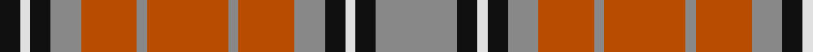

In pattern [KWKRRRRRRRKWKR](/patterns/kwkrrrrrrrkwkr/).

This was sourced from register-of-tartans.  It is a [14 stripes tartan](/stripes/stripes14/).

Original link https://www.tartanregister.gov.uk/tartanDetails.aspx?ref=4058

## Thread count
K/8 LN4 K8 N12 DO22 N4 DO32 N4 DO22 N12 K8 LN4 K8 N/32

## Palette
Each colour and its ΔE from the base-6 reference it is a variant of.

| Colour | Shade | Base | ΔE (OKLab) |
|---|---|---|---|
| DO | <code style="background-color:#B84C00;">#B84C00</code> `#B84C00` | R <code style="background-color:#C80000;">#C80000</code> | 0.08 |
| K | <code style="background-color:#101010;">#101010</code> `#101010` | K <code style="background-color:#000000;">#000000</code> | 0.17 |
| LN | <code style="background-color:#E0E0E0;">#E0E0E0</code> `#E0E0E0` | W <code style="background-color:#F4F4F0;">#F4F4F0</code> | 0.06 |
| N | <code style="background-color:#888888;">#888888</code> `#888888` | R <code style="background-color:#C80000;">#C80000</code> | 0.24 |

ID: /setts/s14/r32k8w4k8r12ra22r4ra32r4ra22r12k8w4k8-k101010-r888888-rab84c00-we0e0e0/
