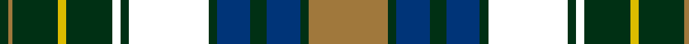

In pattern [GRGYGKGKGBGBGR](/patterns/grgygkgkgbgbgr/).

This was sourced from house-of-tartan.  It is a [14 stripes tartan](/stripes/stripes14/).

Original link http://www.house-of-tartan.scotland.net/house/TartanViewjs.asp?colr=Def&tnam=4800

## Thread count
DG/4 LT2 DG22 Y4 DG22 DDB4 DG4 DDB38 DG4 DB16 DG8 DB16 DG4 LT/38

## Palette
Each colour and its ΔE from the base-6 reference it is a variant of.

| Colour | Shade | Base | ΔE (OKLab) |
|---|---|---|---|
| DB | <code style="background-color:#003478;">#003478</code> `#003478` | B <code style="background-color:#2C4084;">#2C4084</code> | 0.06 |
| DG | <code style="background-color:#003014;">#003014</code> `#003014` | G <code style="background-color:#006400;">#006400</code> | 0.18 |
| LT | <code style="background-color:#A0783C;">#A0783C</code> `#A0783C` | R <code style="background-color:#C80000;">#C80000</code> | 0.18 |
| Y | <code style="background-color:#DCBC00;">#DCBC00</code> `#DCBC00` | Y <code style="background-color:#E8C000;">#E8C000</code> | 0.02 |

## Nearest tartans

The nearest existing variants by ΔTartan distance.

1. [Unnamed C20th - National Archives](/setts/s13/w4k20g8k4g8ka32g20y2g6y4g4ka4y4-g003820-k00002c-ka101010-wfcfcfc-ye8c000/) — ΔT 0.60
1. [Cochrane](/setts/s15/g16r2g2r1g3r1g2r2g12k12r1b16r2b8y2-b000064-g004c00-k000000-rc80000-yffc800/) — ΔT 0.78
1. [Cameron of Erracht](/setts/s11/g8r1g1r3g16k16r1b16r3b8y2-b00004c-g004c00-k000000-rc80000-yffc800/) — ΔT 0.79
1. [MacDonell of Glengarry](/setts/s11/b32r10b60r4k66g60r10g4r4g14w4-b304080-g008000-k000000-rc00000-we0e0e0/) — ΔT 0.87
1. [O'Doherty (Name)](/setts/s13/w4b20g6b4g6k36g20y2g6y4g4k4y4-b003c64-g285800-k101010-we0e0e0-yfccc00/) — ΔT 0.88
1. [Clanranald, MacDonald of (Clan)](/setts/s13/b32r4b4r14b62r4k64w6g62r14g4r4g32-b000048-g045c38-k000000-rc80000-wc8c8c8/) — ΔT 0.88
1. [Eildon (1996)](/setts/s14/r38g4b16g8b16g4k38g4k4g22y4g22r2g4-b003478-g003014-k000034-ra0783c-ydcbc00/) — ΔT 0.88
1. [MacDonald of Clanranald 1](/setts/s13/b32r4b4r14b62r4k64w6g62r14g4r4g32-b304080-g008000-k000000-rc00000-we0e0e0/) — ΔT 0.89
1. [Sempill](/setts/s17/b44k6b6k6b6k30r4g38k2ba6k2g38r4k30b38k6b6-b304080-ba5480b0-g008000-k000000-rc00000/) — ΔT 0.89
1. [Clerke of Ulva](/setts/s11/b6g6k8g28k8g6k28ba36r2ba8r4-b5480b0-ba304080-g008000-k000000-r900030/) — ΔT 0.90

## Neighbour map

Every grey dot is one of 15726 variants placed by the first two principal components of the ΔTartan feature space (44% of its variance). Red is this tartan; blue dots are its nearest — click one to open its page.

<svg viewBox="0 0 640 380" role="img" style="max-width:100%;height:auto;border:1px solid #e0e0e0;border-radius:4px;display:block" xmlns="http://www.w3.org/2000/svg"><image href="/nn/cloud.v1.png" width="640" height="380"/><a href="/setts/s13/w4k20g8k4g8ka32g20y2g6y4g4ka4y4-g003820-k00002c-ka101010-wfcfcfc-ye8c000/"><circle cx="177.0" cy="143.2" r="4" fill="#3465a4"><title>Unnamed C20th - National Archives</title></circle></a><a href="/setts/s15/g16r2g2r1g3r1g2r2g12k12r1b16r2b8y2-b000064-g004c00-k000000-rc80000-yffc800/"><circle cx="197.2" cy="130.7" r="4" fill="#3465a4"><title>Cochrane</title></circle></a><a href="/setts/s11/g8r1g1r3g16k16r1b16r3b8y2-b00004c-g004c00-k000000-rc80000-yffc800/"><circle cx="153.9" cy="150.9" r="4" fill="#3465a4"><title>Cameron of Erracht</title></circle></a><a href="/setts/s11/b32r10b60r4k66g60r10g4r4g14w4-b304080-g008000-k000000-rc00000-we0e0e0/"><circle cx="152.6" cy="132.6" r="4" fill="#3465a4"><title>MacDonell of Glengarry</title></circle></a><a href="/setts/s13/w4b20g6b4g6k36g20y2g6y4g4k4y4-b003c64-g285800-k101010-we0e0e0-yfccc00/"><circle cx="171.3" cy="126.6" r="4" fill="#3465a4"><title>O'Doherty (Name)</title></circle></a><a href="/setts/s13/b32r4b4r14b62r4k64w6g62r14g4r4g32-b000048-g045c38-k000000-rc80000-wc8c8c8/"><circle cx="150.4" cy="134.0" r="4" fill="#3465a4"><title>Clanranald, MacDonald of (Clan)</title></circle></a><a href="/setts/s14/r38g4b16g8b16g4k38g4k4g22y4g22r2g4-b003478-g003014-k000034-ra0783c-ydcbc00/"><circle cx="178.4" cy="138.8" r="4" fill="#3465a4"><title>Eildon (1996)</title></circle></a><a href="/setts/s13/b32r4b4r14b62r4k64w6g62r14g4r4g32-b304080-g008000-k000000-rc00000-we0e0e0/"><circle cx="137.3" cy="125.2" r="4" fill="#3465a4"><title>MacDonald of Clanranald 1</title></circle></a><a href="/setts/s17/b44k6b6k6b6k30r4g38k2ba6k2g38r4k30b38k6b6-b304080-ba5480b0-g008000-k000000-rc00000/"><circle cx="172.0" cy="112.8" r="4" fill="#3465a4"><title>Sempill</title></circle></a><a href="/setts/s11/b6g6k8g28k8g6k28ba36r2ba8r4-b5480b0-ba304080-g008000-k000000-r900030/"><circle cx="142.3" cy="142.6" r="4" fill="#3465a4"><title>Clerke of Ulva</title></circle></a><circle cx="161.5" cy="131.0" r="5" fill="#c00000"/></svg>

ID: /setts/s14/r38g4b16g8b16g4k38g4k4g22y4g22r2g4-b003478-g003014-k000000-ra0783c-ydcbc00/
