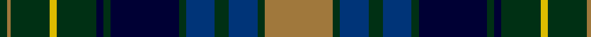

In pattern [GRGYGKGKGBGBGR](/patterns/grgygkgkgbgbgr/).

This was sourced from register-of-tartans.  It is a [14 stripes tartan](/stripes/stripes14/).

Original link https://www.tartanregister.gov.uk/tartanDetails.aspx?ref=1093

## Attestations

This cloth appears in 2 source records; the oldest owns this page.

- 01/01/1996 — Eildon (1996) (register-of-tartans, [record](https://www.tartanregister.gov.uk/tartanDetails.aspx?ref=1093))
- 1996 — Eildon (Fashion) (tartans-authority, [record](http://www.tartansauthority.com/tartan-ferret/display/4800/))

## Thread count
DG/4 LT2 DG22 Y4 DG22 DBa4 DG4 DBa38 DG4 DB16 DG8 DB16 DG4 LT/38

## Palette
Each colour and its ΔE from the base-6 reference it is a variant of.

| Colour | Shade | Base | ΔE (OKLab) |
|---|---|---|---|
| DB | <code style="background-color:#003478;">#003478</code> `#003478` | B <code style="background-color:#2C4084;">#2C4084</code> | 0.06 |
| DBa | <code style="background-color:#000034;">#000034</code> `#000034` | K <code style="background-color:#000000;">#000000</code> | 0.18 |
| DG | <code style="background-color:#003014;">#003014</code> `#003014` | G <code style="background-color:#006400;">#006400</code> | 0.18 |
| LT | <code style="background-color:#A0783C;">#A0783C</code> `#A0783C` | R <code style="background-color:#C80000;">#C80000</code> | 0.18 |
| Y | <code style="background-color:#DCBC00;">#DCBC00</code> `#DCBC00` | Y <code style="background-color:#E8C000;">#E8C000</code> | 0.02 |

## Nearest tartans

The nearest existing variants by ΔTartan distance.

1. [Dyce #2](/setts/s15/b32k4b4k4b4k24g24y4k4y4g24k32b32k2w6-b2c4084-g005020-k101010-we0e0e0-ye8c000/) — ΔT 0.56
1. [Robertson Hunting Clan Tartan Tartan Number: 299. Earliest known date: 1810-15 Also known as the 'Hunting Robertson'. The sett is reputedly ancient, and resembles the 'Athol Murray', though used by only by the Robertsons of the North. The Cockburn Collection is housed in the Mitchell Library in Glasgow. It contains some of the oldest preserved specimens of tartan which were collected between 1810 and 1815. The Robertsons claim descent from 'Donnachaidh Reamhair' who led the clan at the battle of Bannockburn. The Clan Donnachaidh museum is at Blair Atholl. See products available Copyright © Blair Urquhart, Comrie, 2015](/setts/s15/b24k4b4k4b4k24g32k2r4k2g32k24b24k2w6-b2c2c80-g006818-k101010-rc80000-we0e0e0/) — ΔT 0.58
1. [Craigclowan School](/setts/s14/b48k4k4b4k24g32k2r6k2g32k24b24k2w6-b2c2c80-g006818-k101010-rc80000-wfcfcfc/) — ΔT 0.61
1. [Robertson Htg - 1816 (Clan)](/setts/s15/b48k4b4k4b4k24g32k2r6k2g32k24b24k2w6-b2c2c80-g006818-k101010-rc80000-wfcfcfc/) — ΔT 0.68
1. [Loch Carron](/setts/s13/g10b50k38g46k4w4k10w4k4g46k38b60r10-b2c2c80-g006818-k101010-rc80000-wfcfcfc/) — ΔT 0.68
1. [Lochcarron District Tartan Tartan Number: 731. Earliest known date: pre 2003 Nothing See products available Copyright © Blair Urquhart, Comrie, 2015](/setts/s13/g10b50k38g46k4w4k10w4k4g46k38b60r10-b2c2c80-g006818-k101010-rc80000-we0e0e0/) — ΔT 0.69
1. [MacDonell of Glengarry #3](/setts/s11/b16r5b30r2k33g30r5g2r2g7w4-b202060-g006818-k101010-rc80000-we0e0e0/) — ΔT 0.72
1. [Robertson Hunting](/setts/s15/b48k4b4k4b4k24g32k2r4k2g32k24b24k2w6-b2c2c80-g006818-k101010-rc80000-wfcfcfc/) — ΔT 0.73
1. [Cameron of Erracht (Clan)](/setts/s11/g16r2g2r6g32k32r2b32r6b16y4-b2c2c80-g006818-k101010-rc80000-ye8c000/) — ΔT 0.78
1. [MacDonald of Clanranald #2](/setts/s13/b32r4b4r14b62r4k64w6g62r14g4r4g32-b2c4084-g005020-k101010-rdc0000-we0e0e0/) — ΔT 0.81

## Neighbour map

Every grey dot is one of 15726 variants placed by the first two principal components of the ΔTartan feature space (44% of its variance). Red is this tartan; blue dots are its nearest — click one to open its page.

<svg viewBox="0 0 640 380" role="img" style="max-width:100%;height:auto;border:1px solid #e0e0e0;border-radius:4px;display:block" xmlns="http://www.w3.org/2000/svg"><image href="/nn/cloud.v1.png" width="640" height="380"/><a href="/setts/s15/b32k4b4k4b4k24g24y4k4y4g24k32b32k2w6-b2c4084-g005020-k101010-we0e0e0-ye8c000/"><circle cx="181.2" cy="146.2" r="4" fill="#3465a4"><title>Dyce #2</title></circle></a><a href="/setts/s15/b24k4b4k4b4k24g32k2r4k2g32k24b24k2w6-b2c2c80-g006818-k101010-rc80000-we0e0e0/"><circle cx="175.7" cy="144.2" r="4" fill="#3465a4"><title>Robertson Hunting Clan Tartan Tartan Number: 299. Earliest known date: 1810-15 Also known as the 'Hunting Robertson'. The sett is reputedly ancient, and resembles the 'Athol Murray', though used by only by the Robertsons of the North. The Cockburn Collection is housed in the Mitchell Library in Glasgow. It contains some of the oldest preserved specimens of tartan which were collected between 1810 and 1815. The Robertsons claim descent from 'Donnachaidh Reamhair' who led the clan at the battle of Bannockburn. The Clan Donnachaidh museum is at Blair Atholl. See products available Copyright © Blair Urquhart, Comrie, 2015</title></circle></a><a href="/setts/s14/b48k4k4b4k24g32k2r6k2g32k24b24k2w6-b2c2c80-g006818-k101010-rc80000-wfcfcfc/"><circle cx="199.7" cy="128.2" r="4" fill="#3465a4"><title>Craigclowan School</title></circle></a><a href="/setts/s15/b48k4b4k4b4k24g32k2r6k2g32k24b24k2w6-b2c2c80-g006818-k101010-rc80000-wfcfcfc/"><circle cx="206.0" cy="123.1" r="4" fill="#3465a4"><title>Robertson Htg - 1816 (Clan)</title></circle></a><a href="/setts/s13/g10b50k38g46k4w4k10w4k4g46k38b60r10-b2c2c80-g006818-k101010-rc80000-wfcfcfc/"><circle cx="171.0" cy="158.2" r="4" fill="#3465a4"><title>Loch Carron</title></circle></a><a href="/setts/s13/g10b50k38g46k4w4k10w4k4g46k38b60r10-b2c2c80-g006818-k101010-rc80000-we0e0e0/"><circle cx="175.2" cy="160.1" r="4" fill="#3465a4"><title>Lochcarron District Tartan Tartan Number: 731. Earliest known date: pre 2003 Nothing See products available Copyright © Blair Urquhart, Comrie, 2015</title></circle></a><a href="/setts/s11/b16r5b30r2k33g30r5g2r2g7w4-b202060-g006818-k101010-rc80000-we0e0e0/"><circle cx="176.5" cy="146.2" r="4" fill="#3465a4"><title>MacDonell of Glengarry #3</title></circle></a><a href="/setts/s15/b48k4b4k4b4k24g32k2r4k2g32k24b24k2w6-b2c2c80-g006818-k101010-rc80000-wfcfcfc/"><circle cx="210.6" cy="122.9" r="4" fill="#3465a4"><title>Robertson Hunting</title></circle></a><a href="/setts/s11/g16r2g2r6g32k32r2b32r6b16y4-b2c2c80-g006818-k101010-rc80000-ye8c000/"><circle cx="169.8" cy="152.6" r="4" fill="#3465a4"><title>Cameron of Erracht (Clan)</title></circle></a><a href="/setts/s13/b32r4b4r14b62r4k64w6g62r14g4r4g32-b2c4084-g005020-k101010-rdc0000-we0e0e0/"><circle cx="176.3" cy="140.7" r="4" fill="#3465a4"><title>MacDonald of Clanranald #2</title></circle></a><circle cx="178.4" cy="138.8" r="5" fill="#c00000"/></svg>

ID: /setts/s14/r38g4b16g8b16g4k38g4k4g22y4g22r2g4-b003478-g003014-k000034-ra0783c-ydcbc00/
