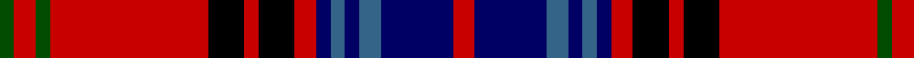

In pattern [GRGRKRKRBBBBBR](/patterns/grgrkrkrbbbbbr/).

This was sourced from register-of-tartans.  It is a [14 stripes tartan](/stripes/stripes14/).

Original link https://www.tartanregister.gov.uk/tartanDetails.aspx?ref=2169

## Attestations

This cloth appears in 2 source records; the oldest owns this page.

- 01/01/2002 — Lochcarron Dress (register-of-tartans, [record](https://www.tartanregister.gov.uk/tartanDetails.aspx?ref=2169))
- pre 2002 — Lochcarron Dress (Corporate) (tartans-authority, [record](http://www.tartansauthority.com/tartan-ferret/display/5463/))

## Register references

External register numbers recorded for this tartan.

- Scottish Register of Tartans: [2169](https://www.tartanregister.gov.uk/tartanDetails.aspx?ref=2169)
- Scottish Tartans Authority (ITI): 5463

## Thread count
G/4 R6 G4 R44 K10 R4 K10 R6 DB4 B4 DB4 B6 DB20 R/6

## Palette
Each colour and its ΔE from the base-6 reference it is a variant of.

| Colour | Shade | Base | ΔE (OKLab) |
|---|---|---|---|
| B | <code style="background-color:#346488;">#346488</code> `#346488` | B <code style="background-color:#2A418A;">#2A418A</code> | 0.11 |
| DB | <code style="background-color:#000064;">#000064</code> `#000064` | B <code style="background-color:#2A418A;">#2A418A</code> | 0.18 |
| G | <code style="background-color:#004C00;">#004C00</code> `#004C00` | G <code style="background-color:#006100;">#006100</code> | 0.07 |
| K | <code style="background-color:#000000;">#000000</code> `#000000` | K <code style="background-color:#000000;">#000000</code> | 0.00 |
| R | <code style="background-color:#C80000;">#C80000</code> `#C80000` | R <code style="background-color:#CC0000;">#CC0000</code> | 0.01 |

## Nearest tartans

The nearest existing variants by ΔTartan distance.

1. [Golfers](/setts/s10/y4r2k9r25k3r2k3r4b15w3~b304080-k000000-rc00000-we0e0e0-yd08010~x2/) — ΔT 0.92
1. [Golfing Stewart (Fashion)](/setts/s10/y4r2k9r25k3r2k3r4b15w3~b2c2c80-k101010-rc80000-wfcfcfc-ye8c000~x2/) — ΔT 1.08
1. [Royal & Ancient/Golfing Stewart](/setts/s10/y4r2k9r25k3r2k3r4b15w3~b2c2c80-k101010-rc80000-wffffff-ye8c000~x2/) — ΔT 1.08
1. [Cameron of Locheil](/setts/s13/k3r4b2r20b20r2g2r6g10r6w2r3k2~b304080-g008000-k000000-rc00000-we0e0e0~x2/) — ΔT 1.12
1. [First Special Service Force](/setts/s13/r8k14r6y6r34k10r6w6r6k64r44b9r6~b2c2c80-k101010-rc80000-we0e0e0-yfccc00/) — ΔT 1.17
1. [Hueg Scottish Blue Thistle (Personal](/setts/s15/r2g4k2b25g4b4y2b2w2b5g3r7k2r3w2~b440044-g006818-k101010-rc80000-we8ccb8-ybc8c00~x2/) — ΔT 1.17
1. [Clifford](/setts/s13/b10k3g3k8r9g3r10ba3r28g3k3w3k3~b102040-ba8080d0-g008000-k000000-r802040-we0e0e0~x2/) — ΔT 1.20
1. [Cameron of Locheil (Bonner collection)](/setts/s13/k3r4b2r20b20r2g2r6g10r6w2r3k2~b2c4084-g005020-k101010-rdc0000-we0e0e0~x2/) — ΔT 1.25
1. [Castle Stewart (District)](/setts/s9/y7k3b4k3r21k2r4k2w4~b2c2c80-k101010-r880000-we0e0e0-yd87c00~x2/) — ΔT 1.27
1. [Hepburn](/setts/s12/r21b4k5y2k2y2k2r7g4r2b3y2~b304080-g008000-k000000-rc00000-yf0c000~x2/) — ΔT 1.30

## Neighbour map

Every grey dot is one of 15726 variants placed by the first two principal components of the ΔTartan feature space (44% of its variance). Red is this tartan; blue dots are its nearest — click one to open its page.

<svg viewBox="0 0 640 380" role="img" style="max-width:100%;height:auto;border:1px solid #e0e0e0;border-radius:4px;display:block" xmlns="http://www.w3.org/2000/svg"><image href="/nn/cloud.v1.png" width="640" height="380"/><a href="/setts/s10/y4r2k9r25k3r2k3r4b15w3~b304080-k000000-rc00000-we0e0e0-yd08010~x2/"><circle cx="217.0" cy="131.7" r="4" fill="#3465a4"><title>Golfers</title></circle></a><a href="/setts/s10/y4r2k9r25k3r2k3r4b15w3~b2c2c80-k101010-rc80000-wfcfcfc-ye8c000~x2/"><circle cx="222.0" cy="131.3" r="4" fill="#3465a4"><title>Golfing Stewart (Fashion)</title></circle></a><a href="/setts/s10/y4r2k9r25k3r2k3r4b15w3~b2c2c80-k101010-rc80000-wffffff-ye8c000~x2/"><circle cx="221.7" cy="131.2" r="4" fill="#3465a4"><title>Royal &amp; Ancient/Golfing Stewart</title></circle></a><a href="/setts/s13/k3r4b2r20b20r2g2r6g10r6w2r3k2~b304080-g008000-k000000-rc00000-we0e0e0~x2/"><circle cx="238.5" cy="138.4" r="4" fill="#3465a4"><title>Cameron of Locheil</title></circle></a><a href="/setts/s13/r8k14r6y6r34k10r6w6r6k64r44b9r6~b2c2c80-k101010-rc80000-we0e0e0-yfccc00/"><circle cx="266.9" cy="130.4" r="4" fill="#3465a4"><title>First Special Service Force</title></circle></a><a href="/setts/s15/r2g4k2b25g4b4y2b2w2b5g3r7k2r3w2~b440044-g006818-k101010-rc80000-we8ccb8-ybc8c00~x2/"><circle cx="246.1" cy="98.9" r="4" fill="#3465a4"><title>Hueg Scottish Blue Thistle (Personal</title></circle></a><a href="/setts/s13/b10k3g3k8r9g3r10ba3r28g3k3w3k3~b102040-ba8080d0-g008000-k000000-r802040-we0e0e0~x2/"><circle cx="216.6" cy="130.5" r="4" fill="#3465a4"><title>Clifford</title></circle></a><a href="/setts/s13/k3r4b2r20b20r2g2r6g10r6w2r3k2~b2c4084-g005020-k101010-rdc0000-we0e0e0~x2/"><circle cx="244.6" cy="137.6" r="4" fill="#3465a4"><title>Cameron of Locheil (Bonner collection)</title></circle></a><a href="/setts/s9/y7k3b4k3r21k2r4k2w4~b2c2c80-k101010-r880000-we0e0e0-yd87c00~x2/"><circle cx="237.5" cy="148.0" r="4" fill="#3465a4"><title>Castle Stewart (District)</title></circle></a><a href="/setts/s12/r21b4k5y2k2y2k2r7g4r2b3y2~b304080-g008000-k000000-rc00000-yf0c000~x2/"><circle cx="242.5" cy="122.5" r="4" fill="#3465a4"><title>Hepburn</title></circle></a><circle cx="228.9" cy="121.3" r="5" fill="#c00000"/></svg>

ID: /setts/s14/r3b10ba3b2ba2b2r3k5r2k5r22g2r3g2~b000064-ba346488-g004c00-k000000-rc80000~x2/
