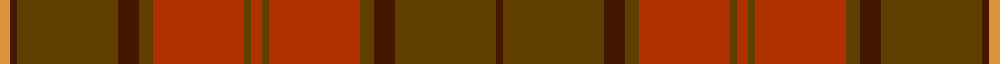

In pattern [BGBGRGRGRGBGBY](/stripes/bgbgrgrgrgbgby/).

This was sourced from register-of-tartans.  It is a [14 stripe tartan](/stripes/stripes14/).

Original link https://www.tartanregister.gov.uk/tartanDetails.aspx?ref=1804

## Register references

External register numbers recorded for this tartan.

- Scottish Register of Tartans: [1804](https://www.tartanregister.gov.uk/tartanDetails.aspx?ref=1804)
- Scottish Tartans Authority (ITI): 3830
- Scottish Tartans World Register: 2914

## Thread count
O/6 DR4 T58 DR12 Ta8 R52 Ta4 R6 Ta4 R52 Ta8 DR12 T58 DR/4

## Palette
Each colour and the base-6 reference it is a variant of.

| Colour | Shade | Base |
|---|---|---|
| DR | <code style="background-color:#441800;">#441800</code> `oklch(27.3% 0.076 46.3)` <small>#441800</small> | B <code style="background-color:#2A418A;">#2A418A</code> |
| O | <code style="background-color:#DC943C;">#DC943C</code> `oklch(72.3% 0.133 67.9)` <small>#DC943C</small> | Y <code style="background-color:#F2BF00;">#F2BF00</code> |
| R | <code style="background-color:#B03000;">#B03000</code> `oklch(50.3% 0.171 36.3)` <small>#B03000</small> | R <code style="background-color:#CC0000;">#CC0000</code> |
| T | <code style="background-color:#604000;">#604000</code> `oklch(39.8% 0.083 76.8)` <small>#604000</small> | G <code style="background-color:#006100;">#006100</code> |
| Ta | <code style="background-color:#604000;">#604000</code> `oklch(39.8% 0.083 76.8)` <small>#604000</small> | G <code style="background-color:#006100;">#006100</code> |

## Nearest tartans

The nearest existing variants by ΔTartan distance, with this tartan at the top so the swatches line up against it.

ΔTartan

Tartan

Sett

—

<a href="/ttd/edit/#slug=r3dy2r26dy4do6dy29do2lo3~x2">Hyland Day (Personal)</a> <a class="nn-out" href="/setts/s14/r3dy2r26dy4do6dy29do2lo3~x2/" title="open its dictionary page">↗</a>

1.26

<a href="/ttd/edit/#slug=r3dy2r26dy4do6dy29do2lo3~x2">Hyland Day (Personal)</a> <a class="nn-out" href="/setts/s8/r3dy2r26dy4do6dy29do2lo3~x2/" title="open its dictionary page">↗</a>

1.56

<a href="/ttd/edit/#slug=y4r18dy2r2dy5k2dy15r1y4~x2">Redwoods</a> <a class="nn-out" href="/setts/s9/y4r18dy2r2dy5k2dy15r1y4~x2/" title="open its dictionary page">↗</a>

1.67

<a href="/ttd/edit/#slug=do22y26r4y26do22dy3do3dy3do3dy31do3dy3do3dy3~x2">Devarr</a> <a class="nn-out" href="/setts/s14/do22y26r4y26do22dy3do3dy3do3dy31do3dy3do3dy3~x2/" title="open its dictionary page">↗</a>

1.91

<a href="/ttd/edit/#slug=do10y24r3y3r24dg3y6do6~x2">Earle's Flame (Fashion)</a> <a class="nn-out" href="/setts/s8/do10y24r3y3r24dg3y6do6~x2/" title="open its dictionary page">↗</a>

1.97

<a href="/ttd/edit/#slug=dg3r15dg2r2dg2r2dg18do2dg2do2dg2do27k2do2k6k2~x2">Strathmore District Tartan Tartan Number: 10118. Earliest known date: 20/11/2009 The name 'Strathmore' means the big valley and its fertile lands have made this area lying between the Grampians to the North and the Sidlaws to the South one the wealthiest farming areas in Scotland. The tartan is thus influenced by the brown and black of the rich soil, the green of the pastures, the red for the abundance of soft fruit grown and the gold to represent its prosperity. See products available Copyright © Blair Urquhart, Comrie, 2015</a> <a class="nn-out" href="/setts/s16/dg3r15dg2r2dg2r2dg18do2dg2do2dg2do27k2do2k6k2~x2/" title="open its dictionary page">↗</a>

2.02

<a href="/setts/s12/y23o4dy6g6y4lb1y4~x4/">Tricor</a>

2.09

<a href="/ttd/edit/#slug=r8y1r1y1r1y25n1y1n1y1n25o7lo6~x2">Johansson (Personal)</a> <a class="nn-out" href="/setts/s13/r8y1r1y1r1y25n1y1n1y1n25o7lo6~x2/" title="open its dictionary page">↗</a>

2.09

<a href="/ttd/edit/#slug=dg3r15dg2r2dg2r2dg18do2dg2do2dg2do27k2do2k6lo2~x2">Strathmore</a> <a class="nn-out" href="/setts/s16/dg3r15dg2r2dg2r2dg18do2dg2do2dg2do27k2do2k6lo2~x2/" title="open its dictionary page">↗</a>

2.10

<a href="/ttd/edit/#slug=dy31do3dy3do3dy3do22y26r4~x2">Devarr (Fashion)</a> <a class="nn-out" href="/setts/s8/dy31do3dy3do3dy3do22y26r4~x2/" title="open its dictionary page">↗</a>

2.13

<a href="/ttd/edit/#slug=o8y1o1y1o1y25dt1y1dt1y1dt25y7lo6~x2">Johansson (Aneby, Sweden), Christian (Personal)</a> <a class="nn-out" href="/setts/s13/o8y1o1y1o1y25dt1y1dt1y1dt25y7lo6~x2/" title="open its dictionary page">↗</a>

## Neighbour map

Every grey dot is one of 14299 variants placed by the first two principal components of the ΔTartan feature space (44% of its variance). Red is this tartan; blue dots are its nearest — click one to open its page.

<svg viewBox="0 0 640 380" role="img" style="max-width:100%;height:auto;border:1px solid #e0e0e0;border-radius:4px;display:block" xmlns="http://www.w3.org/2000/svg"><image href="/nn/cloud.v1.png" width="640" height="380"/><a href="/setts/s8/r3dy2r26dy4do6dy29do2lo3~x2/"><circle cx="341.9" cy="198.8" r="4" fill="#3465a4"><title>Hyland Day (Personal)</title></circle></a><a href="/setts/s9/y4r18dy2r2dy5k2dy15r1y4~x2/"><circle cx="412.1" cy="233.4" r="4" fill="#3465a4"><title>Redwoods</title></circle></a><a href="/setts/s14/do22y26r4y26do22dy3do3dy3do3dy31do3dy3do3dy3~x2/"><circle cx="330.0" cy="232.3" r="4" fill="#3465a4"><title>Devarr</title></circle></a><a href="/setts/s8/do10y24r3y3r24dg3y6do6~x2/"><circle cx="341.6" cy="261.5" r="4" fill="#3465a4"><title>Earle's Flame (Fashion)</title></circle></a><a href="/setts/s16/dg3r15dg2r2dg2r2dg18do2dg2do2dg2do27k2do2k6k2~x2/"><circle cx="300.3" cy="166.9" r="4" fill="#3465a4"><title>Strathmore District Tartan Tartan Number: 10118. Earliest known date: 20/11/2009 The name 'Strathmore' means the big valley and its fertile lands have made this area lying between the Grampians to the North and the Sidlaws to the South one the wealthiest farming areas in Scotland. The tartan is thus influenced by the brown and black of the rich soil, the green of the pastures, the red for the abundance of soft fruit grown and the gold to represent its prosperity. See products available Copyright © Blair Urquhart, Comrie, 2015</title></circle></a><a href="/setts/s12/y23o4dy6g6y4lb1y4~x4/"><circle cx="385.0" cy="190.5" r="4" fill="#3465a4"><title>Tricor</title></circle></a><a href="/setts/s13/r8y1r1y1r1y25n1y1n1y1n25o7lo6~x2/"><circle cx="348.6" cy="157.8" r="4" fill="#3465a4"><title>Johansson (Personal)</title></circle></a><a href="/setts/s16/dg3r15dg2r2dg2r2dg18do2dg2do2dg2do27k2do2k6lo2~x2/"><circle cx="277.5" cy="153.9" r="4" fill="#3465a4"><title>Strathmore</title></circle></a><a href="/setts/s8/dy31do3dy3do3dy3do22y26r4~x2/"><circle cx="364.3" cy="266.0" r="4" fill="#3465a4"><title>Devarr (Fashion)</title></circle></a><a href="/setts/s13/o8y1o1y1o1y25dt1y1dt1y1dt25y7lo6~x2/"><circle cx="340.4" cy="152.9" r="4" fill="#3465a4"><title>Johansson (Aneby, Sweden), Christian (Personal)</title></circle></a><circle cx="348.8" cy="187.6" r="5" fill="#c00000"/></svg>

ID: /setts/s14/r3dy2r26dy4do6dy29do2lo3~x2/
