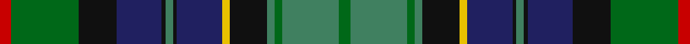

In pattern [GGGGKYBKGKBKGR](/stripes/ggggkybkgkbkgr/).

This was sourced from register-of-tartans.  It is a [14 stripe tartan](/stripes/stripes14/).

Original link https://www.tartanregister.gov.uk/tartanDetails.aspx?ref=2089

## Attestations

This cloth appears in 2 source records; the oldest owns this page.

- 01/01/1997 — Leinster (register-of-tartans, [record](https://www.tartanregister.gov.uk/tartanDetails.aspx?ref=2089))
- 1997 — Leinster (District) (tartans-authority, [record](http://www.tartansauthority.com/tartan-ferret/display/4062/))

## Register references

External register numbers recorded for this tartan.

- Scottish Register of Tartans: [2089](https://www.tartanregister.gov.uk/tartanDetails.aspx?ref=2089)
- Scottish Tartans Authority (ITI): 4062

## Thread count
R/6 Ga36 K20 DB24 K2 G4 K2 DB24 Y4 K20 G4 Ga4 G30 Ga/6

## Palette
Each colour and the base-6 reference it is a variant of.

| Colour | Shade | Base |
|---|---|---|
| DB | <code style="background-color:#202060;">#202060</code> `oklch(28.9% 0.111 276.9)` <small>#202060</small> | B <code style="background-color:#2A418A;">#2A418A</code> |
| G | <code style="background-color:#408060;">#408060</code> `oklch(54.8% 0.084 160.1)` <small>#408060</small> | G <code style="background-color:#006100;">#006100</code> |
| Ga | <code style="background-color:#006818;">#006818</code> `oklch(45.0% 0.142 145.0)` <small>#006818</small> | G <code style="background-color:#006100;">#006100</code> |
| K | <code style="background-color:#101010;">#101010</code> `oklch(17.3% 0.000 89.9)` <small>#101010</small> | K <code style="background-color:#000000;">#000000</code> |
| R | <code style="background-color:#C80000;">#C80000</code> `oklch(52.3% 0.215 29.2)` <small>#C80000</small> | R <code style="background-color:#CC0000;">#CC0000</code> |
| Y | <code style="background-color:#E8C000;">#E8C000</code> `oklch(81.9% 0.168 93.7)` <small>#E8C000</small> | Y <code style="background-color:#F2BF00;">#F2BF00</code> |

## Nearest tartans

The nearest existing variants by ΔTartan distance.

1. [Paget Family Tartan Tartan Number: 2072. Earliest known date: 1992 Designed as a 'Family' tartan and woven by Peter MacDonald in Crieff. See products available Copyright © Blair Urquhart, Comrie, 2015](/setts/s14/r3g4g2g10k18g2db18g3db18g2k18g16w1r3~x2/) — ΔT 0.87
1. [Gordon #3](/setts/s16/db14w1dg8w1dg16t6w1db14w1dg14t6dg6r8dg6r8dg1~x2/) — ΔT 0.92
1. [Bruntsfield Links Golfing Soc. (Corp](/setts/s11/r6g22dg8g4dg12g2dg18db8t12db35ly4/) — ΔT 1.00
1. [Gordon 1](/setts/s16/db14w1g8w1dg16t6w1db14w1g14t6g6r8dg6r8dg1~x2/) — ΔT 1.00
1. [Clack (Personal)](/setts/s13/db4g17dg1db2k6g2dg12g2k6db2dg1db18w2~x2/) — ΔT 1.04
1. [Les Cercles de Fermieres du Quebec](/setts/s17/dy16k4dy8g2dg19w2g22db15k4w3dg3ly4g30db25w5dg40db16~x2/) — ΔT 1.09
1. [Humble, Gordon (Personal)](/setts/s14/o4dy2o14dy4o4p1k8dg13ly3dg13k8dy10k3dy3~x2/) — ΔT 1.12
1. [Whitson](/setts/s16/lb4k1y19lo1k19n13r2n4r2~x4/) — ΔT 1.13
1. [Whitson (Name)](/setts/s9/lb4k1y19lo1k19n13r2n4r2~x4/) — ΔT 1.18
1. [Redgate Hunting #2 (Name)](/setts/s15/dy5k2b6lb1b6k2dy7k16y7k2r4y2r4k2y4~x2/) — ΔT 1.18

## Neighbour map

Every grey dot is one of 14299 variants placed by the first two principal components of the ΔTartan feature space (44% of its variance). Red is this tartan; blue dots are its nearest — click one to open its page.

<svg viewBox="0 0 640 380" role="img" style="max-width:100%;height:auto;border:1px solid #e0e0e0;border-radius:4px;display:block" xmlns="http://www.w3.org/2000/svg"><image href="/nn/cloud.v1.png" width="640" height="380"/><a href="/setts/s14/r3g4g2g10k18g2db18g3db18g2k18g16w1r3~x2/"><circle cx="167.1" cy="143.2" r="4" fill="#3465a4"><title>Paget Family Tartan Tartan Number: 2072. Earliest known date: 1992 Designed as a 'Family' tartan and woven by Peter MacDonald in Crieff. See products available Copyright © Blair Urquhart, Comrie, 2015</title></circle></a><a href="/setts/s16/db14w1dg8w1dg16t6w1db14w1dg14t6dg6r8dg6r8dg1~x2/"><circle cx="87.9" cy="136.7" r="4" fill="#3465a4"><title>Gordon #3</title></circle></a><a href="/setts/s11/r6g22dg8g4dg12g2dg18db8t12db35ly4/"><circle cx="131.6" cy="145.7" r="4" fill="#3465a4"><title>Bruntsfield Links Golfing Soc. (Corp</title></circle></a><a href="/setts/s16/db14w1g8w1dg16t6w1db14w1g14t6g6r8dg6r8dg1~x2/"><circle cx="81.2" cy="133.3" r="4" fill="#3465a4"><title>Gordon 1</title></circle></a><a href="/setts/s13/db4g17dg1db2k6g2dg12g2k6db2dg1db18w2~x2/"><circle cx="161.2" cy="141.2" r="4" fill="#3465a4"><title>Clack (Personal)</title></circle></a><a href="/setts/s17/dy16k4dy8g2dg19w2g22db15k4w3dg3ly4g30db25w5dg40db16~x2/"><circle cx="117.2" cy="113.7" r="4" fill="#3465a4"><title>Les Cercles de Fermieres du Quebec</title></circle></a><a href="/setts/s14/o4dy2o14dy4o4p1k8dg13ly3dg13k8dy10k3dy3~x2/"><circle cx="105.0" cy="154.7" r="4" fill="#3465a4"><title>Humble, Gordon (Personal)</title></circle></a><a href="/setts/s16/lb4k1y19lo1k19n13r2n4r2~x4/"><circle cx="187.1" cy="132.9" r="4" fill="#3465a4"><title>Whitson</title></circle></a><a href="/setts/s9/lb4k1y19lo1k19n13r2n4r2~x4/"><circle cx="175.7" cy="145.3" r="4" fill="#3465a4"><title>Whitson (Name)</title></circle></a><a href="/setts/s15/dy5k2b6lb1b6k2dy7k16y7k2r4y2r4k2y4~x2/"><circle cx="141.5" cy="141.7" r="4" fill="#3465a4"><title>Redgate Hunting #2 (Name)</title></circle></a><circle cx="119.0" cy="135.8" r="5" fill="#c00000"/></svg>

ID: /setts/s14/r3g18k10db12k1g2k1db12ly2k10g2g2g15g3~x2/
