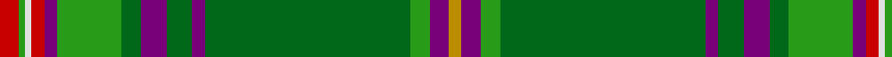

**Bands:** [RGWRBGGBGBGGBY](/stripes/rgwrbggbgbggby/) · **Stripes:** [R G W R DP G G DP G DP G G DP LO](/stripes/stripes14/) R G W R DP G G DP G DP G G DP LO

This was sourced from tartans-authority.  It is a [14 band tartan](/bands/bands14/).

Original link http://www.tartansauthority.com/tartan-ferret/display/6901/

## Thread count
R/6 G2 LN2 R4 P4 G20 Ga6 P8 Ga8 P4 Ga64 G6 P6 DY/4

## Palette
Each colour and its ΔE from the base-6 reference it is a variant of.

| Colour | Shade | Base | ΔE (OKLab) |
|---|---|---|---|
| DY | <code style="background-color:#BC8C00;">#BC8C00</code> `#BC8C00` | Y <code style="background-color:#F2BF00;">#F2BF00</code> | 0.16 |
| G | <code style="background-color:#289C18;">#289C18</code> `#289C18` | G <code style="background-color:#006100;">#006100</code> | 0.19 |
| Ga | <code style="background-color:#006818;">#006818</code> `#006818` | G <code style="background-color:#006100;">#006100</code> | 0.02 |
| LN | <code style="background-color:#E0E0E0;">#E0E0E0</code> `#E0E0E0` | W <code style="background-color:#F7F7F7;">#F7F7F7</code> | 0.07 |
| P | <code style="background-color:#780078;">#780078</code> `#780078` | B <code style="background-color:#2A418A;">#2A418A</code> | 0.17 |
| R | <code style="background-color:#C80000;">#C80000</code> `#C80000` | R <code style="background-color:#CC0000;">#CC0000</code> | 0.01 |

## Nearest tartans

The nearest existing variants by ΔTartan distance.

1. [Neumann - German Pipe Smokers (Corp)](/setts/s13/k2r3ly1dy2ly1dt16ly1g32ly1k2ly1r1k1~x2/) — ΔT 0.96
1. [Irish Diaspora](/setts/s14/b14k3b14k10g40k1g3k1w3k1o3k1g40k10~x2/) — ΔT 1.18
1. [Irish American](/setts/s13/g50dg3k3dg9db7dg2w4dg2r5dg2g8dg5ly4~x2/) — ΔT 1.25
1. [McGran (Personal)](/setts/s26/dp3g3g32dp2g4dp4g3g10dp2r2w1g1r3g1w1r2dp2g10g3dp4g4dp2g32g3dp3lo2~x2/) — ΔT 1.29
1. [Carroll O'Reed](/setts/s12/dg28b1dg4r1k1lr1k1g4r4k2r4lr2~x2/) — ΔT 1.33
1. [Gray Htg (Name)](/setts/s11/k3w1g29o8m2o2m2o2m8g7k2~x2/) — ΔT 1.34
1. [All Ireland Green](/setts/s13/g6g2r2g30lb2g4lb2dg2lb1dg20lb1g2r4~x2/) — ΔT 1.35
1. [Westmeath](/setts/s14/g11r6db6o2g3o2db6r6g36ly2o2ly2db5r5~x2/) — ΔT 1.37
1. [Gray, hunting](/setts/s11/k3w1g29y8r2y2r2y2r8g7k2~x2/) — ΔT 1.39
1. [Morgan Jocelyn . . . (Personal)](/setts/s13/g40lo2r3lb2g4lo1r18lb1g2lo1b4lb1lo3~x2/) — ΔT 1.40

## Neighbour map

Every grey dot is one of 14299 variants placed by the first two principal components of the ΔTartan feature space (44% of its variance). Red is this tartan; blue dots are its nearest — click one to open its page.

<svg viewBox="0 0 640 380" role="img" style="max-width:100%;height:auto;border:1px solid #e0e0e0;border-radius:4px;display:block" xmlns="http://www.w3.org/2000/svg"><image href="/nn/cloud.v1.png" width="640" height="380"/><a href="/setts/s13/k2r3ly1dy2ly1dt16ly1g32ly1k2ly1r1k1~x2/"><circle cx="303.7" cy="69.6" r="4" fill="#3465a4"><title>Neumann - German Pipe Smokers (Corp)</title></circle></a><a href="/setts/s14/b14k3b14k10g40k1g3k1w3k1o3k1g40k10~x2/"><circle cx="329.7" cy="90.5" r="4" fill="#3465a4"><title>Irish Diaspora</title></circle></a><a href="/setts/s13/g50dg3k3dg9db7dg2w4dg2r5dg2g8dg5ly4~x2/"><circle cx="315.4" cy="84.0" r="4" fill="#3465a4"><title>Irish American</title></circle></a><a href="/setts/s26/dp3g3g32dp2g4dp4g3g10dp2r2w1g1r3g1w1r2dp2g10g3dp4g4dp2g32g3dp3lo2~x2/"><circle cx="326.3" cy="55.8" r="4" fill="#3465a4"><title>McGran (Personal)</title></circle></a><a href="/setts/s12/dg28b1dg4r1k1lr1k1g4r4k2r4lr2~x2/"><circle cx="358.9" cy="85.1" r="4" fill="#3465a4"><title>Carroll O'Reed</title></circle></a><a href="/setts/s11/k3w1g29o8m2o2m2o2m8g7k2~x2/"><circle cx="334.9" cy="115.5" r="4" fill="#3465a4"><title>Gray Htg (Name)</title></circle></a><a href="/setts/s13/g6g2r2g30lb2g4lb2dg2lb1dg20lb1g2r4~x2/"><circle cx="296.8" cy="111.3" r="4" fill="#3465a4"><title>All Ireland Green</title></circle></a><a href="/setts/s14/g11r6db6o2g3o2db6r6g36ly2o2ly2db5r5~x2/"><circle cx="298.8" cy="119.7" r="4" fill="#3465a4"><title>Westmeath</title></circle></a><a href="/setts/s11/k3w1g29y8r2y2r2y2r8g7k2~x2/"><circle cx="312.6" cy="105.1" r="4" fill="#3465a4"><title>Gray, hunting</title></circle></a><a href="/setts/s13/g40lo2r3lb2g4lo1r18lb1g2lo1b4lb1lo3~x2/"><circle cx="373.7" cy="71.8" r="4" fill="#3465a4"><title>Morgan Jocelyn . . . (Personal)</title></circle></a><circle cx="323.0" cy="78.2" r="5" fill="#c00000"/></svg>

ID: /setts/s14/r3g1w1r2dp2g10g3dp4g4dp2g32g3dp3lo2~x2/
