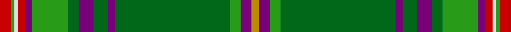

This page is one **sett** — a single exact thread-count. It belongs to the [tartan](/tartans/r3g1w1r2dp2g10gi3dp4gi4dp2gi32g3dp3lo2/)
(the same proportion at any scale), whose colour order is pattern [RGWRBGGBGBGGBY](/stripes/rgwrbggbgbggby/).

Sourced from tartans-authority.  It is a [14 stripe tartan](/stripes/stripes14/).

Original link http://www.tartansauthority.com/tartan-ferret/display/6901/

## Register references

External register numbers recorded for this tartan.

- Scottish Tartans Authority (ITI): 6901

## Thread count
R/6 G2 LN2 R4 P4 G20 Ga6 P8 Ga8 P4 Ga64 G6 P6 DY/4

## Palette

Palette: <strong>Tartan Register</strong>
<table><thead><tr><th>Colour</th><th>Threads</th><th>Shade</th><th>Base</th><th>OKLCh</th></tr></thead><tbody><tr><td>R/</td><td style="text-align:right;font-variant-numeric:tabular-nums">6</td><td><code style="background-color:#C80000;">#C80000</code> <small style="color:#888">#C80000</small></td><td>R <code style="background-color:#CC0000;">#CC0000</code></td><td><small style="color:#888">oklch(52.3% 0.215 29.2)</small></td></tr><tr><td>G</td><td style="text-align:right;font-variant-numeric:tabular-nums">2</td><td><code style="background-color:#289C18;">#289C18</code> <small style="color:#888">#289C18</small></td><td>G <code style="background-color:#006100;">#006100</code></td><td><small style="color:#888">oklch(60.6% 0.191 141.6)</small></td></tr><tr><td>LN</td><td style="text-align:right;font-variant-numeric:tabular-nums">2</td><td><code style="background-color:#E0E0E0;">#E0E0E0</code> <small style="color:#888">#E0E0E0</small></td><td>W <code style="background-color:#F7F7F7;">#F7F7F7</code></td><td><small style="color:#888">oklch(90.7% 0.000 89.9)</small></td></tr><tr><td>R</td><td style="text-align:right;font-variant-numeric:tabular-nums">4</td><td><code style="background-color:#C80000;">#C80000</code> <small style="color:#888">#C80000</small></td><td>R <code style="background-color:#CC0000;">#CC0000</code></td><td><small style="color:#888">oklch(52.3% 0.215 29.2)</small></td></tr><tr><td>P</td><td style="text-align:right;font-variant-numeric:tabular-nums">4</td><td><code style="background-color:#780078;">#780078</code> <small style="color:#888">#780078</small></td><td>B <code style="background-color:#2A418A;">#2A418A</code></td><td><small style="color:#888">oklch(40.2% 0.185 328.4)</small></td></tr><tr><td>G</td><td style="text-align:right;font-variant-numeric:tabular-nums">20</td><td><code style="background-color:#289C18;">#289C18</code> <small style="color:#888">#289C18</small></td><td>G <code style="background-color:#006100;">#006100</code></td><td><small style="color:#888">oklch(60.6% 0.191 141.6)</small></td></tr><tr><td>Ga</td><td style="text-align:right;font-variant-numeric:tabular-nums">6</td><td><code style="background-color:#006818;">#006818</code> <small style="color:#888">#006818</small></td><td>G <code style="background-color:#006100;">#006100</code></td><td><small style="color:#888">oklch(45.0% 0.142 145.0)</small></td></tr><tr><td>P</td><td style="text-align:right;font-variant-numeric:tabular-nums">8</td><td><code style="background-color:#780078;">#780078</code> <small style="color:#888">#780078</small></td><td>B <code style="background-color:#2A418A;">#2A418A</code></td><td><small style="color:#888">oklch(40.2% 0.185 328.4)</small></td></tr><tr><td>Ga</td><td style="text-align:right;font-variant-numeric:tabular-nums">8</td><td><code style="background-color:#006818;">#006818</code> <small style="color:#888">#006818</small></td><td>G <code style="background-color:#006100;">#006100</code></td><td><small style="color:#888">oklch(45.0% 0.142 145.0)</small></td></tr><tr><td>P</td><td style="text-align:right;font-variant-numeric:tabular-nums">4</td><td><code style="background-color:#780078;">#780078</code> <small style="color:#888">#780078</small></td><td>B <code style="background-color:#2A418A;">#2A418A</code></td><td><small style="color:#888">oklch(40.2% 0.185 328.4)</small></td></tr><tr><td>Ga</td><td style="text-align:right;font-variant-numeric:tabular-nums">64</td><td><code style="background-color:#006818;">#006818</code> <small style="color:#888">#006818</small></td><td>G <code style="background-color:#006100;">#006100</code></td><td><small style="color:#888">oklch(45.0% 0.142 145.0)</small></td></tr><tr><td>G</td><td style="text-align:right;font-variant-numeric:tabular-nums">6</td><td><code style="background-color:#289C18;">#289C18</code> <small style="color:#888">#289C18</small></td><td>G <code style="background-color:#006100;">#006100</code></td><td><small style="color:#888">oklch(60.6% 0.191 141.6)</small></td></tr><tr><td>P</td><td style="text-align:right;font-variant-numeric:tabular-nums">6</td><td><code style="background-color:#780078;">#780078</code> <small style="color:#888">#780078</small></td><td>B <code style="background-color:#2A418A;">#2A418A</code></td><td><small style="color:#888">oklch(40.2% 0.185 328.4)</small></td></tr><tr><td>DY/</td><td style="text-align:right;font-variant-numeric:tabular-nums">4</td><td><code style="background-color:#BC8C00;">#BC8C00</code> <small style="color:#888">#BC8C00</small></td><td>Y <code style="background-color:#F2BF00;">#F2BF00</code></td><td><small style="color:#888">oklch(66.8% 0.137 84.1)</small></td></tr></tbody></table>

## Nearest tartans

The nearest existing variants by ΔTartan distance, with this tartan at the top so the swatches line up against it.

ΔTartan

Tartan

Sett

—

<a href="/ttd/edit/#slug=r3g1w1r2dp2g10gi3dp4gi4dp2gi32g3dp3lo2~x2">McGran (Personal)</a> <a class="nn-out" href="/setts/s14/r3g1w1r2dp2g10gi3dp4gi4dp2gi32g3dp3lo2~x2/" title="open its dictionary page">↗</a>

0.96

<a href="/ttd/edit/#slug=k2r3ly1dy2ly1dt16ly1g32ly1k2ly1r1k1~x2">Neumann - German Pipe Smokers (Corp)</a> <a class="nn-out" href="/setts/s13/k2r3ly1dy2ly1dt16ly1g32ly1k2ly1r1k1~x2/" title="open its dictionary page">↗</a>

1.18

<a href="/ttd/edit/#slug=b14k3b14k10gi40k1g3k1w3k1o3k1gi40k10~x2">Irish Diaspora</a> <a class="nn-out" href="/setts/s14/b14k3b14k10gi40k1g3k1w3k1o3k1gi40k10~x2/" title="open its dictionary page">↗</a>

1.25

<a href="/ttd/edit/#slug=g50dg3k3dg9db7dg2w4dg2r5dg2g8dg5ly4~x2">Irish American</a> <a class="nn-out" href="/setts/s13/g50dg3k3dg9db7dg2w4dg2r5dg2g8dg5ly4~x2/" title="open its dictionary page">↗</a>

1.29

<a href="/ttd/edit/#slug=dp3g3gi32dp2gi4dp4gi3g10dp2r2w1g1r3g1w1r2dp2g10gi3dp4gi4dp2gi32g3dp3lo2~x2">McGran (Personal)</a> <a class="nn-out" href="/setts/s26/dp3g3gi32dp2gi4dp4gi3g10dp2r2w1g1r3g1w1r2dp2g10gi3dp4gi4dp2gi32g3dp3lo2~x2/" title="open its dictionary page">↗</a>

1.33

<a href="/ttd/edit/#slug=dg28b1dg4r1k1lr1k1g4r4k2r4lr2~x2">Carroll O'Reed</a> <a class="nn-out" href="/setts/s12/dg28b1dg4r1k1lr1k1g4r4k2r4lr2~x2/" title="open its dictionary page">↗</a>

1.34

<a href="/ttd/edit/#slug=k3w1g29o8m2o2m2o2m8g7k2~x2">Gray Htg (Name)</a> <a class="nn-out" href="/setts/s11/k3w1g29o8m2o2m2o2m8g7k2~x2/" title="open its dictionary page">↗</a>

1.35

<a href="/ttd/edit/#slug=gi6g2r2gi30lb2g4lb2dg2lb1dg20lb1g2r4~x2">All Ireland Green</a> <a class="nn-out" href="/setts/s13/gi6g2r2gi30lb2g4lb2dg2lb1dg20lb1g2r4~x2/" title="open its dictionary page">↗</a>

1.36

<a href="/ttd/edit/#slug=g11r6db6o2g3o2db6r6g36ly2o2ly2db5r5~x2">Westmeath</a> <a class="nn-out" href="/setts/s14/g11r6db6o2g3o2db6r6g36ly2o2ly2db5r5~x2/" title="open its dictionary page">↗</a>

1.38

<a href="/ttd/edit/#slug=k3w1g29y8r2y2r2y2r8g7k2~x2">Gray, hunting</a> <a class="nn-out" href="/setts/s11/k3w1g29y8r2y2r2y2r8g7k2~x2/" title="open its dictionary page">↗</a>

1.39

<a href="/ttd/edit/#slug=g40lo2r3lb2g4lo1r18lb1g2lo1b4lb1lo3~x2">Morgan Jocelyn . . . (Personal)</a> <a class="nn-out" href="/setts/s13/g40lo2r3lb2g4lo1r18lb1g2lo1b4lb1lo3~x2/" title="open its dictionary page">↗</a>

## Neighbour map

Every grey dot is one of 14359 variants placed by the first two principal components of the ΔTartan feature space (44% of its variance). Red is this tartan; blue dots are its nearest — click one to open its page.

<svg viewBox="0 0 640 380" role="img" style="max-width:100%;height:auto;border:1px solid #e0e0e0;border-radius:4px;display:block" xmlns="http://www.w3.org/2000/svg"><image href="/nn/cloud.v1.png" width="640" height="380"/><a href="/setts/s13/k2r3ly1dy2ly1dt16ly1g32ly1k2ly1r1k1~x2/"><circle cx="303.2" cy="69.6" r="4" fill="#3465a4"><title>Neumann - German Pipe Smokers (Corp)</title></circle></a><a href="/setts/s14/b14k3b14k10gi40k1g3k1w3k1o3k1gi40k10~x2/"><circle cx="329.2" cy="90.4" r="4" fill="#3465a4"><title>Irish Diaspora</title></circle></a><a href="/setts/s13/g50dg3k3dg9db7dg2w4dg2r5dg2g8dg5ly4~x2/"><circle cx="314.9" cy="83.7" r="4" fill="#3465a4"><title>Irish American</title></circle></a><a href="/setts/s26/dp3g3gi32dp2gi4dp4gi3g10dp2r2w1g1r3g1w1r2dp2g10gi3dp4gi4dp2gi32g3dp3lo2~x2/"><circle cx="325.6" cy="55.5" r="4" fill="#3465a4"><title>McGran (Personal)</title></circle></a><a href="/setts/s12/dg28b1dg4r1k1lr1k1g4r4k2r4lr2~x2/"><circle cx="358.3" cy="85.0" r="4" fill="#3465a4"><title>Carroll O'Reed</title></circle></a><a href="/setts/s11/k3w1g29o8m2o2m2o2m8g7k2~x2/"><circle cx="334.3" cy="115.6" r="4" fill="#3465a4"><title>Gray Htg (Name)</title></circle></a><a href="/setts/s13/gi6g2r2gi30lb2g4lb2dg2lb1dg20lb1g2r4~x2/"><circle cx="296.5" cy="111.3" r="4" fill="#3465a4"><title>All Ireland Green</title></circle></a><a href="/setts/s14/g11r6db6o2g3o2db6r6g36ly2o2ly2db5r5~x2/"><circle cx="298.2" cy="119.9" r="4" fill="#3465a4"><title>Westmeath</title></circle></a><a href="/setts/s11/k3w1g29y8r2y2r2y2r8g7k2~x2/"><circle cx="311.9" cy="105.3" r="4" fill="#3465a4"><title>Gray, hunting</title></circle></a><a href="/setts/s13/g40lo2r3lb2g4lo1r18lb1g2lo1b4lb1lo3~x2/"><circle cx="372.8" cy="71.6" r="4" fill="#3465a4"><title>Morgan Jocelyn . . . (Personal)</title></circle></a><circle cx="322.3" cy="78.1" r="5" fill="#c00000"/></svg>

ID: /setts/s14/r3g1w1r2dp2g10gi3dp4gi4dp2gi32g3dp3lo2~x2/
