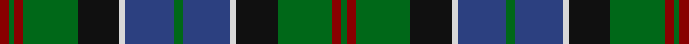

In pattern [GRGKWBGBWKGRGR](/stripes/grgkwbgbwkgrgr/).

This was sourced from house-of-tartan.  It is a [14 stripe tartan](/stripes/stripes14/).

Original link http://www.house-of-tartan.scotland.net/house/TartanViewjs.asp?colr=Def&tnam=6945

## Thread count
DR/6 G4 DR6 G36 K28 LN4 Ba32 G6 Ba32 LN4 K28 G36 DR6 G/4

## Palette
Each colour and the base-6 reference it is a variant of.

| Colour | Shade | Base |
|---|---|---|
| B | <code style="background-color:#5C8CA8;">#5C8CA8</code> `oklch(61.7% 0.067 235.0)` <small>#5C8CA8</small> | B <code style="background-color:#2A418A;">#2A418A</code> |
| Ba | <code style="background-color:#2C4080;">#2C4080</code> `oklch(39.1% 0.111 268.0)` <small>#2C4080</small> | B <code style="background-color:#2A418A;">#2A418A</code> |
| DR | <code style="background-color:#880000;">#880000</code> `oklch(39.4% 0.162 29.2)` <small>#880000</small> | R <code style="background-color:#CC0000;">#CC0000</code> |
| G | <code style="background-color:#006818;">#006818</code> `oklch(45.0% 0.142 145.0)` <small>#006818</small> | G <code style="background-color:#006100;">#006100</code> |
| K | <code style="background-color:#101010;">#101010</code> `oklch(17.3% 0.000 89.9)` <small>#101010</small> | K <code style="background-color:#000000;">#000000</code> |
| LN | <code style="background-color:#D8D8D8;">#D8D8D8</code> `oklch(88.2% 0.000 89.9)` <small>#D8D8D8</small> | W <code style="background-color:#F7F7F7;">#F7F7F7</code> |
| R | <code style="background-color:#C80000;">#C80000</code> `oklch(52.3% 0.215 29.2)` <small>#C80000</small> | R <code style="background-color:#CC0000;">#CC0000</code> |

## Nearest tartans

The nearest existing variants by ΔTartan distance, with this tartan at the top so the swatches line up against it.

ΔTartan

Tartan

Sett

—

<a href="/ttd/edit/#slug=r3g2r3g18k14w2db16g3~x2">Mantle Tartan Tartan Number: 6945. Earliest known date: 2006 A combination of Sinclair Hunting and MacQueen tartans relating to the clan associations of the the two families, Swan and Sinclair. See products available Copyright © Blair Urquhart, Comrie, 2015</a> <a class="nn-out" href="/setts/s14/r3g2r3g18k14w2db16g3~x2/" title="open its dictionary page">↗</a>

0.59

<a href="/ttd/edit/#slug=dt30k5dt5k5dt5k31dg31k3w7k3dg31k31dt31k3r7">78th Regiment (Highlanders) (Mil.)</a> <a class="nn-out" href="/setts/s15/dt30k5dt5k5dt5k31dg31k3w7k3dg31k31dt31k3r7/" title="open its dictionary page">↗</a>

0.60

<a href="/ttd/edit/#slug=r2k1db8k8g8ly2g8k8db1k1db1k1db4r1~x4">Farquharson</a> <a class="nn-out" href="/setts/s14/r2k1db8k8g8ly2g8k8db1k1db1k1db4r1~x4/" title="open its dictionary page">↗</a>

0.67

<a href="/ttd/edit/#slug=r5k3db25k25g25k3w3k6w3k3g25k25db25k3g5">Stephenson Hunting Tartan Tartan Number: 770. Earliest known date: 1981 Based on an old and un-named sett in the records of Messrs Bolingbroke and Jones of Norwich, prior to 1870. See products available Copyright © Blair Urquhart, Comrie, 2015</a> <a class="nn-out" href="/setts/s15/r5k3db25k25g25k3w3k6w3k3g25k25db25k3g5/" title="open its dictionary page">↗</a>

0.69

<a href="/setts/s16/db20ly3k7g11k2g3k2g3r4~x2/">Ogilvie of Inverarity (Wilson) / Ochterlonie</a>

0.74

<a href="/ttd/edit/#slug=db9k1db1k1db1k7dg8ly2dg8k7db8k1r2~x2">MacLeod of Gesto</a> <a class="nn-out" href="/setts/s13/db9k1db1k1db1k7dg8ly2dg8k7db8k1r2~x2/" title="open its dictionary page">↗</a>

0.74

<a href="/ttd/edit/#slug=db28k4db4k4db4k28g27k3ly5k3g27k28db27k3r5~x2">Baillie (William Wilson)</a> <a class="nn-out" href="/setts/s15/db28k4db4k4db4k28g27k3ly5k3g27k28db27k3r5~x2/" title="open its dictionary page">↗</a>

0.76

<a href="/ttd/edit/#slug=g26k4g6m4g6k26db26k3w7k3db26k26g26k3m7~x2">MacRae Hunting (Wilsons)</a> <a class="nn-out" href="/setts/s15/g26k4g6m4g6k26db26k3w7k3db26k26g26k3m7~x2/" title="open its dictionary page">↗</a>

0.78

<a href="/ttd/edit/#slug=db18k5dg3r3dg6k2ly2k2dg6r3dg3k10db5k10">MacClellan</a> <a class="nn-out" href="/setts/s14/db18k5dg3r3dg6k2ly2k2dg6r3dg3k10db5k10/" title="open its dictionary page">↗</a>

0.78

<a href="/ttd/edit/#slug=ly3k1g10k7db10g2db2g2db10k7g10k1lg3~x2">Doon Valley Crafters (Corporate)</a> <a class="nn-out" href="/setts/s13/ly3k1g10k7db10g2db2g2db10k7g10k1lg3~x2/" title="open its dictionary page">↗</a>

0.78

<a href="/ttd/edit/#slug=dg26k4dg6r4dg6k26db26k3w7k3db26k26dg26k3r7~x2">MacRae Htg - 1820 (Wilsons)</a> <a class="nn-out" href="/setts/s15/dg26k4dg6r4dg6k26db26k3w7k3db26k26dg26k3r7~x2/" title="open its dictionary page">↗</a>

## Neighbour map

Every grey dot is one of 14299 variants placed by the first two principal components of the ΔTartan feature space (44% of its variance). Red is this tartan; blue dots are its nearest — click one to open its page.

<svg viewBox="0 0 640 380" role="img" style="max-width:100%;height:auto;border:1px solid #e0e0e0;border-radius:4px;display:block" xmlns="http://www.w3.org/2000/svg"><image href="/nn/cloud.v1.png" width="640" height="380"/><a href="/setts/s15/dt30k5dt5k5dt5k31dg31k3w7k3dg31k31dt31k3r7/"><circle cx="182.5" cy="176.8" r="4" fill="#3465a4"><title>78th Regiment (Highlanders) (Mil.)</title></circle></a><a href="/setts/s14/r2k1db8k8g8ly2g8k8db1k1db1k1db4r1~x4/"><circle cx="148.3" cy="178.5" r="4" fill="#3465a4"><title>Farquharson</title></circle></a><a href="/setts/s15/r5k3db25k25g25k3w3k6w3k3g25k25db25k3g5/"><circle cx="163.9" cy="175.0" r="4" fill="#3465a4"><title>Stephenson Hunting Tartan Tartan Number: 770. Earliest known date: 1981 Based on an old and un-named sett in the records of Messrs Bolingbroke and Jones of Norwich, prior to 1870. See products available Copyright © Blair Urquhart, Comrie, 2015</title></circle></a><a href="/setts/s16/db20ly3k7g11k2g3k2g3r4~x2/"><circle cx="166.3" cy="157.1" r="4" fill="#3465a4"><title>Ogilvie of Inverarity (Wilson) / Ochterlonie</title></circle></a><a href="/setts/s13/db9k1db1k1db1k7dg8ly2dg8k7db8k1r2~x2/"><circle cx="166.1" cy="193.2" r="4" fill="#3465a4"><title>MacLeod of Gesto</title></circle></a><a href="/setts/s15/db28k4db4k4db4k28g27k3ly5k3g27k28db27k3r5~x2/"><circle cx="181.3" cy="175.5" r="4" fill="#3465a4"><title>Baillie (William Wilson)</title></circle></a><a href="/setts/s15/g26k4g6m4g6k26db26k3w7k3db26k26g26k3m7~x2/"><circle cx="134.2" cy="174.5" r="4" fill="#3465a4"><title>MacRae Hunting (Wilsons)</title></circle></a><a href="/setts/s14/db18k5dg3r3dg6k2ly2k2dg6r3dg3k10db5k10/"><circle cx="168.8" cy="184.9" r="4" fill="#3465a4"><title>MacClellan</title></circle></a><a href="/setts/s13/ly3k1g10k7db10g2db2g2db10k7g10k1lg3~x2/"><circle cx="142.3" cy="184.5" r="4" fill="#3465a4"><title>Doon Valley Crafters (Corporate)</title></circle></a><a href="/setts/s15/dg26k4dg6r4dg6k26db26k3w7k3db26k26dg26k3r7~x2/"><circle cx="145.4" cy="179.9" r="4" fill="#3465a4"><title>MacRae Htg - 1820 (Wilsons)</title></circle></a><circle cx="163.8" cy="179.7" r="5" fill="#c00000"/></svg>

ID: /setts/s14/r3g2r3g18k14w2db16g3~x2/
