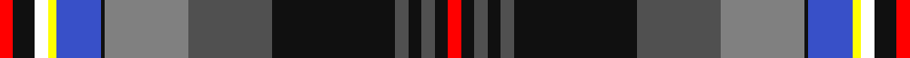

In pattern [RKBKBKBGKBYWKR](/stripes/rkbkbkbgkbywkr/).

This was sourced from register-of-tartans.  It is a [14 stripe tartan](/stripes/stripes14/).

Original link https://www.tartanregister.gov.uk/tartanDetails.aspx?ref=11466

## Register references

External register numbers recorded for this tartan.

- Scottish Register of Tartans: [11466](https://www.tartanregister.gov.uk/tartanDetails.aspx?ref=11466)

## Thread count
R/3 K5 W3 Y2 B10 K1 Na19 N19 K28 N3 K3 N3 K3 R/3

## Palette
Each colour and the base-6 reference it is a variant of.

| Colour | Shade | Base |
|---|---|---|
| B | <code style="background-color:#3850C8;">#3850C8</code> `oklch(48.8% 0.188 269.4)` <small>#3850C8</small> | B <code style="background-color:#2A418A;">#2A418A</code> |
| K | <code style="background-color:#101010;">#101010</code> `oklch(17.3% 0.000 89.9)` <small>#101010</small> | K <code style="background-color:#000000;">#000000</code> |
| N | <code style="background-color:#505050;">#505050</code> `oklch(43.1% 0.000 89.9)` <small>#505050</small> | B <code style="background-color:#2A418A;">#2A418A</code> |
| Na | <code style="background-color:#808080;">#808080</code> `oklch(60.0% 0.000 89.9)` <small>#808080</small> | G <code style="background-color:#006100;">#006100</code> |
| R | <code style="background-color:#FF0000;">#FF0000</code> `oklch(62.8% 0.258 29.2)` <small>#FF0000</small> | R <code style="background-color:#CC0000;">#CC0000</code> |
| W | <code style="background-color:#FFFFFF;">#FFFFFF</code> `oklch(100.0% 0.000 89.9)` <small>#FFFFFF</small> | W <code style="background-color:#F7F7F7;">#F7F7F7</code> |
| Y | <code style="background-color:#FFFF00;">#FFFF00</code> `oklch(96.8% 0.211 109.8)` <small>#FFFF00</small> | Y <code style="background-color:#F2BF00;">#F2BF00</code> |

## Nearest tartans

The nearest existing variants by ΔTartan distance.

1. [Robert Lee Jordan Defiance (Per.)](/setts/s14/r3w5k1dt24dp3dt4dp3dt3dp12dg3dp1dg21k1ly3~x2/) — ΔT 0.67
1. [Robert Lee Jordan Defiance (Personal)](/setts/s14/k3k1dg21dp1dg3dp12dt3dp3dt4dp3dt24k1w5r3~x2/) — ΔT 0.76
1. [Dundee Carers Centre](/setts/s11/m66db2r14db2ly5r8db12dg10dg60m4db25/) — ΔT 0.79
1. [Bethune (Personal)](/setts/s13/t2db18ly4k5ly1k1w1k2g8r6k1r3w1~x4/) — ΔT 0.94
1. [Moon (Georgia, USA)](/setts/s18/lb4k1r5k3r8dg8k1lo3k1b4k27b4k1lo3k1dg8r8k3~x2/) — ΔT 1.02
1. [Bethune](/setts/s12/b2db18ly4k5ly1k1w1k2g8k1r3w1~x4/) — ΔT 1.15
1. [Heston (Name)](/setts/s11/lo2k8db48lb9o12m3o9m3o12dg8lo2~x2/) — ΔT 1.15
1. [Anderson](/setts/s20/r4dg6r2dg6r3db4r1k4ly1k1ly1k3lr3k3b18r1k2r1b6r3~x2/) — ΔT 1.16
1. [St. Andrews Grand (Fashion)](/setts/s13/g4r1r1dg2r1r1r1r1k12g18db23w2k3~x2/) — ΔT 1.18
1. [Royal Scottish Pipe Band Association](/setts/s12/lb6k1t20r2g3r2k15r2g3r2k6k3~x2/) — ΔT 1.19

## Neighbour map

Every grey dot is one of 14299 variants placed by the first two principal components of the ΔTartan feature space (44% of its variance). Red is this tartan; blue dots are its nearest — click one to open its page.

<svg viewBox="0 0 640 380" role="img" style="max-width:100%;height:auto;border:1px solid #e0e0e0;border-radius:4px;display:block" xmlns="http://www.w3.org/2000/svg"><image href="/nn/cloud.v1.png" width="640" height="380"/><a href="/setts/s14/r3w5k1dt24dp3dt4dp3dt3dp12dg3dp1dg21k1ly3~x2/"><circle cx="160.7" cy="74.1" r="4" fill="#3465a4"><title>Robert Lee Jordan Defiance (Per.)</title></circle></a><a href="/setts/s14/k3k1dg21dp1dg3dp12dt3dp3dt4dp3dt24k1w5r3~x2/"><circle cx="164.9" cy="77.9" r="4" fill="#3465a4"><title>Robert Lee Jordan Defiance (Personal)</title></circle></a><a href="/setts/s11/m66db2r14db2ly5r8db12dg10dg60m4db25/"><circle cx="161.1" cy="66.5" r="4" fill="#3465a4"><title>Dundee Carers Centre</title></circle></a><a href="/setts/s13/t2db18ly4k5ly1k1w1k2g8r6k1r3w1~x4/"><circle cx="108.8" cy="74.5" r="4" fill="#3465a4"><title>Bethune (Personal)</title></circle></a><a href="/setts/s18/lb4k1r5k3r8dg8k1lo3k1b4k27b4k1lo3k1dg8r8k3~x2/"><circle cx="135.9" cy="56.3" r="4" fill="#3465a4"><title>Moon (Georgia, USA)</title></circle></a><a href="/setts/s12/b2db18ly4k5ly1k1w1k2g8k1r3w1~x4/"><circle cx="124.0" cy="72.4" r="4" fill="#3465a4"><title>Bethune</title></circle></a><a href="/setts/s11/lo2k8db48lb9o12m3o9m3o12dg8lo2~x2/"><circle cx="191.7" cy="82.8" r="4" fill="#3465a4"><title>Heston (Name)</title></circle></a><a href="/setts/s20/r4dg6r2dg6r3db4r1k4ly1k1ly1k3lr3k3b18r1k2r1b6r3~x2/"><circle cx="96.3" cy="69.7" r="4" fill="#3465a4"><title>Anderson</title></circle></a><a href="/setts/s13/g4r1r1dg2r1r1r1r1k12g18db23w2k3~x2/"><circle cx="163.7" cy="76.2" r="4" fill="#3465a4"><title>St. Andrews Grand (Fashion)</title></circle></a><a href="/setts/s12/lb6k1t20r2g3r2k15r2g3r2k6k3~x2/"><circle cx="136.6" cy="96.6" r="4" fill="#3465a4"><title>Royal Scottish Pipe Band Association</title></circle></a><circle cx="156.5" cy="67.0" r="5" fill="#c00000"/></svg>

ID: /setts/s14/r3k5w3ly2b10k1y19n19k28n3k3n3k3r3/
