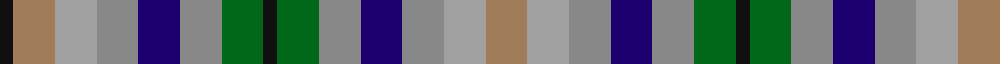

In pattern [KRYRBRGKGRBRYR](/patterns/kryrbrgkgrbryr/).

This was sourced from register-of-tartans.  It is a [14 stripes tartan](/stripes/stripes14/).

Original link https://www.tartanregister.gov.uk/tartanDetails.aspx?ref=3961

## Thread count
K/4 LT12 Na12 N12 DB12 N12 G12 K4 G12 N12 DB12 N12 Na12 LT/12

## Palette
Each colour and its ΔE from the base-6 reference it is a variant of.

| Colour | Shade | Base | ΔE (OKLab) |
|---|---|---|---|
| DB | <code style="background-color:#1C0070;">#1C0070</code> `#1C0070` | B <code style="background-color:#2A418A;">#2A418A</code> | 0.14 |
| DO | <code style="background-color:#B84C00;">#B84C00</code> `#B84C00` | R <code style="background-color:#CC0000;">#CC0000</code> | 0.08 |
| DY | <code style="background-color:#D09800;">#D09800</code> `#D09800` | Y <code style="background-color:#F2BF00;">#F2BF00</code> | 0.12 |
| G | <code style="background-color:#006818;">#006818</code> `#006818` | G <code style="background-color:#006100;">#006100</code> | 0.02 |
| K | <code style="background-color:#101010;">#101010</code> `#101010` | K <code style="background-color:#000000;">#000000</code> | 0.17 |
| LG | <code style="background-color:#C4BC68;">#C4BC68</code> `#C4BC68` | Y <code style="background-color:#F2BF00;">#F2BF00</code> | 0.08 |
| LR | <code style="background-color:#E8CCB8;">#E8CCB8</code> `#E8CCB8` | W <code style="background-color:#F7F7F7;">#F7F7F7</code> | 0.12 |
| LT | <code style="background-color:#A07C58;">#A07C58</code> `#A07C58` | R <code style="background-color:#CC0000;">#CC0000</code> | 0.19 |
| N | <code style="background-color:#888888;">#888888</code> `#888888` | R <code style="background-color:#CC0000;">#CC0000</code> | 0.24 |
| Na | <code style="background-color:#A0A0A0;">#A0A0A0</code> `#A0A0A0` | Y <code style="background-color:#F2BF00;">#F2BF00</code> | 0.21 |

## Nearest tartans

The nearest existing variants by ΔTartan distance.

1. [Stewarton (Fashion)](/setts/s8/k1g3r3b3r3y3ra3k1~b1c0070-g006818-k101010-r888888-raa07c58-ya0a0a0~x4/) — ΔT 1.34
1. [Stanners (Personal)](/setts/s13/y4k4b4k4g4w1g4w1b3r4b3r4w1~b386074-g006818-k101010-rc80000-we0e0e0-ya0a0a0~x4/) — ΔT 1.72
1. [DunBroch](/setts/s11/b4ba8k2ba5w2ba5g8bb7g2bb7g3~b483d8b-ba539dc2-bb700038-g00572b-k101010-we1cdb2~x2/) — ΔT 1.78
1. [Roscommon County Crest (Fashion)](/setts/s11/g11k5y7w5y7k5g7y11b16y7ya5~b2c2c80-g006818-k101010-we0e0e0-ya08858-yae8c000~x2/) — ΔT 1.79
1. [Redgate (Name)](/setts/s13/b10r3b10k7y5w2y5w2y5k7g10r3g7~b5c8ca8-g00643c-k101010-r880000-we0e0e0-ya08858~x2/) — ΔT 1.82
1. [Callanish, The](/setts/s13/r2y2b2g2y6ga3b3g4y2b3ga2y2r2~b383131-g6b560f-ga647052-r7c1000-ycbc1b9~x2/) — ΔT 1.84
1. [Stanners (Personal)](/setts/s13/y4k4b4k4g4w1g4w1b3r4b3r4w1~b003c64-g006818-k101010-rc80000-we0e0e0-ya0a0a0~x4/) — ΔT 1.85
1. [Scandinavian](/setts/s14/g10k6b10y4b10k3g10k3g10k3r10w4r10k6~b7098b4-g008040-k101010-rc80000-wfcfcfc-yf0c800~x2/) — ΔT 1.94
1. [Stirling Millennium](/setts/s9/w2wa1g1ga1gb1gc1g1ga1gc1~g8c7038-ga289c18-gb006818-gc003820-wc49cd8-wae0e0e0~x20/) — ΔT 1.97
1. [Belwade](/setts/s11/b4g4b4w1ba1w1r4y4w1g4r4~b2c4084-ba141e46-g007800-r781c38-wffffff-ydc943c~x4/) — ΔT 2.08

## Neighbour map

Every grey dot is one of 15726 variants placed by the first two principal components of the ΔTartan feature space (44% of its variance). Red is this tartan; blue dots are its nearest — click one to open its page.

<svg viewBox="0 0 640 380" role="img" style="max-width:100%;height:auto;border:1px solid #e0e0e0;border-radius:4px;display:block" xmlns="http://www.w3.org/2000/svg"><image href="/nn/cloud.v1.png" width="640" height="380"/><a href="/setts/s8/k1g3r3b3r3y3ra3k1~b1c0070-g006818-k101010-r888888-raa07c58-ya0a0a0~x4/"><circle cx="14.0" cy="257.6" r="4" fill="#3465a4"><title>Stewarton (Fashion)</title></circle></a><a href="/setts/s13/y4k4b4k4g4w1g4w1b3r4b3r4w1~b386074-g006818-k101010-rc80000-we0e0e0-ya0a0a0~x4/"><circle cx="14.0" cy="212.1" r="4" fill="#3465a4"><title>Stanners (Personal)</title></circle></a><a href="/setts/s11/b4ba8k2ba5w2ba5g8bb7g2bb7g3~b483d8b-ba539dc2-bb700038-g00572b-k101010-we1cdb2~x2/"><circle cx="52.7" cy="217.7" r="4" fill="#3465a4"><title>DunBroch</title></circle></a><a href="/setts/s11/g11k5y7w5y7k5g7y11b16y7ya5~b2c2c80-g006818-k101010-we0e0e0-ya08858-yae8c000~x2/"><circle cx="25.0" cy="224.5" r="4" fill="#3465a4"><title>Roscommon County Crest (Fashion)</title></circle></a><a href="/setts/s13/b10r3b10k7y5w2y5w2y5k7g10r3g7~b5c8ca8-g00643c-k101010-r880000-we0e0e0-ya08858~x2/"><circle cx="14.0" cy="197.5" r="4" fill="#3465a4"><title>Redgate (Name)</title></circle></a><a href="/setts/s13/r2y2b2g2y6ga3b3g4y2b3ga2y2r2~b383131-g6b560f-ga647052-r7c1000-ycbc1b9~x2/"><circle cx="36.9" cy="233.6" r="4" fill="#3465a4"><title>Callanish, The</title></circle></a><a href="/setts/s13/y4k4b4k4g4w1g4w1b3r4b3r4w1~b003c64-g006818-k101010-rc80000-we0e0e0-ya0a0a0~x4/"><circle cx="14.0" cy="212.1" r="4" fill="#3465a4"><title>Stanners (Personal)</title></circle></a><a href="/setts/s14/g10k6b10y4b10k3g10k3g10k3r10w4r10k6~b7098b4-g008040-k101010-rc80000-wfcfcfc-yf0c800~x2/"><circle cx="14.0" cy="206.1" r="4" fill="#3465a4"><title>Scandinavian</title></circle></a><a href="/setts/s9/w2wa1g1ga1gb1gc1g1ga1gc1~g8c7038-ga289c18-gb006818-gc003820-wc49cd8-wae0e0e0~x20/"><circle cx="14.0" cy="269.6" r="4" fill="#3465a4"><title>Stirling Millennium</title></circle></a><a href="/setts/s11/b4g4b4w1ba1w1r4y4w1g4r4~b2c4084-ba141e46-g007800-r781c38-wffffff-ydc943c~x4/"><circle cx="14.0" cy="202.6" r="4" fill="#3465a4"><title>Belwade</title></circle></a><circle cx="14.0" cy="251.4" r="5" fill="#c00000"/></svg>

ID: /setts/s14/r3y3ra3b3ra3g3k1g3ra3b3ra3y3r3k1~b1c0070-g006818-k101010-ra07c58-ra888888-ya0a0a0~x4/
