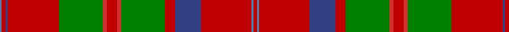

In pattern [BRBRGRRRGRBRBR](/patterns/brbrgrrrgrbrbr/).

This was sourced from weddslist.  It is a [14 stripes tartan](/stripes/stripes14/).

Original link http://www.weddslist.com/cgi-bin/tartans/pg.pl?source=sts

## Thread count
Ba/4 Ra8 B4 Ra102 G88 R8 Ra20 R8 G88 Ra20 B52 Ra100 Ba4 Ra/8

## Palette
Each colour and its ΔE from the base-6 reference it is a variant of.

| Colour | Shade | Base | ΔE (OKLab) |
|---|---|---|---|
| B | <code style="background-color:#304080;">#304080</code> `#304080` | B <code style="background-color:#2A418A;">#2A418A</code> | 0.02 |
| Ba | <code style="background-color:#5480B0;">#5480B0</code> `#5480B0` | B <code style="background-color:#2A418A;">#2A418A</code> | 0.19 |
| G | <code style="background-color:#008000;">#008000</code> `#008000` | G <code style="background-color:#006100;">#006100</code> | 0.10 |
| R | <code style="background-color:#D03030;">#D03030</code> `#D03030` | R <code style="background-color:#CC0000;">#CC0000</code> | 0.04 |
| Ra | <code style="background-color:#C00000;">#C00000</code> `#C00000` | R <code style="background-color:#CC0000;">#CC0000</code> | 0.03 |

## Nearest tartans

The nearest existing variants by ΔTartan distance.

1. [MacQuarrie #2](/setts/s14/r4b2r50ba26r10g44ra4r10ra4g44r51ba2r4b2x2~b3c82af-ba2c4084-g005020-rdc0000-rac82828/) — ΔT 0.71
1. [Leask](/setts/s14/g4r2w1r2k1r24g12y2g3y2g12r2g3y4x2~g408060-k101010-rc80000-we0e0e0-ye8c000/) — ΔT 0.77
1. [Grant or New Bruce](/setts/s15/r12b2r4b4r39ba2r4b11r6g4r6g45r4b4bb10~b800080-ba5480b0-bb304080-g008000-rc00000/) — ΔT 0.80
1. [Perth, (Duke of.. )](/setts/s14/b30r14b2r14g20w1g2w1g20r44b4r10ba1r4x2~b304080-ba5480b0-g008000-rc00000-we0e0e0/) — ΔT 1.00
1. [Grant or New Bruce Clan Tartan Tartan Number: 1385. Earliest known date: 1819 As ordered by Patrick Grant of Redcastle, the chief of the Clan Grant. The large red and the large green squares have been reduced by a factor of 4 to allow display. The original sett was S15 P2 S4 P4 S156 LB2 S4 P42 S6 G4 S6 G178 S4 P4 S10 (HSHP half sett half pivot). This tartan was also adopted by the Drummonds. See products available Copyright © Blair Urquhart, Comrie, 2015](/setts/s15/r12b2r4b4r39ba2r4b11r6g4r6g45r4b4bb10~b780078-ba5c8ca8-bb2c2c80-g006818-rc80000/) — ΔT 1.01
1. [Balnagowan (Harrods)](/setts/s14/y3g3r1y2r1g20k5g4k5g3r2g3ra7g2x2~g604000-k101010-rc80000-rab84c00-ye8c000/) — ΔT 1.02
1. [Dalziel (Clan)](/setts/s17/r24w1b2r4g32r4b2w1r4b6r4w1b2r32g6ra6g6x2~b780078-g006818-rc80000-racc4438-we0e0e0/) — ΔT 1.04
1. [Dalziel](/setts/s17/r24w1b2r4g32r4b2w1r4b6r4w1b2r32g2ra3g6x2~b304080-g008000-rc00000-ra900030-we0e0e0/) — ΔT 1.06
1. [Leask Family Tartan Tartan Number: 905. Earliest known date: 1981 Designed by Madam Leask and the Scottish Tartans Society Accredited in 1981. See products available Copyright © Blair Urquhart, Comrie, 2015](/setts/s14/g2r2w1r2k1r24g12y2g3y2g12r2g3y2x2~g006818-k101010-rc80000-we0e0e0-ye8c000/) — ΔT 1.07
1. [Shaw of Tordarroch Red (Dress)](/setts/s14/b5k1r30ba15r8g30r8ba2r8g30r8ba15r30k1x2~b5c8ca8-ba440044-g006818-k101010-rc80000/) — ΔT 1.09

## Neighbour map

Every grey dot is one of 15726 variants placed by the first two principal components of the ΔTartan feature space (44% of its variance). Red is this tartan; blue dots are its nearest — click one to open its page.

<svg viewBox="0 0 640 380" role="img" style="max-width:100%;height:auto;border:1px solid #e0e0e0;border-radius:4px;display:block" xmlns="http://www.w3.org/2000/svg"><image href="/nn/cloud.v1.png" width="640" height="380"/><a href="/setts/s14/r4b2r50ba26r10g44ra4r10ra4g44r51ba2r4b2x2~b3c82af-ba2c4084-g005020-rdc0000-rac82828/"><circle cx="309.3" cy="105.3" r="4" fill="#3465a4"><title>MacQuarrie #2</title></circle></a><a href="/setts/s14/g4r2w1r2k1r24g12y2g3y2g12r2g3y4x2~g408060-k101010-rc80000-we0e0e0-ye8c000/"><circle cx="299.3" cy="99.0" r="4" fill="#3465a4"><title>Leask</title></circle></a><a href="/setts/s15/r12b2r4b4r39ba2r4b11r6g4r6g45r4b4bb10~b800080-ba5480b0-bb304080-g008000-rc00000/"><circle cx="294.3" cy="96.3" r="4" fill="#3465a4"><title>Grant or New Bruce</title></circle></a><a href="/setts/s14/b30r14b2r14g20w1g2w1g20r44b4r10ba1r4x2~b304080-ba5480b0-g008000-rc00000-we0e0e0/"><circle cx="328.5" cy="87.7" r="4" fill="#3465a4"><title>Perth, (Duke of.. )</title></circle></a><a href="/setts/s15/r12b2r4b4r39ba2r4b11r6g4r6g45r4b4bb10~b780078-ba5c8ca8-bb2c2c80-g006818-rc80000/"><circle cx="299.3" cy="97.8" r="4" fill="#3465a4"><title>Grant or New Bruce Clan Tartan Tartan Number: 1385. Earliest known date: 1819 As ordered by Patrick Grant of Redcastle, the chief of the Clan Grant. The large red and the large green squares have been reduced by a factor of 4 to allow display. The original sett was S15 P2 S4 P4 S156 LB2 S4 P42 S6 G4 S6 G178 S4 P4 S10 (HSHP half sett half pivot). This tartan was also adopted by the Drummonds. See products available Copyright © Blair Urquhart, Comrie, 2015</title></circle></a><a href="/setts/s14/y3g3r1y2r1g20k5g4k5g3r2g3ra7g2x2~g604000-k101010-rc80000-rab84c00-ye8c000/"><circle cx="325.7" cy="123.0" r="4" fill="#3465a4"><title>Balnagowan (Harrods)</title></circle></a><a href="/setts/s17/r24w1b2r4g32r4b2w1r4b6r4w1b2r32g6ra6g6x2~b780078-g006818-rc80000-racc4438-we0e0e0/"><circle cx="345.4" cy="78.1" r="4" fill="#3465a4"><title>Dalziel (Clan)</title></circle></a><a href="/setts/s17/r24w1b2r4g32r4b2w1r4b6r4w1b2r32g2ra3g6x2~b304080-g008000-rc00000-ra900030-we0e0e0/"><circle cx="357.3" cy="73.1" r="4" fill="#3465a4"><title>Dalziel</title></circle></a><a href="/setts/s14/g2r2w1r2k1r24g12y2g3y2g12r2g3y2x2~g006818-k101010-rc80000-we0e0e0-ye8c000/"><circle cx="297.1" cy="93.4" r="4" fill="#3465a4"><title>Leask Family Tartan Tartan Number: 905. Earliest known date: 1981 Designed by Madam Leask and the Scottish Tartans Society Accredited in 1981. See products available Copyright © Blair Urquhart, Comrie, 2015</title></circle></a><a href="/setts/s14/b5k1r30ba15r8g30r8ba2r8g30r8ba15r30k1x2~b5c8ca8-ba440044-g006818-k101010-rc80000/"><circle cx="283.1" cy="117.9" r="4" fill="#3465a4"><title>Shaw of Tordarroch Red (Dress)</title></circle></a><circle cx="312.4" cy="109.1" r="5" fill="#c00000"/></svg>

ID: /setts/s14/r4b2r50ba26r10g44ra4r10ra4g44r51ba2r4b2x2~b5480b0-ba304080-g008000-rc00000-rad03030/
