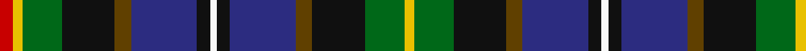

This page is one **sett** — a single exact thread-count. It belongs to the [tartan](/tartans/r4y3g12k16t5db20k4w2/)
(the same proportion at any scale), whose colour order is pattern [RYGKGBKWKBGKGY](/stripes/rygkgbkwkbgkgy/).

Sourced from register-of-tartans.  It is a [14 stripe tartan](/stripes/stripes14/).

Original link https://www.tartanregister.gov.uk/tartanDetails.aspx?ref=1850

## Register references

External register numbers recorded for this tartan.

- Scottish Register of Tartans: [1850](https://www.tartanregister.gov.uk/tartanDetails.aspx?ref=1850)
- Scottish Tartans Authority (ITI): 6051

## Thread count
R/8 Y6 G24 K32 T10 DB40 K8 W4 K8 DB40 T10 K32 G24 Y/6

## Palette
Each colour and the base-6 reference it is a variant of.

| Colour | Shade | Base |
|---|---|---|
| DB | <code style="background-color:#2C2C80;">#2C2C80</code> `oklch(35.0% 0.138 276.6)` <small>#2C2C80</small> | B <code style="background-color:#2A418A;">#2A418A</code> |
| G | <code style="background-color:#006818;">#006818</code> `oklch(45.0% 0.142 145.0)` <small>#006818</small> | G <code style="background-color:#006100;">#006100</code> |
| K | <code style="background-color:#101010;">#101010</code> `oklch(17.3% 0.000 89.9)` <small>#101010</small> | K <code style="background-color:#000000;">#000000</code> |
| LT | <code style="background-color:#A08858;">#A08858</code> `oklch(63.7% 0.071 84.0)` <small>#A08858</small> | Y <code style="background-color:#F2BF00;">#F2BF00</code> |
| R | <code style="background-color:#C80000;">#C80000</code> `oklch(52.3% 0.215 29.2)` <small>#C80000</small> | R <code style="background-color:#CC0000;">#CC0000</code> |
| T | <code style="background-color:#604000;">#604000</code> `oklch(39.8% 0.083 76.8)` <small>#604000</small> | G <code style="background-color:#006100;">#006100</code> |
| W | <code style="background-color:#F8F8F8;">#F8F8F8</code> `oklch(97.9% 0.000 89.9)` <small>#F8F8F8</small> | W <code style="background-color:#F7F7F7;">#F7F7F7</code> |
| Y | <code style="background-color:#E8C000;">#E8C000</code> `oklch(81.9% 0.168 93.7)` <small>#E8C000</small> | Y <code style="background-color:#F2BF00;">#F2BF00</code> |

## Nearest tartans

The nearest existing variants by ΔTartan distance, with this tartan at the top so the swatches line up against it.

ΔTartan

Tartan

Sett

—

<a href="/ttd/edit/#slug=r4ly3g12k16dy5db20k4w2~x2">Iowa</a> <a class="nn-out" href="/setts/s14/r4ly3g12k16dy5db20k4w2~x2/" title="open its dictionary page">↗</a>

0.00

<a href="/ttd/edit/#slug=g12k16dy5db20k4w2k4db20dy5k16g12ly3r4ly3~x2">Iowa American District Tartan Tartan Number: 6051. Earliest known date: 2004 Iowa has a rich history of Scottish influence in the towns and cities. The Iowa Scottish Heritage Society desired to give to the people of Iowa a tartan that symbolizes the state. Blue for the sky, rivers &amp; lakes, Green for the fields our farmers plant. Black for the rich soil for which we are blessed. White for the snow. Red for the barns and the wild rose. Brown for the earth. Yellow for corn and the Goldfinch. Adopted by the State of Iowa General Assembly, resolution No 149 by Heaton &amp; Whitaker. See products available Copyright © Blair Urquhart, Comrie, 2015</a> <a class="nn-out" href="/setts/s14/g12k16dy5db20k4w2k4db20dy5k16g12ly3r4ly3~x2/" title="open its dictionary page">↗</a>

0.80

<a href="/ttd/edit/#slug=r3k2dp12w2dp12k12g12lo2g12k2r1db2~x2">Rust (Personal)</a> <a class="nn-out" href="/setts/s12/r3k2dp12w2dp12k12g12lo2g12k2r1db2~x2/" title="open its dictionary page">↗</a>

0.85

<a href="/setts/s14/r5lb1dt10w2k10y10k1ly3~x4/">Culloden 1746 Artefact Tartan Tartan Number: 7422. Earliest known date: 1746 Count from the original Culloden coat discovered and later examined by Peter MacDonald on display at the Kelvingrove Museum, Glasgow. See products available Copyright © Blair Urquhart, Comrie, 2015</a>

0.86

<a href="/ttd/edit/#slug=db2k2db16k15ly2g16k2g16w2k17db4r6k3ly2~x2">Allison (MacGregor-Hastie)</a> <a class="nn-out" href="/setts/s14/db2k2db16k15ly2g16k2g16w2k17db4r6k3ly2~x2/" title="open its dictionary page">↗</a>

0.90

<a href="/ttd/edit/#slug=db3k3db15k15ly3dg15k3dg15w3k15db4r6k3ly2~x2">Allison Family Tartan Tartan Number: 314. Earliest known date: 1880 This sample comes from the MacGregor-Hastie collection which forms the basis of the cloth archive of the Scottish Tartans Society. First recorded in the Clans Originaux in 1880. See products available Copyright © Blair Urquhart, Comrie, 2015</a> <a class="nn-out" href="/setts/s14/db3k3db15k15ly3dg15k3dg15w3k15db4r6k3ly2~x2/" title="open its dictionary page">↗</a>

0.98

<a href="/ttd/edit/#slug=db8r2db2r4db8y2k10y10k4y2ly2y4w1~x2">McCrann, Julian David (Personal)</a> <a class="nn-out" href="/setts/s13/db8r2db2r4db8y2k10y10k4y2ly2y4w1~x2/" title="open its dictionary page">↗</a>

0.98

<a href="/ttd/edit/#slug=db3k2db12k18dg14k2dg14k8ly2k8t4r4k2w3~x2">Allison (MacBean and Bishop)</a> <a class="nn-out" href="/setts/s14/db3k2db12k18dg14k2dg14k8ly2k8t4r4k2w3~x2/" title="open its dictionary page">↗</a>

1.02

<a href="/ttd/edit/#slug=db3k3db12k18dg14k2dg14k8ly2k8t4r4k2w3~x2">Alison / Allison</a> <a class="nn-out" href="/setts/s14/db3k3db12k18dg14k2dg14k8ly2k8t4r4k2w3~x2/" title="open its dictionary page">↗</a>

1.05

<a href="/ttd/edit/#slug=db7w3g3db18lo3k15lo3g17r6g3r2g7~x2">Drennan</a> <a class="nn-out" href="/setts/s12/db7w3g3db18lo3k15lo3g17r6g3r2g7~x2/" title="open its dictionary page">↗</a>

1.05

<a href="/ttd/edit/#slug=r3k2dp12w2dp12k12g12ly2g12k2r1t2~x2">Rust Personal Tartan Tartan Number: 555. Earliest known date: Oman 1983 Amended sett from T.S.D See products available Copyright © Blair Urquhart, Comrie, 2015</a> <a class="nn-out" href="/setts/s12/r3k2dp12w2dp12k12g12ly2g12k2r1t2~x2/" title="open its dictionary page">↗</a>

## Neighbour map

Every grey dot is one of 14299 variants placed by the first two principal components of the ΔTartan feature space (44% of its variance). Red is this tartan; blue dots are its nearest — click one to open its page.

<svg viewBox="0 0 640 380" role="img" style="max-width:100%;height:auto;border:1px solid #e0e0e0;border-radius:4px;display:block" xmlns="http://www.w3.org/2000/svg"><image href="/nn/cloud.v1.png" width="640" height="380"/><a href="/setts/s14/g12k16dy5db20k4w2k4db20dy5k16g12ly3r4ly3~x2/"><circle cx="84.5" cy="144.9" r="4" fill="#3465a4"><title>Iowa American District Tartan Tartan Number: 6051. Earliest known date: 2004 Iowa has a rich history of Scottish influence in the towns and cities. The Iowa Scottish Heritage Society desired to give to the people of Iowa a tartan that symbolizes the state. Blue for the sky, rivers &amp; lakes, Green for the fields our farmers plant. Black for the rich soil for which we are blessed. White for the snow. Red for the barns and the wild rose. Brown for the earth. Yellow for corn and the Goldfinch. Adopted by the State of Iowa General Assembly, resolution No 149 by Heaton &amp; Whitaker. See products available Copyright © Blair Urquhart, Comrie, 2015</title></circle></a><a href="/setts/s12/r3k2dp12w2dp12k12g12lo2g12k2r1db2~x2/"><circle cx="114.7" cy="136.0" r="4" fill="#3465a4"><title>Rust (Personal)</title></circle></a><a href="/setts/s14/r5lb1dt10w2k10y10k1ly3~x4/"><circle cx="56.5" cy="129.2" r="4" fill="#3465a4"><title>Culloden 1746 Artefact Tartan Tartan Number: 7422. Earliest known date: 1746 Count from the original Culloden coat discovered and later examined by Peter MacDonald on display at the Kelvingrove Museum, Glasgow. See products available Copyright © Blair Urquhart, Comrie, 2015</title></circle></a><a href="/setts/s14/db2k2db16k15ly2g16k2g16w2k17db4r6k3ly2~x2/"><circle cx="108.7" cy="137.3" r="4" fill="#3465a4"><title>Allison (MacGregor-Hastie)</title></circle></a><a href="/setts/s14/db3k3db15k15ly3dg15k3dg15w3k15db4r6k3ly2~x2/"><circle cx="109.0" cy="159.9" r="4" fill="#3465a4"><title>Allison Family Tartan Tartan Number: 314. Earliest known date: 1880 This sample comes from the MacGregor-Hastie collection which forms the basis of the cloth archive of the Scottish Tartans Society. First recorded in the Clans Originaux in 1880. See products available Copyright © Blair Urquhart, Comrie, 2015</title></circle></a><a href="/setts/s13/db8r2db2r4db8y2k10y10k4y2ly2y4w1~x2/"><circle cx="97.5" cy="161.1" r="4" fill="#3465a4"><title>McCrann, Julian David (Personal)</title></circle></a><a href="/setts/s14/db3k2db12k18dg14k2dg14k8ly2k8t4r4k2w3~x2/"><circle cx="135.7" cy="148.6" r="4" fill="#3465a4"><title>Allison (MacBean and Bishop)</title></circle></a><a href="/setts/s14/db3k3db12k18dg14k2dg14k8ly2k8t4r4k2w3~x2/"><circle cx="137.4" cy="150.4" r="4" fill="#3465a4"><title>Alison / Allison</title></circle></a><a href="/setts/s12/db7w3g3db18lo3k15lo3g17r6g3r2g7~x2/"><circle cx="106.8" cy="160.1" r="4" fill="#3465a4"><title>Drennan</title></circle></a><a href="/setts/s12/r3k2dp12w2dp12k12g12ly2g12k2r1t2~x2/"><circle cx="104.8" cy="126.0" r="4" fill="#3465a4"><title>Rust Personal Tartan Tartan Number: 555. Earliest known date: Oman 1983 Amended sett from T.S.D See products available Copyright © Blair Urquhart, Comrie, 2015</title></circle></a><circle cx="84.5" cy="144.9" r="5" fill="#c00000"/></svg>

ID: /setts/s14/r4ly3g12k16dy5db20k4w2~x2/
