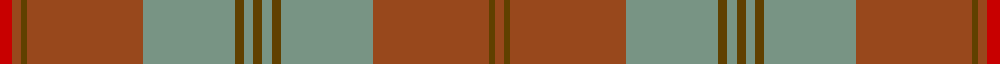

In pattern [RGRGGGGGGGRGRR](/stripes/rgrgggggggrgrr/).

This was sourced from register-of-tartans.  It is a [14 stripe tartan](/stripes/stripes14/).

Original link https://www.tartanregister.gov.uk/tartanDetails.aspx?ref=4308

## Register references

External register numbers recorded for this tartan.

- Scottish Register of Tartans: [4308](https://www.tartanregister.gov.uk/tartanDetails.aspx?ref=4308)
- Scottish Tartans Authority (ITI): 6350

## Thread count
R/8 T6 Ta4 T76 LG60 Ta6 LG6 Ta6 LG6 Ta6 LG60 T76 Ta4 T/6

## Palette
Each colour and the base-6 reference it is a variant of.

| Colour | Shade | Base |
|---|---|---|
| LG | <code style="background-color:#789484;">#789484</code> `oklch(64.0% 0.040 160.0)` <small>#789484</small> | G <code style="background-color:#006100;">#006100</code> |
| R | <code style="background-color:#C80000;">#C80000</code> `oklch(52.3% 0.215 29.2)` <small>#C80000</small> | R <code style="background-color:#CC0000;">#CC0000</code> |
| T | <code style="background-color:#98481C;">#98481C</code> `oklch(49.6% 0.121 46.1)` <small>#98481C</small> | R <code style="background-color:#CC0000;">#CC0000</code> |
| Ta | <code style="background-color:#604000;">#604000</code> `oklch(39.8% 0.083 76.8)` <small>#604000</small> | G <code style="background-color:#006100;">#006100</code> |

## Nearest tartans

The nearest existing variants by ΔTartan distance, with this tartan at the top so the swatches line up against it.

ΔTartan

Tartan

Sett

—

<a href="/ttd/edit/#slug=r4o3dy2o38y30dy3y3dy3~x2">Unidentified Lindley #6</a> <a class="nn-out" href="/setts/s14/r4o3dy2o38y30dy3y3dy3~x2/" title="open its dictionary page">↗</a>

1.57

<a href="/ttd/edit/#slug=g6w1g12o4r4o2r4o32g1o2~x2">Seton, hunting</a> <a class="nn-out" href="/setts/s10/g6w1g12o4r4o2r4o32g1o2~x2/" title="open its dictionary page">↗</a>

1.58

<a href="/ttd/edit/#slug=o7dt2o3dg32o2dg2o2dt10o2lb2o31dt2o2dt1o6~x2">Drummond of Megginch - 1997 Kilt</a> <a class="nn-out" href="/setts/s15/o7dt2o3dg32o2dg2o2dt10o2lb2o31dt2o2dt1o6~x2/" title="open its dictionary page">↗</a>

1.60

<a href="/ttd/edit/#slug=r3y33g10r3g3r3g3r8y10r3~x2">Gray (Name)</a> <a class="nn-out" href="/setts/s10/r3y33g10r3g3r3g3r8y10r3~x2/" title="open its dictionary page">↗</a>

1.61

<a href="/ttd/edit/#slug=g4n4g2lo36n14lo2t4g7r5lo3~x2">Rikaco Eve (Fashion)</a> <a class="nn-out" href="/setts/s10/g4n4g2lo36n14lo2t4g7r5lo3~x2/" title="open its dictionary page">↗</a>

1.63

<a href="/ttd/edit/#slug=o10y1k1y1k1y11o18y1k1y10~x4">Donachie of Brockloch Ancient Hunting</a> <a class="nn-out" href="/setts/s10/o10y1k1y1k1y11o18y1k1y10~x4/" title="open its dictionary page">↗</a>

1.68

<a href="/ttd/edit/#slug=dg10r2y2r6y16r1y2r1y3r6~x4">Nithsdale</a> <a class="nn-out" href="/setts/s10/dg10r2y2r6y16r1y2r1y3r6~x4/" title="open its dictionary page">↗</a>

1.72

<a href="/ttd/edit/#slug=dg27r2dg3r3n3lo2n14r2n3lo3n3r2n14~x2">Crowne Plaza (Corporate)</a> <a class="nn-out" href="/setts/s13/dg27r2dg3r3n3lo2n14r2n3lo3n3r2n14~x2/" title="open its dictionary page">↗</a>

1.72

<a href="/ttd/edit/#slug=r31db2r3db2r3g12r3db2r3db2r31dy4g19dy36g19dy4~x2">O'Brian #1 (Fashion)</a> <a class="nn-out" href="/setts/s16/r31db2r3db2r3g12r3db2r3db2r31dy4g19dy36g19dy4~x2/" title="open its dictionary page">↗</a>

1.77

<a href="/ttd/edit/#slug=dy9n4dy2n4dy2n30dy9n4t14lo2~x2">Hanna of Leith (yellow line)</a> <a class="nn-out" href="/setts/s10/dy9n4dy2n4dy2n30dy9n4t14lo2~x2/" title="open its dictionary page">↗</a>

1.77

<a href="/ttd/edit/#slug=o13r1o2r2o2r1o2r5o11r1o2g2o2r1o2g7~x2">Sarna</a> <a class="nn-out" href="/setts/s16/o13r1o2r2o2r1o2r5o11r1o2g2o2r1o2g7~x2/" title="open its dictionary page">↗</a>

## Neighbour map

Every grey dot is one of 14299 variants placed by the first two principal components of the ΔTartan feature space (44% of its variance). Red is this tartan; blue dots are its nearest — click one to open its page.

<svg viewBox="0 0 640 380" role="img" style="max-width:100%;height:auto;border:1px solid #e0e0e0;border-radius:4px;display:block" xmlns="http://www.w3.org/2000/svg"><image href="/nn/cloud.v1.png" width="640" height="380"/><a href="/setts/s10/g6w1g12o4r4o2r4o32g1o2~x2/"><circle cx="464.4" cy="157.6" r="4" fill="#3465a4"><title>Seton, hunting</title></circle></a><a href="/setts/s15/o7dt2o3dg32o2dg2o2dt10o2lb2o31dt2o2dt1o6~x2/"><circle cx="433.7" cy="138.5" r="4" fill="#3465a4"><title>Drummond of Megginch - 1997 Kilt</title></circle></a><a href="/setts/s10/r3y33g10r3g3r3g3r8y10r3~x2/"><circle cx="413.4" cy="225.0" r="4" fill="#3465a4"><title>Gray (Name)</title></circle></a><a href="/setts/s10/g4n4g2lo36n14lo2t4g7r5lo3~x2/"><circle cx="356.1" cy="164.8" r="4" fill="#3465a4"><title>Rikaco Eve (Fashion)</title></circle></a><a href="/setts/s10/o10y1k1y1k1y11o18y1k1y10~x4/"><circle cx="420.7" cy="197.4" r="4" fill="#3465a4"><title>Donachie of Brockloch Ancient Hunting</title></circle></a><a href="/setts/s10/dg10r2y2r6y16r1y2r1y3r6~x4/"><circle cx="391.8" cy="231.1" r="4" fill="#3465a4"><title>Nithsdale</title></circle></a><a href="/setts/s13/dg27r2dg3r3n3lo2n14r2n3lo3n3r2n14~x2/"><circle cx="358.4" cy="197.5" r="4" fill="#3465a4"><title>Crowne Plaza (Corporate)</title></circle></a><a href="/setts/s16/r31db2r3db2r3g12r3db2r3db2r31dy4g19dy36g19dy4~x2/"><circle cx="325.0" cy="166.3" r="4" fill="#3465a4"><title>O'Brian #1 (Fashion)</title></circle></a><a href="/setts/s10/dy9n4dy2n4dy2n30dy9n4t14lo2~x2/"><circle cx="396.8" cy="215.8" r="4" fill="#3465a4"><title>Hanna of Leith (yellow line)</title></circle></a><a href="/setts/s16/o13r1o2r2o2r1o2r5o11r1o2g2o2r1o2g7~x2/"><circle cx="480.8" cy="212.3" r="4" fill="#3465a4"><title>Sarna</title></circle></a><circle cx="411.0" cy="169.3" r="5" fill="#c00000"/></svg>

ID: /setts/s14/r4o3dy2o38y30dy3y3dy3~x2/
