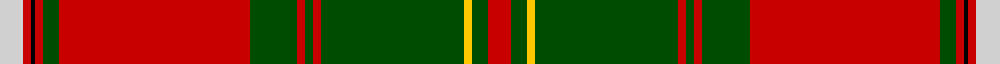

In pattern [RGYGRGRGRGRKRW](/stripes/rgygrgrgrgrkrw/).

This was sourced from weddslist.  It is a [14 stripe tartan](/stripes/stripes14/).

Original link http://www.weddslist.com/cgi-bin/tartans/pg.pl?source=rb

## Thread count
N/6 R2 K1 R2 G4 R48 G12 R2 G2 R2 G36 Y2 G4 R/6

## Palette
Each colour and the base-6 reference it is a variant of.

| Colour | Shade | Base |
|---|---|---|
| G | <code style="background-color:#004C00;">#004C00</code> `oklch(36.1% 0.123 142.5)` <small>#004C00</small> | G <code style="background-color:#006100;">#006100</code> |
| K | <code style="background-color:#000000;">#000000</code> `oklch(0.0% 0.000 0.0)` <small>#000000</small> | K <code style="background-color:#000000;">#000000</code> |
| N | <code style="background-color:#D0D0D0;">#D0D0D0</code> `oklch(85.8% 0.000 89.9)` <small>#D0D0D0</small> | W <code style="background-color:#F7F7F7;">#F7F7F7</code> |
| R | <code style="background-color:#C80000;">#C80000</code> `oklch(52.3% 0.215 29.2)` <small>#C80000</small> | R <code style="background-color:#CC0000;">#CC0000</code> |
| Y | <code style="background-color:#FFC800;">#FFC800</code> `oklch(85.7% 0.175 88.5)` <small>#FFC800</small> | Y <code style="background-color:#F2BF00;">#F2BF00</code> |

## Nearest tartans

The nearest existing variants by ΔTartan distance.

1. [MacDonald of Glencoe #3](/setts/s13/g8r1r6g3r40y2k12r6g30r3k2r1r6~x2/) — ΔT 0.87
1. [Hay](/setts/s14/r9g6ly4g54r4g4r4g18r72g6r4k2r4w9/) — ΔT 0.88
1. [Hay](/setts/s14/r6dg4ly2dg36r2dg2r2dg12r48dg4r2k1r2lr6~x2/) — ΔT 0.98
1. [Munro (Clan)](/setts/s17/r36ly2db1r3g41r3db1ly2r3db12r3ly2db1r36g3r3g4~x2/) — ΔT 1.07
1. [Bruce - 1819 (New)](/setts/s15/r15dp1r2dp2r78lt1r2dp21r3g2r3g89r2dp2r10/) — ΔT 1.08
1. [Hay - 1842 (Clan)](/setts/s14/r3dg2ly1dg18r1dg1r1dg6r24dg2r1k1r1w3~x2/) — ΔT 1.12
1. [Dalzell](/setts/s17/r24w1db2r8g52r8db2w1r8db12r8w1db2r52g4r6g6~x2/) — ΔT 1.17
1. [Dalriada](/setts/s18/r55w1r1g2r2g49r2g2r2db15r2g2r2r53g2r2r2g10~x4/) — ΔT 1.18
1. [MacDonald, of Glencoe](/setts/s13/r5ly1db2r2g30r5db10t1r42g2r4ly1g4~x2/) — ΔT 1.21
1. [Drummond of Megginch - 1820 Plaid](/setts/s15/r26db2r6db6r126lb6r6db38r6dg6r6dg130r19db6r18/) — ΔT 1.21

## Neighbour map

Every grey dot is one of 14299 variants placed by the first two principal components of the ΔTartan feature space (44% of its variance). Red is this tartan; blue dots are its nearest — click one to open its page.

<svg viewBox="0 0 640 380" role="img" style="max-width:100%;height:auto;border:1px solid #e0e0e0;border-radius:4px;display:block" xmlns="http://www.w3.org/2000/svg"><image href="/nn/cloud.v1.png" width="640" height="380"/><a href="/setts/s13/g8r1r6g3r40y2k12r6g30r3k2r1r6~x2/"><circle cx="330.3" cy="77.7" r="4" fill="#3465a4"><title>MacDonald of Glencoe #3</title></circle></a><a href="/setts/s14/r9g6ly4g54r4g4r4g18r72g6r4k2r4w9/"><circle cx="339.4" cy="69.4" r="4" fill="#3465a4"><title>Hay</title></circle></a><a href="/setts/s14/r6dg4ly2dg36r2dg2r2dg12r48dg4r2k1r2lr6~x2/"><circle cx="381.7" cy="74.0" r="4" fill="#3465a4"><title>Hay</title></circle></a><a href="/setts/s17/r36ly2db1r3g41r3db1ly2r3db12r3ly2db1r36g3r3g4~x2/"><circle cx="361.9" cy="57.6" r="4" fill="#3465a4"><title>Munro (Clan)</title></circle></a><a href="/setts/s15/r15dp1r2dp2r78lt1r2dp21r3g2r3g89r2dp2r10/"><circle cx="386.4" cy="61.0" r="4" fill="#3465a4"><title>Bruce - 1819 (New)</title></circle></a><a href="/setts/s14/r3dg2ly1dg18r1dg1r1dg6r24dg2r1k1r1w3~x2/"><circle cx="335.0" cy="84.9" r="4" fill="#3465a4"><title>Hay - 1842 (Clan)</title></circle></a><a href="/setts/s17/r24w1db2r8g52r8db2w1r8db12r8w1db2r52g4r6g6~x2/"><circle cx="376.5" cy="58.5" r="4" fill="#3465a4"><title>Dalzell</title></circle></a><a href="/setts/s18/r55w1r1g2r2g49r2g2r2db15r2g2r2r53g2r2r2g10~x4/"><circle cx="385.3" cy="34.2" r="4" fill="#3465a4"><title>Dalriada</title></circle></a><a href="/setts/s13/r5ly1db2r2g30r5db10t1r42g2r4ly1g4~x2/"><circle cx="372.0" cy="78.7" r="4" fill="#3465a4"><title>MacDonald, of Glencoe</title></circle></a><a href="/setts/s15/r26db2r6db6r126lb6r6db38r6dg6r6dg130r19db6r18/"><circle cx="375.3" cy="67.8" r="4" fill="#3465a4"><title>Drummond of Megginch - 1820 Plaid</title></circle></a><circle cx="355.7" cy="57.4" r="5" fill="#c00000"/></svg>

ID: /setts/s14/r6dg4ly2dg36r2dg2r2dg12r48dg4r2k1r2lb6/
