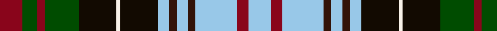

This page is one **sett** — a single exact thread-count. It belongs to the [tartan](/tartans/dr6g4dr2g9k10w1k10lb3ka2lb3ka2lb11dr3lb6/)
(the same proportion at any scale), whose colour order is pattern [RGRGKWKWBWBWRW](/stripes/rgrgkwkwbwbwrw/).

Sourced from register-of-tartans.  It is a [14 stripe tartan](/stripes/stripes14/).

Original link https://www.tartanregister.gov.uk/tartanDetails.aspx?ref=10810

## Register references

External register numbers recorded for this tartan.

- Scottish Register of Tartans: [10810](https://www.tartanregister.gov.uk/tartanDetails.aspx?ref=10810)

## Thread count
DR/12 G8 DR4 G18 K20 W2 K20 LB6 Ka4 LB6 Ka4 LB22 DR6 LB/12

## Palette
Each colour and the base-6 reference it is a variant of.

| Colour | Shade | Base |
|---|---|---|
| DR | <code style="background-color:#89051B;">#89051B</code> `oklch(40.0% 0.158 22.6)` <small>#89051B</small> | R <code style="background-color:#CC0000;">#CC0000</code> |
| G | <code style="background-color:#004C00;">#004C00</code> `oklch(36.1% 0.123 142.5)` <small>#004C00</small> | G <code style="background-color:#006100;">#006100</code> |
| K | <code style="background-color:#120A01;">#120A01</code> `oklch(15.2% 0.028 78.6)` <small>#120A01</small> | K <code style="background-color:#000000;">#000000</code> |
| Ka | <code style="background-color:#321308;">#321308</code> `oklch(23.2% 0.054 39.9)` <small>#321308</small> | B <code style="background-color:#2A418A;">#2A418A</code> |
| LB | <code style="background-color:#98C8E8;">#98C8E8</code> `oklch(81.0% 0.068 237.9)` <small>#98C8E8</small> | W <code style="background-color:#F7F7F7;">#F7F7F7</code> |
| W | <code style="background-color:#F7F1E8;">#F7F1E8</code> `oklch(96.0% 0.014 78.3)` <small>#F7F1E8</small> | W <code style="background-color:#F7F7F7;">#F7F7F7</code> |

## Nearest tartans

The nearest existing variants by ΔTartan distance, with this tartan at the top so the swatches line up against it.

ΔTartan

Tartan

Sett

—

<a href="/ttd/edit/#slug=r6dg4r2dg9k10w1k10lb3do2lb3do2lb11r3lb6~x2">Redgate in Connecticut (Ulster-Scots)</a> <a class="nn-out" href="/setts/s14/r6dg4r2dg9k10w1k10lb3do2lb3do2lb11r3lb6~x2/" title="open its dictionary page">↗</a>

0.63

<a href="/ttd/edit/#slug=r6g4r2g9k10lb1k10lg3dy2lg3dy2lg11r3lg6~x2">Redgate (Name)</a> <a class="nn-out" href="/setts/s14/r6g4r2g9k10lb1k10lg3dy2lg3dy2lg11r3lg6~x2/" title="open its dictionary page">↗</a>

0.82

<a href="/ttd/edit/#slug=w3t2w7t2w2k7dg8k1w2k1dg8k7db7r2~x2">Land's End (Unnamed Maroon) (Personal)</a> <a class="nn-out" href="/setts/s14/w3t2w7t2w2k7dg8k1w2k1dg8k7db7r2~x2/" title="open its dictionary page">↗</a>

0.86

<a href="/ttd/edit/#slug=w3t2w7t2w2k7g8k1w2k1g8k7db7r2~x2">MacKenzie Dress</a> <a class="nn-out" href="/setts/s14/w3t2w7t2w2k7g8k1w2k1g8k7db7r2~x2/" title="open its dictionary page">↗</a>

0.87

<a href="/ttd/edit/#slug=w7t4w2t7dr2t7k6w1k6dy5t3dy3dg13dy4~x2">Redgate (Connecticut) Dress</a> <a class="nn-out" href="/setts/s14/w7t4w2t7dr2t7k6w1k6dy5t3dy3dg13dy4~x2/" title="open its dictionary page">↗</a>

0.92

<a href="/ttd/edit/#slug=w6k1w1k1w1k8g8lo2g8k8db8k1r2~x2">Farquharson Dress</a> <a class="nn-out" href="/setts/s13/w6k1w1k1w1k8g8lo2g8k8db8k1r2~x2/" title="open its dictionary page">↗</a>

0.92

<a href="/setts/s14/r4ly3w12k16g5db20k4w2~x2/">Iowa Dress</a>

0.95

<a href="/ttd/edit/#slug=db2lb2db1lb9k5dg3r2dg5k1ly2~x4">Firth of Tay</a> <a class="nn-out" href="/setts/s10/db2lb2db1lb9k5dg3r2dg5k1ly2~x4/" title="open its dictionary page">↗</a>

0.95

<a href="/ttd/edit/#slug=lb7db4lb2db7r2db7k6lb1k6lo5db3lo3y13lo4~x2">Redgate Dress (Name)</a> <a class="nn-out" href="/setts/s14/lb7db4lb2db7r2db7k6lb1k6lo5db3lo3y13lo4~x2/" title="open its dictionary page">↗</a>

0.96

<a href="/ttd/edit/#slug=k6g10w10k2w23db10w2k6ly2k8g10r12g4r8w4">Stewart, Variant</a> <a class="nn-out" href="/setts/s15/k6g10w10k2w23db10w2k6ly2k8g10r12g4r8w4/" title="open its dictionary page">↗</a>

1.00

<a href="/ttd/edit/#slug=k6dg10w10k2w23db10w2k6ly2k8dg10r12dg4r8w4">Stuart/Stewart variant</a> <a class="nn-out" href="/setts/s15/k6dg10w10k2w23db10w2k6ly2k8dg10r12dg4r8w4/" title="open its dictionary page">↗</a>

## Neighbour map

Every grey dot is one of 14299 variants placed by the first two principal components of the ΔTartan feature space (44% of its variance). Red is this tartan; blue dots are its nearest — click one to open its page.

<svg viewBox="0 0 640 380" role="img" style="max-width:100%;height:auto;border:1px solid #e0e0e0;border-radius:4px;display:block" xmlns="http://www.w3.org/2000/svg"><image href="/nn/cloud.v1.png" width="640" height="380"/><a href="/setts/s14/r6g4r2g9k10lb1k10lg3dy2lg3dy2lg11r3lg6~x2/"><circle cx="76.6" cy="147.0" r="4" fill="#3465a4"><title>Redgate (Name)</title></circle></a><a href="/setts/s14/w3t2w7t2w2k7dg8k1w2k1dg8k7db7r2~x2/"><circle cx="26.2" cy="151.1" r="4" fill="#3465a4"><title>Land's End (Unnamed Maroon) (Personal)</title></circle></a><a href="/setts/s14/w3t2w7t2w2k7g8k1w2k1g8k7db7r2~x2/"><circle cx="24.2" cy="149.8" r="4" fill="#3465a4"><title>MacKenzie Dress</title></circle></a><a href="/setts/s14/w7t4w2t7dr2t7k6w1k6dy5t3dy3dg13dy4~x2/"><circle cx="57.5" cy="145.2" r="4" fill="#3465a4"><title>Redgate (Connecticut) Dress</title></circle></a><a href="/setts/s13/w6k1w1k1w1k8g8lo2g8k8db8k1r2~x2/"><circle cx="70.4" cy="146.3" r="4" fill="#3465a4"><title>Farquharson Dress</title></circle></a><a href="/setts/s14/r4ly3w12k16g5db20k4w2~x2/"><circle cx="62.0" cy="132.8" r="4" fill="#3465a4"><title>Iowa Dress</title></circle></a><a href="/setts/s10/db2lb2db1lb9k5dg3r2dg5k1ly2~x4/"><circle cx="64.2" cy="148.4" r="4" fill="#3465a4"><title>Firth of Tay</title></circle></a><a href="/setts/s14/lb7db4lb2db7r2db7k6lb1k6lo5db3lo3y13lo4~x2/"><circle cx="58.7" cy="144.8" r="4" fill="#3465a4"><title>Redgate Dress (Name)</title></circle></a><a href="/setts/s15/k6g10w10k2w23db10w2k6ly2k8g10r12g4r8w4/"><circle cx="49.1" cy="119.4" r="4" fill="#3465a4"><title>Stewart, Variant</title></circle></a><a href="/setts/s15/k6dg10w10k2w23db10w2k6ly2k8dg10r12dg4r8w4/"><circle cx="56.8" cy="120.7" r="4" fill="#3465a4"><title>Stuart/Stewart variant</title></circle></a><circle cx="61.5" cy="137.6" r="5" fill="#c00000"/></svg>

ID: /setts/s14/r6dg4r2dg9k10w1k10lb3do2lb3do2lb11r3lb6~x2/
