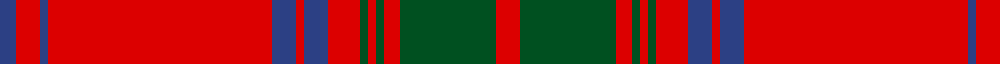

In pattern [BRBRBRBRGRGRGR](/patterns/brbrbrbrgrgrgr/).

This was sourced from register-of-tartans.  It is a [14 stripes tartan](/stripes/stripes14/).

Original link https://www.tartanregister.gov.uk/tartanDetails.aspx?ref=3553

## Thread count
B/4 R6 B2 R56 B6 R2 B6 R8 G2 R2 G2 R4 G24 R/6

## Palette
Each colour and its ΔE from the base-6 reference it is a variant of.

| Colour | Shade | Base | ΔE (OKLab) |
|---|---|---|---|
| B | <code style="background-color:#2C4084;">#2C4084</code> `#2C4084` | B <code style="background-color:#2A418A;">#2A418A</code> | 0.01 |
| G | <code style="background-color:#005020;">#005020</code> `#005020` | G <code style="background-color:#006100;">#006100</code> | 0.07 |
| R | <code style="background-color:#DC0000;">#DC0000</code> `#DC0000` | R <code style="background-color:#CC0000;">#CC0000</code> | 0.03 |

## Nearest tartans

The nearest existing variants by ΔTartan distance.

1. [Ross #7](/setts/s14/g10r10g4r124b12r4b12r16g4r4g4r10g50r10-b2c4084-g005020-rdc0000/) — ΔT 0.32
1. [Ross 5](/setts/s14/r6g24r4g2r2g2r8b6r2b6r56b2r6b4-b304080-g008000-rc00000/) — ΔT 0.62
1. [MacGillivray #3](/setts/s14/g38r14g14r14g14r28b6r6g38r6b6r132b14r28-b2c4084-g005020-rdc0000/) — ΔT 0.75
1. [Ross, Old](/setts/s14/b4r2b2r62b16r4b16r6g2r4g2r6g10r4-b440044-g006818-rc80000/) — ΔT 0.81
1. [Ross 4](/setts/s14/g10r10g4r124b12r4b12r16g4r4g4r10g50r10-b304080-g008000-rc00000/) — ΔT 0.83
1. [Rothesay District Tartan Tartan Number: 1533. Earliest known date: 1842 Rothesay is an historic Royal Burgh, which derives its name from the title of the Duke of Rothesay, held by the sovereigns eldest son since 1469. The Rothesay tartan, previously unknown, appeared in the Vestiarium Scoticum (1842) under the name, 'Prince of Rothesay'. It was worn by King Edward VII as a child and originally classified as a Royal tartan. Rothesay is the principal town of the Isles of Bute, stronghold of the Stuarts of Bute and the Boyds. See products available Copyright © Blair Urquhart, Comrie, 2015](/setts/s17/w4r64g4r6g4r8g34r8g32r8g4r6g4r64w2r2w4-g003820-rc80000-we0e0e0/) — ΔT 0.85
1. [MacGillivray Hunting Clan Tartan Tartan Number: 880. Earliest known date: pre 2003 The pattern books of the old firm of weavers, Wilson's of Bannockburn, provide a reliable early source for this tartan. Wilson's were in business with a monopoly to supply tartan to the regiments in the second half of the 18th century before this pattern was recorded. See products available Copyright © Blair Urquhart, Comrie, 2015](/setts/s14/g38r14g14r14g14r28b6r6g38r6b6r132b14r28-b2c2c80-g006818-rc80000/) — ΔT 0.95
1. [Rothesay](/setts/s17/w4r64g4r6g4r8g34r8g32r8g4r6g4r64w2r2w4-g003000-rc00000-we0e0e0/) — ΔT 1.03
1. [Rothesay (Red)](/setts/s17/w8r83g7r5g7r7g28r7g28r7g7r5g7r83w4r4w8-g006818-rc80000-wfcfcfc/) — ΔT 1.08
1. [MacGillivray](/setts/s14/g38r14g14r14g14r28b6r6g38r6b6r132b14r28-b304080-g008000-rc00000/) — ΔT 1.15

## Neighbour map

Every grey dot is one of 15726 variants placed by the first two principal components of the ΔTartan feature space (44% of its variance). Red is this tartan; blue dots are its nearest — click one to open its page.

<svg viewBox="0 0 640 380" role="img" style="max-width:100%;height:auto;border:1px solid #e0e0e0;border-radius:4px;display:block" xmlns="http://www.w3.org/2000/svg"><image href="/nn/cloud.v1.png" width="640" height="380"/><a href="/setts/s14/g10r10g4r124b12r4b12r16g4r4g4r10g50r10-b2c4084-g005020-rdc0000/"><circle cx="475.5" cy="99.5" r="4" fill="#3465a4"><title>Ross #7</title></circle></a><a href="/setts/s14/r6g24r4g2r2g2r8b6r2b6r56b2r6b4-b304080-g008000-rc00000/"><circle cx="468.6" cy="112.5" r="4" fill="#3465a4"><title>Ross 5</title></circle></a><a href="/setts/s14/g38r14g14r14g14r28b6r6g38r6b6r132b14r28-b2c4084-g005020-rdc0000/"><circle cx="439.6" cy="129.4" r="4" fill="#3465a4"><title>MacGillivray #3</title></circle></a><a href="/setts/s14/b4r2b2r62b16r4b16r6g2r4g2r6g10r4-b440044-g006818-rc80000/"><circle cx="471.3" cy="106.0" r="4" fill="#3465a4"><title>Ross, Old</title></circle></a><a href="/setts/s14/g10r10g4r124b12r4b12r16g4r4g4r10g50r10-b304080-g008000-rc00000/"><circle cx="481.9" cy="106.2" r="4" fill="#3465a4"><title>Ross 4</title></circle></a><a href="/setts/s17/w4r64g4r6g4r8g34r8g32r8g4r6g4r64w2r2w4-g003820-rc80000-we0e0e0/"><circle cx="454.8" cy="101.5" r="4" fill="#3465a4"><title>Rothesay District Tartan Tartan Number: 1533. Earliest known date: 1842 Rothesay is an historic Royal Burgh, which derives its name from the title of the Duke of Rothesay, held by the sovereigns eldest son since 1469. The Rothesay tartan, previously unknown, appeared in the Vestiarium Scoticum (1842) under the name, 'Prince of Rothesay'. It was worn by King Edward VII as a child and originally classified as a Royal tartan. Rothesay is the principal town of the Isles of Bute, stronghold of the Stuarts of Bute and the Boyds. See products available Copyright © Blair Urquhart, Comrie, 2015</title></circle></a><a href="/setts/s14/g38r14g14r14g14r28b6r6g38r6b6r132b14r28-b2c2c80-g006818-rc80000/"><circle cx="447.7" cy="135.7" r="4" fill="#3465a4"><title>MacGillivray Hunting Clan Tartan Tartan Number: 880. Earliest known date: pre 2003 The pattern books of the old firm of weavers, Wilson's of Bannockburn, provide a reliable early source for this tartan. Wilson's were in business with a monopoly to supply tartan to the regiments in the second half of the 18th century before this pattern was recorded. See products available Copyright © Blair Urquhart, Comrie, 2015</title></circle></a><a href="/setts/s17/w4r64g4r6g4r8g34r8g32r8g4r6g4r64w2r2w4-g003000-rc00000-we0e0e0/"><circle cx="452.2" cy="102.0" r="4" fill="#3465a4"><title>Rothesay</title></circle></a><a href="/setts/s17/w8r83g7r5g7r7g28r7g28r7g7r5g7r83w4r4w8-g006818-rc80000-wfcfcfc/"><circle cx="441.7" cy="109.8" r="4" fill="#3465a4"><title>Rothesay (Red)</title></circle></a><a href="/setts/s14/g38r14g14r14g14r28b6r6g38r6b6r132b14r28-b304080-g008000-rc00000/"><circle cx="445.6" cy="135.9" r="4" fill="#3465a4"><title>MacGillivray</title></circle></a><circle cx="461.4" cy="105.6" r="5" fill="#c00000"/></svg>

ID: /setts/s14/r6g24r4g2r2g2r8b6r2b6r56b2r6b4-b2c4084-g005020-rdc0000/
