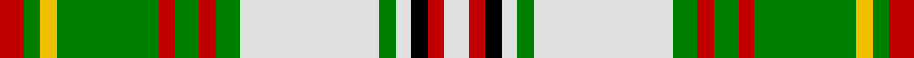

This page is one **sett** — a single exact thread-count. It belongs to the [tartan](/tartans/r6g4y4g25r4g6r4g6ln34g4ln4k4r4ln6/)
(the same proportion at any scale), whose colour order is pattern [RGYGRGRGWGWKRW](/stripes/rgygrgrgwgwkrw/).

Sourced from weddslist.  It is a [14 stripe tartan](/stripes/stripes14/).

Original link http://www.weddslist.com/cgi-bin/tartans/pg.pl?source=sts

## Thread count
R/6 G4 Y4 G25 R4 G6 R4 G6 LN34 G4 LN4 K4 R4 LN/6

## Palette
Each colour and the base-6 reference it is a variant of.

| Colour | Shade | Base |
|---|---|---|
| G | <code style="background-color:#008000;">#008000</code> `oklch(52.0% 0.177 142.5)` <small>#008000</small> | G <code style="background-color:#006100;">#006100</code> |
| K | <code style="background-color:#000000;">#000000</code> `oklch(0.0% 0.000 0.0)` <small>#000000</small> | K <code style="background-color:#000000;">#000000</code> |
| LN | <code style="background-color:#E0E0E0;">#E0E0E0</code> `oklch(90.7% 0.000 89.9)` <small>#E0E0E0</small> | W <code style="background-color:#F7F7F7;">#F7F7F7</code> |
| R | <code style="background-color:#C00000;">#C00000</code> `oklch(50.7% 0.208 29.2)` <small>#C00000</small> | R <code style="background-color:#CC0000;">#CC0000</code> |
| Y | <code style="background-color:#F0C000;">#F0C000</code> `oklch(82.7% 0.169 90.5)` <small>#F0C000</small> | Y <code style="background-color:#F2BF00;">#F2BF00</code> |

## Nearest tartans

The nearest existing variants by ΔTartan distance, with this tartan at the top so the swatches line up against it.

ΔTartan

Tartan

Sett

—

<a href="/ttd/edit/#slug=r6g4ly4g25r4g6r4g6w34g4w4k4r4w6">Hay, White Dress</a> <a class="nn-out" href="/setts/s14/r6g4ly4g25r4g6r4g6w34g4w4k4r4w6/" title="open its dictionary page">↗</a>

1.34

<a href="/setts/s26/r3g2ly2g14r2g3r2g3w17g2w2k2r2w3~x2/">Hay, White Dress</a>

1.40

<a href="/ttd/edit/#slug=w1k1ly1dg8k1lr1w8lr1k8lr1w1dg8lr1w1~x6">Praetorian, Green (Fashion)</a> <a class="nn-out" href="/setts/s14/w1k1ly1dg8k1lr1w8lr1k8lr1w1dg8lr1w1~x6/" title="open its dictionary page">↗</a>

1.41

<a href="/ttd/edit/#slug=o35w4o3ly7o3w4o7dr15y4w36y5~x2">MacKellar, dress</a> <a class="nn-out" href="/setts/s11/o35w4o3ly7o3w4o7dr15y4w36y5~x2/" title="open its dictionary page">↗</a>

1.41

<a href="/ttd/edit/#slug=w1dg1ly1g8k1lb1w8lb1k8lb1w1g8lb1w1~x6">Praetorian Green</a> <a class="nn-out" href="/setts/s14/w1dg1ly1g8k1lb1w8lb1k8lb1w1g8lb1w1~x6/" title="open its dictionary page">↗</a>

1.41

<a href="/ttd/edit/#slug=r4w4r2w29k10g3k10g4g4g3g3g3~x2">Ross Arisaid</a> <a class="nn-out" href="/setts/s12/r4w4r2w29k10g3k10g4g4g3g3g3~x2/" title="open its dictionary page">↗</a>

1.43

<a href="/ttd/edit/#slug=n2ly2n1ly2n1lb15n4r1ly2dg7ly1~x4">Hutt #1 (Personal)</a> <a class="nn-out" href="/setts/s11/n2ly2n1ly2n1lb15n4r1ly2dg7ly1~x4/" title="open its dictionary page">↗</a>

1.45

<a href="/ttd/edit/#slug=g10w4r4m4g2m4r4w4g10w4t4w2t4w23k2r2~x2">MacBean dress</a> <a class="nn-out" href="/setts/s16/g10w4r4m4g2m4r4w4g10w4t4w2t4w23k2r2~x2/" title="open its dictionary page">↗</a>

1.46

<a href="/ttd/edit/#slug=ly5g16db8g4db4g4lr38g4lr38g4db4g4db8g16ly5r3~x2">Nova Scotia Dress #2</a> <a class="nn-out" href="/setts/s16/ly5g16db8g4db4g4lr38g4lr38g4db4g4db8g16ly5r3~x2/" title="open its dictionary page">↗</a>

1.47

<a href="/ttd/edit/#slug=db3dy14g2dy2g2dy3g6w18db3dy2db2dy2~x2">Raibert Check</a> <a class="nn-out" href="/setts/s12/db3dy14g2dy2g2dy3g6w18db3dy2db2dy2~x2/" title="open its dictionary page">↗</a>

1.49

<a href="/ttd/edit/#slug=r3w5r2w12ly1k2ly1w2ly1k2ly2k2r1g4r2g4r2~x2">Anderson, dress</a> <a class="nn-out" href="/setts/s17/r3w5r2w12ly1k2ly1w2ly1k2ly2k2r1g4r2g4r2~x2/" title="open its dictionary page">↗</a>

## Neighbour map

Every grey dot is one of 14299 variants placed by the first two principal components of the ΔTartan feature space (44% of its variance). Red is this tartan; blue dots are its nearest — click one to open its page.

<svg viewBox="0 0 640 380" role="img" style="max-width:100%;height:auto;border:1px solid #e0e0e0;border-radius:4px;display:block" xmlns="http://www.w3.org/2000/svg"><image href="/nn/cloud.v1.png" width="640" height="380"/><a href="/setts/s26/r3g2ly2g14r2g3r2g3w17g2w2k2r2w3~x2/"><circle cx="152.6" cy="89.1" r="4" fill="#3465a4"><title>Hay, White Dress</title></circle></a><a href="/setts/s14/w1k1ly1dg8k1lr1w8lr1k8lr1w1dg8lr1w1~x6/"><circle cx="127.4" cy="130.8" r="4" fill="#3465a4"><title>Praetorian, Green (Fashion)</title></circle></a><a href="/setts/s11/o35w4o3ly7o3w4o7dr15y4w36y5~x2/"><circle cx="180.0" cy="120.2" r="4" fill="#3465a4"><title>MacKellar, dress</title></circle></a><a href="/setts/s14/w1dg1ly1g8k1lb1w8lb1k8lb1w1g8lb1w1~x6/"><circle cx="93.8" cy="109.2" r="4" fill="#3465a4"><title>Praetorian Green</title></circle></a><a href="/setts/s12/r4w4r2w29k10g3k10g4g4g3g3g3~x2/"><circle cx="152.5" cy="100.7" r="4" fill="#3465a4"><title>Ross Arisaid</title></circle></a><a href="/setts/s11/n2ly2n1ly2n1lb15n4r1ly2dg7ly1~x4/"><circle cx="182.3" cy="111.8" r="4" fill="#3465a4"><title>Hutt #1 (Personal)</title></circle></a><a href="/setts/s16/g10w4r4m4g2m4r4w4g10w4t4w2t4w23k2r2~x2/"><circle cx="131.7" cy="97.1" r="4" fill="#3465a4"><title>MacBean dress</title></circle></a><a href="/setts/s16/ly5g16db8g4db4g4lr38g4lr38g4db4g4db8g16ly5r3~x2/"><circle cx="202.6" cy="112.6" r="4" fill="#3465a4"><title>Nova Scotia Dress #2</title></circle></a><a href="/setts/s12/db3dy14g2dy2g2dy3g6w18db3dy2db2dy2~x2/"><circle cx="160.2" cy="143.8" r="4" fill="#3465a4"><title>Raibert Check</title></circle></a><a href="/setts/s17/r3w5r2w12ly1k2ly1w2ly1k2ly2k2r1g4r2g4r2~x2/"><circle cx="117.9" cy="101.1" r="4" fill="#3465a4"><title>Anderson, dress</title></circle></a><circle cx="155.2" cy="121.1" r="5" fill="#c00000"/></svg>

ID: /setts/s14/r6g4ly4g25r4g6r4g6w34g4w4k4r4w6/
