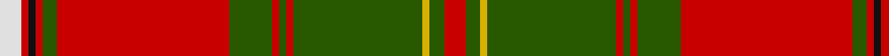

In pattern [RGYGRGRGRGRKRW](/patterns/rgygrgrgrgrkrw/).

This was sourced from tartans-authority.  It is a [14 stripes tartan](/stripes/stripes14/).

Original link http://www.tartansauthority.com/tartan-ferret/display/1555/

## Thread count
LN/6 R2 K2 R2 G4 R48 G12 R2 G2 R2 G36 Y2 G4 R/6

## Palette
Each colour and its ΔE from the base-6 reference it is a variant of.

| Colour | Shade | Base | ΔE (OKLab) |
|---|---|---|---|
| G | <code style="background-color:#285800;">#285800</code> `#285800` | G <code style="background-color:#006100;">#006100</code> | 0.03 |
| K | <code style="background-color:#101010;">#101010</code> `#101010` | K <code style="background-color:#000000;">#000000</code> | 0.17 |
| LN | <code style="background-color:#E0E0E0;">#E0E0E0</code> `#E0E0E0` | W <code style="background-color:#F7F7F7;">#F7F7F7</code> | 0.07 |
| R | <code style="background-color:#C80000;">#C80000</code> `#C80000` | R <code style="background-color:#CC0000;">#CC0000</code> | 0.01 |
| Y | <code style="background-color:#D8B000;">#D8B000</code> `#D8B000` | Y <code style="background-color:#F2BF00;">#F2BF00</code> | 0.06 |

## Nearest tartans

The nearest existing variants by ΔTartan distance.

1. [Hay Clan Tartan Tartan Number: 1555. Earliest known date: 1842 The design comes from the Vestiarium Scoticum (1842). The authors, the Sobieski Stuart brothers, enjoyed a popular following among the Scottish gentry in the early Victorian era, and in the spirit of the times, added mystery, romance and some spurious historical documentation to the subject of tartan. Of the better known tartans, the book offers some minor variation, but in other cases it provides the only recorded version of many tartans in use today. See products available Copyright © Blair Urquhart, Comrie, 2015](/setts/s14/r9g6y4g54r4g4r4g18r72g6r4k2r4w9-g006818-k101010-rc80000-we0e0e0-ye8c000/) — ΔT 0.69
1. [Leask Family Tartan Tartan Number: 905. Earliest known date: 1981 Designed by Madam Leask and the Scottish Tartans Society Accredited in 1981. See products available Copyright © Blair Urquhart, Comrie, 2015](/setts/s14/g4r4w2r4k2r48g24y4g6y4g24r4g6y4-g006818-k101010-rc80000-we0e0e0-ye8c000/) — ΔT 0.81
1. [Lochiel, (Cameron)](/setts/s17/r72y4b4r6g80r6b4y4r6b24r6y4b4r72g6ba6g8-b304080-ba600030-g008000-rc00000-yf0c000/) — ΔT 0.83
1. [All Ireland Red](/setts/s15/r12g4b4r60ga4r4gb8r4ga4r2ga40r2g4b4r8-b202060-g789484-ga006818-gb289c18-rc80000/) — ΔT 0.92
1. [Hay](/setts/s14/r9g6y4g54r4g4r4g18r72g6r4k2r4w9-g008000-k000000-rc00000-we0e0e0-yf0c000/) — ΔT 0.94
1. [Dalziel](/setts/s17/r48w2b4r8g64r8b4w2r8b12r8w2b4r64g4ra6g12-b304080-g008000-rc00000-ra900030-we0e0e0/) — ΔT 0.98
1. [Stirling, Weavers Guild](/setts/s17/r92y4b4r10g92r10b4y4r10b20r10y4b4r98g10w10g10-b304080-g008000-rc00000-we0e0e0-yf0c000/) — ΔT 1.01
1. [Crieff](/setts/s13/r4ra10g7ra70g7ra4b21ra4g85ra4g7ra10r4-b800080-g008000-rd03030-rac00000/) — ΔT 1.07
1. [Hayes (Fashion)](/setts/s14/r8g4y4g48r4g4r4g16r68g12r8g4r8ya8-g004c00-rc80000-yc89800-yab0b0b0/) — ΔT 1.11
1. [Hay](/setts/s14/r6g4y2g36r2g2r2g12r48g4r2k1r2w6-g004c00-k000000-rc80000-wd0d0d0-yffc800/) — ΔT 1.11

## Neighbour map

Every grey dot is one of 15726 variants placed by the first two principal components of the ΔTartan feature space (44% of its variance). Red is this tartan; blue dots are its nearest — click one to open its page.

<svg viewBox="0 0 640 380" role="img" style="max-width:100%;height:auto;border:1px solid #e0e0e0;border-radius:4px;display:block" xmlns="http://www.w3.org/2000/svg"><image href="/nn/cloud.v1.png" width="640" height="380"/><a href="/setts/s14/r9g6y4g54r4g4r4g18r72g6r4k2r4w9-g006818-k101010-rc80000-we0e0e0-ye8c000/"><circle cx="342.4" cy="70.4" r="4" fill="#3465a4"><title>Hay Clan Tartan Tartan Number: 1555. Earliest known date: 1842 The design comes from the Vestiarium Scoticum (1842). The authors, the Sobieski Stuart brothers, enjoyed a popular following among the Scottish gentry in the early Victorian era, and in the spirit of the times, added mystery, romance and some spurious historical documentation to the subject of tartan. Of the better known tartans, the book offers some minor variation, but in other cases it provides the only recorded version of many tartans in use today. See products available Copyright © Blair Urquhart, Comrie, 2015</title></circle></a><a href="/setts/s14/g4r4w2r4k2r48g24y4g6y4g24r4g6y4-g006818-k101010-rc80000-we0e0e0-ye8c000/"><circle cx="295.1" cy="92.6" r="4" fill="#3465a4"><title>Leask Family Tartan Tartan Number: 905. Earliest known date: 1981 Designed by Madam Leask and the Scottish Tartans Society Accredited in 1981. See products available Copyright © Blair Urquhart, Comrie, 2015</title></circle></a><a href="/setts/s17/r72y4b4r6g80r6b4y4r6b24r6y4b4r72g6ba6g8-b304080-ba600030-g008000-rc00000-yf0c000/"><circle cx="321.8" cy="83.2" r="4" fill="#3465a4"><title>Lochiel, (Cameron)</title></circle></a><a href="/setts/s15/r12g4b4r60ga4r4gb8r4ga4r2ga40r2g4b4r8-b202060-g789484-ga006818-gb289c18-rc80000/"><circle cx="367.7" cy="76.4" r="4" fill="#3465a4"><title>All Ireland Red</title></circle></a><a href="/setts/s14/r9g6y4g54r4g4r4g18r72g6r4k2r4w9-g008000-k000000-rc00000-we0e0e0-yf0c000/"><circle cx="336.3" cy="68.8" r="4" fill="#3465a4"><title>Hay</title></circle></a><a href="/setts/s17/r48w2b4r8g64r8b4w2r8b12r8w2b4r64g4ra6g12-b304080-g008000-rc00000-ra900030-we0e0e0/"><circle cx="354.8" cy="72.0" r="4" fill="#3465a4"><title>Dalziel</title></circle></a><a href="/setts/s17/r92y4b4r10g92r10b4y4r10b20r10y4b4r98g10w10g10-b304080-g008000-rc00000-we0e0e0-yf0c000/"><circle cx="358.4" cy="74.7" r="4" fill="#3465a4"><title>Stirling, Weavers Guild</title></circle></a><a href="/setts/s13/r4ra10g7ra70g7ra4b21ra4g85ra4g7ra10r4-b800080-g008000-rd03030-rac00000/"><circle cx="325.2" cy="112.8" r="4" fill="#3465a4"><title>Crieff</title></circle></a><a href="/setts/s14/r8g4y4g48r4g4r4g16r68g12r8g4r8ya8-g004c00-rc80000-yc89800-yab0b0b0/"><circle cx="345.3" cy="123.6" r="4" fill="#3465a4"><title>Hayes (Fashion)</title></circle></a><a href="/setts/s14/r6g4y2g36r2g2r2g12r48g4r2k1r2w6-g004c00-k000000-rc80000-wd0d0d0-yffc800/"><circle cx="352.3" cy="56.7" r="4" fill="#3465a4"><title>Hay</title></circle></a><circle cx="332.1" cy="83.9" r="5" fill="#c00000"/></svg>

ID: /setts/s14/r6g4y2g36r2g2r2g12r48g4r2k2r2w6-g285800-k101010-rc80000-we0e0e0-yd8b000/
