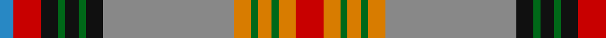

**Bands:** [BRKGKGKRYGYGYR](/stripes/brkgkgkrygygyr/) · **Stripes:** [T R K G K G K O LO G LO G LO R](/stripes/stripes14/) T R K G K G K O LO G LO G LO R

This was sourced from house-of-tartan.  It is a [14 band tartan](/bands/bands14/).

Original link http://www.house-of-tartan.scotland.net/house/TartanViewjs.asp?colr=Def&tnam=2011

## Thread count
B/8 R16 K10 G4 K8 G4 K10 N76 O10 G4 O8 G4 O10 R/16

## Palette
Each colour and its ΔE from the base-6 reference it is a variant of.

| Colour | Shade | Base | ΔE (OKLab) |
|---|---|---|---|
| B | <code style="background-color:#2888C4;">#2888C4</code> `#2888C4` | B <code style="background-color:#2A418A;">#2A418A</code> | 0.21 |
| G | <code style="background-color:#006818;">#006818</code> `#006818` | G <code style="background-color:#006100;">#006100</code> | 0.02 |
| K | <code style="background-color:#101010;">#101010</code> `#101010` | K <code style="background-color:#000000;">#000000</code> | 0.17 |
| N | <code style="background-color:#888888;">#888888</code> `#888888` | R <code style="background-color:#CC0000;">#CC0000</code> | 0.24 |
| O | <code style="background-color:#D87C00;">#D87C00</code> `#D87C00` | Y <code style="background-color:#F2BF00;">#F2BF00</code> | 0.17 |
| R | <code style="background-color:#C80000;">#C80000</code> `#C80000` | R <code style="background-color:#CC0000;">#CC0000</code> | 0.01 |

## Nearest tartans

The nearest existing variants by ΔTartan distance.

1. [Berwick -upon-Tweed (asymmetric)](/setts/s14/r16o5dg2o4dg2o5y38k5dg2k4dg2k5r8b4~x2/) — ΔT 0.46
1. [Moray of Abercairny](/setts/s11/w1t3db2r18r2g16r2r2r2t3w1~x2/) — ΔT 0.81
1. [O'Keefe (Name)](/setts/s12/k8r2k3ly2k2w3k2lo12y22r2y2k1~x2/) — ΔT 0.94
1. [Sommerville](/setts/s18/ly2r5r3g54r5g3r5db20r5r3r5g16r2db4r48r6r3w2~x2/) — ΔT 1.11
1. [Roman (Personal)](/setts/s14/r27g20k7w3lo3r2lo3w3lo6dp6k2r3lo4dp3~x2/) — ΔT 1.14
1. [Westwood](/setts/s18/r6t4dg16lo2k1w6k1lo30r15lo30k1w6k1lo2dg16t4r6w1~x2/) — ΔT 1.15
1. [Berwick-upon-Tweed (symmetric)](/setts/s14/r9r5dg2r4dg2r5n38k5dg2k4dg2k5r8lb4~x2/) — ΔT 1.17
1. [Cats (Fashion)](/setts/s12/db8g2k2lo2k2ly2k2g18r2g2r29k3~x2/) — ΔT 1.17
1. [O'Keefe](/setts/s22/k8r2k3ly2k2w3k2lo12y22r2y2k1y2r2y22lo12k2w3k2ly2k3r2~x2/) — ΔT 1.19
1. [Bicknell, The Hamish (Personal)](/setts/s11/w3k1r25k2dy2g25dy2ly2dy10k1r2~x2/) — ΔT 1.20

## Neighbour map

Every grey dot is one of 14313 variants placed by the first two principal components of the ΔTartan feature space (44% of its variance). Red is this tartan; blue dots are its nearest — click one to open its page.

<svg viewBox="0 0 640 380" role="img" style="max-width:100%;height:auto;border:1px solid #e0e0e0;border-radius:4px;display:block" xmlns="http://www.w3.org/2000/svg"><image href="/nn/cloud.v1.png" width="640" height="380"/><a href="/setts/s14/r16o5dg2o4dg2o5y38k5dg2k4dg2k5r8b4~x2/"><circle cx="189.8" cy="83.7" r="4" fill="#3465a4"><title>Berwick -upon-Tweed (asymmetric)</title></circle></a><a href="/setts/s11/w1t3db2r18r2g16r2r2r2t3w1~x2/"><circle cx="209.0" cy="102.7" r="4" fill="#3465a4"><title>Moray of Abercairny</title></circle></a><a href="/setts/s12/k8r2k3ly2k2w3k2lo12y22r2y2k1~x2/"><circle cx="192.1" cy="86.9" r="4" fill="#3465a4"><title>O'Keefe (Name)</title></circle></a><a href="/setts/s18/ly2r5r3g54r5g3r5db20r5r3r5g16r2db4r48r6r3w2~x2/"><circle cx="232.1" cy="54.9" r="4" fill="#3465a4"><title>Sommerville</title></circle></a><a href="/setts/s14/r27g20k7w3lo3r2lo3w3lo6dp6k2r3lo4dp3~x2/"><circle cx="145.1" cy="103.8" r="4" fill="#3465a4"><title>Roman (Personal)</title></circle></a><a href="/setts/s18/r6t4dg16lo2k1w6k1lo30r15lo30k1w6k1lo2dg16t4r6w1~x2/"><circle cx="213.1" cy="62.6" r="4" fill="#3465a4"><title>Westwood</title></circle></a><a href="/setts/s14/r9r5dg2r4dg2r5n38k5dg2k4dg2k5r8lb4~x2/"><circle cx="195.7" cy="83.1" r="4" fill="#3465a4"><title>Berwick-upon-Tweed (symmetric)</title></circle></a><a href="/setts/s12/db8g2k2lo2k2ly2k2g18r2g2r29k3~x2/"><circle cx="214.7" cy="95.0" r="4" fill="#3465a4"><title>Cats (Fashion)</title></circle></a><a href="/setts/s22/k8r2k3ly2k2w3k2lo12y22r2y2k1y2r2y22lo12k2w3k2ly2k3r2~x2/"><circle cx="200.4" cy="63.0" r="4" fill="#3465a4"><title>O'Keefe</title></circle></a><a href="/setts/s11/w3k1r25k2dy2g25dy2ly2dy10k1r2~x2/"><circle cx="208.4" cy="81.9" r="4" fill="#3465a4"><title>Bicknell, The Hamish (Personal)</title></circle></a><circle cx="200.4" cy="80.4" r="5" fill="#c00000"/></svg>

ID: /setts/s14/r8lo5g2lo4g2lo5o38k5g2k4g2k5r8t4~x2/
