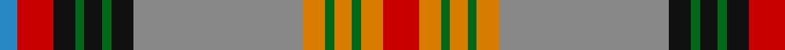

In pattern [BRKGKGKRYGYGYR](/patterns/brkgkgkrygygyr/).

This was sourced from house-of-tartan.  It is a [14 stripes tartan](/stripes/stripes14/).

Original link http://www.house-of-tartan.scotland.net/house/TartanViewjs.asp?colr=Def&tnam=2011

## Thread count
B/8 R16 K10 G4 K8 G4 K10 N76 O10 G4 O8 G4 O10 R/16

## Palette
Each colour and its ΔE from the base-6 reference it is a variant of.

| Colour | Shade | Base | ΔE (OKLab) |
|---|---|---|---|
| B | <code style="background-color:#2888C4;">#2888C4</code> `#2888C4` | B <code style="background-color:#2A418A;">#2A418A</code> | 0.21 |
| G | <code style="background-color:#006818;">#006818</code> `#006818` | G <code style="background-color:#006100;">#006100</code> | 0.02 |
| K | <code style="background-color:#101010;">#101010</code> `#101010` | K <code style="background-color:#000000;">#000000</code> | 0.17 |
| N | <code style="background-color:#888888;">#888888</code> `#888888` | R <code style="background-color:#CC0000;">#CC0000</code> | 0.24 |
| O | <code style="background-color:#D87C00;">#D87C00</code> `#D87C00` | Y <code style="background-color:#F2BF00;">#F2BF00</code> | 0.17 |
| R | <code style="background-color:#C80000;">#C80000</code> `#C80000` | R <code style="background-color:#CC0000;">#CC0000</code> | 0.01 |

## Nearest tartans

The nearest existing variants by ΔTartan distance.

1. [Berwick -upon-Tweed (asymmetric)](/setts/s14/r16ra5g2ra4g2ra5ga38k5g2k4g2k5r8b4~b0596fa-g005020-ga808080-k101010-rdc0000-rabe7832~x2/) — ΔT 0.45
1. [Moray of Abercairny](/setts/s11/w1b3ba2r18ra2g16ra2r2ra2b3w1~b5c8ca8-ba1c1c50-g006818-r880000-rad05054-wf8f8f8~x2/) — ΔT 0.81
1. [O'Keefe (Name)](/setts/s12/k8r2k3y2k2w3k2ya12g22r2g2k1~g8c7038-k101010-rc80000-we0e0e0-ye8c000-yaa08858~x2/) — ΔT 0.94
1. [Sommerville](/setts/s18/w2r3ra6r48b4r2g16ra5r3ra5b20r5g3r5g54r3ra5y2~b2c2c80-g006818-rc80000-rae87878-we0e0e0-ye8c000~x2/) — ΔT 1.11
1. [Roman (Personal)](/setts/s14/r27g20k7w3y3r2y3w3y6b6k2r3y4b3~b780078-g006818-k101010-r880000-we0e0e0-ya08858~x2/) — ΔT 1.14
1. [Sommerville Family Tartan Tartan Number: 1861. Earliest known date: 1930 The specimen in the Society's collection was obtained about 1930 from the firm J Johnston of Edinburgh. It was descibed at the time as a modern family tartan. The cloth archive also contains a sample from the Lochcarron weavers. See products available Copyright © Blair Urquhart, Comrie, 2015](/setts/s18/w2r3ra5r48b4r2g17ra5r3ra5b21r5g3r5g54r3ra5y2~b2c2c80-g006818-rc80000-rad05054-we0e0e0-ye8c000/) — ΔT 1.15
1. [Westwood](/setts/s18/r6b4g16y2k1w6k1y30r15y30k1w6k1y2g16b4r6w1~b5c8ca8-g003820-k101010-rc80000-we0e0e0-ya08858~x2/) — ΔT 1.15
1. [Berwick-upon-Tweed (symmetric)](/setts/s14/r9ra5g2ra4g2ra5b38k5g2k4g2k5r8w4~b606060-g204000-k000000-r880000-rac82800-w94acfc~x2/) — ΔT 1.17
1. [Cats (Fashion)](/setts/s12/b8g2k2y2k2ya2k2g18r2g2r29k3~b2c2c80-g006818-k101010-rc80000-ybc8c00-yae8c000~x2/) — ΔT 1.17
1. [O'Keefe](/setts/s22/k8r2k3y2k2w3k2ya12g22r2g2k1g2r2g22ya12k2w3k2y2k3r2~g8c7038-k101010-rc80000-we0e0e0-ye8c000-yaa08858~x2/) — ΔT 1.19

## Neighbour map

Every grey dot is one of 15726 variants placed by the first two principal components of the ΔTartan feature space (44% of its variance). Red is this tartan; blue dots are its nearest — click one to open its page.

<svg viewBox="0 0 640 380" role="img" style="max-width:100%;height:auto;border:1px solid #e0e0e0;border-radius:4px;display:block" xmlns="http://www.w3.org/2000/svg"><image href="/nn/cloud.v1.png" width="640" height="380"/><a href="/setts/s14/r16ra5g2ra4g2ra5ga38k5g2k4g2k5r8b4~b0596fa-g005020-ga808080-k101010-rdc0000-rabe7832~x2/"><circle cx="188.0" cy="80.0" r="4" fill="#3465a4"><title>Berwick -upon-Tweed (asymmetric)</title></circle></a><a href="/setts/s11/w1b3ba2r18ra2g16ra2r2ra2b3w1~b5c8ca8-ba1c1c50-g006818-r880000-rad05054-wf8f8f8~x2/"><circle cx="207.1" cy="99.3" r="4" fill="#3465a4"><title>Moray of Abercairny</title></circle></a><a href="/setts/s12/k8r2k3y2k2w3k2ya12g22r2g2k1~g8c7038-k101010-rc80000-we0e0e0-ye8c000-yaa08858~x2/"><circle cx="190.0" cy="85.2" r="4" fill="#3465a4"><title>O'Keefe (Name)</title></circle></a><a href="/setts/s18/w2r3ra6r48b4r2g16ra5r3ra5b20r5g3r5g54r3ra5y2~b2c2c80-g006818-rc80000-rae87878-we0e0e0-ye8c000~x2/"><circle cx="230.3" cy="52.0" r="4" fill="#3465a4"><title>Sommerville</title></circle></a><a href="/setts/s14/r27g20k7w3y3r2y3w3y6b6k2r3y4b3~b780078-g006818-k101010-r880000-we0e0e0-ya08858~x2/"><circle cx="143.0" cy="100.7" r="4" fill="#3465a4"><title>Roman (Personal)</title></circle></a><a href="/setts/s18/w2r3ra5r48b4r2g17ra5r3ra5b21r5g3r5g54r3ra5y2~b2c2c80-g006818-rc80000-rad05054-we0e0e0-ye8c000/"><circle cx="238.7" cy="55.4" r="4" fill="#3465a4"><title>Sommerville Family Tartan Tartan Number: 1861. Earliest known date: 1930 The specimen in the Society's collection was obtained about 1930 from the firm J Johnston of Edinburgh. It was descibed at the time as a modern family tartan. The cloth archive also contains a sample from the Lochcarron weavers. See products available Copyright © Blair Urquhart, Comrie, 2015</title></circle></a><a href="/setts/s18/r6b4g16y2k1w6k1y30r15y30k1w6k1y2g16b4r6w1~b5c8ca8-g003820-k101010-rc80000-we0e0e0-ya08858~x2/"><circle cx="211.2" cy="60.2" r="4" fill="#3465a4"><title>Westwood</title></circle></a><a href="/setts/s14/r9ra5g2ra4g2ra5b38k5g2k4g2k5r8w4~b606060-g204000-k000000-r880000-rac82800-w94acfc~x2/"><circle cx="193.5" cy="80.2" r="4" fill="#3465a4"><title>Berwick-upon-Tweed (symmetric)</title></circle></a><a href="/setts/s12/b8g2k2y2k2ya2k2g18r2g2r29k3~b2c2c80-g006818-k101010-rc80000-ybc8c00-yae8c000~x2/"><circle cx="213.0" cy="93.6" r="4" fill="#3465a4"><title>Cats (Fashion)</title></circle></a><a href="/setts/s22/k8r2k3y2k2w3k2ya12g22r2g2k1g2r2g22ya12k2w3k2y2k3r2~g8c7038-k101010-rc80000-we0e0e0-ye8c000-yaa08858~x2/"><circle cx="198.4" cy="59.9" r="4" fill="#3465a4"><title>O'Keefe</title></circle></a><circle cx="198.4" cy="76.9" r="5" fill="#c00000"/></svg>

ID: /setts/s14/r8y5g2y4g2y5ra38k5g2k4g2k5r8b4~b2888c4-g006818-k101010-rc80000-ra888888-yd87c00~x2/
