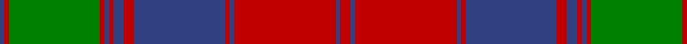

In pattern [BRGRBRBRBRBRBR](/patterns/brgrbrbrbrbrbr/).

This was sourced from weddslist.  It is a [14 stripes tartan](/stripes/stripes14/).

Original link http://www.weddslist.com/cgi-bin/tartans/pg.pl?source=sts

## Thread count
B/4 R4 G80 R4 B4 R4 B9 R9 B80 R4 B4 R89 B4 R/9

## Palette
Each colour and its ΔE from the base-6 reference it is a variant of.

| Colour | Shade | Base | ΔE (OKLab) |
|---|---|---|---|
| B | <code style="background-color:#304080;">#304080</code> `#304080` | B <code style="background-color:#2A418A;">#2A418A</code> | 0.02 |
| G | <code style="background-color:#008000;">#008000</code> `#008000` | G <code style="background-color:#006100;">#006100</code> | 0.10 |
| R | <code style="background-color:#C00000;">#C00000</code> `#C00000` | R <code style="background-color:#CC0000;">#CC0000</code> | 0.03 |

## Nearest tartans

The nearest existing variants by ΔTartan distance.

1. [Fraser of Altyre Clan Tartan Tartan Number: 528. Earliest known date: (c.1850) Proportional count of silk sample from Messrs Andersons of Edinburgh (now Kinloch Anderson). MacGregor-Hastie was of the opinion that the sett could be dated to around 1850, based on the story of an 'old lady' (c.1938) who said that a kilt of this pattern had been in the family for generations. The MacGregor-Hastie collection is housed at the Scottish Tartans Museum, Stirling. (1994) See products available Copyright © Blair Urquhart, Comrie, 2015](/setts/s14/r9b4r89b4r4b80r9b9r4b4r4g80r4b4~b2c2c80-g006818-rc80000/) — ΔT 0.52
1. [Fraser of Altyre](/setts/s14/r4b2r45b2r2b40r4b4r2b2r2g40r2b2~b202060-g00643c-rc80000~x2/) — ΔT 0.68
1. [MacQuarrie #3](/setts/s13/g2r3g2r52g2r2b28r2g42r2g2r3g2~b2c4084-g005020-rdc0000~x2/) — ΔT 0.76
1. [MacQuarrie 3](/setts/s13/g2r3g2r52g2r2b28r2g42r2g2r3g2~b304080-g008000-rc00000~x2/) — ΔT 0.85
1. [Unidentified Coat](/setts/s14/g6r2g2r24b1ba1r2ba12r2ba1b1r2g24r2~b3c82af-ba2c4084-g005020-rdc0000~x2/) — ΔT 0.97
1. [Ladybird](/setts/s15/r20b1r1ba2r1b1r4ba4g2ba4g2ba4g19r1b2~b800080-ba304080-g008000-rc00000~x2/) — ΔT 1.01
1. [MacQuarrie 1815](/setts/s13/g2r3g2r52g2r2b28r2g42r2g2r3g2~b000052-g11450d-raa0000~x2/) — ΔT 1.02
1. [MacQuarrie 1815](/setts/s13/g2r3g2r52g2r2b28r2g42r2g2r3g2~b000052-g11450d-raa0000/) — ΔT 1.02
1. [Drummond](/setts/s12/b24r7g7r39b4r2b2r5g42r7b6r7~b304080-g008000-rc00000~x2/) — ΔT 1.08
1. [Drummond #2](/setts/s12/b24r7g7r39b4r2b2r5g42r7b6r7~b2c4084-g005020-rdc0000~x2/) — ΔT 1.12

## Neighbour map

Every grey dot is one of 15726 variants placed by the first two principal components of the ΔTartan feature space (44% of its variance). Red is this tartan; blue dots are its nearest — click one to open its page.

<svg viewBox="0 0 640 380" role="img" style="max-width:100%;height:auto;border:1px solid #e0e0e0;border-radius:4px;display:block" xmlns="http://www.w3.org/2000/svg"><image href="/nn/cloud.v1.png" width="640" height="380"/><a href="/setts/s14/r9b4r89b4r4b80r9b9r4b4r4g80r4b4~b2c2c80-g006818-rc80000/"><circle cx="306.3" cy="121.6" r="4" fill="#3465a4"><title>Fraser of Altyre Clan Tartan Tartan Number: 528. Earliest known date: (c.1850) Proportional count of silk sample from Messrs Andersons of Edinburgh (now Kinloch Anderson). MacGregor-Hastie was of the opinion that the sett could be dated to around 1850, based on the story of an 'old lady' (c.1938) who said that a kilt of this pattern had been in the family for generations. The MacGregor-Hastie collection is housed at the Scottish Tartans Museum, Stirling. (1994) See products available Copyright © Blair Urquhart, Comrie, 2015</title></circle></a><a href="/setts/s14/r4b2r45b2r2b40r4b4r2b2r2g40r2b2~b202060-g00643c-rc80000~x2/"><circle cx="309.8" cy="121.7" r="4" fill="#3465a4"><title>Fraser of Altyre</title></circle></a><a href="/setts/s13/g2r3g2r52g2r2b28r2g42r2g2r3g2~b2c4084-g005020-rdc0000~x2/"><circle cx="340.9" cy="114.9" r="4" fill="#3465a4"><title>MacQuarrie #3</title></circle></a><a href="/setts/s13/g2r3g2r52g2r2b28r2g42r2g2r3g2~b304080-g008000-rc00000~x2/"><circle cx="341.3" cy="117.3" r="4" fill="#3465a4"><title>MacQuarrie 3</title></circle></a><a href="/setts/s14/g6r2g2r24b1ba1r2ba12r2ba1b1r2g24r2~b3c82af-ba2c4084-g005020-rdc0000~x2/"><circle cx="296.8" cy="107.5" r="4" fill="#3465a4"><title>Unidentified Coat</title></circle></a><a href="/setts/s15/r20b1r1ba2r1b1r4ba4g2ba4g2ba4g19r1b2~b800080-ba304080-g008000-rc00000~x2/"><circle cx="268.3" cy="112.0" r="4" fill="#3465a4"><title>Ladybird</title></circle></a><a href="/setts/s13/g2r3g2r52g2r2b28r2g42r2g2r3g2~b000052-g11450d-raa0000~x2/"><circle cx="348.1" cy="124.5" r="4" fill="#3465a4"><title>MacQuarrie 1815</title></circle></a><a href="/setts/s13/g2r3g2r52g2r2b28r2g42r2g2r3g2~b000052-g11450d-raa0000/"><circle cx="348.1" cy="124.5" r="4" fill="#3465a4"><title>MacQuarrie 1815</title></circle></a><a href="/setts/s12/b24r7g7r39b4r2b2r5g42r7b6r7~b304080-g008000-rc00000~x2/"><circle cx="306.2" cy="152.0" r="4" fill="#3465a4"><title>Drummond</title></circle></a><a href="/setts/s12/b24r7g7r39b4r2b2r5g42r7b6r7~b2c4084-g005020-rdc0000~x2/"><circle cx="305.6" cy="149.6" r="4" fill="#3465a4"><title>Drummond #2</title></circle></a><circle cx="308.8" cy="123.1" r="5" fill="#c00000"/></svg>

ID: /setts/s14/r9b4r89b4r4b80r9b9r4b4r4g80r4b4~b304080-g008000-rc00000/
