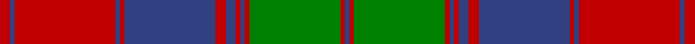

In pattern [BRGRBRBRBRBRBR](/stripes/brgrbrbrbrbrbr/).

This was sourced from weddslist.  It is a [14 stripe tartan](/stripes/stripes14/).

Original link http://www.weddslist.com/cgi-bin/tartans/pg.pl?source=sts

## Attestations

This cloth appears in 2 source records; the oldest owns this page.

- undated — Fraser of Altyre (weddslist, [record](http://www.weddslist.com/cgi-bin/tartans/pg.pl?source=sts))
- undated — Fraser of Altyre Clan Tartan Tartan Number: 528. Earliest known date: (c.1850) Proportional count of silk sample from Messrs Andersons of Edinburgh (now Kinloch Anderson). MacGregor-Hastie was of the opinion that the sett could be dated to around 1850, based on the story of an 'old lady' (c.1938) who said that a kilt of this pattern had been in the family for generations. The MacGregor-Hastie collection is housed at the Scottish Tartans Museum, Stirling. (1994) See products available Copyright © Blair Urquhart, Comrie, 2015 (house-of-tartan, [record](http://www.house-of-tartan.scotland.net/house/TartanViewjs.asp?colr=Def&tnam=528))

## Thread count
R/9 B4 R89 B4 R4 B80 R9 B9 R4 B4 R4 G80 R4 B/4

## Palette
Each colour and the base-6 reference it is a variant of.

| Colour | Shade | Base |
|---|---|---|
| B | <code style="background-color:#304080;">#304080</code> `oklch(39.4% 0.109 270.2)` <small>#304080</small> | B <code style="background-color:#2A418A;">#2A418A</code> |
| G | <code style="background-color:#008000;">#008000</code> `oklch(52.0% 0.177 142.5)` <small>#008000</small> | G <code style="background-color:#006100;">#006100</code> |
| R | <code style="background-color:#C00000;">#C00000</code> `oklch(50.7% 0.208 29.2)` <small>#C00000</small> | R <code style="background-color:#CC0000;">#CC0000</code> |

## Nearest tartans

The nearest existing variants by ΔTartan distance.

1. [Fraser of Altyre](/setts/s14/r4db2r45db2r2db40r4db4r2db2r2g40r2db2~x2/) — ΔT 0.68
1. [MacQuarrie #3](/setts/s13/dg2r3dg2r52dg2r2db28r2dg42r2dg2r3dg2~x2/) — ΔT 0.77
1. [MacQuarrie 3](/setts/s13/g2r3g2r52g2r2db28r2g42r2g2r3g2~x2/) — ΔT 0.85
1. [Unidentified Coat](/setts/s14/dg6r2dg2r24t1db1r2db12r2db1t1r2dg24r2~x2/) — ΔT 0.98
1. [Ladybird](/setts/s15/r20p1r1db2r1p1r4db4g2db4g2db4g19r1p2~x2/) — ΔT 1.01
1. [MacQuarrie 1815](/setts/s13/dg2r3dg2r52dg2r2db28r2dg42r2dg2r3dg2/) — ΔT 1.03
1. [Drummond](/setts/s12/db24r7g7r39db4r2db2r5g42r7db6r7~x2/) — ΔT 1.09
1. [Drummond #2](/setts/s12/db24r7dg7r39db4r2db2r5dg42r7db6r7~x2/) — ΔT 1.12
1. [MacQuarrie 1815](/setts/s13/dg1r2dg1r26dg1r1db14r1dg21r1dg1r2dg1/) — ΔT 1.14
1. [Unidentified, coat](/setts/s14/g6r2g2r24t1db1r2db12r2db1t1r2g24r2~x2/) — ΔT 1.18

## Neighbour map

Every grey dot is one of 14299 variants placed by the first two principal components of the ΔTartan feature space (44% of its variance). Red is this tartan; blue dots are its nearest — click one to open its page.

<svg viewBox="0 0 640 380" role="img" style="max-width:100%;height:auto;border:1px solid #e0e0e0;border-radius:4px;display:block" xmlns="http://www.w3.org/2000/svg"><image href="/nn/cloud.v1.png" width="640" height="380"/><a href="/setts/s14/r4db2r45db2r2db40r4db4r2db2r2g40r2db2~x2/"><circle cx="311.5" cy="123.0" r="4" fill="#3465a4"><title>Fraser of Altyre</title></circle></a><a href="/setts/s13/dg2r3dg2r52dg2r2db28r2dg42r2dg2r3dg2~x2/"><circle cx="342.0" cy="114.9" r="4" fill="#3465a4"><title>MacQuarrie #3</title></circle></a><a href="/setts/s13/g2r3g2r52g2r2db28r2g42r2g2r3g2~x2/"><circle cx="342.5" cy="118.0" r="4" fill="#3465a4"><title>MacQuarrie 3</title></circle></a><a href="/setts/s14/dg6r2dg2r24t1db1r2db12r2db1t1r2dg24r2~x2/"><circle cx="298.1" cy="108.8" r="4" fill="#3465a4"><title>Unidentified Coat</title></circle></a><a href="/setts/s15/r20p1r1db2r1p1r4db4g2db4g2db4g19r1p2~x2/"><circle cx="269.8" cy="114.4" r="4" fill="#3465a4"><title>Ladybird</title></circle></a><a href="/setts/s13/dg2r3dg2r52dg2r2db28r2dg42r2dg2r3dg2/"><circle cx="349.7" cy="126.0" r="4" fill="#3465a4"><title>MacQuarrie 1815</title></circle></a><a href="/setts/s12/db24r7g7r39db4r2db2r5g42r7db6r7~x2/"><circle cx="307.4" cy="152.7" r="4" fill="#3465a4"><title>Drummond</title></circle></a><a href="/setts/s12/db24r7dg7r39db4r2db2r5dg42r7db6r7~x2/"><circle cx="306.7" cy="149.6" r="4" fill="#3465a4"><title>Drummond #2</title></circle></a><a href="/setts/s13/dg1r2dg1r26dg1r1db14r1dg21r1dg1r2dg1/"><circle cx="331.8" cy="113.9" r="4" fill="#3465a4"><title>MacQuarrie 1815</title></circle></a><a href="/setts/s14/g6r2g2r24t1db1r2db12r2db1t1r2g24r2~x2/"><circle cx="298.3" cy="111.5" r="4" fill="#3465a4"><title>Unidentified, coat</title></circle></a><circle cx="310.4" cy="124.7" r="5" fill="#c00000"/></svg>

ID: /setts/s14/r9db4r89db4r4db80r9db9r4db4r4g80r4db4/
